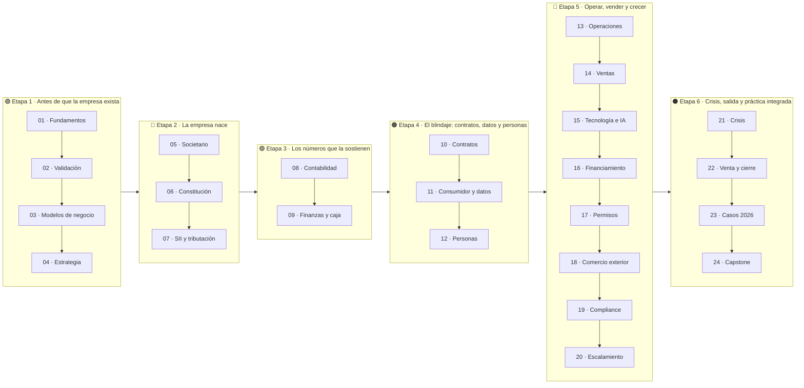

# Currículo — 336 clases en 24 partes

Cada parte tiene su propio README con narrativa, mapa visual, marco normativo, glosario propio y
el índice de sus clases. Cada clase es una carpeta con un `README.md` autocontenido que incluye
diagrama de razonamiento, desarrollo, taller, criterio de aceptación y fuentes explicadas.

## 🗺️ Recorrido completo

## 📘 Las 24 partes, en 6 etapas

### 🟢 Etapa 1 — Antes de que la empresa exista

Para quien tiene una idea y ninguna estructura. Al terminarla sabes si el problema que elegiste sostiene un negocio, tienes evidencia de que alguien pagaría, un modelo de ingreso con su economía unitaria y una estrategia con criterios escritos para abandonarla si no funciona.

**Partes 01–04 · 56 clases · salida: Tesis validada con evidencia primaria**

| # | Parte | Clases | Contenido central | Evidencia | README |
|---:|---|---:|---|---|---|
| 01 | [Fundamentos de empresa y mentalidad empresarial](curriculum/part-01-fundamentos-de-empresa-y-mentalidad-empresarial/README.md) | 14 (001–014) | Valor, autoempleo frente a organización, ingresos y costos, caja, riesgo, ética y tipos de mercado | `GUIA-PRACTICA` | [📘 leer](curriculum/part-01-fundamentos-de-empresa-y-mentalidad-empresarial/README.md) |
| 02 | [Descubrimiento, validación y mercado](curriculum/part-02-descubrimiento-validacion-y-mercado/README.md) | 14 (015–028) | Hipótesis falsables, entrevistas sin sesgo, TAM/SAM/SOM bottom-up, competencia, MVP y kill criteria | `GUIA-PRACTICA` | [📘 leer](curriculum/part-02-descubrimiento-validacion-y-mercado/README.md) |
| 03 | [Modelos de negocio y líneas de ingreso](curriculum/part-03-modelos-de-negocio-y-lineas-de-ingreso/README.md) | 14 (029–042) | Canvas, servicios, suscripción, e-commerce, retail, marketplace, licencias, franquicia y portafolio | `GUIA-PRACTICA` | [📘 leer](curriculum/part-03-modelos-de-negocio-y-lineas-de-ingreso/README.md) |
| 04 | [Estrategia y ventaja competitiva](curriculum/part-04-estrategia-y-ventaja-competitiva/README.md) | 14 (043–056) | PESTEL, cinco fuerzas, cadena de valor, ventaja defendible, nicho, OKR, roadmap y kill criteria | `GUIA-PRACTICA` | [📘 leer](curriculum/part-04-estrategia-y-ventaja-competitiva/README.md) |

### 🔵 Etapa 2 — La empresa nace

El bloque jurídico y tributario, en el orden en que ocurre de verdad. Al terminarla puedes elegir vehículo societario con criterio, redactar el pacto entre socios, constituir la sociedad, obtener el RUT y operar el ciclo del SII sin descubrir las obligaciones por multa.

**Partes 05–07 · 42 clases · salida: Empresa constituida, con RUT y régimen elegido**

| # | Parte | Clases | Contenido central | Evidencia | README |
|---:|---|---:|---|---|---|
| 05 | [Diseño societario y gobierno inicial](curriculum/part-05-diseno-societario-y-gobierno-inicial/README.md) | 14 (057–070) | EIRL, SRL, SpA y SA, capital y control, vesting, poderes, pacto de socios y gobierno mínimo | `VERIFICADO-FUENTE` | [📘 leer](curriculum/part-05-diseno-societario-y-gobierno-inicial/README.md) |
| 06 | [Constitución formal de la empresa en Chile](curriculum/part-06-constitucion-formal-de-la-empresa-en-chile/README.md) | 14 (071–084) | Registro de Empresas, objeto y domicilio, capital, firma electrónica, RUT, carpeta y cuenta bancaria | `VERIFICADO-FUENTE` | [📘 leer](curriculum/part-06-constitucion-formal-de-la-empresa-en-chile/README.md) |
| 07 | [SII y ciclo tributario de principio a fin](curriculum/part-07-sii-y-ciclo-tributario-de-principio-a-fin/README.md) | 14 (085–098) | Inicio de actividades, códigos, Pro Pyme General y Transparente, IVA, DTE, RCV, F29 y Operación Renta | `VERIFICADO-FUENTE` | [📘 leer](curriculum/part-07-sii-y-ciclo-tributario-de-principio-a-fin/README.md) |

### 🟣 Etapa 3 — Los números que la sostienen

Donde se decide si la empresa sobrevive el primer año. Al terminarla lees los tres estados financieros, mantienes un flujo de caja de 13 semanas, fijas precio con un método defendible y sabes por qué una empresa rentable puede quedarse sin dinero.

**Partes 08–09 · 28 clases · salida: Contabilidad que sirve para decidir y caja bajo control**

| # | Parte | Clases | Contenido central | Evidencia | README |
|---:|---|---:|---|---|---|
| 08 | [Contabilidad y estados financieros](curriculum/part-08-contabilidad-y-estados-financieros/README.md) | 14 (099–112) | Plan de cuentas, partida doble, devengo frente a caja, los tres estados, conciliación y cierre | `GUIA-PRACTICA` | [📘 leer](curriculum/part-08-contabilidad-y-estados-financieros/README.md) |
| 09 | [Finanzas, caja, precios y economía unitaria](curriculum/part-09-finanzas-caja-precios-y-economia-unitaria/README.md) | 14 (113–126) | Presupuesto de arranque, flujo de 13 semanas, punto de equilibrio, pricing, CAC/LTV y reglas de caja | `GUIA-PRACTICA` | [📘 leer](curriculum/part-09-finanzas-caja-precios-y-economia-unitaria/README.md) |

### 🟠 Etapa 4 — El blindaje: contratos, datos y personas

Las tres materias que más contingencia generan cuando se improvisan. Al terminarla negocias contratos sabiendo dónde queda el riesgo, cumples el bloque de consumidor y datos personales, y contratas personas con la figura correcta y las obligaciones preventivas al día.

**Partes 10–12 · 42 clases · salida: Operación contractual y laboral sin contingencias abiertas**

| # | Parte | Clases | Contenido central | Evidencia | README |
|---:|---|---:|---|---|---|
| 10 | [Contratos y arquitectura legal operativa](curriculum/part-10-contratos-y-arquitectura-legal-operativa/README.md) | 14 (127–140) | Anatomía contractual, servicios, suministro, NDA, propiedad intelectual, SLA, responsabilidad y salidas | `VERIFICADO-FUENTE` | [📘 leer](curriculum/part-10-contratos-y-arquitectura-legal-operativa/README.md) |
| 11 | [Consumidor, e-commerce, privacidad, IP y seguridad digital](curriculum/part-11-consumidor-e-commerce-privacidad-ip-y-seguridad-digital/README.md) | 14 (141–154) | Ley del Consumidor, comercio electrónico, garantía, Ley 19.628 y 21.719, marcas, IP y ciberseguridad | `DINAMICO` | [📘 leer](curriculum/part-11-consumidor-e-commerce-privacidad-ip-y-seguridad-digital/README.md) |
| 12 | [Personas, relaciones laborales y seguridad y salud](curriculum/part-12-personas-relaciones-laborales-y-seguridad-y-salud/README.md) | 14 (155–168) | Contratar o externalizar, contrato, Mi DT, 42 horas, remuneraciones, Ley Karin, DS 44 y término | `VERIFICADO-FUENTE` | [📘 leer](curriculum/part-12-personas-relaciones-laborales-y-seguridad-y-salud/README.md) |

### 🔴 Etapa 5 — Operar, vender y crecer

La empresa funcionando. Al terminarla tienes procesos con dueño y control, un sistema comercial medible, un stack tecnológico proporcionado, financiamiento calzado al uso, los permisos sectoriales mapeados y un crecimiento que la caja puede financiar.

**Partes 13–20 · 112 clases · salida: Empresa habilitada, operando y creciendo con control**

| # | Parte | Clases | Contenido central | Evidencia | README |
|---:|---|---:|---|---|---|
| 13 | [Operaciones, compras, inventario y calidad](curriculum/part-13-operaciones-compras-inventario-y-calidad/README.md) | 14 (169–182) | Procesos end-to-end, SOP, homologación, tres vías, inventario, calidad, cuello de botella y mejora | `GUIA-PRACTICA` | [📘 leer](curriculum/part-13-operaciones-compras-inventario-y-calidad/README.md) |
| 14 | [Ventas, marketing y experiencia de cliente](curriculum/part-14-ventas-marketing-y-experiencia-de-cliente/README.md) | 14 (183–196) | ICP, marca y mensaje, embudo, contenidos, atribución, prospección, CRM, onboarding y forecast | `GUIA-PRACTICA` | [📘 leer](curriculum/part-14-ventas-marketing-y-experiencia-de-cliente/README.md) |
| 15 | [Tecnología, datos, IA y operación digital](curriculum/part-15-tecnologia-datos-ia-y-operacion-digital/README.md) | 14 (197–210) | Arquitectura mínima, identidad y accesos, respaldos probados, ciberhigiene, datos, IA y FinOps | `DINAMICO` | [📘 leer](curriculum/part-15-tecnologia-datos-ia-y-operacion-digital/README.md) |
| 16 | [Financiamiento, banca, fondos e inversión](curriculum/part-16-financiamiento-banca-fondos-e-inversion/README.md) | 14 (211–224) | Bootstrapping, medios de pago, crédito, factoring, FOGAPE, Sercotec, Corfo, SAFE y dilución | `DINAMICO` | [📘 leer](curriculum/part-16-financiamiento-banca-fondos-e-inversion/README.md) |
| 17 | [Permisos, patentes y regulación sectorial](curriculum/part-17-permisos-patentes-y-regulacion-sectorial/README.md) | 14 (225–238) | Patente municipal, uso de suelo, sanitaria, DS 977, salud, obra, SEC, SUBTEL, SERNATUR y SEIA | `SECTORIAL` | [📘 leer](curriculum/part-17-permisos-patentes-y-regulacion-sectorial/README.md) |
| 18 | [Comercio exterior e internacionalización](curriculum/part-18-comercio-exterior-e-internacionalizacion/README.md) | 14 (239–252) | Preparación exportadora, Incoterms, clasificación arancelaria, DUS, IVA exportador, FX y entrada | `VERIFICADO-FUENTE` | [📘 leer](curriculum/part-18-comercio-exterior-e-internacionalizacion/README.md) |
| 19 | [Compliance, riesgos y responsabilidad empresarial](curriculum/part-19-compliance-riesgos-y-responsabilidad-empresarial/README.md) | 14 (253–266) | Mapa de riesgos, controles, Ley 20.393 y 21.595, modelo de prevención, UAF, KYC y seguros | `VERIFICADO-FUENTE` | [📘 leer](curriculum/part-19-compliance-riesgos-y-responsabilidad-empresarial/README.md) |
| 20 | [Escalamiento, organización y gobierno avanzado](curriculum/part-20-escalamiento-organizacion-y-gobierno-avanzado/README.md) | 14 (267–280) | De fundador a organización, delegación, presupuesto por centro, estandarizar, franquiciar y adquirir | `GUIA-PRACTICA` | [📘 leer](curriculum/part-20-escalamiento-organizacion-y-gobierno-avanzado/README.md) |

### ⚫ Etapa 6 — Crisis, salida y práctica integrada

Lo que casi ningún programa enseña porque no es aspiracional. Al terminarla tienes plan de continuidad ensayado, sabes qué hacer ante una fuga de caja, entiendes cómo se vende o se cierra una empresa, y has llevado un caso propio de la tesis a la defensa ante un comité.

**Partes 21–24 · 56 clases · salida: Caso completo defendido y capacidad de operar bajo estrés**

| # | Parte | Clases | Contenido central | Evidencia | README |
|---:|---|---:|---|---|---|
| 21 | [Crisis, continuidad, insolvencia y recuperación](curriculum/part-21-crisis-continuidad-insolvencia-y-recuperacion/README.md) | 14 (281–294) | Mapa de amenazas, continuidad, recuperación, crisis reputacional, plan de 30 días y Ley 20.720 | `VERIFICADO-FUENTE` | [📘 leer](curriculum/part-21-crisis-continuidad-insolvencia-y-recuperacion/README.md) |
| 22 | [Venta, sucesión, transformación y cierre](curriculum/part-22-venta-sucesion-transformacion-y-cierre/README.md) | 14 (295–308) | Transferibilidad, key-person risk, valoración, data room, asset o share deal, sucesión y cierre | `VERIFICADO-FUENTE` | [📘 leer](curriculum/part-22-venta-sucesion-transformacion-y-cierre/README.md) |
| 23 | [Estudios de líneas de negocio reales 2026](curriculum/part-23-estudios-de-lineas-de-negocio-reales-2026/README.md) | 14 (309–322) | SaaS con IA, agencia, MSSP, D2C, marketplace, educación, fintech, foodtech, solar y última milla | `SECTORIAL` | [📘 leer](curriculum/part-23-estudios-de-lineas-de-negocio-reales-2026/README.md) |
| 24 | [Capstone: construir una empresa de comienzo a fin](curriculum/part-24-capstone-construir-una-empresa-de-comienzo-a-fin/README.md) | 14 (323–336) | Tesis, validación, modelo, sociedad, SII, finanzas, contratos, permisos, financiamiento y defensa | `GUIA-PRACTICA` | [📘 leer](curriculum/part-24-capstone-construir-una-empresa-de-comienzo-a-fin/README.md) |

## 🏷️ Estados de evidencia

| Estado | Significado |
|---|---|
| `VERIFICADO-FUENTE` | Referido a fuente oficial primaria o institucional |
| `GUIA-PRACTICA` | Síntesis educativa que debe adaptarse al caso concreto |
| `SECTORIAL` | Aplica solo si la actividad cae en ese sector |
| `DINAMICO` | Tasa, plazo, convocatoria o norma en transición que debe revisarse a la fecha de ejecución |

---

[← Inicio](README.md) · [Glosario maestro](docs/19_GLOSSARY.md) · [Estado verificable](STATUS.md)
