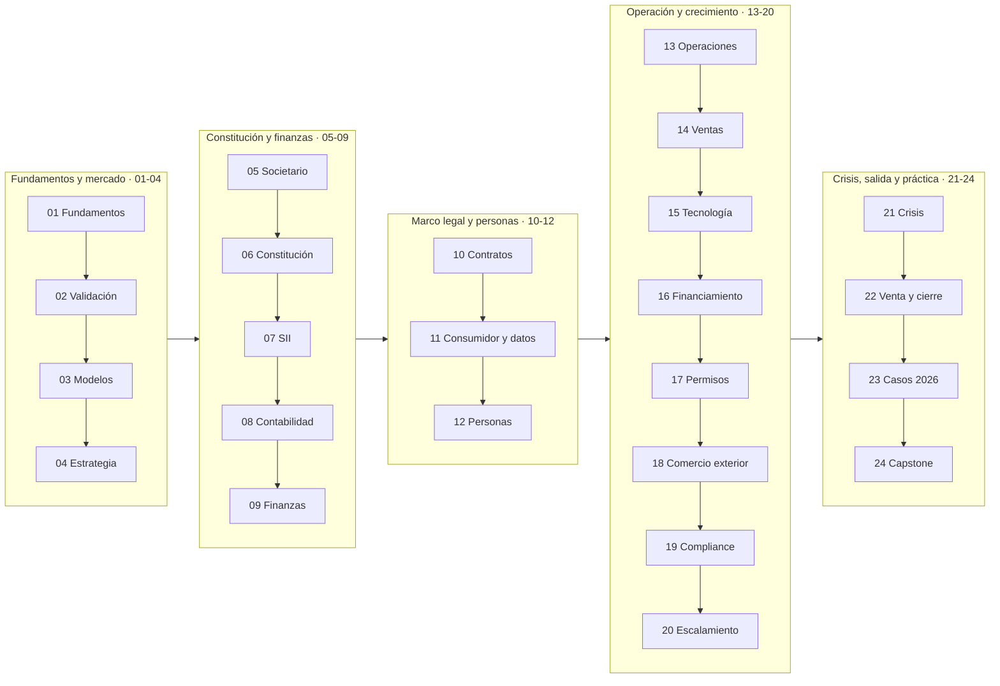

# Currículo — 336 clases en 24 partes

Cada parte tiene su propio README con narrativa, mapa visual, marco normativo, glosario propio y
el índice de sus clases. Cada clase es una carpeta con un `README.md` autocontenido que incluye
diagrama de razonamiento, desarrollo, taller, criterio de aceptación y fuentes explicadas.

## 🗺️ Recorrido completo

## 📘 Las 24 partes

| # | Parte | Clases | Rango | Estado | Idea central |
|---:|---|---:|---|---|---|
| 01 | [Fundamentos de empresa y mentalidad empresarial](curriculum/part-01-fundamentos-de-empresa-y-mentalidad-empresarial/README.md) | 14 | 001–014 | `GUIA-PRACTICA` | Aprender a ver la empresa como sistema antes de constituir nada |
| 02 | [Descubrimiento, validación y mercado](curriculum/part-02-descubrimiento-validacion-y-mercado/README.md) | 14 | 015–028 | `GUIA-PRACTICA` | Gastar información barata antes de gastar dinero caro |
| 03 | [Modelos de negocio y líneas de ingreso](curriculum/part-03-modelos-de-negocio-y-lineas-de-ingreso/README.md) | 14 | 029–042 | `GUIA-PRACTICA` | El modelo de ingreso decide la estructura de costos y la carga regulatoria |
| 04 | [Estrategia y ventaja competitiva](curriculum/part-04-estrategia-y-ventaja-competitiva/README.md) | 14 | 043–056 | `GUIA-PRACTICA` | Elegir dónde competir importa más que competir bien en el lugar equivocado |
| 05 | [Diseño societario y gobierno inicial](curriculum/part-05-diseno-societario-y-gobierno-inicial/README.md) | 14 | 057–070 | `VERIFICADO-FUENTE` | Las reglas entre socios se escriben cuando la relación está bien |
| 06 | [Constitución formal de la empresa en Chile](curriculum/part-06-constitucion-formal-de-la-empresa-en-chile/README.md) | 14 | 071–084 | `VERIFICADO-FUENTE` | Constituida no es lo mismo que habilitada para operar |
| 07 | [SII y ciclo tributario de principio a fin](curriculum/part-07-sii-y-ciclo-tributario-de-principio-a-fin/README.md) | 14 | 085–098 | `VERIFICADO-FUENTE` | El ciclo tributario es una máquina de plazos que no se detiene |
| 08 | [Contabilidad y estados financieros](curriculum/part-08-contabilidad-y-estados-financieros/README.md) | 14 | 099–112 | `GUIA-PRACTICA` | Contabilidad que sirve para decidir, no solo para declarar |
| 09 | [Finanzas, caja, precios y economía unitaria](curriculum/part-09-finanzas-caja-precios-y-economia-unitaria/README.md) | 14 | 113–126 | `GUIA-PRACTICA` | Las empresas quiebran por caja, no por falta de utilidad contable |
| 10 | [Contratos y arquitectura legal operativa](curriculum/part-10-contratos-y-arquitectura-legal-operativa/README.md) | 14 | 127–140 | `VERIFICADO-FUENTE` | El contrato se lee empezando por el final |
| 11 | [Consumidor, e-commerce, privacidad, IP y seguridad digital](curriculum/part-11-consumidor-e-commerce-privacidad-ip-y-seguridad-digital/README.md) | 14 | 141–154 | `DINAMICO` | Vender a consumidores y tratar datos activa un bloque regulatorio propio |
| 12 | [Personas, relaciones laborales y seguridad y salud](curriculum/part-12-personas-relaciones-laborales-y-seguridad-y-salud/README.md) | 14 | 155–168 | `VERIFICADO-FUENTE` | Contratar es la decisión que más obligaciones periódicas activa |
| 13 | [Operaciones, compras, inventario y calidad](curriculum/part-13-operaciones-compras-inventario-y-calidad/README.md) | 14 | 169–182 | `GUIA-PRACTICA` | Los procesos fallan en los traspasos, no en las actividades |
| 14 | [Ventas, marketing y experiencia de cliente](curriculum/part-14-ventas-marketing-y-experiencia-de-cliente/README.md) | 14 | 183–196 | `GUIA-PRACTICA` | Vender de forma repetible exige un sistema, no talento individual |
| 15 | [Tecnología, datos, IA y operación digital](curriculum/part-15-tecnologia-datos-ia-y-operacion-digital/README.md) | 14 | 197–210 | `DINAMICO` | La empresa moderna corre sobre software de terceros |
| 16 | [Financiamiento, banca, fondos e inversión](curriculum/part-16-financiamiento-banca-fondos-e-inversion/README.md) | 14 | 211–224 | `DINAMICO` | Financiar es elegir de quién depender |
| 17 | [Permisos, patentes y regulación sectorial](curriculum/part-17-permisos-patentes-y-regulacion-sectorial/README.md) | 14 | 225–238 | `SECTORIAL` | Estar constituido y con inicio de actividades no habilita a operar |
| 18 | [Comercio exterior e internacionalización](curriculum/part-18-comercio-exterior-e-internacionalizacion/README.md) | 14 | 239–252 | `VERIFICADO-FUENTE` | Exportar agrega aduanas, moneda, logística y tributación internacional |
| 19 | [Compliance, riesgos y responsabilidad empresarial](curriculum/part-19-compliance-riesgos-y-responsabilidad-empresarial/README.md) | 14 | 253–266 | `VERIFICADO-FUENTE` | El riesgo penal corporativo dejó de ser tema exclusivo de grandes empresas |
| 20 | [Escalamiento, organización y gobierno avanzado](curriculum/part-20-escalamiento-organizacion-y-gobierno-avanzado/README.md) | 14 | 267–280 | `GUIA-PRACTICA` | Crecer rompe lo que funcionaba |
| 21 | [Crisis, continuidad, insolvencia y recuperación](curriculum/part-21-crisis-continuidad-insolvencia-y-recuperacion/README.md) | 14 | 281–294 | `VERIFICADO-FUENTE` | Toda empresa enfrenta una crisis; la diferencia es si tenía un plan antes |
| 22 | [Venta, sucesión, transformación y cierre](curriculum/part-22-venta-sucesion-transformacion-y-cierre/README.md) | 14 | 295–308 | `VERIFICADO-FUENTE` | Una empresa vale lo que puede operar sin su fundador |
| 23 | [Estudios de líneas de negocio reales 2026](curriculum/part-23-estudios-de-lineas-de-negocio-reales-2026/README.md) | 14 | 309–322 | `SECTORIAL` | El mismo marco aplicado a catorce sectores reales |
| 24 | [Capstone: construir una empresa de comienzo a fin](curriculum/part-24-capstone-construir-una-empresa-de-comienzo-a-fin/README.md) | 14 | 323–336 | `GUIA-PRACTICA` | Un solo caso llevado de la tesis a la defensa |

## 🏷️ Estados de evidencia

| Estado | Significado |
|---|---|
| `VERIFICADO-FUENTE` | Referido a fuente oficial primaria o institucional |
| `GUIA-PRACTICA` | Síntesis educativa que debe adaptarse al caso concreto |
| `SECTORIAL` | Aplica solo si la actividad cae en ese sector |
| `DINAMICO` | Tasa, plazo, convocatoria o norma en transición que debe revisarse a la fecha de ejecución |

---

[← Inicio](README.md) · [Glosario maestro](docs/19_GLOSSARY.md) · [Estado verificable](STATUS.md)
