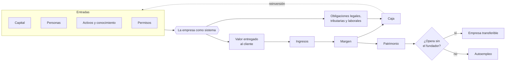

# Parte 01 — Fundamentos de empresa y mentalidad empresarial

> *Aprender a ver la empresa como sistema antes de constituir nada*

**Estado de evidencia:** `GUIA-PRACTICA` · **Clases:** 14 (001–014) · **Fecha base normativa:** 07-08-2026 
**Conceptos definidos en esta parte:** 56

## 🎯 De qué trata esta parte

Casi todo el material sobre creación de empresas empieza por el trámite. Este programa empieza por la pregunta que el trámite presupone: ¿qué es exactamente lo que se está creando? Una empresa es un sistema que toma capital, tiempo de personas, activos y permisos, y los convierte en algo por lo que un tercero paga voluntariamente y de forma repetida. Todo lo demás —la sociedad, el RUT, la patente— es infraestructura al servicio de ese intercambio.

La consecuencia práctica de mirarlo así es que las decisiones dejan de ser trámites aislados y pasan a tener causa y efecto. Elegir un tipo societario condiciona el régimen tributario disponible; elegir un régimen condiciona la política de retiros; contratar a la primera persona activa un calendario de obligaciones mensuales que no se detiene. Esta parte instala ese vocabulario para que el resto del programa pueda decir «esto dispara aquello» y se entienda.

El otro trabajo de esta parte es incómodo y necesario: distinguir entre construir un autoempleo y construir una organización. Ambas son decisiones legítimas, pero producen activos distintos y solo una de ellas se puede vender. Postergar esa distinción es la razón por la que muchos fundadores descubren a los diez años que no tienen empresa sino un trabajo que no pueden dejar.

## 📚 Resultados de la parte

Al terminar esta parte podrás:

1. **Distinguir empresa, autoempleo y proyecto personal por su capacidad de operar sin el fundador**.
2. **Leer un negocio en términos de ingresos, costos, márgenes, activos y caja**.
3. **Identificar qué decisión de negocio dispara qué obligación legal o tributaria**.
4. **Evaluar riesgo e incertidumbre sin confundir optimismo con evidencia**.

## 🗺️ Mapa de la parte

## ⚖️ Marco aplicable

- Código de Comercio y Código Civil como base de los actos de comercio y las obligaciones
- Ley 20.416 (Estatuto Pyme) para el encuadre de tamaño de empresa
- clasificación de empresa por ventas anuales en UF que usan SII, Sercotec y Corfo

**Autoridades o contrapartes:** SII, Registro de Empresas y Sociedades, Servicio Nacional del Consumidor.
**Profesionales de apoyo:** fundador o gerencia, contador, abogado corporativo.

## ⚠️ Riesgos característicos

- Confundir facturación con utilidad y utilidad con caja disponible.
- Construir un autoempleo creyendo que se construye una empresa vendible.
- Operar informalmente por comodidad hasta que el costo del incumplimiento supera el ahorro.
- Tomar decisiones irreversibles con evidencia anecdótica.

## 📘 Las 14 clases

| # | Global | Clase | Decisión que habilita |
|---:|---:|---|---|
| 01 | 001 | [Qué es una empresa y cómo crea valor](class-01-que-es-una-empresa-y-como-crea-valor/README.md) | definir qué valor entrega la empresa, a quién y cuánto de ese valor puede retener |
| 02 | 002 | [Emprender, autoemplearse y construir una organización](class-02-emprender-autoemplearse-y-construir-una-organizacion/README.md) | elegir conscientemente entre maximizar ingreso personal o construir un activo transferible |
| 03 | 003 | [Problema, necesidad, deseo y trabajo por resolver](class-03-problema-necesidad-deseo-y-trabajo-por-resolver/README.md) | seleccionar un problema con frecuencia, gravedad y costo suficientes para sostener un negocio |
| 04 | 004 | [Cliente, usuario, pagador y beneficiario](class-04-cliente-usuario-pagador-y-beneficiario/README.md) | mapear quién decide, quién usa, quién paga y quién se beneficia en el proceso de compra |
| 05 | 005 | [Producto, servicio, solución y experiencia](class-05-producto-servicio-solucion-y-experiencia/README.md) | definir qué parte de la oferta es producto, qué parte es servicio y cómo evoluciona la mezcla |
| 06 | 006 | [Ingresos, costos, gastos, inversión y utilidad](class-06-ingresos-costos-gastos-inversion-y-utilidad/README.md) | clasificar correctamente cada salida de dinero antes de proyectar rentabilidad |
| 07 | 007 | [Activos, pasivos, patrimonio y capital de trabajo](class-07-activos-pasivos-patrimonio-y-capital-de-trabajo/README.md) | determinar cuánta caja inmoviliza la operación por cada peso adicional de venta |
| 08 | 008 | [Riesgo, incertidumbre y toma de decisiones](class-08-riesgo-incertidumbre-y-toma-de-decisiones/README.md) | clasificar cada decisión por reversibilidad y por exposición a ruina antes de decidir |
| 09 | 009 | [Ética empresarial y licencia social para operar](class-09-etica-empresarial-y-licencia-social-para-operar/README.md) | definir los límites que la empresa no cruzará aunque sean legalmente permitidos |
| 10 | 010 | [Formalidad, informalidad y costo del incumplimiento](class-10-formalidad-informalidad-y-costo-del-incumplimiento/README.md) | cuantificar el costo del incumplimiento antes de decidir postergar la formalización |
| 11 | 011 | [Ciclo de vida completo de una empresa](class-11-ciclo-de-vida-completo-de-una-empresa/README.md) | identificar la etapa real de la empresa y qué gate falta para avanzar |
| 12 | 012 | [Tipos de mercado: B2C, B2B, B2G, C2C y plataformas](class-12-tipos-de-mercado-b2c-b2b-b2g-c2c-y-plataformas/README.md) | elegir a qué tipo de mercado se vende y aceptar la carga que trae |
| 13 | 013 | [Empresa tradicional, digital y habilitada por IA](class-13-empresa-tradicional-digital-y-habilitada-por-ia/README.md) | determinar qué procesos conviene digitalizar y cuáles admiten asistencia de modelos |
| 14 | 014 | [Mapa personal de competencias del fundador](class-14-mapa-personal-de-competencias-del-fundador/README.md) | decidir qué brechas se cubren aprendiendo, contratando o asociándose |

## 🔤 Glosario de la parte

| Concepto | Definición operacional |
|---|---|
| **Activo** | Recurso controlado por la empresa con capacidad de generar beneficio futuro. |
| **Apuesta reversible** | Decisión que puede deshacerse a bajo costo. |
| **Autoempleo** | Actividad cuyo ingreso se detiene cuando la persona deja de trabajar. |
| **B2B** | Venta a empresas, con ciclo largo y decisión distribuida. |
| **B2C** | Venta a consumidor final, regulada por la ley 19.496. |
| **B2G** | Venta al estado a través de chilecompra y licitaciones. |
| **Barrera de formalización** | Costo y complejidad percibidos que retrasan la formalización. |
| **Beneficiario** | Quien recibe el resultado aunque no participe en la decisión. |
| **Brecha** | Función crítica que el fundador no domina ni tiene cubierta. |
| **Capital de trabajo** | Activo corriente menos pasivo corriente; la caja que la operación inmoviliza. |
| **Captura de valor** | Porción del valor creado que la empresa retiene como margen. |
| **Cliente** | Quien decide la compra. |
| **Competencia del fundador** | Capacidad demostrable de ejecutar una función crítica del negocio. |
| **Conflicto de interés** | Situación donde el interés personal compite con el de la empresa. |
| **Contingencia** | Obligación probable que aún no se ha materializado en el balance. |
| **Costo** | Recurso consumido directamente para producir lo vendido. |
| **Costo del incumplimiento** | Multa, interés, clausura, juicio y pérdida de oportunidad acumulados. |
| **Deseo** | Preferencia por una forma específica de solución. |
| **Deuda organizacional** | Procesos y decisiones postergados que se cobran en la etapa siguiente. |
| **Empresa** | Sistema que combina capital, personas y activos para entregar valor y sostenerse con sus ingresos. |
| **Empresa digital** | Opera con procesos integrados sobre software y datos. |
| **Empresa habilitada por IA** | Incorpora modelos en el flujo de trabajo con revisión humana. |
| **Empresa tradicional** | Opera con procesos manuales y sistemas desconectados. |
| **Etapa** | Fase del ciclo con problema dominante propio: validación, tracción, escala, madurez, salida. |
| **Excedente del cliente** | Diferencia entre lo que el cliente valora y lo que paga; si es cero, no repite. |
| **Experiencia** | Conjunto de interacciones que determinan si el cliente repite. |
| **Gasto** | Recurso consumido para operar la empresa con independencia de las ventas. |
| **Gate** | Condición que debe cumplirse para pasar a la etapa siguiente. |
| **Grupo de interés** | Actor afectado por la operación aunque no sea cliente. |
| **Humano en el circuito** | Control que revisa la salida del modelo antes de que produzca efecto. |
| **Incertidumbre** | Situación donde no se conoce la distribución de resultados posibles. |
| **Informalidad** | Operación económica sin cumplir obligaciones de registro, tributarias o laborales. |
| **Ingreso** | Venta reconocida por servicios prestados o bienes entregados. |
| **Inversión** | Desembolso que genera un activo con capacidad de producir ingreso futuro. |
| **Job to be done** | Progreso que el cliente intenta lograr al contratar una solución. |
| **Key-person risk** | Concentración de conocimiento, relaciones o decisiones en una sola persona. |
| **Licencia social** | Aceptación de la comunidad que permite operar sin fricción. |
| **Necesidad** | Carencia funcional que el cliente reconoce aunque no sepa cómo resolverla. |
| **Organización** | Estructura que produce resultados con personas y procesos distintos del fundador. |
| **Pagador** | Quien libera el presupuesto. |
| **Pasivo** | Obligación presente que consumirá recursos. |
| **Patrimonio** | Diferencia entre activos y pasivos; lo que queda para los dueños. |
| **Plan de cobertura** | Socio, contratación, asesoría o aprendizaje que cierra la brecha. |
| **Plataforma** | Modelo que intermedia entre dos lados y monetiza la transacción. |
| **Problema** | Situación que produce un costo real, medible y recurrente para alguien. |
| **Producto** | Objeto o software entregado, con costo marginal bajo y escalabilidad alta. |
| **Propuesta de valor** | Razón concreta por la que un cliente prefiere pagar a esta empresa y no a la alternativa. |
| **Riesgo** | Evento con probabilidad estimable y consecuencia acotada. |
| **Ruina** | Escenario del que la empresa no puede recuperarse aunque el valor esperado sea positivo. |
| **Salida** | Evento de venta, sucesión, transformación o cierre. |
| **Servicio** | Resultado producido con tiempo de personas, con costo marginal alto. |
| **Solución** | Combinación de producto, servicio y proceso que resuelve el problema completo. |
| **Transferibilidad** | Capacidad de la empresa de seguir operando y valer con otro dueño. |
| **Usuario** | Quien usa la solución día a día. |
| **Zona de dilución** | Actividad que el fundador hace y que otro haría mejor y más barato. |
| **Ética empresarial** | Criterio de decisión que se sostiene cuando nadie está mirando. |

## 🔗 Cómo se conecta

Es la base de vocabulario de todo el programa. Las partes 08 y 09 formalizan con números lo que aquí se enuncia (ingreso, costo, margen, caja); las partes 05 y 06 convierten la decisión de formalizarse en estructura jurídica; y la parte 22 vuelve al final sobre la pregunta de transferibilidad que aquí se plantea.

## 📖 Pauta bibliográfica

- Drucker, P. — *The Practice of Management*: la empresa definida por el cliente que crea, no por su forma jurídica.
- Estatuto Pyme (Ley 20.416) — clasificación por tamaño y sus efectos prácticos.
- Estadísticas de empresas por rubro y tamaño del SII — para situar la escala real del mercado chileno.

## 🏛️ Fuentes oficiales de la parte

**Biblioteca del Congreso Nacional · LeyChile — Normativa oficial consolidada**  
<https://www.bcn.cl/leychile/> · verificado 2026-08-07

- *Qué contiene:* Publica el texto oficial y consolidado de leyes, decretos y reglamentos, con la versión vigente a una fecha, el historial de modificaciones y la tramitación que las originó.
- *Cómo leerla:* Usa siempre el selector de versión vigente a la fecha en que ejecutarás el trámite, no la última publicada. Y lee el artículo transitorio: en normas en implantación gradual —jornada, datos personales— ahí está la fecha que realmente te aplica.

**Servicio de Impuestos Internos — Nuevos contribuyentes, inicio de actividades y DTE**  
<https://www.sii.cl/ayudas/nuevos_contribuyentes/boleta-vys-facturador.html> · verificado 2026-08-07

- *Qué contiene:* Reúne el circuito completo del contribuyente nuevo: obtención de RUT, declaración de inicio de actividades, elección de códigos de actividad económica y habilitación para emitir documentos tributarios electrónicos.
- *Cómo leerla:* Sepáralo en dos actos distintos que la página trata seguidos: el RUT identifica, el inicio de actividades habilita. Lo que te bloquea para facturar casi siempre está en el segundo, no en el primero.

**Servicio de Cooperación Técnica — Fomento para micro y pequeñas empresas**  
<https://www.sercotec.cl/> · verificado 2026-08-07

- *Qué contiene:* Publica las convocatorias vigentes con sus bases: perfil de empresa elegible, monto del subsidio, cofinanciamiento exigido, gastos financiables y obligaciones de rendición.
- *Cómo leerla:* Lee las bases desde el final: la sección de rendición decide si podrás quedarte con el subsidio. Muchos proyectos se adjudican y después devuelven fondos por no poder acreditar el gasto en la forma exigida.

---

| Anterior | Índice | Siguiente |
|---|---|---|
| **Primera parte** | [Currículo](../../CURRICULUM.md) · [Programa](../../README.md) | [Parte 02 · Descubrimiento, validación y mercado →](../part-02-descubrimiento-validacion-y-mercado/README.md) |
