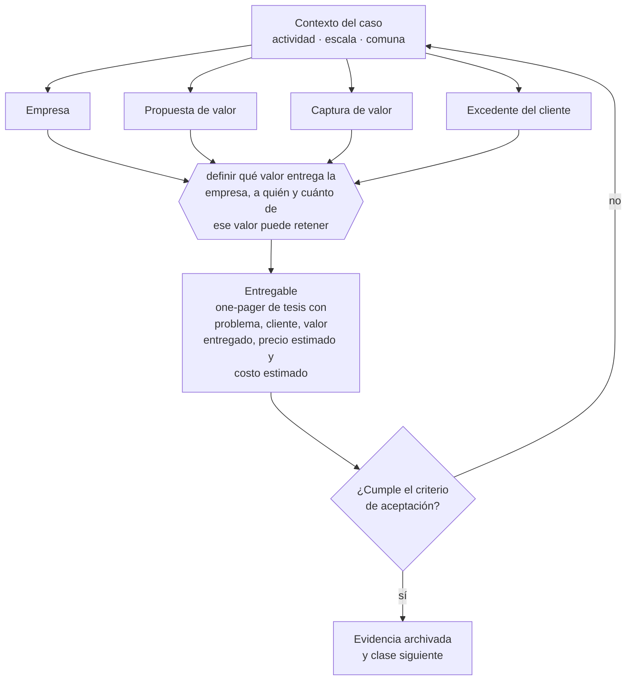

# Clase 001 — Qué es una empresa y cómo crea valor

> **Parte 01 · Fundamentos de empresa y mentalidad empresarial** — clase 1 de 14

**Estado de evidencia:** `GUIA-PRACTICA` · **Jurisdicción:** Chile-first · **Fecha base normativa:** 07-08-2026 
**Decisión que habilita:** definir qué valor entrega la empresa, a quién y cuánto de ese valor puede retener 
**Entregable:** one-pager de tesis con problema, cliente, valor entregado, precio estimado y costo estimado

## 🎯 Propósito

Instalar la definición de empresa que sostiene las 335 clases siguientes. Sin ella, constituir una sociedad es un trámite sin propósito y cada decisión posterior parece arbitraria en vez de encadenada.

## 📚 Resultados de aprendizaje

Al finalizar esta clase podrás:

1. **Definir** con precisión los cuatro conceptos de la tabla siguiente y usarlos para describir un caso real.
2. **Explicar** por qué esta materia condiciona decisiones de otras partes del programa.
3. **Decidir** —definir qué valor entrega la empresa, a quién y cuánto de ese valor puede retener— y justificar la decisión por escrito.
4. **Producir** el entregable de la clase y contrastarlo contra su criterio de aceptación.
5. **Distinguir** el dato estable del dato dinámico que exige revalidación en la fuente oficial.

## 🧩 Conceptos centrales

| Concepto | Comprensión verificable |
|---|---|
| **Empresa** | Sistema que combina capital, personas y activos para entregar valor y sostenerse con sus ingresos. |
| **Propuesta de valor** | Razón concreta por la que un cliente prefiere pagar a esta empresa y no a la alternativa. |
| **Captura de valor** | Porción del valor creado que la empresa retiene como margen. |
| **Excedente del cliente** | Diferencia entre lo que el cliente valora y lo que paga; si es cero, no repite. |

## 🗺️ Flujo de razonamiento

## 📖 Desarrollo

### 1. El fondo del asunto

Una empresa crea valor cuando el resultado que entrega vale para el cliente más que el precio, y captura valor cuando ese precio supera el costo de producirlo. Las dos condiciones deben cumplirse a la vez: si solo se cumple la primera hay clientes felices y pérdida; si solo la segunda, hay margen y fuga de clientes.

### 2. Cómo se traduce en la práctica

La prueba práctica es incómoda: describe tu empresa sin nombrar lo que hace y solo por el resultado que produce en el cliente. Si no puedes, todavía estás describiendo una actividad, no un negocio. Esa reformulación es la que después permite fijar precio por valor y no por costo.

### 3. Marco aplicable y quién interviene

- Código de Comercio y Código Civil como base de los actos de comercio y las obligaciones
- Ley 20.416 (Estatuto Pyme) para el encuadre de tamaño de empresa
- clasificación de empresa por ventas anuales en UF que usan SII, Sercotec y Corfo

**Autoridades o contrapartes involucradas:** SII, Registro de Empresas y Sociedades, Servicio Nacional del Consumidor.
**Profesionales de apoyo:** fundador o gerencia, contador, abogado corporativo. La participación concreta depende del riesgo, del
tamaño de la empresa y de la actividad económica.

## 🧪 Taller guiado

Aplica esta clase a **una** de las siguientes líneas de negocio y repite después el ejercicio con
una segunda línea de carga regulatoria distinta:

| Línea | Carga regulatoria |
|---|---|
| SaaS B2B con IA | media |
| Servicios profesionales | baja |
| E-commerce D2C | media |
| Alimentos o foodtech | alta |
| Exportación de servicios | media |
| Fintech regulada | alta |
| Construcción o servicios técnicos | alta |

**Secuencia de trabajo:**

1. Delimita el contexto: actividad económica, escala, comuna y etapa de la empresa.
2. Reúne los antecedentes que la decisión exige y anota la fecha de cada fuente.
3. Identifica las alternativas reales, incluida la de no hacer nada.
4. Evalúa el impacto en mercado, caja, personas, regulación y operación.
5. Toma la decisión y regístrala con sus supuestos.
6. Produce el entregable.
7. Contrástalo contra el criterio de aceptación.
8. Anota lo que requiere validación profesional y programa su revisión.

### 📦 Entregable

One-pager de tesis con problema, cliente, valor entregado, precio estimado y costo estimado.

Debe incluir decisión, supuestos, fuentes con fecha de consulta, responsable, riesgos
identificados y próximos pasos.

## 🏆 Reto verificable

Resuelve la misma materia para una segunda línea de negocio con distinta carga regulatoria y
explica por escrito **qué cambió, por qué y qué fuente lo determina**.

## ✅ Criterio de aceptación

- [ ] el valor entregado está expresado como resultado medible para el cliente
- [ ] se distingue creación de captura de valor con cifras estimadas
- [ ] cada afirmación regulatoria está referida a una fuente oficial con fecha de consulta;
- [ ] los datos dinámicos quedan marcados para revalidación;
- [ ] hay un responsable asignado y evidencia reproducible del trabajo.

## ⚠️ Errores frecuentes

**Propios de esta clase:**

- Describir la empresa por lo que hace y no por el resultado que produce en el cliente.
- Asumir que un margen alto es sostenible sin barrera que lo proteja.

**Característicos de la parte 01:**

- Confundir facturación con utilidad y utilidad con caja disponible.
- Construir un autoempleo creyendo que se construye una empresa vendible.

## 🇨🇱 Checklist Chile

- [ ] ¿existe norma o autoridad específica para esta materia?
- [ ] ¿la fuente consultada está vigente a la fecha de ejecución?
- [ ] ¿se activa algún trámite ante el SII?
- [ ] ¿se activa algún requisito municipal o sectorial?
- [ ] ¿afecta a consumidores o al tratamiento de datos personales?
- [ ] ¿afecta a trabajadores o a la seguridad y salud en el trabajo?
- [ ] ¿afecta a impuestos, contabilidad o caja?
- [ ] ¿afecta a contratos o a propiedad intelectual?
- [ ] ¿requiere renovación, reporte periódico o revalidación?

## ❓ Preguntas de comprobación

1. ¿Qué resultado medible obtiene tu cliente y cuánto vale para él en dinero o tiempo?
2. ¿Qué impide que otro entregue ese mismo resultado más barato el próximo trimestre?
3. Si el precio bajara 20 %, ¿seguiría habiendo captura de valor? ¿Y si subiera 20 %, seguiría habiendo clientes?

## 🔗 Fuentes oficiales

**Biblioteca del Congreso Nacional · LeyChile — Normativa oficial consolidada**  
<https://www.bcn.cl/leychile/> · verificado 2026-08-19

- *Qué contiene:* Publica el texto oficial y consolidado de leyes, decretos y reglamentos, con la versión vigente a una fecha, el historial de modificaciones y la tramitación que las originó.
- *Cómo leerla:* Usa siempre el selector de versión vigente a la fecha en que ejecutarás el trámite, no la última publicada. Y lee el artículo transitorio: en normas en implantación gradual —jornada, datos personales— ahí está la fecha que realmente te aplica.
- *Uso en esta clase:* aporta el marco de «Normativa oficial consolidada» para definir qué valor entrega la empresa, a quién y cuánto de ese valor puede retener.

**Servicio de Impuestos Internos — Nuevos contribuyentes, inicio de actividades y DTE**  
<https://www.sii.cl/ayudas/nuevos_contribuyentes/boleta-vys-facturador.html> · verificado 2026-08-19

- *Qué contiene:* Reúne el circuito completo del contribuyente nuevo: obtención de RUT, declaración de inicio de actividades, elección de códigos de actividad económica y habilitación para emitir documentos tributarios electrónicos.
- *Cómo leerla:* Sepáralo en dos actos distintos que la página trata seguidos: el RUT identifica, el inicio de actividades habilita. Lo que te bloquea para facturar casi siempre está en el segundo, no en el primero.
- *Uso en esta clase:* aporta el marco de «Nuevos contribuyentes, inicio de actividades y DTE» para definir qué valor entrega la empresa, a quién y cuánto de ese valor puede retener.

**Servicio de Cooperación Técnica — Fomento para micro y pequeñas empresas**  
<https://www.sercotec.cl/> · verificado 2026-08-19

- *Qué contiene:* Publica las convocatorias vigentes con sus bases: perfil de empresa elegible, monto del subsidio, cofinanciamiento exigido, gastos financiables y obligaciones de rendición.
- *Cómo leerla:* Lee las bases desde el final: la sección de rendición decide si podrás quedarte con el subsidio. Muchos proyectos se adjudican y después devuelven fondos por no poder acreditar el gasto en la forma exigida.
- *Uso en esta clase:* aporta el marco de «Fomento para micro y pequeñas empresas» para definir qué valor entrega la empresa, a quién y cuánto de ese valor puede retener.

Complementos del repositorio: [glosario](../../../docs/19_GLOSSARY.md) ·
[ruta de lecturas](../../../docs/15_BOOKS_AND_LEARNING_PATH.md) ·
[catálogo de fuentes](../../../docs/16_OFFICIAL_SOURCE_CATALOG.md).

> [!IMPORTANT]
> Material educativo. Para una decisión real de alto impacto hay que verificar la fuente oficial
> vigente y validar con el profesional competente.

---

| Anterior | Índice | Siguiente |
|---|---|---|
| **Inicio de la parte** | [Parte 01](../README.md) · [Programa](../../../README.md) | [002 · Emprender, autoemplearse y construir una organización →](../class-02-emprender-autoemplearse-y-construir-una-organizacion/README.md) |
