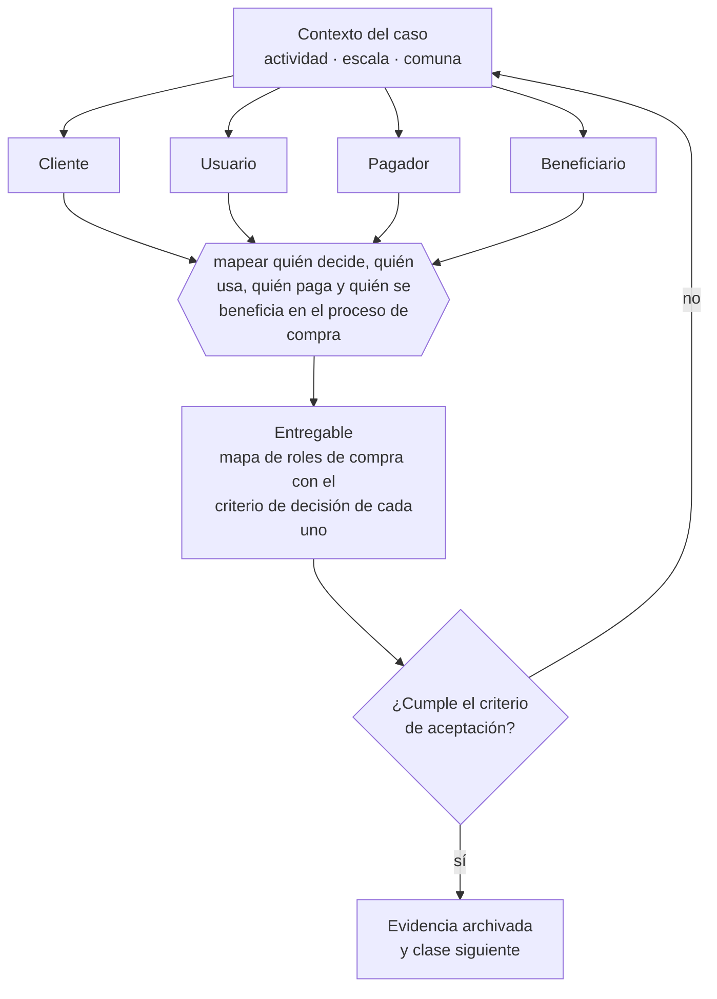

# Clase 004 — Cliente, usuario, pagador y beneficiario

> **Parte 01 · Fundamentos de empresa y mentalidad empresarial** — clase 4 de 14

**Estado de evidencia:** `GUIA-PRACTICA` · **Jurisdicción:** Chile-first · **Fecha base normativa:** 07-08-2026 
**Decisión que habilita:** mapear quién decide, quién usa, quién paga y quién se beneficia en el proceso de compra 
**Entregable:** mapa de roles de compra con el criterio de decisión de cada uno

## 🎯 Propósito

Evitar el error que más contratos B2B pierde en Chile: convencer a quien usa la solución sin convencer a quien libera el presupuesto, y confundir entusiasmo con orden de compra.

## 📚 Resultados de aprendizaje

Al finalizar esta clase podrás:

1. **Definir** con precisión los cuatro conceptos de la tabla siguiente y usarlos para describir un caso real.
2. **Explicar** por qué esta materia condiciona decisiones de otras partes del programa.
3. **Decidir** —mapear quién decide, quién usa, quién paga y quién se beneficia en el proceso de compra— y justificar la decisión por escrito.
4. **Producir** el entregable de la clase y contrastarlo contra su criterio de aceptación.
5. **Distinguir** el dato estable del dato dinámico que exige revalidación en la fuente oficial.

## 🧩 Conceptos centrales

| Concepto | Comprensión verificable |
|---|---|
| **Cliente** | Quien decide la compra. |
| **Usuario** | Quien usa la solución día a día. |
| **Pagador** | Quien libera el presupuesto. |
| **Beneficiario** | Quien recibe el resultado aunque no participe en la decisión. |

## 🗺️ Flujo de razonamiento

## 📖 Desarrollo

### 1. El fondo del asunto

En B2C los cuatro roles suelen coincidir; en B2B casi nunca. Vender al usuario sin convencer al pagador produce entusiasmo sin orden de compra, y convencer al pagador sin el usuario produce contratos que no se renuevan. El mensaje, el precio y el material comercial cambian según a quién se dirijan.

### 2. Cómo se traduce en la práctica

En empresas medianas chilenas el pagador rara vez es el usuario, y el proceso de aprobación suele ser más rígido que el presupuesto. Preguntar por el proceso de decisión —quién firma, con qué documento, en qué instancia— entrega mejor información que preguntar por el monto disponible.

### 3. Marco aplicable y quién interviene

- Código de Comercio y Código Civil como base de los actos de comercio y las obligaciones
- Ley 20.416 (Estatuto Pyme) para el encuadre de tamaño de empresa
- clasificación de empresa por ventas anuales en UF que usan SII, Sercotec y Corfo

**Autoridades o contrapartes involucradas:** SII, Registro de Empresas y Sociedades, Servicio Nacional del Consumidor.
**Profesionales de apoyo:** fundador o gerencia, contador, abogado corporativo. La participación concreta depende del riesgo, del
tamaño de la empresa y de la actividad económica.

## 🧪 Taller guiado

Aplica esta clase a **una** de las siguientes líneas de negocio y repite después el ejercicio con
una segunda línea de carga regulatoria distinta:

| Línea | Carga regulatoria |
|---|---|
| SaaS B2B con IA | media |
| Servicios profesionales | baja |
| E-commerce D2C | media |
| Alimentos o foodtech | alta |
| Exportación de servicios | media |
| Fintech regulada | alta |
| Construcción o servicios técnicos | alta |

**Secuencia de trabajo:**

1. Delimita el contexto: actividad económica, escala, comuna y etapa de la empresa.
2. Reúne los antecedentes que la decisión exige y anota la fecha de cada fuente.
3. Identifica las alternativas reales, incluida la de no hacer nada.
4. Evalúa el impacto en mercado, caja, personas, regulación y operación.
5. Toma la decisión y regístrala con sus supuestos.
6. Produce el entregable.
7. Contrástalo contra el criterio de aceptación.
8. Anota lo que requiere validación profesional y programa su revisión.

### 📦 Entregable

Mapa de roles de compra con el criterio de decisión de cada uno.

Debe incluir decisión, supuestos, fuentes con fecha de consulta, responsable, riesgos
identificados y próximos pasos.

## 🏆 Reto verificable

Resuelve la misma materia para una segunda línea de negocio con distinta carga regulatoria y
explica por escrito **qué cambió, por qué y qué fuente lo determina**.

## ✅ Criterio de aceptación

- [ ] los cuatro roles están identificados con nombre de cargo
- [ ] cada rol tiene su criterio de decisión declarado
- [ ] cada afirmación regulatoria está referida a una fuente oficial con fecha de consulta;
- [ ] los datos dinámicos quedan marcados para revalidación;
- [ ] hay un responsable asignado y evidencia reproducible del trabajo.

## ⚠️ Errores frecuentes

**Propios de esta clase:**

- Diseñar toda la comunicación para el usuario e ignorar el criterio del pagador.
- Asumir que un solo interlocutor representa a toda la organización compradora.

**Característicos de la parte 01:**

- Confundir facturación con utilidad y utilidad con caja disponible.
- Construir un autoempleo creyendo que se construye una empresa vendible.

## 🇨🇱 Checklist Chile

- [ ] ¿existe norma o autoridad específica para esta materia?
- [ ] ¿la fuente consultada está vigente a la fecha de ejecución?
- [ ] ¿se activa algún trámite ante el SII?
- [ ] ¿se activa algún requisito municipal o sectorial?
- [ ] ¿afecta a consumidores o al tratamiento de datos personales?
- [ ] ¿afecta a trabajadores o a la seguridad y salud en el trabajo?
- [ ] ¿afecta a impuestos, contabilidad o caja?
- [ ] ¿afecta a contratos o a propiedad intelectual?
- [ ] ¿requiere renovación, reporte periódico o revalidación?

## ❓ Preguntas de comprobación

1. ¿Quién decide, quién usa, quién paga y quién se beneficia en tu última venta cerrada?
2. ¿Qué criterio distinto usa cada uno para evaluar la compra?
3. ¿Qué documento interno necesita el pagador para autorizar y quién lo prepara?

## 🔗 Fuentes oficiales

**Biblioteca del Congreso Nacional · LeyChile — Normativa oficial consolidada**  
<https://www.bcn.cl/leychile/> · verificado 2026-08-07

- *Qué contiene:* Publica el texto oficial y consolidado de leyes, decretos y reglamentos, con la versión vigente a una fecha, el historial de modificaciones y la tramitación que las originó.
- *Cómo leerla:* Usa siempre el selector de versión vigente a la fecha en que ejecutarás el trámite, no la última publicada. Y lee el artículo transitorio: en normas en implantación gradual —jornada, datos personales— ahí está la fecha que realmente te aplica.

**Servicio de Impuestos Internos — Nuevos contribuyentes, inicio de actividades y DTE**  
<https://www.sii.cl/ayudas/nuevos_contribuyentes/boleta-vys-facturador.html> · verificado 2026-08-07

- *Qué contiene:* Reúne el circuito completo del contribuyente nuevo: obtención de RUT, declaración de inicio de actividades, elección de códigos de actividad económica y habilitación para emitir documentos tributarios electrónicos.
- *Cómo leerla:* Sepáralo en dos actos distintos que la página trata seguidos: el RUT identifica, el inicio de actividades habilita. Lo que te bloquea para facturar casi siempre está en el segundo, no en el primero.

**Servicio de Cooperación Técnica — Fomento para micro y pequeñas empresas**  
<https://www.sercotec.cl/> · verificado 2026-08-07

- *Qué contiene:* Publica las convocatorias vigentes con sus bases: perfil de empresa elegible, monto del subsidio, cofinanciamiento exigido, gastos financiables y obligaciones de rendición.
- *Cómo leerla:* Lee las bases desde el final: la sección de rendición decide si podrás quedarte con el subsidio. Muchos proyectos se adjudican y después devuelven fondos por no poder acreditar el gasto en la forma exigida.

Complementos del repositorio: [glosario](../../../docs/19_GLOSSARY.md) ·
[ruta de lecturas](../../../docs/15_BOOKS_AND_LEARNING_PATH.md) ·
[catálogo de fuentes](../../../docs/16_OFFICIAL_SOURCE_CATALOG.md).

> [!IMPORTANT]
> Material educativo. Para una decisión real de alto impacto hay que verificar la fuente oficial
> vigente y validar con el profesional competente.

---

| Anterior | Índice | Siguiente |
|---|---|---|
| [← 003 · Problema, necesidad, deseo y trabajo por resolver](../class-03-problema-necesidad-deseo-y-trabajo-por-resolver/README.md) | [Parte 01](../README.md) · [Programa](../../../README.md) | [005 · Producto, servicio, solución y experiencia →](../class-05-producto-servicio-solucion-y-experiencia/README.md) |
