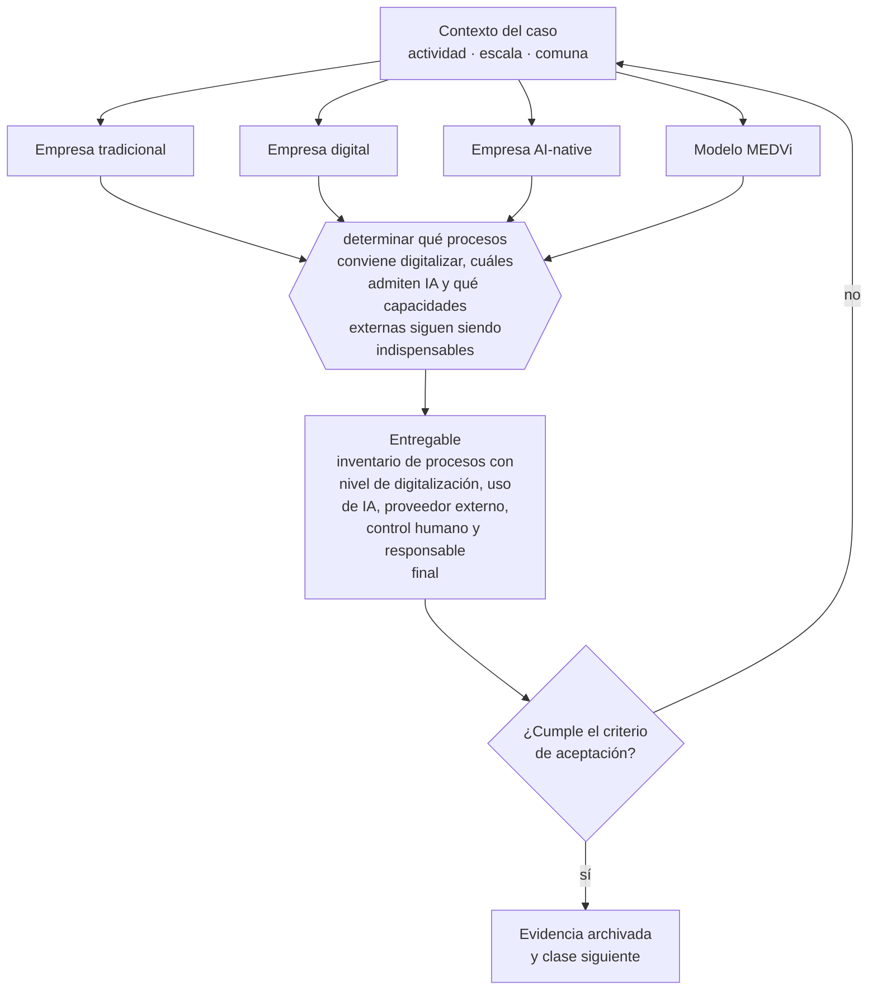

# Clase 013 — Empresa tradicional, digital y habilitada por IA

> **Parte 01 · Fundamentos de empresa y mentalidad empresarial** — clase 13 de 14

**Estado de evidencia:** `GUIA-PRACTICA` · **Jurisdicción:** Chile-first · **Fecha base normativa:** 07-08-2026 
**Decisión que habilita:** determinar qué procesos conviene digitalizar, cuáles admiten IA y qué capacidades externas siguen siendo indispensables 
**Entregable:** inventario de procesos con nivel de digitalización, uso de IA, proveedor externo, control humano y responsable final

## 🎯 Propósito

Ordenar la incorporación de tecnología e IA en la secuencia que funciona —proceso, datos, digitalización, modelo— y evitar automatizar un desorden.

## 📚 Resultados de aprendizaje

Al finalizar esta clase podrás:

1. **Definir** con precisión los cuatro conceptos de la tabla siguiente y usarlos para describir un caso real.
2. **Explicar** por qué esta materia condiciona decisiones de otras partes del programa.
3. **Decidir** —determinar qué procesos conviene digitalizar, cuáles admiten IA y qué capacidades externas siguen siendo indispensables— y justificar la decisión por escrito.
4. **Producir** el entregable de la clase y contrastarlo contra su criterio de aceptación.
5. **Distinguir** el dato estable del dato dinámico que exige revalidación en la fuente oficial.

## 🧩 Conceptos centrales

| Concepto | Comprensión verificable |
|---|---|
| **Empresa tradicional** | Opera principalmente mediante personas, procesos manuales y sistemas desconectados. |
| **Empresa digital** | Integra procesos, software y datos sin rediseñar necesariamente la organización alrededor de modelos. |
| **Empresa AI-native** | Diseña desde el origen procesos, roles y economía para que la ia ejecute una parte central del trabajo bajo controles definidos. |
| **Modelo MEDVi** | Combina una estructura interna mínima con ia, contratistas, proveedores clínicos, farmacias, agencias y plataformas externas. |

## 🗺️ Flujo de razonamiento

## 📖 Desarrollo

### 1. El fondo del asunto

La diferencia no está en comprar una herramienta. Una empresa tradicional coordina personas y documentos; una digital integra software y datos; una empresa habilitada por IA añade modelos a procesos existentes; y una AI-native diseña desde el inicio su operación, costos y decisiones alrededor de automatización. MEDVi lleva esa lógica al extremo, pero su escala depende también de una infraestructura empresarial externa extensa: la IA no prescribió, compuso ni despachó medicamentos.

### 2. Cómo se traduce en la práctica

Antes de conectar un modelo a un proceso hay que resolver una pregunta legal que suele llegar tarde: qué datos se le pueden entregar. Con la Ley 21.719 vigente desde el 1 de diciembre de 2026, cargar datos de clientes en un servicio sin acuerdo de tratamiento puede constituir una cesión no autorizada.

### 3. Marco aplicable y quién interviene

- Código de Comercio y Código Civil como base de los actos de comercio y las obligaciones
- Ley 20.416 (Estatuto Pyme) para el encuadre de tamaño de empresa
- clasificación de empresa por ventas anuales en UF que usan SII, Sercotec y Corfo

**Autoridades o contrapartes involucradas:** SII, Registro de Empresas y Sociedades, Servicio Nacional del Consumidor.
**Profesionales de apoyo:** fundador o gerencia, contador, abogado corporativo. La participación concreta depende del riesgo, del
tamaño de la empresa y de la actividad económica.

## 🔬 Caso aplicado: MEDVi

[MEDVi: empresa AI-native, red externa y control al crecer](../../../case-studies/21-medvi-empresa-ai-native-y-control.md#2-empresa-tradicional-vs-digital-vs-ai-native-vs-medvi)

**Lente para esta clase:** comparar estructura, costos, velocidad, automatización, dependencias, control, riesgo y responsabilidad sin reducir el caso a «dos personas hicieron todo».

El expediente separa hechos verificados, cifras reportadas, alegaciones periodísticas,
actuaciones regulatorias, respuesta de la empresa e interpretación pedagógica. No uses una
categoría como prueba automática de otra.

## 🧪 Taller guiado

Aplica esta clase a **una** de las siguientes líneas de negocio y repite después el ejercicio con
una segunda línea de carga regulatoria distinta:

| Línea | Carga regulatoria |
|---|---|
| SaaS B2B con IA | media |
| Servicios profesionales | baja |
| E-commerce D2C | media |
| Alimentos o foodtech | alta |
| Exportación de servicios | media |
| Fintech regulada | alta |
| Construcción o servicios técnicos | alta |

**Secuencia de trabajo:**

1. Delimita el contexto: actividad económica, escala, comuna y etapa de la empresa.
2. Reúne los antecedentes que la decisión exige y anota la fecha de cada fuente.
3. Identifica las alternativas reales, incluida la de no hacer nada.
4. Evalúa el impacto en mercado, caja, personas, regulación y operación.
5. Toma la decisión y regístrala con sus supuestos.
6. Produce el entregable.
7. Contrástalo contra el criterio de aceptación.
8. Anota lo que requiere validación profesional y programa su revisión.

### 📦 Entregable

Inventario de procesos con nivel de digitalización, uso de ia, proveedor externo, control humano y responsable final.

Debe incluir decisión, supuestos, fuentes con fecha de consulta, responsable, riesgos
identificados y próximos pasos.

## 🏆 Reto verificable

Resuelve la misma materia para una segunda línea de negocio con distinta carga regulatoria y
explica por escrito **qué cambió, por qué y qué fuente lo determina**.

## ✅ Criterio de aceptación

- [ ] cada proceso distingue ejecución interna, automatizada y externalizada
- [ ] cada uso de IA declara supervisión, dependencia y responsable final
- [ ] cada afirmación regulatoria está referida a una fuente oficial con fecha de consulta;
- [ ] los datos dinámicos quedan marcados para revalidación;
- [ ] hay un responsable asignado y evidencia reproducible del trabajo.

## ⚠️ Errores frecuentes

**Propios de esta clase:**

- Confundir pocos empleados internos con ausencia de personas, proveedores o infraestructura externa.
- Atribuir a la ia tareas clínicas, farmacéuticas o logísticas ejecutadas por terceros.

**Característicos de la parte 01:**

- Confundir facturación con utilidad y utilidad con caja disponible.
- Construir un autoempleo creyendo que se construye una empresa vendible.

## 🇨🇱 Checklist Chile

- [ ] ¿existe norma o autoridad específica para esta materia?
- [ ] ¿la fuente consultada está vigente a la fecha de ejecución?
- [ ] ¿se activa algún trámite ante el SII?
- [ ] ¿se activa algún requisito municipal o sectorial?
- [ ] ¿afecta a consumidores o al tratamiento de datos personales?
- [ ] ¿afecta a trabajadores o a la seguridad y salud en el trabajo?
- [ ] ¿afecta a impuestos, contabilidad o caja?
- [ ] ¿afecta a contratos o a propiedad intelectual?
- [ ] ¿requiere renovación, reporte periódico o revalidación?

## ❓ Preguntas de comprobación

1. ¿Qué proceso tuyo está lo bastante estandarizado como para automatizarse sin multiplicar errores?
2. ¿Qué datos entrarían al modelo y con qué base de licitud?
3. ¿Quién revisa la salida antes de que produzca un efecto sobre un cliente?

## 🔗 Fuentes oficiales

**Biblioteca del Congreso Nacional · LeyChile — Normativa oficial consolidada**  
<https://www.bcn.cl/leychile/> · verificado 2026-09-01

- *Qué contiene:* Publica el texto oficial y consolidado de leyes, decretos y reglamentos, con la versión vigente a una fecha, el historial de modificaciones y la tramitación que las originó.
- *Cómo leerla:* Usa siempre el selector de versión vigente a la fecha en que ejecutarás el trámite, no la última publicada. Y lee el artículo transitorio: en normas en implantación gradual —jornada, datos personales— ahí está la fecha que realmente te aplica.
- *Uso en esta clase:* aporta el marco de «Normativa oficial consolidada» para determinar qué procesos conviene digitalizar, cuáles admiten IA y qué capacidades externas siguen siendo indispensables.

**The New York Times · republicado por GV Wire — A $1.8 Billion Company With Two Employees? AI Made It Possible**  
<https://gvwire.com/2026/04/05/a-1-8-billion-company-with-two-employees-ai-made-it-possible/> · verificado 2026-10-04

- *Qué contiene:* Perfil empresarial que declara acceso del New York Times a estados financieros y contrapartes, y documenta capital inicial, tiempo de construcción, ventas, margen, herramientas de IA, contratistas y proveedores externos.
- *Cómo leerla:* Distingue cifras verificadas por el medio, afirmaciones del fundador y proyecciones. La meta de US$1.800 millones es una proyección de ventas, no valoración; dos empleados no significa dos ejecutores de toda la cadena.
- *Uso en esta clase:* aporta el marco de «A $1.8 Billion Company With Two Employees? AI Made It Possible» para determinar qué procesos conviene digitalizar, cuáles admiten IA y qué capacidades externas siguen siendo indispensables.

**U.S. Food and Drug Administration — MEDVi, LLC dba MEDVi: Warning Letter MARCS-CMS 721455**  
<https://www.fda.gov/inspections-compliance-enforcement-and-criminal-investigations/warning-letters/medvi-llc-dba-medvi-721455-02202026> · verificado 2026-10-04

- *Qué contiene:* Carta de advertencia fechada el 20 de febrero de 2026, dirigida a MEDVi, LLC dba MEDVi, sobre claims y rotulado observados por FDA en medvi.io durante diciembre de 2025.
- *Cómo leerla:* Distingue lo que FDA observó y calificó como misbranding de cualquier conclusión penal o de falsificación. Registra destinatario, dominio, claims, normas citadas, plazo de respuesta y medidas advertidas sin ampliar su alcance.
- *Uso en esta clase:* aporta el marco de «MEDVi, LLC dba MEDVi: Warning Letter MARCS-CMS 721455» para determinar qué procesos conviene digitalizar, cuáles admiten IA y qué capacidades externas siguen siendo indispensables.

**MEDVi · versión corporativa — MEDVi statement in response to external speculation**  
<https://home.medvi.org/communication> · verificado 2026-10-04

- *Qué contiene:* Declaración corporativa del 8 de abril de 2026 sobre la carta FDA, un supuesto sitio de afiliado, publicidad con posibles médicos generados por IA, correcciones y estructura de proveedores clínicos y farmacias.
- *Cómo leerla:* Trátala como la versión de MEDVi, no como verificación independiente. Contrasta cada afirmación con el destinatario y contenido de la carta FDA, archivos del sitio, contratos, responsables y evidencia de las medidas correctivas.
- *Uso en esta clase:* aporta el marco de «MEDVi statement in response to external speculation» para determinar qué procesos conviene digitalizar, cuáles admiten IA y qué capacidades externas siguen siendo indispensables.

Complementos del repositorio: [glosario](../../../docs/19_GLOSSARY.md) ·
[ruta de lecturas](../../../docs/15_BOOKS_AND_LEARNING_PATH.md) ·
[catálogo de fuentes](../../../docs/16_OFFICIAL_SOURCE_CATALOG.md).

> [!IMPORTANT]
> Material educativo. Para una decisión real de alto impacto hay que verificar la fuente oficial
> vigente y validar con el profesional competente.

---

| Anterior | Índice | Siguiente |
|---|---|---|
| [← 012 · Tipos de mercado: B2C, B2B, B2G, C2C y plataformas](../class-12-tipos-de-mercado-b2c-b2b-b2g-c2c-y-plataformas/README.md) | [Parte 01](../README.md) · [Programa](../../../README.md) | [014 · Mapa personal de competencias del fundador →](../class-14-mapa-personal-de-competencias-del-fundador/README.md) |
