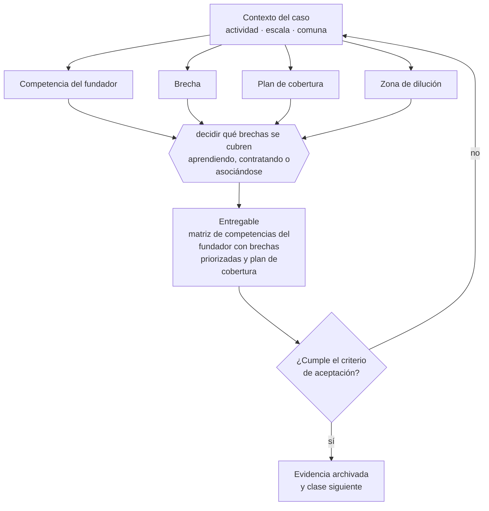

# Clase 014 — Mapa personal de competencias del fundador

> **Parte 01 · Fundamentos de empresa y mentalidad empresarial** — clase 14 de 14

**Estado de evidencia:** `GUIA-PRACTICA` · **Jurisdicción:** Chile-first · **Fecha base normativa:** 07-08-2026 
**Decisión que habilita:** decidir qué brechas se cubren aprendiendo, contratando o asociándose 
**Entregable:** matriz de competencias del fundador con brechas priorizadas y plan de cobertura

## 🎯 Propósito

Mapear las capacidades que el negocio exige contra las que el fundador tiene, y decidir cómo se cubre cada brecha antes de que sea urgente.

## 📚 Resultados de aprendizaje

Al finalizar esta clase podrás:

1. **Definir** con precisión los cuatro conceptos de la tabla siguiente y usarlos para describir un caso real.
2. **Explicar** por qué esta materia condiciona decisiones de otras partes del programa.
3. **Decidir** —decidir qué brechas se cubren aprendiendo, contratando o asociándose— y justificar la decisión por escrito.
4. **Producir** el entregable de la clase y contrastarlo contra su criterio de aceptación.
5. **Distinguir** el dato estable del dato dinámico que exige revalidación en la fuente oficial.

## 🧩 Conceptos centrales

| Concepto | Comprensión verificable |
|---|---|
| **Competencia del fundador** | Capacidad demostrable de ejecutar una función crítica del negocio. |
| **Brecha** | Función crítica que el fundador no domina ni tiene cubierta. |
| **Plan de cobertura** | Socio, contratación, asesoría o aprendizaje que cierra la brecha. |
| **Zona de dilución** | Actividad que el fundador hace y que otro haría mejor y más barato. |

## 🗺️ Flujo de razonamiento

## 📖 Desarrollo

### 1. El fondo del asunto

El mapa de competencias no busca que el fundador aprenda todo, sino que sepa qué no sabe y decida cómo cubrirlo antes de que sea urgente. Las brechas más caras en empresas chilenas suelen ser tributaria, laboral y comercial, en ese orden.

### 2. Cómo se traduce en la práctica

Las brechas más caras en empresas chilenas son, en ese orden, la tributaria, la laboral y la comercial. Las dos primeras se pueden delegar, pero no ignorar: un fundador que no entiende los conceptos mínimos no puede supervisar a quien contrató, y descubre el problema cuando ya es contingencia.

### 3. Marco aplicable y quién interviene

- Código de Comercio y Código Civil como base de los actos de comercio y las obligaciones
- Ley 20.416 (Estatuto Pyme) para el encuadre de tamaño de empresa
- clasificación de empresa por ventas anuales en UF que usan SII, Sercotec y Corfo

**Autoridades o contrapartes involucradas:** SII, Registro de Empresas y Sociedades, Servicio Nacional del Consumidor.
**Profesionales de apoyo:** fundador o gerencia, contador, abogado corporativo. La participación concreta depende del riesgo, del
tamaño de la empresa y de la actividad económica.

## 🧪 Taller guiado

Aplica esta clase a **una** de las siguientes líneas de negocio y repite después el ejercicio con
una segunda línea de carga regulatoria distinta:

| Línea | Carga regulatoria |
|---|---|
| SaaS B2B con IA | media |
| Servicios profesionales | baja |
| E-commerce D2C | media |
| Alimentos o foodtech | alta |
| Exportación de servicios | media |
| Fintech regulada | alta |
| Construcción o servicios técnicos | alta |

**Secuencia de trabajo:**

1. Delimita el contexto: actividad económica, escala, comuna y etapa de la empresa.
2. Reúne los antecedentes que la decisión exige y anota la fecha de cada fuente.
3. Identifica las alternativas reales, incluida la de no hacer nada.
4. Evalúa el impacto en mercado, caja, personas, regulación y operación.
5. Toma la decisión y regístrala con sus supuestos.
6. Produce el entregable.
7. Contrástalo contra el criterio de aceptación.
8. Anota lo que requiere validación profesional y programa su revisión.

### 📦 Entregable

Matriz de competencias del fundador con brechas priorizadas y plan de cobertura.

Debe incluir decisión, supuestos, fuentes con fecha de consulta, responsable, riesgos
identificados y próximos pasos.

## 🏆 Reto verificable

Resuelve la misma materia para una segunda línea de negocio con distinta carga regulatoria y
explica por escrito **qué cambió, por qué y qué fuente lo determina**.

## ✅ Criterio de aceptación

- [ ] cada brecha crítica tiene un plan de cobertura con plazo
- [ ] las brechas están priorizadas por impacto en el negocio
- [ ] cada afirmación regulatoria está referida a una fuente oficial con fecha de consulta;
- [ ] los datos dinámicos quedan marcados para revalidación;
- [ ] hay un responsable asignado y evidencia reproducible del trabajo.

## ⚠️ Errores frecuentes

**Propios de esta clase:**

- Cubrir la brecha comercial con más producto en vez de con capacidad de venta.
- Delegar la función tributaria sin entender los conceptos mínimos para supervisarla.

**Característicos de la parte 01:**

- Confundir facturación con utilidad y utilidad con caja disponible.
- Construir un autoempleo creyendo que se construye una empresa vendible.

## 🇨🇱 Checklist Chile

- [ ] ¿existe norma o autoridad específica para esta materia?
- [ ] ¿la fuente consultada está vigente a la fecha de ejecución?
- [ ] ¿se activa algún trámite ante el SII?
- [ ] ¿se activa algún requisito municipal o sectorial?
- [ ] ¿afecta a consumidores o al tratamiento de datos personales?
- [ ] ¿afecta a trabajadores o a la seguridad y salud en el trabajo?
- [ ] ¿afecta a impuestos, contabilidad o caja?
- [ ] ¿afecta a contratos o a propiedad intelectual?
- [ ] ¿requiere renovación, reporte periódico o revalidación?

## ❓ Preguntas de comprobación

1. ¿Qué función crítica del negocio no dominas ni tienes cubierta hoy?
2. ¿La cubrirás aprendiendo, contratando o asociándote, y en qué plazo?
3. ¿Qué estás haciendo tú que otro haría mejor y más barato?

## 🔗 Fuentes oficiales

**Biblioteca del Congreso Nacional · LeyChile — Normativa oficial consolidada**  
<https://www.bcn.cl/leychile/> · verificado 2026-08-19

- *Qué contiene:* Publica el texto oficial y consolidado de leyes, decretos y reglamentos, con la versión vigente a una fecha, el historial de modificaciones y la tramitación que las originó.
- *Cómo leerla:* Usa siempre el selector de versión vigente a la fecha en que ejecutarás el trámite, no la última publicada. Y lee el artículo transitorio: en normas en implantación gradual —jornada, datos personales— ahí está la fecha que realmente te aplica.
- *Uso en esta clase:* aporta el marco de «Normativa oficial consolidada» para decidir qué brechas se cubren aprendiendo, contratando o asociándose.

**Servicio de Impuestos Internos — Nuevos contribuyentes, inicio de actividades y DTE**  
<https://www.sii.cl/ayudas/nuevos_contribuyentes/boleta-vys-facturador.html> · verificado 2026-08-19

- *Qué contiene:* Reúne el circuito completo del contribuyente nuevo: obtención de RUT, declaración de inicio de actividades, elección de códigos de actividad económica y habilitación para emitir documentos tributarios electrónicos.
- *Cómo leerla:* Sepáralo en dos actos distintos que la página trata seguidos: el RUT identifica, el inicio de actividades habilita. Lo que te bloquea para facturar casi siempre está en el segundo, no en el primero.
- *Uso en esta clase:* aporta el marco de «Nuevos contribuyentes, inicio de actividades y DTE» para decidir qué brechas se cubren aprendiendo, contratando o asociándose.

**Servicio de Cooperación Técnica — Fomento para micro y pequeñas empresas**  
<https://www.sercotec.cl/> · verificado 2026-08-19

- *Qué contiene:* Publica las convocatorias vigentes con sus bases: perfil de empresa elegible, monto del subsidio, cofinanciamiento exigido, gastos financiables y obligaciones de rendición.
- *Cómo leerla:* Lee las bases desde el final: la sección de rendición decide si podrás quedarte con el subsidio. Muchos proyectos se adjudican y después devuelven fondos por no poder acreditar el gasto en la forma exigida.
- *Uso en esta clase:* aporta el marco de «Fomento para micro y pequeñas empresas» para decidir qué brechas se cubren aprendiendo, contratando o asociándose.

Complementos del repositorio: [glosario](../../../docs/19_GLOSSARY.md) ·
[ruta de lecturas](../../../docs/15_BOOKS_AND_LEARNING_PATH.md) ·
[catálogo de fuentes](../../../docs/16_OFFICIAL_SOURCE_CATALOG.md).

> [!IMPORTANT]
> Material educativo. Para una decisión real de alto impacto hay que verificar la fuente oficial
> vigente y validar con el profesional competente.

---

| Anterior | Índice | Siguiente |
|---|---|---|
| [← 013 · Empresa tradicional, digital y habilitada por IA](../class-13-empresa-tradicional-digital-y-habilitada-por-ia/README.md) | [Parte 01](../README.md) · [Programa](../../../README.md) | [015 · Formulación del problema empresarial →](../../part-02-descubrimiento-validacion-y-mercado/class-01-formulacion-del-problema-empresarial/README.md) |
