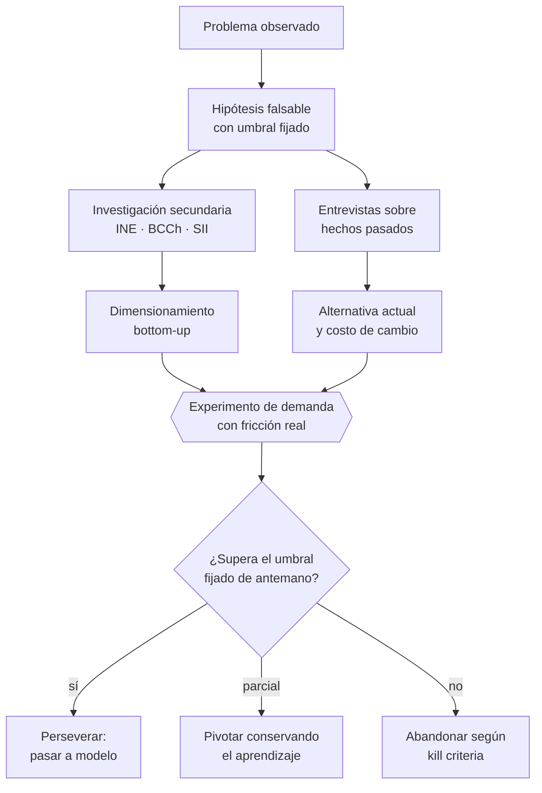

# Parte 02 — Descubrimiento, validación y mercado

> *Gastar información barata antes de gastar dinero caro*

🟢 **Etapa 1 — Antes de que la empresa exista** · salida de la etapa: Tesis validada con evidencia primaria

**Estado de evidencia:** `GUIA-PRACTICA` · **Clases:** 14 (015–028) · **Fecha base normativa:** 07-08-2026 
**Contenido central:** Hipótesis falsables, entrevistas sin sesgo, TAM/SAM/SOM bottom-up, competencia, MVP y kill criteria 
**Conceptos definidos en esta parte:** 56

## 🎯 De qué trata esta parte

La validación no busca confirmar la idea: busca abaratar el error. Cada peso gastado en descubrimiento evita muchos gastados en construir algo que nadie compra, y esa aritmética es la única defensa real contra el sesgo de confirmación del fundador. El método es simple de enunciar y difícil de sostener: convertir la intuición en hipótesis falsable, fijar el umbral antes de mirar el dato, y aceptar el resultado aunque duela.

El núcleo técnico de esta parte es la distinción entre lo que la gente dice y lo que la gente hace. Una entrevista bien hecha pregunta por hechos pasados —qué hiciste la última vez, cuánto te costó, qué probaste, por qué lo abandonaste— porque las respuestas sobre intenciones futuras tienen valor predictivo casi nulo. Un experimento bien diseñado impone fricción: una seña, una firma, una tarjeta. El interés es gratis; el compromiso no.

El dimensionamiento cierra la parte y es donde más se miente sin querer. Estimar el mercado como un porcentaje de una cifra global es señal de que no se estudió el mercado propio. La estimación defendible se construye de abajo hacia arriba, con datos del INE, del Banco Central y del SII, y con cada supuesto vinculado a su fuente y su fecha.

## 📚 Resultados de la parte

Al terminar esta parte podrás:

1. **Formular un problema empresarial en términos falsables**.
2. **Producir evidencia de demanda antes de comprometer capital**.
3. **Dimensionar TAM, SAM y SOM con supuestos rastreables a una fuente**.
4. **Decidir con criterio explícito entre perseverar, pivotar o abandonar**.

## 🗺️ Mapa de la parte

## ⚖️ Marco aplicable

- método de descubrimiento de clientes y experimentación acotada
- Jobs to Be Done como marco de resultados esperados
- estadística oficial chilena: INE, Banco Central, Censo y encuestas sectoriales

**Autoridades o contrapartes:** INE, Banco Central de Chile, SII (estadísticas de empresas por rubro).
**Profesionales de apoyo:** fundador, investigador de mercado, analista de datos.

## ⚠️ Riesgos característicos

- Entrevistar buscando confirmación en vez de refutación.
- Estimar mercado de arriba hacia abajo sin conexión con capacidad real de venta.
- Confundir interés declarado con disposición a pagar.
- Invertir en producto antes de tener un canal de adquisición identificado.

## 📘 Las 14 clases

| # | Global | Clase | Decisión que habilita |
|---:|---:|---|---|
| 01 | 015 | [Formulación del problema empresarial](class-01-formulacion-del-problema-empresarial/README.md) | convertir la intuición del fundador en un enunciado que puede resultar falso |
| 02 | 016 | [Investigación secundaria con fuentes confiables](class-02-investigacion-secundaria-con-fuentes-confiables/README.md) | definir qué fuentes se usarán y con qué frecuencia se revalidan |
| 03 | 017 | [Entrevistas de descubrimiento sin sesgos](class-03-entrevistas-de-descubrimiento-sin-sesgos/README.md) | decidir a quién entrevistar y qué evidencia de comportamiento se busca |
| 04 | 018 | [Segmentación y perfil de cliente ideal](class-04-segmentacion-y-perfil-de-cliente-ideal/README.md) | definir a qué segmento se dirige la empresa y a cuáles renuncia explícitamente |
| 05 | 019 | [Jobs to Be Done y resultados esperados](class-05-jobs-to-be-done-y-resultados-esperados/README.md) | definir qué progreso contrata el cliente y con qué métrica lo juzga |
| 06 | 020 | [Tamaño de mercado TAM SAM SOM](class-06-tamano-de-mercado-tam-sam-som/README.md) | dimensionar el mercado con supuestos que un tercero pueda auditar |
| 07 | 021 | [Competidores directos, indirectos y sustitutos](class-07-competidores-directos-indirectos-y-sustitutos/README.md) | identificar contra qué compite realmente la oferta en la decisión del cliente |
| 08 | 022 | [Mapa de alternativas actuales del cliente](class-08-mapa-de-alternativas-actuales-del-cliente/README.md) | determinar si la mejora ofrecida supera el costo de cambio del cliente |
| 09 | 023 | [Propuesta de valor y diferenciación](class-09-propuesta-de-valor-y-diferenciacion/README.md) | definir la promesa central y la prueba que la sostiene |
| 10 | 024 | [Hipótesis críticas del negocio](class-10-hipotesis-criticas-del-negocio/README.md) | priorizar qué supuestos se prueban primero y con qué presupuesto |
| 11 | 025 | [Experimentos de demanda antes de invertir](class-11-experimentos-de-demanda-antes-de-invertir/README.md) | elegir el experimento que produce la señal más fuerte al menor costo |
| 12 | 026 | [MVP, prototipo y concierge test](class-12-mvp-prototipo-y-concierge-test/README.md) | decidir qué se entrega manualmente y qué se automatiza en la primera versión |
| 13 | 027 | [Precio como experimento de mercado](class-13-precio-como-experimento-de-mercado/README.md) | fijar el precio inicial con un método declarado y un plan de prueba |
| 14 | 028 | [Decidir: perseverar, pivotar o abandonar](class-14-decidir-perseverar-pivotar-o-abandonar/README.md) | decidir con criterio preestablecido si se persevera, se pivota o se abandona |

## 🔤 Glosario de la parte

| Concepto | Definición operacional |
|---|---|
| **Abandonar** | Cerrar la apuesta según criterio definido previamente. |
| **Alcance** | Segmento y contexto donde la hipótesis se afirma verdadera. |
| **Alternativa actual** | Lo que el cliente hace hoy para mitigar el problema. |
| **Ancla** | Primer número que condiciona la percepción de todo el resto. |
| **Circunstancia** | Contexto que gatilla la contratación de la solución. |
| **Competidor directo** | Resuelve el mismo job con un modelo similar. |
| **Competidor indirecto** | Resuelve el mismo job con un modelo distinto. |
| **Concierge test** | Entrega manual del servicio para validar antes de automatizar. |
| **Costo de cambio** | Esfuerzo, riesgo y dinero de abandonar la alternativa actual. |
| **Costo del experimento** | Gasto máximo aceptable para obtener la señal. |
| **Criterio de exclusión** | Atributo que descarta a un prospecto aunque parezca atractivo. |
| **Deuda de aprendizaje** | Conocimiento no adquirido por saltarse la etapa manual. |
| **Diferenciación** | Atributo que el cliente valora y que la competencia no ofrece igual. |
| **Disposición a pagar** | Máximo que el cliente pagaría antes de rechazar. |
| **Elasticidad** | Sensibilidad de la demanda ante un cambio de precio. |
| **Entrevista de descubrimiento** | Conversación sobre el pasado del entrevistado, no sobre el futuro. |
| **Estimación bottom-up** | Cálculo desde número de clientes posibles por ticket promedio. |
| **Evidencia de comportamiento** | Lo que la persona ya hizo, gastó o intentó. |
| **Experimento de demanda** | Prueba que mide intención con costo o compromiso real. |
| **Fecha de corte** | Momento al que corresponde el dato y a partir del cual envejece. |
| **Fuente primaria** | Dato producido por quien lo genera: organismo oficial, registro, censo. |
| **Fuente secundaria** | Interpretación o resumen elaborado por un tercero. |
| **Fuerza de cambio** | Empuje del problema y atracción de la solución contra hábito y ansiedad. |
| **Gatillo de cambio** | Evento que hace insostenible seguir con la alternativa actual. |
| **Hipótesis crítica** | Supuesto cuyo error invalida todo el negocio. |
| **Hipótesis falsable** | Enunciado que puede resultar falso con una observación concreta. |
| **ICP** | Perfil de cliente ideal, definido por atributos observables. |
| **Job to be done** | Progreso que el cliente busca en una circunstancia concreta. |
| **Kill criteria** | Condición fijada de antemano que obliga a detener. |
| **Matriz competitiva** | Comparación por atributos que el cliente usa para decidir. |
| **MVP** | Versión mínima que permite aprender lo crítico entregando valor real. |
| **Métrica de refutación** | Dato que, si aparece, obliga a abandonar la hipótesis. |
| **Paridad** | Atributo necesario para competir pero que no diferencia. |
| **Perseverar** | Seguir con la hipótesis actual porque la evidencia la respalda. |
| **Pivotar** | Cambiar un elemento del modelo conservando el aprendizaje. |
| **Precio de referencia** | Monto que el cliente ya paga por la alternativa actual. |
| **Pregunta inductiva** | Pregunta que sugiere la respuesta esperada. |
| **Propuesta de valor** | Promesa específica de resultado para un segmento específico. |
| **Prototipo** | Representación que permite evaluar sin operar. |
| **Prueba** | Evidencia que hace creíble la promesa. |
| **Punto de dolor residual** | Lo que la alternativa actual no resuelve. |
| **Resultado esperado** | Métrica con la que el cliente juzga si el progreso ocurrió. |
| **Riesgo de deseabilidad** | Que el cliente no quiera la solución. |
| **Riesgo de factibilidad** | Que la empresa no pueda entregarlo de forma sostenible. |
| **Riesgo de viabilidad** | Que el modelo no genere margen suficiente. |
| **SAM** | Porción del tam alcanzable con el modelo y la geografía actuales. |
| **Saturación** | Punto en que las entrevistas dejan de aportar información nueva. |
| **Segmentación** | División del mercado en grupos con comportamiento de compra distinto. |
| **Segmento accesible** | Grupo al que la empresa efectivamente puede llegar con su canal. |
| **Sesgo de confirmación** | Tendencia a buscar solo evidencia que apoya lo que ya se cree. |
| **Señal débil** | Clic, me gusta, encuesta o promesa verbal. |
| **Señal fuerte** | Pago, reserva, firma o cesión de tiempo relevante. |
| **SOM** | Porción del sam capturable en un horizonte realista con la capacidad actual. |
| **Sustituto** | Forma alternativa de lograr el progreso, incluido no hacer nada. |
| **TAM** | Mercado total teórico si se capturara todo el segmento. |
| **Trazabilidad** | Posibilidad de reconstruir de dónde salió cada cifra. |

## 🔗 Cómo se conecta

Alimenta directamente la parte 03, que traduce la evidencia en modelo de ingreso, y la parte 09, que convierte la disposición a pagar detectada aquí en precio y economía unitaria. Sin esta parte, la parte 24 no tiene caso que defender.

## 📖 Pauta bibliográfica

- Fitzpatrick, R. — *The Mom Test*: cómo preguntar sin inducir la respuesta.
- Christensen, C. — marco Jobs to Be Done y competencia por el progreso del cliente.
- INE · Censo y encuestas sectoriales, y series del Banco Central: base de todo dimensionamiento bottom-up en Chile.

## 🏛️ Fuentes oficiales de la parte

**Biblioteca del Congreso Nacional · LeyChile — Normativa oficial consolidada**  
<https://www.bcn.cl/leychile/> · verificado 2026-08-19

- *Qué contiene:* Publica el texto oficial y consolidado de leyes, decretos y reglamentos, con la versión vigente a una fecha, el historial de modificaciones y la tramitación que las originó.
- *Cómo leerla:* Usa siempre el selector de versión vigente a la fecha en que ejecutarás el trámite, no la última publicada. Y lee el artículo transitorio: en normas en implantación gradual —jornada, datos personales— ahí está la fecha que realmente te aplica.

**Servicio de Cooperación Técnica — Fomento para micro y pequeñas empresas**  
<https://www.sercotec.cl/> · verificado 2026-08-19

- *Qué contiene:* Publica las convocatorias vigentes con sus bases: perfil de empresa elegible, monto del subsidio, cofinanciamiento exigido, gastos financiables y obligaciones de rendición.
- *Cómo leerla:* Lee las bases desde el final: la sección de rendición decide si podrás quedarte con el subsidio. Muchos proyectos se adjudican y después devuelven fondos por no poder acreditar el gasto en la forma exigida.

**ProChile — Programas, estudios de mercado y promoción**  
<https://www.prochile.gob.cl/> · verificado 2026-08-19

- *Qué contiene:* Publica estudios de mercado por país y sector, agendas de negocios, ferias, y los programas de cofinanciamiento de actividades de promoción.
- *Cómo leerla:* Los estudios de mercado por país son el mejor uso gratuito: entregan tamaño, canales, competencia y requisitos de entrada verificados, que es justo lo que una estimación bottom-up necesita.

---

| Anterior | Índice | Siguiente |
|---|---|---|
| [← Parte 01 · Fundamentos de empresa y mentalidad empresarial](../part-01-fundamentos-de-empresa-y-mentalidad-empresarial/README.md) | [Currículo](../../CURRICULUM.md) · [Programa](../../README.md) | [Parte 03 · Modelos de negocio y líneas de ingreso →](../part-03-modelos-de-negocio-y-lineas-de-ingreso/README.md) |
