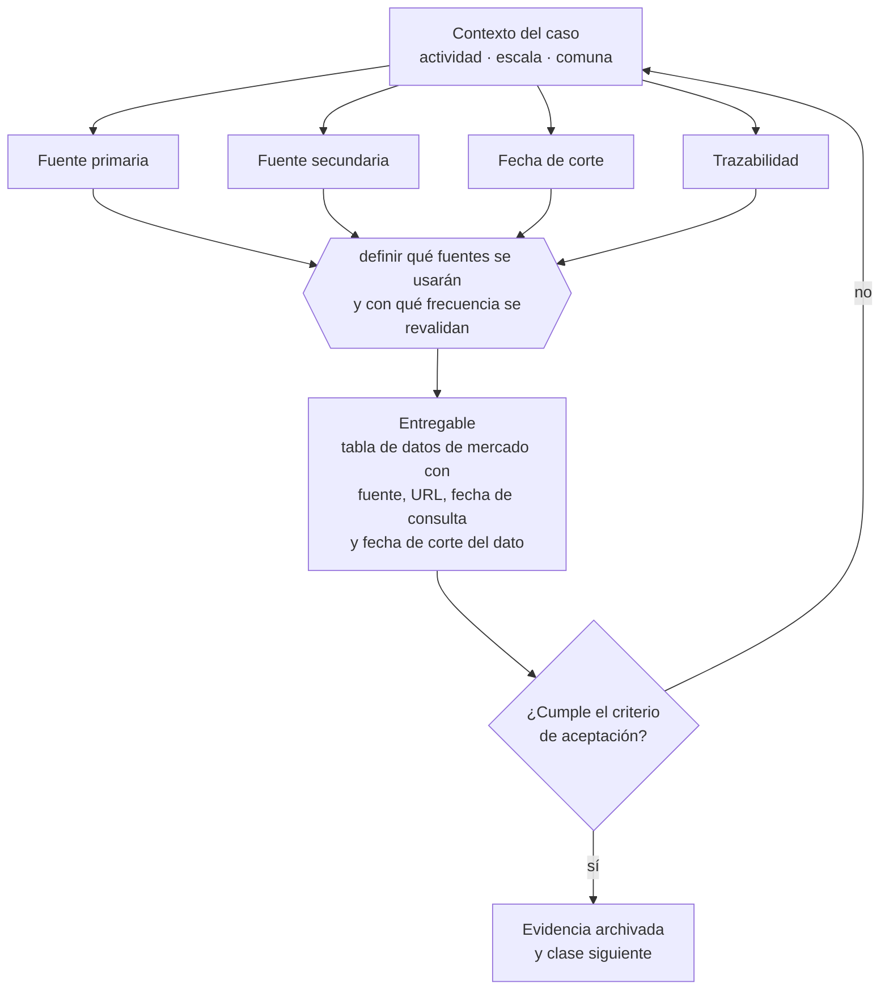

# Clase 016 — Investigación secundaria con fuentes confiables

> **Parte 02 · Descubrimiento, validación y mercado** — clase 2 de 14

**Estado de evidencia:** `GUIA-PRACTICA` · **Jurisdicción:** Chile-first · **Fecha base normativa:** 07-08-2026 
**Decisión que habilita:** definir qué fuentes se usarán y con qué frecuencia se revalidan 
**Entregable:** tabla de datos de mercado con fuente, URL, fecha de consulta y fecha de corte del dato

## 🎯 Propósito

Construir la base de datos de mercado con fuentes primarias trazables, porque una cifra sin origen ni fecha no se puede defender ante un banco, un inversionista ni un comité.

## 📚 Resultados de aprendizaje

Al finalizar esta clase podrás:

1. **Definir** con precisión los cuatro conceptos de la tabla siguiente y usarlos para describir un caso real.
2. **Explicar** por qué esta materia condiciona decisiones de otras partes del programa.
3. **Decidir** —definir qué fuentes se usarán y con qué frecuencia se revalidan— y justificar la decisión por escrito.
4. **Producir** el entregable de la clase y contrastarlo contra su criterio de aceptación.
5. **Distinguir** el dato estable del dato dinámico que exige revalidación en la fuente oficial.

## 🧩 Conceptos centrales

| Concepto | Comprensión verificable |
|---|---|
| **Fuente primaria** | Dato producido por quien lo genera: organismo oficial, registro, censo. |
| **Fuente secundaria** | Interpretación o resumen elaborado por un tercero. |
| **Fecha de corte** | Momento al que corresponde el dato y a partir del cual envejece. |
| **Trazabilidad** | Posibilidad de reconstruir de dónde salió cada cifra. |

## 🗺️ Flujo de razonamiento

## 📖 Desarrollo

### 1. El fondo del asunto

En Chile la investigación secundaria seria se apoya en INE, Banco Central, estadísticas del SII por rubro y registros sectoriales. Cada cifra usada en una decisión debe tener fuente, fecha y método; una cifra sin trazabilidad no se puede defender ante un banco, un inversionista ni un comité.

### 2. Cómo se traduce en la práctica

En Chile la investigación seria se apoya en el INE para población y empleo, el Banco Central para series macro y tipo de cambio, y las estadísticas del SII por rubro y tamaño. La regla es bajar el dato a la comuna cuando el negocio sea local: los promedios nacionales rara vez describen el mercado alcanzable.

### 3. Marco aplicable y quién interviene

- método de descubrimiento de clientes y experimentación acotada
- Jobs to Be Done como marco de resultados esperados
- estadística oficial chilena: INE, Banco Central, Censo y encuestas sectoriales

**Autoridades o contrapartes involucradas:** INE, Banco Central de Chile, SII (estadísticas de empresas por rubro).
**Profesionales de apoyo:** fundador, investigador de mercado, analista de datos. La participación concreta depende del riesgo, del
tamaño de la empresa y de la actividad económica.

## 🧪 Taller guiado

Aplica esta clase a **una** de las siguientes líneas de negocio y repite después el ejercicio con
una segunda línea de carga regulatoria distinta:

| Línea | Carga regulatoria |
|---|---|
| SaaS B2B con IA | media |
| Servicios profesionales | baja |
| E-commerce D2C | media |
| Alimentos o foodtech | alta |
| Exportación de servicios | media |
| Fintech regulada | alta |
| Construcción o servicios técnicos | alta |

**Secuencia de trabajo:**

1. Delimita el contexto: actividad económica, escala, comuna y etapa de la empresa.
2. Reúne los antecedentes que la decisión exige y anota la fecha de cada fuente.
3. Identifica las alternativas reales, incluida la de no hacer nada.
4. Evalúa el impacto en mercado, caja, personas, regulación y operación.
5. Toma la decisión y regístrala con sus supuestos.
6. Produce el entregable.
7. Contrástalo contra el criterio de aceptación.
8. Anota lo que requiere validación profesional y programa su revisión.

### 📦 Entregable

Tabla de datos de mercado con fuente, url, fecha de consulta y fecha de corte del dato.

Debe incluir decisión, supuestos, fuentes con fecha de consulta, responsable, riesgos
identificados y próximos pasos.

## 🏆 Reto verificable

Resuelve la misma materia para una segunda línea de negocio con distinta carga regulatoria y
explica por escrito **qué cambió, por qué y qué fuente lo determina**.

## ✅ Criterio de aceptación

- [ ] cada cifra tiene fuente primaria identificable y fecha
- [ ] los datos dinámicos están marcados para revalidación
- [ ] cada afirmación regulatoria está referida a una fuente oficial con fecha de consulta;
- [ ] los datos dinámicos quedan marcados para revalidación;
- [ ] hay un responsable asignado y evidencia reproducible del trabajo.

## ⚠️ Errores frecuentes

**Propios de esta clase:**

- Citar una nota de prensa que a su vez cita un informe que nadie leyó.
- Usar una cifra de mercado global como si describiera el mercado chileno.

**Característicos de la parte 02:**

- Entrevistar buscando confirmación en vez de refutación.
- Estimar mercado de arriba hacia abajo sin conexión con capacidad real de venta.

## 🇨🇱 Checklist Chile

- [ ] ¿existe norma o autoridad específica para esta materia?
- [ ] ¿la fuente consultada está vigente a la fecha de ejecución?
- [ ] ¿se activa algún trámite ante el SII?
- [ ] ¿se activa algún requisito municipal o sectorial?
- [ ] ¿afecta a consumidores o al tratamiento de datos personales?
- [ ] ¿afecta a trabajadores o a la seguridad y salud en el trabajo?
- [ ] ¿afecta a impuestos, contabilidad o caja?
- [ ] ¿afecta a contratos o a propiedad intelectual?
- [ ] ¿requiere renovación, reporte periódico o revalidación?

## ❓ Preguntas de comprobación

1. ¿Cuál es la fuente primaria, la fecha de consulta y la fecha de corte de cada cifra que usas?
2. ¿Qué dato tuyo proviene en realidad de una nota de prensa que cita a un tercero?
3. ¿Qué cifras de tu modelo son dinámicas y cuándo toca revalidarlas?

## 🔗 Fuentes oficiales

**Biblioteca del Congreso Nacional · LeyChile — Normativa oficial consolidada**  
<https://www.bcn.cl/leychile/> · verificado 2026-08-07

- *Qué contiene:* Publica el texto oficial y consolidado de leyes, decretos y reglamentos, con la versión vigente a una fecha, el historial de modificaciones y la tramitación que las originó.
- *Cómo leerla:* Usa siempre el selector de versión vigente a la fecha en que ejecutarás el trámite, no la última publicada. Y lee el artículo transitorio: en normas en implantación gradual —jornada, datos personales— ahí está la fecha que realmente te aplica.

**Servicio de Impuestos Internos — Nuevos contribuyentes, inicio de actividades y DTE**  
<https://www.sii.cl/ayudas/nuevos_contribuyentes/boleta-vys-facturador.html> · verificado 2026-08-07

- *Qué contiene:* Reúne el circuito completo del contribuyente nuevo: obtención de RUT, declaración de inicio de actividades, elección de códigos de actividad económica y habilitación para emitir documentos tributarios electrónicos.
- *Cómo leerla:* Sepáralo en dos actos distintos que la página trata seguidos: el RUT identifica, el inicio de actividades habilita. Lo que te bloquea para facturar casi siempre está en el segundo, no en el primero.

Complementos del repositorio: [glosario](../../../docs/19_GLOSSARY.md) ·
[ruta de lecturas](../../../docs/15_BOOKS_AND_LEARNING_PATH.md) ·
[catálogo de fuentes](../../../docs/16_OFFICIAL_SOURCE_CATALOG.md).

> [!IMPORTANT]
> Material educativo. Para una decisión real de alto impacto hay que verificar la fuente oficial
> vigente y validar con el profesional competente.

---

| Anterior | Índice | Siguiente |
|---|---|---|
| [← 015 · Formulación del problema empresarial](../class-01-formulacion-del-problema-empresarial/README.md) | [Parte 02](../README.md) · [Programa](../../../README.md) | [017 · Entrevistas de descubrimiento sin sesgos →](../class-03-entrevistas-de-descubrimiento-sin-sesgos/README.md) |
