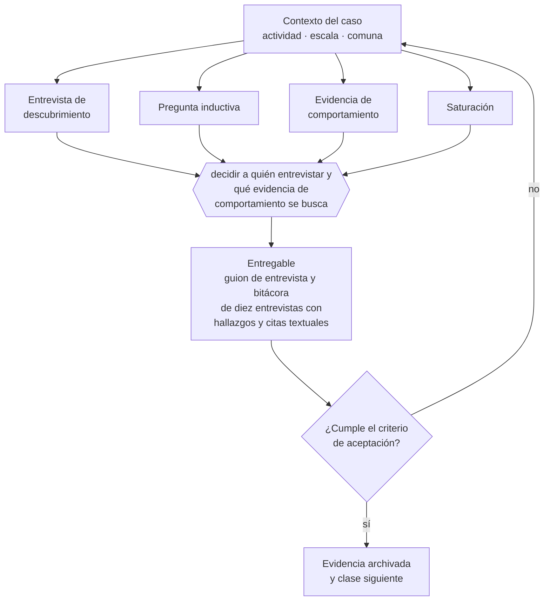

# Clase 017 — Entrevistas de descubrimiento sin sesgos

> **Parte 02 · Descubrimiento, validación y mercado** — clase 3 de 14

**Estado de evidencia:** `GUIA-PRACTICA` · **Jurisdicción:** Chile-first · **Fecha base normativa:** 07-08-2026 
**Decisión que habilita:** decidir a quién entrevistar y qué evidencia de comportamiento se busca 
**Entregable:** guion de entrevista y bitácora de diez entrevistas con hallazgos y citas textuales

## 🎯 Propósito

Aprender a entrevistar sobre hechos ocurridos y no sobre intenciones, porque las respuestas sobre lo que alguien haría en el futuro tienen valor predictivo casi nulo.

## 📚 Resultados de aprendizaje

Al finalizar esta clase podrás:

1. **Definir** con precisión los cuatro conceptos de la tabla siguiente y usarlos para describir un caso real.
2. **Explicar** por qué esta materia condiciona decisiones de otras partes del programa.
3. **Decidir** —decidir a quién entrevistar y qué evidencia de comportamiento se busca— y justificar la decisión por escrito.
4. **Producir** el entregable de la clase y contrastarlo contra su criterio de aceptación.
5. **Distinguir** el dato estable del dato dinámico que exige revalidación en la fuente oficial.

## 🧩 Conceptos centrales

| Concepto | Comprensión verificable |
|---|---|
| **Entrevista de descubrimiento** | Conversación sobre el pasado del entrevistado, no sobre el futuro. |
| **Pregunta inductiva** | Pregunta que sugiere la respuesta esperada. |
| **Evidencia de comportamiento** | Lo que la persona ya hizo, gastó o intentó. |
| **Saturación** | Punto en que las entrevistas dejan de aportar información nueva. |

## 🗺️ Flujo de razonamiento

## 📖 Desarrollo

### 1. El fondo del asunto

La regla central es preguntar por hechos ocurridos y no por intenciones: qué hizo la última vez que enfrentó el problema, cuánto le costó, qué probó y por qué lo abandonó. Las respuestas sobre lo que la persona haría en el futuro tienen valor predictivo casi nulo.

### 2. Cómo se traduce en la práctica

La contaminación más habitual es presentar la solución al inicio: a partir de ahí el entrevistado colabora en vez de informar. La estructura que funciona empieza por el último episodio real del problema y avanza hacia atrás, hasta que aparecen el costo y la alternativa que hoy usa.

### 3. Marco aplicable y quién interviene

- método de descubrimiento de clientes y experimentación acotada
- Jobs to Be Done como marco de resultados esperados
- estadística oficial chilena: INE, Banco Central, Censo y encuestas sectoriales

**Autoridades o contrapartes involucradas:** INE, Banco Central de Chile, SII (estadísticas de empresas por rubro).
**Profesionales de apoyo:** fundador, investigador de mercado, analista de datos. La participación concreta depende del riesgo, del
tamaño de la empresa y de la actividad económica.

## 🧪 Taller guiado

Aplica esta clase a **una** de las siguientes líneas de negocio y repite después el ejercicio con
una segunda línea de carga regulatoria distinta:

| Línea | Carga regulatoria |
|---|---|
| SaaS B2B con IA | media |
| Servicios profesionales | baja |
| E-commerce D2C | media |
| Alimentos o foodtech | alta |
| Exportación de servicios | media |
| Fintech regulada | alta |
| Construcción o servicios técnicos | alta |

**Secuencia de trabajo:**

1. Delimita el contexto: actividad económica, escala, comuna y etapa de la empresa.
2. Reúne los antecedentes que la decisión exige y anota la fecha de cada fuente.
3. Identifica las alternativas reales, incluida la de no hacer nada.
4. Evalúa el impacto en mercado, caja, personas, regulación y operación.
5. Toma la decisión y regístrala con sus supuestos.
6. Produce el entregable.
7. Contrástalo contra el criterio de aceptación.
8. Anota lo que requiere validación profesional y programa su revisión.

### 📦 Entregable

Guion de entrevista y bitácora de diez entrevistas con hallazgos y citas textuales.

Debe incluir decisión, supuestos, fuentes con fecha de consulta, responsable, riesgos
identificados y próximos pasos.

## 🏆 Reto verificable

Resuelve la misma materia para una segunda línea de negocio con distinta carga regulatoria y
explica por escrito **qué cambió, por qué y qué fuente lo determina**.

## ✅ Criterio de aceptación

- [ ] las preguntas indagan hechos pasados y no intenciones
- [ ] las conclusiones citan evidencia textual de las entrevistas
- [ ] cada afirmación regulatoria está referida a una fuente oficial con fecha de consulta;
- [ ] los datos dinámicos quedan marcados para revalidación;
- [ ] hay un responsable asignado y evidencia reproducible del trabajo.

## ⚠️ Errores frecuentes

**Propios de esta clase:**

- Presentar la solución al inicio y contaminar toda la conversación.
- Entrevistar solo a personas del entorno cercano del fundador.

**Característicos de la parte 02:**

- Entrevistar buscando confirmación en vez de refutación.
- Estimar mercado de arriba hacia abajo sin conexión con capacidad real de venta.

## 🇨🇱 Checklist Chile

- [ ] ¿existe norma o autoridad específica para esta materia?
- [ ] ¿la fuente consultada está vigente a la fecha de ejecución?
- [ ] ¿se activa algún trámite ante el SII?
- [ ] ¿se activa algún requisito municipal o sectorial?
- [ ] ¿afecta a consumidores o al tratamiento de datos personales?
- [ ] ¿afecta a trabajadores o a la seguridad y salud en el trabajo?
- [ ] ¿afecta a impuestos, contabilidad o caja?
- [ ] ¿afecta a contratos o a propiedad intelectual?
- [ ] ¿requiere renovación, reporte periódico o revalidación?

## ❓ Preguntas de comprobación

1. ¿Cuántas de tus preguntas indagan hechos pasados y cuántas piden opiniones sobre el futuro?
2. ¿Qué cita textual de un entrevistado respalda tu conclusión principal?
3. ¿A cuántas personas fuera de tu entorno cercano entrevistaste?

## 🔗 Fuentes oficiales

**Biblioteca del Congreso Nacional · LeyChile — Normativa oficial consolidada**  
<https://www.bcn.cl/leychile/> · verificado 2026-08-19

- *Qué contiene:* Publica el texto oficial y consolidado de leyes, decretos y reglamentos, con la versión vigente a una fecha, el historial de modificaciones y la tramitación que las originó.
- *Cómo leerla:* Usa siempre el selector de versión vigente a la fecha en que ejecutarás el trámite, no la última publicada. Y lee el artículo transitorio: en normas en implantación gradual —jornada, datos personales— ahí está la fecha que realmente te aplica.
- *Uso en esta clase:* aporta el marco de «Normativa oficial consolidada» para decidir a quién entrevistar y qué evidencia de comportamiento se busca.

**Servicio de Cooperación Técnica — Fomento para micro y pequeñas empresas**  
<https://www.sercotec.cl/> · verificado 2026-08-19

- *Qué contiene:* Publica las convocatorias vigentes con sus bases: perfil de empresa elegible, monto del subsidio, cofinanciamiento exigido, gastos financiables y obligaciones de rendición.
- *Cómo leerla:* Lee las bases desde el final: la sección de rendición decide si podrás quedarte con el subsidio. Muchos proyectos se adjudican y después devuelven fondos por no poder acreditar el gasto en la forma exigida.
- *Uso en esta clase:* aporta el marco de «Fomento para micro y pequeñas empresas» para decidir a quién entrevistar y qué evidencia de comportamiento se busca.

**ProChile — Programas, estudios de mercado y promoción**  
<https://www.prochile.gob.cl/> · verificado 2026-08-19

- *Qué contiene:* Publica estudios de mercado por país y sector, agendas de negocios, ferias, y los programas de cofinanciamiento de actividades de promoción.
- *Cómo leerla:* Los estudios de mercado por país son el mejor uso gratuito: entregan tamaño, canales, competencia y requisitos de entrada verificados, que es justo lo que una estimación bottom-up necesita.
- *Uso en esta clase:* aporta el marco de «Programas, estudios de mercado y promoción» para decidir a quién entrevistar y qué evidencia de comportamiento se busca.

Complementos del repositorio: [glosario](../../../docs/19_GLOSSARY.md) ·
[ruta de lecturas](../../../docs/15_BOOKS_AND_LEARNING_PATH.md) ·
[catálogo de fuentes](../../../docs/16_OFFICIAL_SOURCE_CATALOG.md).

> [!IMPORTANT]
> Material educativo. Para una decisión real de alto impacto hay que verificar la fuente oficial
> vigente y validar con el profesional competente.

---

| Anterior | Índice | Siguiente |
|---|---|---|
| [← 016 · Investigación secundaria con fuentes confiables](../class-02-investigacion-secundaria-con-fuentes-confiables/README.md) | [Parte 02](../README.md) · [Programa](../../../README.md) | [018 · Segmentación y perfil de cliente ideal →](../class-04-segmentacion-y-perfil-de-cliente-ideal/README.md) |
