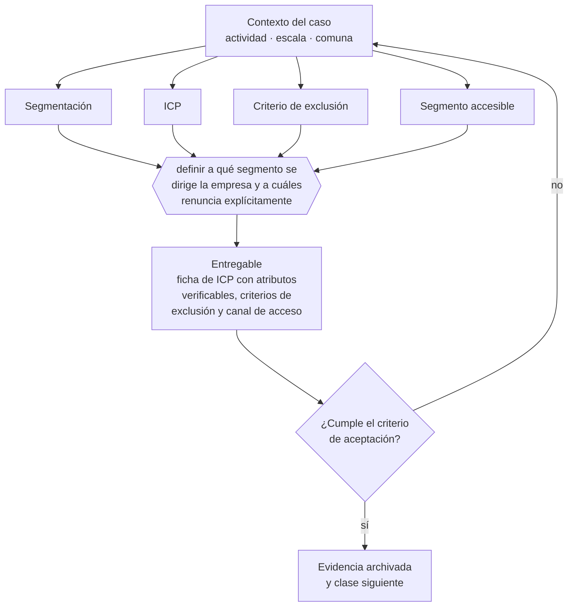

# Clase 018 — Segmentación y perfil de cliente ideal

> **Parte 02 · Descubrimiento, validación y mercado** — clase 4 de 14

**Estado de evidencia:** `GUIA-PRACTICA` · **Jurisdicción:** Chile-first · **Fecha base normativa:** 07-08-2026 
**Decisión que habilita:** definir a qué segmento se dirige la empresa y a cuáles renuncia explícitamente 
**Entregable:** ficha de ICP con atributos verificables, criterios de exclusión y canal de acceso

## 🎯 Propósito

Definir un perfil de cliente ideal con atributos verificables antes del contacto, para que el equipo comercial pueda filtrar en vez de perseguir todo.

## 📚 Resultados de aprendizaje

Al finalizar esta clase podrás:

1. **Definir** con precisión los cuatro conceptos de la tabla siguiente y usarlos para describir un caso real.
2. **Explicar** por qué esta materia condiciona decisiones de otras partes del programa.
3. **Decidir** —definir a qué segmento se dirige la empresa y a cuáles renuncia explícitamente— y justificar la decisión por escrito.
4. **Producir** el entregable de la clase y contrastarlo contra su criterio de aceptación.
5. **Distinguir** el dato estable del dato dinámico que exige revalidación en la fuente oficial.

## 🧩 Conceptos centrales

| Concepto | Comprensión verificable |
|---|---|
| **Segmentación** | División del mercado en grupos con comportamiento de compra distinto. |
| **ICP** | Perfil de cliente ideal, definido por atributos observables. |
| **Criterio de exclusión** | Atributo que descarta a un prospecto aunque parezca atractivo. |
| **Segmento accesible** | Grupo al que la empresa efectivamente puede llegar con su canal. |

## 🗺️ Flujo de razonamiento

## 📖 Desarrollo

### 1. El fondo del asunto

Un ICP útil se escribe con atributos verificables antes de la venta: tamaño, rubro, sistema que usa, evento que gatilla la compra. Un ICP escrito con adjetivos —empresas modernas, clientes exigentes— no permite filtrar prospectos y por lo tanto no sirve para dirigir el esfuerzo comercial.

### 2. Cómo se traduce en la práctica

Un ICP escrito con adjetivos —empresas modernas, clientes exigentes— no filtra nada. Uno útil se escribe con atributos observables antes de vender: rubro, tamaño, sistema que ya usa, evento que gatilla la compra. La parte 14 lo refina mirando qué clientes efectivamente retienen y son rentables.

### 3. Marco aplicable y quién interviene

- método de descubrimiento de clientes y experimentación acotada
- Jobs to Be Done como marco de resultados esperados
- estadística oficial chilena: INE, Banco Central, Censo y encuestas sectoriales

**Autoridades o contrapartes involucradas:** INE, Banco Central de Chile, SII (estadísticas de empresas por rubro).
**Profesionales de apoyo:** fundador, investigador de mercado, analista de datos. La participación concreta depende del riesgo, del
tamaño de la empresa y de la actividad económica.

## 🧪 Taller guiado

Aplica esta clase a **una** de las siguientes líneas de negocio y repite después el ejercicio con
una segunda línea de carga regulatoria distinta:

| Línea | Carga regulatoria |
|---|---|
| SaaS B2B con IA | media |
| Servicios profesionales | baja |
| E-commerce D2C | media |
| Alimentos o foodtech | alta |
| Exportación de servicios | media |
| Fintech regulada | alta |
| Construcción o servicios técnicos | alta |

**Secuencia de trabajo:**

1. Delimita el contexto: actividad económica, escala, comuna y etapa de la empresa.
2. Reúne los antecedentes que la decisión exige y anota la fecha de cada fuente.
3. Identifica las alternativas reales, incluida la de no hacer nada.
4. Evalúa el impacto en mercado, caja, personas, regulación y operación.
5. Toma la decisión y regístrala con sus supuestos.
6. Produce el entregable.
7. Contrástalo contra el criterio de aceptación.
8. Anota lo que requiere validación profesional y programa su revisión.

### 📦 Entregable

Ficha de icp con atributos verificables, criterios de exclusión y canal de acceso.

Debe incluir decisión, supuestos, fuentes con fecha de consulta, responsable, riesgos
identificados y próximos pasos.

## 🏆 Reto verificable

Resuelve la misma materia para una segunda línea de negocio con distinta carga regulatoria y
explica por escrito **qué cambió, por qué y qué fuente lo determina**.

## ✅ Criterio de aceptación

- [ ] todos los atributos del ICP son verificables antes de contactar
- [ ] existen criterios explícitos de exclusión
- [ ] cada afirmación regulatoria está referida a una fuente oficial con fecha de consulta;
- [ ] los datos dinámicos quedan marcados para revalidación;
- [ ] hay un responsable asignado y evidencia reproducible del trabajo.

## ⚠️ Errores frecuentes

**Propios de esta clase:**

- Definir el icp tan amplio que no orienta ninguna decisión comercial.
- Incluir un segmento atractivo al que el canal actual no puede llegar.

**Característicos de la parte 02:**

- Entrevistar buscando confirmación en vez de refutación.
- Estimar mercado de arriba hacia abajo sin conexión con capacidad real de venta.

## 🇨🇱 Checklist Chile

- [ ] ¿existe norma o autoridad específica para esta materia?
- [ ] ¿la fuente consultada está vigente a la fecha de ejecución?
- [ ] ¿se activa algún trámite ante el SII?
- [ ] ¿se activa algún requisito municipal o sectorial?
- [ ] ¿afecta a consumidores o al tratamiento de datos personales?
- [ ] ¿afecta a trabajadores o a la seguridad y salud en el trabajo?
- [ ] ¿afecta a impuestos, contabilidad o caja?
- [ ] ¿afecta a contratos o a propiedad intelectual?
- [ ] ¿requiere renovación, reporte periódico o revalidación?

## ❓ Preguntas de comprobación

1. ¿Todos los atributos de tu ICP se pueden verificar antes de contactar al prospecto?
2. ¿Qué criterio explícito descarta a un prospecto aunque parezca atractivo?
3. ¿Tu canal actual llega efectivamente al segmento que definiste?

## 🔗 Fuentes oficiales

**Biblioteca del Congreso Nacional · LeyChile — Normativa oficial consolidada**  
<https://www.bcn.cl/leychile/> · verificado 2026-08-19

- *Qué contiene:* Publica el texto oficial y consolidado de leyes, decretos y reglamentos, con la versión vigente a una fecha, el historial de modificaciones y la tramitación que las originó.
- *Cómo leerla:* Usa siempre el selector de versión vigente a la fecha en que ejecutarás el trámite, no la última publicada. Y lee el artículo transitorio: en normas en implantación gradual —jornada, datos personales— ahí está la fecha que realmente te aplica.
- *Uso en esta clase:* aporta el marco de «Normativa oficial consolidada» para definir a qué segmento se dirige la empresa y a cuáles renuncia explícitamente.

**Servicio de Cooperación Técnica — Fomento para micro y pequeñas empresas**  
<https://www.sercotec.cl/> · verificado 2026-08-19

- *Qué contiene:* Publica las convocatorias vigentes con sus bases: perfil de empresa elegible, monto del subsidio, cofinanciamiento exigido, gastos financiables y obligaciones de rendición.
- *Cómo leerla:* Lee las bases desde el final: la sección de rendición decide si podrás quedarte con el subsidio. Muchos proyectos se adjudican y después devuelven fondos por no poder acreditar el gasto en la forma exigida.
- *Uso en esta clase:* aporta el marco de «Fomento para micro y pequeñas empresas» para definir a qué segmento se dirige la empresa y a cuáles renuncia explícitamente.

**ProChile — Programas, estudios de mercado y promoción**  
<https://www.prochile.gob.cl/> · verificado 2026-08-19

- *Qué contiene:* Publica estudios de mercado por país y sector, agendas de negocios, ferias, y los programas de cofinanciamiento de actividades de promoción.
- *Cómo leerla:* Los estudios de mercado por país son el mejor uso gratuito: entregan tamaño, canales, competencia y requisitos de entrada verificados, que es justo lo que una estimación bottom-up necesita.
- *Uso en esta clase:* aporta el marco de «Programas, estudios de mercado y promoción» para definir a qué segmento se dirige la empresa y a cuáles renuncia explícitamente.

Complementos del repositorio: [glosario](../../../docs/19_GLOSSARY.md) ·
[ruta de lecturas](../../../docs/15_BOOKS_AND_LEARNING_PATH.md) ·
[catálogo de fuentes](../../../docs/16_OFFICIAL_SOURCE_CATALOG.md).

> [!IMPORTANT]
> Material educativo. Para una decisión real de alto impacto hay que verificar la fuente oficial
> vigente y validar con el profesional competente.

---

| Anterior | Índice | Siguiente |
|---|---|---|
| [← 017 · Entrevistas de descubrimiento sin sesgos](../class-03-entrevistas-de-descubrimiento-sin-sesgos/README.md) | [Parte 02](../README.md) · [Programa](../../../README.md) | [019 · Jobs to Be Done y resultados esperados →](../class-05-jobs-to-be-done-y-resultados-esperados/README.md) |
