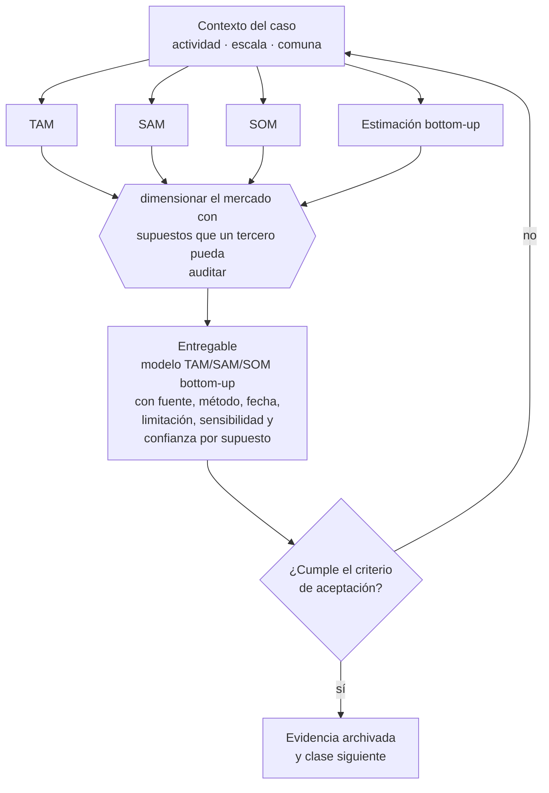

# Clase 020 — Tamaño de mercado TAM SAM SOM

> **Parte 02 · Descubrimiento, validación y mercado** — clase 6 de 14

**Estado de evidencia:** `GUIA-PRACTICA` · **Jurisdicción:** Chile-first · **Fecha base normativa:** 07-08-2026 
**Decisión que habilita:** dimensionar el mercado con supuestos que un tercero pueda auditar 
**Entregable:** modelo TAM/SAM/SOM bottom-up con fuente, método, fecha, limitación, sensibilidad y confianza por supuesto

## 🎯 Propósito

Producir una estimación TAM, SAM y SOM auditable, con método, limitaciones, sensibilidad y confianza explícitos.

## 📚 Resultados de aprendizaje

Al finalizar esta clase podrás:

1. **Definir** con precisión los cuatro conceptos de la tabla siguiente y usarlos para describir un caso real.
2. **Explicar** por qué esta materia condiciona decisiones de otras partes del programa.
3. **Decidir** —dimensionar el mercado con supuestos que un tercero pueda auditar— y justificar la decisión por escrito.
4. **Producir** el entregable de la clase y contrastarlo contra su criterio de aceptación.
5. **Distinguir** el dato estable del dato dinámico que exige revalidación en la fuente oficial.

## 🧩 Conceptos centrales

| Concepto | Comprensión verificable |
|---|---|
| **TAM** | Mercado total teórico si se capturara todo el segmento. |
| **SAM** | Porción del tam alcanzable con el modelo y la geografía actuales. |
| **SOM** | Porción del sam capturable en un horizonte realista con la capacidad actual. |
| **Estimación bottom-up** | Cálculo desde número de clientes posibles por ticket promedio. |

## 🗺️ Flujo de razonamiento

## 📖 Desarrollo

### 1. El fondo del asunto

La estimación bottom-up es la única defendible ante un evaluador: número de empresas o personas en el segmento por tasa de adopción realista por ticket. La estimación top-down —un porcentaje de un mercado global— solo sirve como contraste. Cada nivel debe explicar método, fecha, supuestos, limitaciones y sensibilidad; el SOM además debe reconciliarse con canal, capacidad y horizonte, no con una cuota deseada.

### 2. Cómo se traduce en la práctica

La versión defendible parte de cuántas empresas o personas hay en el segmento, según INE o SII, por una tasa de adopción y un ticket justificados. Una cifra top-down solo contrasta orden de magnitud. El SOM se limita además por canal, capacidad y horizonte, y la sensibilidad muestra qué supuesto mueve de verdad la conclusión.

### 3. Marco aplicable y quién interviene

- método de descubrimiento de clientes y experimentación acotada
- Jobs to Be Done como marco de resultados esperados
- estadística oficial chilena: INE, Banco Central, Censo y encuestas sectoriales

**Autoridades o contrapartes involucradas:** INE, Banco Central de Chile, SII (estadísticas de empresas por rubro).
**Profesionales de apoyo:** fundador, investigador de mercado, analista de datos. La participación concreta depende del riesgo, del
tamaño de la empresa y de la actividad económica.

## 🧪 Taller guiado

Aplica esta clase a **una** de las siguientes líneas de negocio y repite después el ejercicio con
una segunda línea de carga regulatoria distinta:

| Línea | Carga regulatoria |
|---|---|
| SaaS B2B con IA | media |
| Servicios profesionales | baja |
| E-commerce D2C | media |
| Alimentos o foodtech | alta |
| Exportación de servicios | media |
| Fintech regulada | alta |
| Construcción o servicios técnicos | alta |

**Secuencia de trabajo:**

1. Delimita el contexto: actividad económica, escala, comuna y etapa de la empresa.
2. Reúne los antecedentes que la decisión exige y anota la fecha de cada fuente.
3. Identifica las alternativas reales, incluida la de no hacer nada.
4. Evalúa el impacto en mercado, caja, personas, regulación y operación.
5. Toma la decisión y regístrala con sus supuestos.
6. Produce el entregable.
7. Contrástalo contra el criterio de aceptación.
8. Anota lo que requiere validación profesional y programa su revisión.

### 📦 Entregable

Modelo tam/sam/som bottom-up con fuente, método, fecha, limitación, sensibilidad y confianza por supuesto.

Debe incluir decisión, supuestos, fuentes con fecha de consulta, responsable, riesgos
identificados y próximos pasos.

## 🏆 Reto verificable

Resuelve la misma materia para una segunda línea de negocio con distinta carga regulatoria y
explica por escrito **qué cambió, por qué y qué fuente lo determina**.

## ✅ Criterio de aceptación

- [ ] el cálculo es bottom-up y cada supuesto tiene fuente, método y fecha
- [ ] las limitaciones y la sensibilidad están declaradas
- [ ] el SOM es coherente con canal, capacidad y horizonte
- [ ] cada afirmación regulatoria está referida a una fuente oficial con fecha de consulta;
- [ ] los datos dinámicos quedan marcados para revalidación;
- [ ] hay un responsable asignado y evidencia reproducible del trabajo.

## ⚠️ Errores frecuentes

**Propios de esta clase:**

- Presentar el 1% de un mercado enorme como meta de ventas.
- Contar como sam segmentos que el canal actual no puede alcanzar.

**Característicos de la parte 02:**

- Entrevistar buscando confirmación en vez de refutación.
- Estimar mercado de arriba hacia abajo sin conexión con capacidad real de venta.

## 🇨🇱 Checklist Chile

- [ ] ¿existe norma o autoridad específica para esta materia?
- [ ] ¿la fuente consultada está vigente a la fecha de ejecución?
- [ ] ¿se activa algún trámite ante el SII?
- [ ] ¿se activa algún requisito municipal o sectorial?
- [ ] ¿afecta a consumidores o al tratamiento de datos personales?
- [ ] ¿afecta a trabajadores o a la seguridad y salud en el trabajo?
- [ ] ¿afecta a impuestos, contabilidad o caja?
- [ ] ¿afecta a contratos o a propiedad intelectual?
- [ ] ¿requiere renovación, reporte periódico o revalidación?

## ❓ Preguntas de comprobación

1. ¿Cada supuesto tiene fuente, método, fecha, limitación y nivel de confianza?
2. ¿El SOM es coherente con tu canal, capacidad y horizonte?
3. ¿Qué supuesto cambia más el resultado y qué evidencia permitiría reducir su incertidumbre?

## 🔗 Fuentes oficiales

**Instituto Nacional de Estadísticas — Estadística oficial de población, empleo y actividad**  
<https://www.ine.gob.cl/> · verificado 2026-09-01

- *Qué contiene:* Produce la estadística oficial del país: población y hogares por comuna, empleo, remuneraciones, IPC e índices sectoriales de actividad.
- *Cómo leerla:* Es la base de cualquier dimensionamiento bottom-up serio en Chile. Baja el dato por comuna cuando el negocio sea local; los promedios nacionales rara vez describen el mercado al que realmente puedes llegar.
- *Uso en esta clase:* aporta el marco de «Estadística oficial de población, empleo y actividad» para dimensionar el mercado con supuestos que un tercero pueda auditar.

**Banco Central de Chile — Estadísticas macroeconómicas, tipo de cambio y UF**  
<https://www.bcentral.cl/> · verificado 2026-09-01

- *Qué contiene:* Publica las series oficiales de tipo de cambio, UF, UTM, tasas de interés, cuentas nacionales y balanza de pagos, además de la normativa cambiaria aplicable a operaciones con el exterior.
- *Cómo leerla:* Toma de aquí toda serie que uses en una proyección y guarda la fecha de descarga. Si la empresa cobra o paga en moneda extranjera, la serie de tipo de cambio es el insumo para medir la exposición, no una referencia informativa.
- *Uso en esta clase:* aporta el marco de «Estadísticas macroeconómicas, tipo de cambio y UF» para dimensionar el mercado con supuestos que un tercero pueda auditar.

**Servicio de Impuestos Internos — Nuevos contribuyentes, inicio de actividades y DTE**  
<https://www.sii.cl/ayudas/nuevos_contribuyentes/boleta-vys-facturador.html> · verificado 2026-09-01

- *Qué contiene:* Reúne el circuito completo del contribuyente nuevo: obtención de RUT, declaración de inicio de actividades, elección de códigos de actividad económica y habilitación para emitir documentos tributarios electrónicos.
- *Cómo leerla:* Sepáralo en dos actos distintos que la página trata seguidos: el RUT identifica, el inicio de actividades habilita. Lo que te bloquea para facturar casi siempre está en el segundo, no en el primero.
- *Uso en esta clase:* aporta el marco de «Nuevos contribuyentes, inicio de actividades y DTE» para dimensionar el mercado con supuestos que un tercero pueda auditar.

Complementos del repositorio: [glosario](../../../docs/19_GLOSSARY.md) ·
[ruta de lecturas](../../../docs/15_BOOKS_AND_LEARNING_PATH.md) ·
[catálogo de fuentes](../../../docs/16_OFFICIAL_SOURCE_CATALOG.md).

> [!IMPORTANT]
> Material educativo. Para una decisión real de alto impacto hay que verificar la fuente oficial
> vigente y validar con el profesional competente.

---

| Anterior | Índice | Siguiente |
|---|---|---|
| [← 019 · Jobs to Be Done y resultados esperados](../class-05-jobs-to-be-done-y-resultados-esperados/README.md) | [Parte 02](../README.md) · [Programa](../../../README.md) | [021 · Competidores directos, indirectos y sustitutos →](../class-07-competidores-directos-indirectos-y-sustitutos/README.md) |
