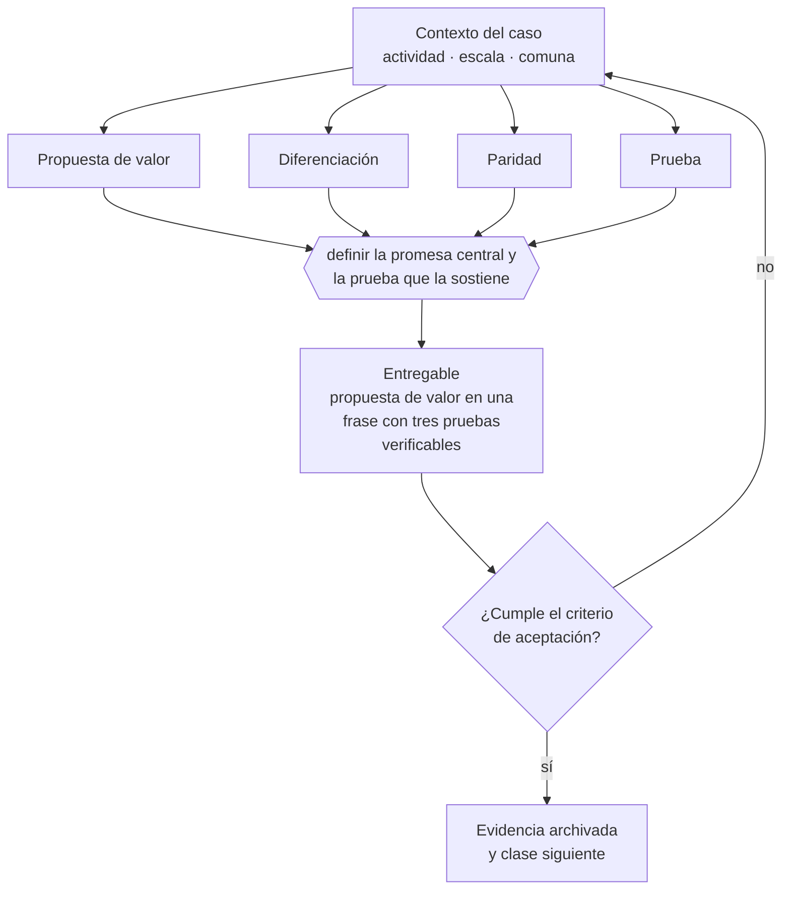

# Clase 023 — Propuesta de valor y diferenciación

> **Parte 02 · Descubrimiento, validación y mercado** — clase 9 de 14

**Estado de evidencia:** `GUIA-PRACTICA` · **Jurisdicción:** Chile-first · **Fecha base normativa:** 07-08-2026 
**Decisión que habilita:** definir la promesa central y la prueba que la sostiene 
**Entregable:** propuesta de valor en una frase con tres pruebas verificables

## 🎯 Propósito

Construir una promesa con tres piezas —para quién, qué resultado, por qué creerlo— y en particular con la tercera, que es la que casi siempre falta.

## 📚 Resultados de aprendizaje

Al finalizar esta clase podrás:

1. **Definir** con precisión los cuatro conceptos de la tabla siguiente y usarlos para describir un caso real.
2. **Explicar** por qué esta materia condiciona decisiones de otras partes del programa.
3. **Decidir** —definir la promesa central y la prueba que la sostiene— y justificar la decisión por escrito.
4. **Producir** el entregable de la clase y contrastarlo contra su criterio de aceptación.
5. **Distinguir** el dato estable del dato dinámico que exige revalidación en la fuente oficial.

## 🧩 Conceptos centrales

| Concepto | Comprensión verificable |
|---|---|
| **Propuesta de valor** | Promesa específica de resultado para un segmento específico. |
| **Diferenciación** | Atributo que el cliente valora y que la competencia no ofrece igual. |
| **Paridad** | Atributo necesario para competir pero que no diferencia. |
| **Prueba** | Evidencia que hace creíble la promesa. |

## 🗺️ Flujo de razonamiento

## 📖 Desarrollo

### 1. El fondo del asunto

Una propuesta de valor necesita tres piezas: para quién, qué resultado y por qué creerlo. La tercera es la que más se omite. Sin prueba —caso, dato, garantía, referencia— la promesa se percibe como publicidad y obliga a competir por precio.

### 2. Cómo se traduce en la práctica

Sin prueba —un caso con cifras, una garantía, una referencia verificable— la promesa se percibe como publicidad y obliga a competir por precio. Además, en venta a consumidor la promesa es exigible: prometer lo que la operación no puede sostener deja de ser un problema de marketing y pasa a ser una infracción a la Ley 19.496.

### 3. Marco aplicable y quién interviene

- método de descubrimiento de clientes y experimentación acotada
- Jobs to Be Done como marco de resultados esperados
- estadística oficial chilena: INE, Banco Central, Censo y encuestas sectoriales

**Autoridades o contrapartes involucradas:** INE, Banco Central de Chile, SII (estadísticas de empresas por rubro).
**Profesionales de apoyo:** fundador, investigador de mercado, analista de datos. La participación concreta depende del riesgo, del
tamaño de la empresa y de la actividad económica.

## 🧪 Taller guiado

Aplica esta clase a **una** de las siguientes líneas de negocio y repite después el ejercicio con
una segunda línea de carga regulatoria distinta:

| Línea | Carga regulatoria |
|---|---|
| SaaS B2B con IA | media |
| Servicios profesionales | baja |
| E-commerce D2C | media |
| Alimentos o foodtech | alta |
| Exportación de servicios | media |
| Fintech regulada | alta |
| Construcción o servicios técnicos | alta |

**Secuencia de trabajo:**

1. Delimita el contexto: actividad económica, escala, comuna y etapa de la empresa.
2. Reúne los antecedentes que la decisión exige y anota la fecha de cada fuente.
3. Identifica las alternativas reales, incluida la de no hacer nada.
4. Evalúa el impacto en mercado, caja, personas, regulación y operación.
5. Toma la decisión y regístrala con sus supuestos.
6. Produce el entregable.
7. Contrástalo contra el criterio de aceptación.
8. Anota lo que requiere validación profesional y programa su revisión.

### 📦 Entregable

Propuesta de valor en una frase con tres pruebas verificables.

Debe incluir decisión, supuestos, fuentes con fecha de consulta, responsable, riesgos
identificados y próximos pasos.

## 🏆 Reto verificable

Resuelve la misma materia para una segunda línea de negocio con distinta carga regulatoria y
explica por escrito **qué cambió, por qué y qué fuente lo determina**.

## ✅ Criterio de aceptación

- [ ] la promesa nombra segmento y resultado
- [ ] cada elemento diferenciador tiene prueba asociada
- [ ] cada afirmación regulatoria está referida a una fuente oficial con fecha de consulta;
- [ ] los datos dinámicos quedan marcados para revalidación;
- [ ] hay un responsable asignado y evidencia reproducible del trabajo.

## ⚠️ Errores frecuentes

**Propios de esta clase:**

- Diferenciarse por atributos que son paridad en el mercado.
- Prometer resultados que la operación no puede sostener y exponerse ante sernac.

**Característicos de la parte 02:**

- Entrevistar buscando confirmación en vez de refutación.
- Estimar mercado de arriba hacia abajo sin conexión con capacidad real de venta.

## 🇨🇱 Checklist Chile

- [ ] ¿existe norma o autoridad específica para esta materia?
- [ ] ¿la fuente consultada está vigente a la fecha de ejecución?
- [ ] ¿se activa algún trámite ante el SII?
- [ ] ¿se activa algún requisito municipal o sectorial?
- [ ] ¿afecta a consumidores o al tratamiento de datos personales?
- [ ] ¿afecta a trabajadores o a la seguridad y salud en el trabajo?
- [ ] ¿afecta a impuestos, contabilidad o caja?
- [ ] ¿afecta a contratos o a propiedad intelectual?
- [ ] ¿requiere renovación, reporte periódico o revalidación?

## ❓ Preguntas de comprobación

1. ¿Qué prueba concreta respalda cada elemento diferenciador de tu promesa?
2. ¿Tu operación actual puede cumplir lo que estás prometiendo, siempre?
3. ¿Qué atributo de tu propuesta es en realidad paridad de mercado y no diferencia?

## 🔗 Fuentes oficiales

**Servicio Nacional del Consumidor — Ley 19.496, comercio electrónico y garantía legal**  
<https://www.sernac.cl/> · verificado 2026-08-07

- *Qué contiene:* Publica la interpretación aplicada de la Ley del Consumidor: deberes de información en la oferta, reglas del comercio electrónico, garantía legal, contratos de adhesión y el procedimiento de reclamos.
- *Cómo leerla:* Entra por el rubro de tu negocio y revisa las alertas y procedimientos colectivos publicados: muestran qué está fiscalizando el servicio ahora, que es mejor predictor de tu riesgo que la lectura abstracta de la ley.

Complementos del repositorio: [glosario](../../../docs/19_GLOSSARY.md) ·
[ruta de lecturas](../../../docs/15_BOOKS_AND_LEARNING_PATH.md) ·
[catálogo de fuentes](../../../docs/16_OFFICIAL_SOURCE_CATALOG.md).

> [!IMPORTANT]
> Material educativo. Para una decisión real de alto impacto hay que verificar la fuente oficial
> vigente y validar con el profesional competente.

---

| Anterior | Índice | Siguiente |
|---|---|---|
| [← 022 · Mapa de alternativas actuales del cliente](../class-08-mapa-de-alternativas-actuales-del-cliente/README.md) | [Parte 02](../README.md) · [Programa](../../../README.md) | [024 · Hipótesis críticas del negocio →](../class-10-hipotesis-criticas-del-negocio/README.md) |
