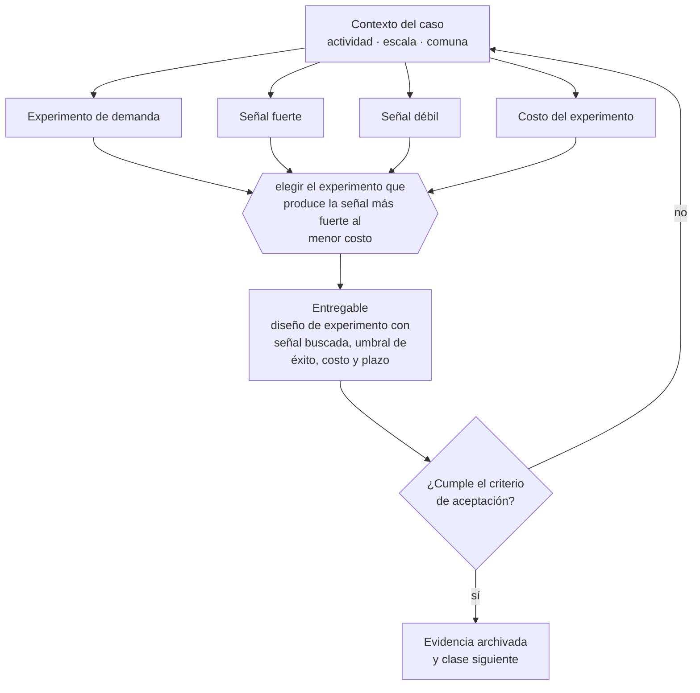

# Clase 025 — Experimentos de demanda antes de invertir

> **Parte 02 · Descubrimiento, validación y mercado** — clase 11 de 14

**Estado de evidencia:** `GUIA-PRACTICA` · **Jurisdicción:** Chile-first · **Fecha base normativa:** 07-08-2026 
**Decisión que habilita:** elegir el experimento que produce la señal más fuerte al menor costo 
**Entregable:** diseño de experimento con señal buscada, umbral de éxito, costo y plazo

## 🎯 Propósito

Diseñar experimentos que produzcan señales fuertes —pago, seña, firma, cesión de tiempo— en vez de señales débiles que se confunden con validación.

## 📚 Resultados de aprendizaje

Al finalizar esta clase podrás:

1. **Definir** con precisión los cuatro conceptos de la tabla siguiente y usarlos para describir un caso real.
2. **Explicar** por qué esta materia condiciona decisiones de otras partes del programa.
3. **Decidir** —elegir el experimento que produce la señal más fuerte al menor costo— y justificar la decisión por escrito.
4. **Producir** el entregable de la clase y contrastarlo contra su criterio de aceptación.
5. **Distinguir** el dato estable del dato dinámico que exige revalidación en la fuente oficial.

## 🧩 Conceptos centrales

| Concepto | Comprensión verificable |
|---|---|
| **Experimento de demanda** | Prueba que mide intención con costo o compromiso real. |
| **Señal fuerte** | Pago, reserva, firma o cesión de tiempo relevante. |
| **Señal débil** | Clic, me gusta, encuesta o promesa verbal. |
| **Costo del experimento** | Gasto máximo aceptable para obtener la señal. |

## 🗺️ Flujo de razonamiento

## 📖 Desarrollo

### 1. El fondo del asunto

Un experimento de demanda vale por la fricción que impone: pedir una tarjeta, una seña o una firma separa el interés del compromiso. Prometer algo que aún no existe exige cuidado con la Ley del Consumidor: la comunicación debe dejar claro el estado real de la oferta.

### 2. Cómo se traduce en la práctica

La fricción es lo que hace válido el experimento: pedir una tarjeta o un anticipo separa el interés del compromiso. Al mismo tiempo, ofrecer algo que aún no existe exige cuidado con la Ley del Consumidor: la comunicación debe dejar claro el estado real de la oferta y los plazos, o el experimento se convierte en publicidad engañosa.

### 3. Marco aplicable y quién interviene

- método de descubrimiento de clientes y experimentación acotada
- Jobs to Be Done como marco de resultados esperados
- estadística oficial chilena: INE, Banco Central, Censo y encuestas sectoriales

**Autoridades o contrapartes involucradas:** INE, Banco Central de Chile, SII (estadísticas de empresas por rubro).
**Profesionales de apoyo:** fundador, investigador de mercado, analista de datos. La participación concreta depende del riesgo, del
tamaño de la empresa y de la actividad económica.

## 🧪 Taller guiado

Aplica esta clase a **una** de las siguientes líneas de negocio y repite después el ejercicio con
una segunda línea de carga regulatoria distinta:

| Línea | Carga regulatoria |
|---|---|
| SaaS B2B con IA | media |
| Servicios profesionales | baja |
| E-commerce D2C | media |
| Alimentos o foodtech | alta |
| Exportación de servicios | media |
| Fintech regulada | alta |
| Construcción o servicios técnicos | alta |

**Secuencia de trabajo:**

1. Delimita el contexto: actividad económica, escala, comuna y etapa de la empresa.
2. Reúne los antecedentes que la decisión exige y anota la fecha de cada fuente.
3. Identifica las alternativas reales, incluida la de no hacer nada.
4. Evalúa el impacto en mercado, caja, personas, regulación y operación.
5. Toma la decisión y regístrala con sus supuestos.
6. Produce el entregable.
7. Contrástalo contra el criterio de aceptación.
8. Anota lo que requiere validación profesional y programa su revisión.

### 📦 Entregable

Diseño de experimento con señal buscada, umbral de éxito, costo y plazo.

Debe incluir decisión, supuestos, fuentes con fecha de consulta, responsable, riesgos
identificados y próximos pasos.

## 🏆 Reto verificable

Resuelve la misma materia para una segunda línea de negocio con distinta carga regulatoria y
explica por escrito **qué cambió, por qué y qué fuente lo determina**.

## ✅ Criterio de aceptación

- [ ] la señal medida implica compromiso del cliente
- [ ] el umbral de éxito se fijó antes de ejecutar
- [ ] cada afirmación regulatoria está referida a una fuente oficial con fecha de consulta;
- [ ] los datos dinámicos quedan marcados para revalidación;
- [ ] hay un responsable asignado y evidencia reproducible del trabajo.

## ⚠️ Errores frecuentes

**Propios de esta clase:**

- Aceptar señales débiles como validación de demanda.
- Preventa de un producto inexistente sin informar plazos ni condiciones.

**Característicos de la parte 02:**

- Entrevistar buscando confirmación en vez de refutación.
- Estimar mercado de arriba hacia abajo sin conexión con capacidad real de venta.

## 🇨🇱 Checklist Chile

- [ ] ¿existe norma o autoridad específica para esta materia?
- [ ] ¿la fuente consultada está vigente a la fecha de ejecución?
- [ ] ¿se activa algún trámite ante el SII?
- [ ] ¿se activa algún requisito municipal o sectorial?
- [ ] ¿afecta a consumidores o al tratamiento de datos personales?
- [ ] ¿afecta a trabajadores o a la seguridad y salud en el trabajo?
- [ ] ¿afecta a impuestos, contabilidad o caja?
- [ ] ¿afecta a contratos o a propiedad intelectual?
- [ ] ¿requiere renovación, reporte periódico o revalidación?

## ❓ Preguntas de comprobación

1. ¿Qué compromiso real asume quien responde a tu experimento?
2. ¿Fijaste el umbral de éxito antes de ejecutarlo?
3. Si estás preventa, ¿informaste con claridad plazos y condiciones?

## 🔗 Fuentes oficiales

**Servicio Nacional del Consumidor — Ley 19.496, comercio electrónico y garantía legal**  
<https://www.sernac.cl/> · verificado 2026-08-07

- *Qué contiene:* Publica la interpretación aplicada de la Ley del Consumidor: deberes de información en la oferta, reglas del comercio electrónico, garantía legal, contratos de adhesión y el procedimiento de reclamos.
- *Cómo leerla:* Entra por el rubro de tu negocio y revisa las alertas y procedimientos colectivos publicados: muestran qué está fiscalizando el servicio ahora, que es mejor predictor de tu riesgo que la lectura abstracta de la ley.

Complementos del repositorio: [glosario](../../../docs/19_GLOSSARY.md) ·
[ruta de lecturas](../../../docs/15_BOOKS_AND_LEARNING_PATH.md) ·
[catálogo de fuentes](../../../docs/16_OFFICIAL_SOURCE_CATALOG.md).

> [!IMPORTANT]
> Material educativo. Para una decisión real de alto impacto hay que verificar la fuente oficial
> vigente y validar con el profesional competente.

---

| Anterior | Índice | Siguiente |
|---|---|---|
| [← 024 · Hipótesis críticas del negocio](../class-10-hipotesis-criticas-del-negocio/README.md) | [Parte 02](../README.md) · [Programa](../../../README.md) | [026 · MVP, prototipo y concierge test →](../class-12-mvp-prototipo-y-concierge-test/README.md) |
