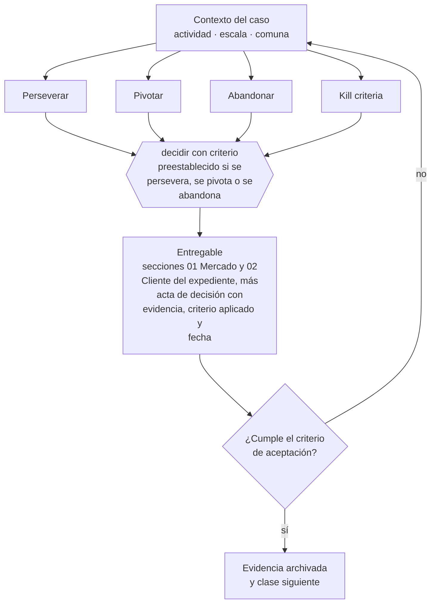

# Clase 028 — Decidir: perseverar, pivotar o abandonar

> **Parte 02 · Descubrimiento, validación y mercado** — clase 14 de 14

**Estado de evidencia:** `GUIA-PRACTICA` · **Jurisdicción:** Chile-first · **Fecha base normativa:** 07-08-2026 
**Decisión que habilita:** decidir con criterio preestablecido si se persevera, se pivota o se abandona 
**Entregable:** secciones 01 Mercado y 02 Cliente del expediente, más acta de decisión con evidencia, criterio aplicado y fecha

## 🎯 Propósito

Sintetizar mercado y cliente en el expediente y decidir continuar, cambiar o detener contra criterios escritos de antemano.

## 📚 Resultados de aprendizaje

Al finalizar esta clase podrás:

1. **Definir** con precisión los cuatro conceptos de la tabla siguiente y usarlos para describir un caso real.
2. **Explicar** por qué esta materia condiciona decisiones de otras partes del programa.
3. **Decidir** —decidir con criterio preestablecido si se persevera, se pivota o se abandona— y justificar la decisión por escrito.
4. **Producir** el entregable de la clase y contrastarlo contra su criterio de aceptación.
5. **Distinguir** el dato estable del dato dinámico que exige revalidación en la fuente oficial.

## 🧩 Conceptos centrales

| Concepto | Comprensión verificable |
|---|---|
| **Perseverar** | Seguir con la hipótesis actual porque la evidencia la respalda. |
| **Pivotar** | Cambiar un elemento del modelo conservando el aprendizaje. |
| **Abandonar** | Cerrar la apuesta según criterio definido previamente. |
| **Kill criteria** | Condición fijada de antemano que obliga a detener. |

## 🗺️ Flujo de razonamiento

## 📖 Desarrollo

### 1. El fondo del asunto

La decisión de continuar debe tomarse contra criterios escritos antes de conocer el resultado. Antes del acta, el aprendizaje de la parte se sintetiza en las secciones 01 Mercado y 02 Cliente del Expediente de viabilidad: un informe ejecutivo de una o dos páginas y un mapa de empatía trazable. Sin esa síntesis, el equipo puede cumplir actividades aisladas y aun así no responder si existe mercado, cliente y problema real.

### 2. Cómo se traduce en la práctica

La síntesis obliga a responder si existe mercado, cliente y problema real en vez de exhibir actividades sueltas. El informe ejecutivo y el mapa de empatía conservan fuentes, supuestos, confianza y preguntas abiertas; recién entonces el acta aplica el kill criterion. Así un resultado negativo también produce una decisión útil y trazable.

### 3. Marco aplicable y quién interviene

- método de descubrimiento de clientes y experimentación acotada
- Jobs to Be Done como marco de resultados esperados
- estadística oficial chilena: INE, Banco Central, Censo y encuestas sectoriales

**Autoridades o contrapartes involucradas:** INE, Banco Central de Chile, SII (estadísticas de empresas por rubro).
**Profesionales de apoyo:** fundador, investigador de mercado, analista de datos. La participación concreta depende del riesgo, del
tamaño de la empresa y de la actividad económica.

## 🧪 Taller guiado

Aplica esta clase a **una** de las siguientes líneas de negocio y repite después el ejercicio con
una segunda línea de carga regulatoria distinta:

| Línea | Carga regulatoria |
|---|---|
| SaaS B2B con IA | media |
| Servicios profesionales | baja |
| E-commerce D2C | media |
| Alimentos o foodtech | alta |
| Exportación de servicios | media |
| Fintech regulada | alta |
| Construcción o servicios técnicos | alta |

**Secuencia de trabajo:**

1. Delimita el contexto: actividad económica, escala, comuna y etapa de la empresa.
2. Reúne los antecedentes que la decisión exige y anota la fecha de cada fuente.
3. Identifica las alternativas reales, incluida la de no hacer nada.
4. Evalúa el impacto en mercado, caja, personas, regulación y operación.
5. Toma la decisión y regístrala con sus supuestos.
6. Produce el entregable.
7. Contrástalo contra el criterio de aceptación.
8. Anota lo que requiere validación profesional y programa su revisión.

### 📦 Entregable

Secciones 01 mercado y 02 cliente del expediente, más acta de decisión con evidencia, criterio aplicado y fecha.

Debe incluir decisión, supuestos, fuentes con fecha de consulta, responsable, riesgos
identificados y próximos pasos.

## 🏆 Reto verificable

Resuelve la misma materia para una segunda línea de negocio con distinta carga regulatoria y
explica por escrito **qué cambió, por qué y qué fuente lo determina**.

## ✅ Criterio de aceptación

- [ ] el criterio de decisión estaba escrito antes del resultado
- [ ] el informe de mercado identifica fuentes, supuestos, confianza y preguntas abiertas
- [ ] el mapa del cliente separa evidencia, hipótesis e interpretación
- [ ] la decisión queda documentada con su evidencia
- [ ] cada afirmación regulatoria está referida a una fuente oficial con fecha de consulta;
- [ ] los datos dinámicos quedan marcados para revalidación;
- [ ] hay un responsable asignado y evidencia reproducible del trabajo.

## ⚠️ Errores frecuentes

**Propios de esta clase:**

- Reinterpretar el criterio después de conocer el resultado.
- Presentar cifras sin fuente o convertir la interpretación del equipo en evidencia del cliente.

**Característicos de la parte 02:**

- Entrevistar buscando confirmación en vez de refutación.
- Estimar mercado de arriba hacia abajo sin conexión con capacidad real de venta.

## 🇨🇱 Checklist Chile

- [ ] ¿existe norma o autoridad específica para esta materia?
- [ ] ¿la fuente consultada está vigente a la fecha de ejecución?
- [ ] ¿se activa algún trámite ante el SII?
- [ ] ¿se activa algún requisito municipal o sectorial?
- [ ] ¿afecta a consumidores o al tratamiento de datos personales?
- [ ] ¿afecta a trabajadores o a la seguridad y salud en el trabajo?
- [ ] ¿afecta a impuestos, contabilidad o caja?
- [ ] ¿afecta a contratos o a propiedad intelectual?
- [ ] ¿requiere renovación, reporte periódico o revalidación?

## ❓ Preguntas de comprobación

1. ¿Tus secciones 01 y 02 permiten decidir sin abrir todos los anexos?
2. ¿Qué afirmación es evidencia, cuál hipótesis y cuál interpretación?
3. ¿Qué condición preestablecida obliga a perseverar, pivotar o abandonar?

## 🔗 Fuentes oficiales

**Biblioteca del Congreso Nacional · LeyChile — Normativa oficial consolidada**  
<https://www.bcn.cl/leychile/> · verificado 2026-10-01

- *Qué contiene:* Publica el texto oficial y consolidado de leyes, decretos y reglamentos, con la versión vigente a una fecha, el historial de modificaciones y la tramitación que las originó.
- *Cómo leerla:* Usa siempre el selector de versión vigente a la fecha en que ejecutarás el trámite, no la última publicada. Y lee el artículo transitorio: en normas en implantación gradual —jornada, datos personales— ahí está la fecha que realmente te aplica.
- *Uso en esta clase:* aporta el marco de «Normativa oficial consolidada» para decidir con criterio preestablecido si se persevera, se pivota o se abandona.

**Servicio de Cooperación Técnica — Fomento para micro y pequeñas empresas**  
<https://www.sercotec.cl/> · verificado 2026-08-19

- *Qué contiene:* Publica las convocatorias vigentes con sus bases: perfil de empresa elegible, monto del subsidio, cofinanciamiento exigido, gastos financiables y obligaciones de rendición.
- *Cómo leerla:* Lee las bases desde el final: la sección de rendición decide si podrás quedarte con el subsidio. Muchos proyectos se adjudican y después devuelven fondos por no poder acreditar el gasto en la forma exigida.
- *Uso en esta clase:* aporta el marco de «Fomento para micro y pequeñas empresas» para decidir con criterio preestablecido si se persevera, se pivota o se abandona.

**ProChile — Programas, estudios de mercado y promoción**  
<https://www.prochile.gob.cl/> · verificado 2026-10-01

- *Qué contiene:* Publica estudios de mercado por país y sector, agendas de negocios, ferias, y los programas de cofinanciamiento de actividades de promoción.
- *Cómo leerla:* Los estudios de mercado por país son el mejor uso gratuito: entregan tamaño, canales, competencia y requisitos de entrada verificados, que es justo lo que una estimación bottom-up necesita.
- *Uso en esta clase:* aporta el marco de «Programas, estudios de mercado y promoción» para decidir con criterio preestablecido si se persevera, se pivota o se abandona.

Complementos del repositorio: [glosario](../../../docs/19_GLOSSARY.md) ·
[ruta de lecturas](../../../docs/15_BOOKS_AND_LEARNING_PATH.md) ·
[catálogo de fuentes](../../../docs/16_OFFICIAL_SOURCE_CATALOG.md).

> [!IMPORTANT]
> Material educativo. Para una decisión real de alto impacto hay que verificar la fuente oficial
> vigente y validar con el profesional competente.

---

| Anterior | Índice | Siguiente |
|---|---|---|
| [← 027 · Precio como experimento de mercado](../class-13-precio-como-experimento-de-mercado/README.md) | [Parte 02](../README.md) · [Programa](../../../README.md) | [029 · Business Model Canvas →](../../part-03-modelos-de-negocio-y-lineas-de-ingreso/class-01-business-model-canvas/README.md) |
