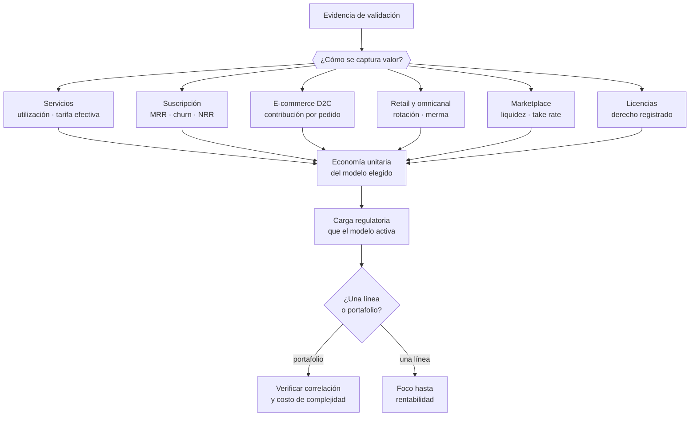

# Parte 03 — Modelos de negocio y líneas de ingreso

> *El modelo de ingreso decide la estructura de costos y la carga regulatoria*

**Estado de evidencia:** `GUIA-PRACTICA` · **Clases:** 14 (029–042) · **Fecha base normativa:** 07-08-2026 
**Conceptos definidos en esta parte:** 56

## 🎯 De qué trata esta parte

Elegir modelo de negocio no es elegir una etiqueta: es aceptar una estructura de costos, un ciclo de caja y un bloque regulatorio. Un mismo producto vendido por suscripción, por proyecto o en retail produce tres empresas distintas, con equipos distintos y problemas distintos. Por eso esta parte recorre los modelos por su economía y no por su atractivo.

Cada modelo trae su exigencia oculta. La suscripción convierte el problema de vender en el problema de retener, y añade en Chile las reglas de renovación automática frente al consumidor. El e-commerce parece de margen alto hasta que se restan pasarela, despacho y devoluciones. El marketplace no escala por producto sino por densidad, y su punto difícil es alcanzar liquidez en un nicho antes de agotar el capital. Los servicios profesionales se juegan en utilización y tarifa efectiva, no en tarifa nominal.

La parte cierra con el portafolio, donde vive el error más común de la pyme chilena: abrir líneas nuevas para compensar que la principal no funciona. Diversificar solo reduce riesgo si las líneas no caen juntas, y cada línea adicional cobra un costo de complejidad que rara vez se contabiliza.

## 📚 Resultados de la parte

Al terminar esta parte podrás:

1. **Elegir un modelo de ingreso coherente con el problema, el cliente y la capacidad de la empresa**.
2. **Estimar la economía unitaria implícita de cada modelo**.
3. **Anticipar la carga operativa y regulatoria que trae cada modelo**.
4. **Diseñar un portafolio de líneas que no concentre todo el riesgo en un cliente o canal**.

## 🗺️ Mapa de la parte

## ⚖️ Marco aplicable

- Business Model Canvas y Lean Canvas como instrumentos de diseño
- Ley 19.496 sobre protección de los derechos de los consumidores para modelos B2C
- Ley 20.169 sobre competencia desleal y DL 211 en modelos de plataforma

**Autoridades o contrapartes:** SERNAC, FNE, SII.
**Profesionales de apoyo:** fundador, abogado comercial, contador de gestión.

## ⚠️ Riesgos característicos

- Copiar un modelo extranjero sin verificar su viabilidad regulatoria o logística en chile.
- Sumar líneas de negocio antes de que la primera sea rentable.
- Modelos de plataforma que asumen responsabilidad de proveedor sin haberlo previsto.
- Dependencia de un canal único que puede cambiar sus reglas unilateralmente.

## 📘 Las 14 clases

| # | Global | Clase | Decisión que habilita |
|---:|---:|---|---|
| 01 | 029 | [Business Model Canvas](class-01-business-model-canvas/README.md) | verificar si los nueve bloques del modelo son consistentes entre sí |
| 02 | 030 | [Lean Canvas](class-02-lean-canvas/README.md) | identificar la métrica clave y si existe alguna ventaja difícil de copiar |
| 03 | 031 | [Modelo de servicios profesionales](class-03-modelo-de-servicios-profesionales/README.md) | definir tarifa, mezcla de perfiles y utilización objetivo antes de vender |
| 04 | 032 | [Suscripción y SaaS](class-04-suscripcion-y-saas/README.md) | definir el ciclo de cobro, la política de renovación y el umbral de churn tolerable |
| 05 | 033 | [Comercio electrónico D2C](class-05-comercio-electronico-d2c/README.md) | determinar la contribución real por pedido y el nivel de servicio comprometido |
| 06 | 034 | [Retail físico y omnicanal](class-06-retail-fisico-y-omnicanal/README.md) | decidir si el punto físico se justifica por su rotación y su contribución |
| 07 | 035 | [Marketplace de dos lados](class-07-marketplace-de-dos-lados/README.md) | elegir qué lado se subsidia primero y en qué nicho se busca liquidez |
| 08 | 036 | [Licencias, royalties y propiedad intelectual](class-08-licencias-royalties-y-propiedad-intelectual/README.md) | determinar qué derecho existe, si está registrado y bajo qué condiciones se licencia |
| 09 | 037 | [Agencia y servicios administrados](class-09-agencia-y-servicios-administrados/README.md) | definir la mezcla entre proyecto y retainer y el límite de concentración aceptable |
| 10 | 038 | [Manufactura y venta de productos](class-10-manufactura-y-venta-de-productos/README.md) | determinar lote, inventario objetivo y capital de trabajo que la producción exige |
| 11 | 039 | [Franquicia y licenciamiento de formato](class-11-franquicia-y-licenciamiento-de-formato/README.md) | decidir si el negocio es replicable y bajo qué condiciones se franquicia |
| 12 | 040 | [Publicidad, afiliación y contenido](class-12-publicidad-afiliacion-y-contenido/README.md) | definir la mezcla entre audiencia propia y prestada y el mecanismo de monetización |
| 13 | 041 | [Modelos freemium, usage-based y outcome-based](class-13-modelos-freemium-usage-based-y-outcome-based/README.md) | elegir el mecanismo de cobro coherente con el costo de servir y el riesgo asumido |
| 14 | 042 | [Portafolio de líneas de negocio y concentración de riesgo](class-14-portafolio-de-lineas-de-negocio-y-concentracion-de-riesgo/README.md) | decidir cuántas líneas sostener y qué concentración máxima se acepta |

## 🔤 Glosario de la parte

| Concepto | Definición operacional |
|---|---|
| **Actividad clave** | Proceso sin el cual la propuesta de valor no se puede entregar. |
| **Afiliación** | Comisión por venta referida a un tercero. |
| **Agencia** | Modelo de proyecto con equipo propio y entrega a medida. |
| **Apalancamiento** | Proporción de trabajo ejecutado por perfiles menos caros que el senior. |
| **Audiencia propia** | Canal que la empresa controla: base de correo, comunidad, sitio. |
| **Business Model Canvas** | Representación de nueve bloques de cómo la empresa crea, entrega y captura valor. |
| **Canon de entrada y regalía** | Pago inicial y pago recurrente del franquiciado. |
| **Churn** | Porcentaje de clientes o ingreso que se pierde por período. |
| **Coherencia del canvas** | Que los nueve bloques se sostengan entre sí. |
| **Concentración** | Proporción de ingresos dependiente de un cliente, canal o producto. |
| **Concentración de clientes** | Porcentaje de ingresos que depende de pocos clientes. |
| **Contribución por pedido** | Margen después de producto, envío, medios de pago y devolución. |
| **Control de marca** | Mecanismo que asegura consistencia entre unidades. |
| **Correlación** | Grado en que dos líneas caen juntas ante el mismo shock. |
| **Costo de complejidad** | Carga operativa y de gestión que agrega cada línea adicional. |
| **Costo de producción** | Materiales, mano de obra directa y costos indirectos de fabricación. |
| **Costo de servir** | Costo de atender a un usuario, incluido el que no paga. |
| **Costo logístico inverso** | Costo de recibir y reponer un producto devuelto. |
| **D2C** | Venta directa al consumidor sin intermediario. |
| **Dependencia de plataforma** | Riesgo de que un cambio de algoritmo elimine la distribución. |
| **Desintermediación** | Riesgo de que las partes transaccionen fuera de la plataforma. |
| **Franquicia** | Cesión de un formato completo de negocio bajo marca y manual. |
| **Freemium** | Nivel gratuito permanente que alimenta la conversión a pago. |
| **Lean Canvas** | Variante orientada a problema, solución, métricas y ventaja injusta. |
| **Licencia** | Autorización de uso de un derecho conservando la titularidad. |
| **Lote mínimo** | Cantidad mínima económicamente producible. |
| **Manual de operación** | Documento que estandariza cómo se opera la unidad. |
| **Marketplace** | Plataforma que intermedia entre oferta y demanda. |
| **Merma** | Pérdida de inventario por daño, vencimiento o hurto. |
| **Modelo publicitario** | Monetización de la atención de una audiencia propia. |
| **MRR** | Ingreso recurrente mensual normalizado. |
| **Métrica clave** | El número que resume si el modelo funciona. |
| **NRR** | Ingreso neto retenido incluyendo expansión y contracción de la base existente. |
| **Omnicanal** | Operación integrada entre canal físico y digital con inventario único. |
| **Outcome-based** | Cobro vinculado al resultado obtenido por el cliente. |
| **Portafolio de líneas** | Conjunto de fuentes de ingreso con riesgos distintos. |
| **Problema del huevo y la gallina** | Ningún lado llega si el otro no está. |
| **Punto de reorden** | Nivel de inventario que gatilla una nueva orden. |
| **Recurso clave** | Activo indispensable: equipo, licencia, dato, permiso o instalación. |
| **Registro previo** | Inscripción del derecho que hace exigible la licencia frente a terceros. |
| **Responsabilidad por producto** | Obligación del fabricante por daños derivados del bien. |
| **Retainer** | Cuota mensual por disponibilidad y trabajo acordado. |
| **Retracto** | Derecho del consumidor a desistir en los plazos y casos legales. |
| **Rotación** | Veces que el inventario se vende y repone en un período. |
| **Royalty** | Pago recurrente asociado al uso o a las ventas del licenciatario. |
| **Servicio administrado** | Operación continua de una función del cliente bajo sla. |
| **Servicios profesionales** | Venta de resultado producido con horas de personas expertas. |
| **Solución mínima** | Las tres funciones que atacan los tres problemas principales. |
| **Suscripción** | Cobro recurrente por acceso continuo a un servicio. |
| **Take rate** | Porcentaje de la transacción que retiene la plataforma. |
| **Tarifa efectiva** | Ingreso real por hora trabajada, incluidas las horas no facturadas. |
| **Tasa de utilización** | Porcentaje de horas facturables sobre horas disponibles. |
| **Territorio y exclusividad** | Alcance geográfico y de mercado de la licencia. |
| **Ticket promedio** | Venta media por transacción. |
| **Usage-based** | Cobro proporcional al consumo efectivo. |
| **Ventaja injusta** | Recurso que no se puede copiar ni comprar fácilmente. |

## 🔗 Cómo se conecta

Recibe la evidencia de la parte 02 y entrega a la parte 09 el modelo cuya economía unitaria hay que calcular. Los modelos B2C activan la parte 11 completa; los de plataforma y suscripción, además, sus reglas de contrato de adhesión.

## 📖 Pauta bibliográfica

- Osterwalder, A. y Pigneur, Y. — *Business Model Generation*: los nueve bloques como prueba de coherencia.
- Maurya, A. — *Running Lean*: Lean Canvas y la casilla incómoda de la ventaja injusta.
- Ley 19.496 y su Reglamento de Comercio Electrónico: el bloque que activa todo modelo B2C.

## 🏛️ Fuentes oficiales de la parte

**Servicio Nacional del Consumidor — Ley 19.496, comercio electrónico y garantía legal**  
<https://www.sernac.cl/> · verificado 2026-08-07

- *Qué contiene:* Publica la interpretación aplicada de la Ley del Consumidor: deberes de información en la oferta, reglas del comercio electrónico, garantía legal, contratos de adhesión y el procedimiento de reclamos.
- *Cómo leerla:* Entra por el rubro de tu negocio y revisa las alertas y procedimientos colectivos publicados: muestran qué está fiscalizando el servicio ahora, que es mejor predictor de tu riesgo que la lectura abstracta de la ley.

**Servicio de Impuestos Internos — Nuevos contribuyentes, inicio de actividades y DTE**  
<https://www.sii.cl/ayudas/nuevos_contribuyentes/boleta-vys-facturador.html> · verificado 2026-08-07

- *Qué contiene:* Reúne el circuito completo del contribuyente nuevo: obtención de RUT, declaración de inicio de actividades, elección de códigos de actividad económica y habilitación para emitir documentos tributarios electrónicos.
- *Cómo leerla:* Sepáralo en dos actos distintos que la página trata seguidos: el RUT identifica, el inicio de actividades habilita. Lo que te bloquea para facturar casi siempre está en el segundo, no en el primero.

**Biblioteca del Congreso Nacional · LeyChile — Normativa oficial consolidada**  
<https://www.bcn.cl/leychile/> · verificado 2026-08-07

- *Qué contiene:* Publica el texto oficial y consolidado de leyes, decretos y reglamentos, con la versión vigente a una fecha, el historial de modificaciones y la tramitación que las originó.
- *Cómo leerla:* Usa siempre el selector de versión vigente a la fecha en que ejecutarás el trámite, no la última publicada. Y lee el artículo transitorio: en normas en implantación gradual —jornada, datos personales— ahí está la fecha que realmente te aplica.

---

| Anterior | Índice | Siguiente |
|---|---|---|
| [← Parte 02 · Descubrimiento, validación y mercado](../part-02-descubrimiento-validacion-y-mercado/README.md) | [Currículo](../../CURRICULUM.md) · [Programa](../../README.md) | [Parte 04 · Estrategia y ventaja competitiva →](../part-04-estrategia-y-ventaja-competitiva/README.md) |
