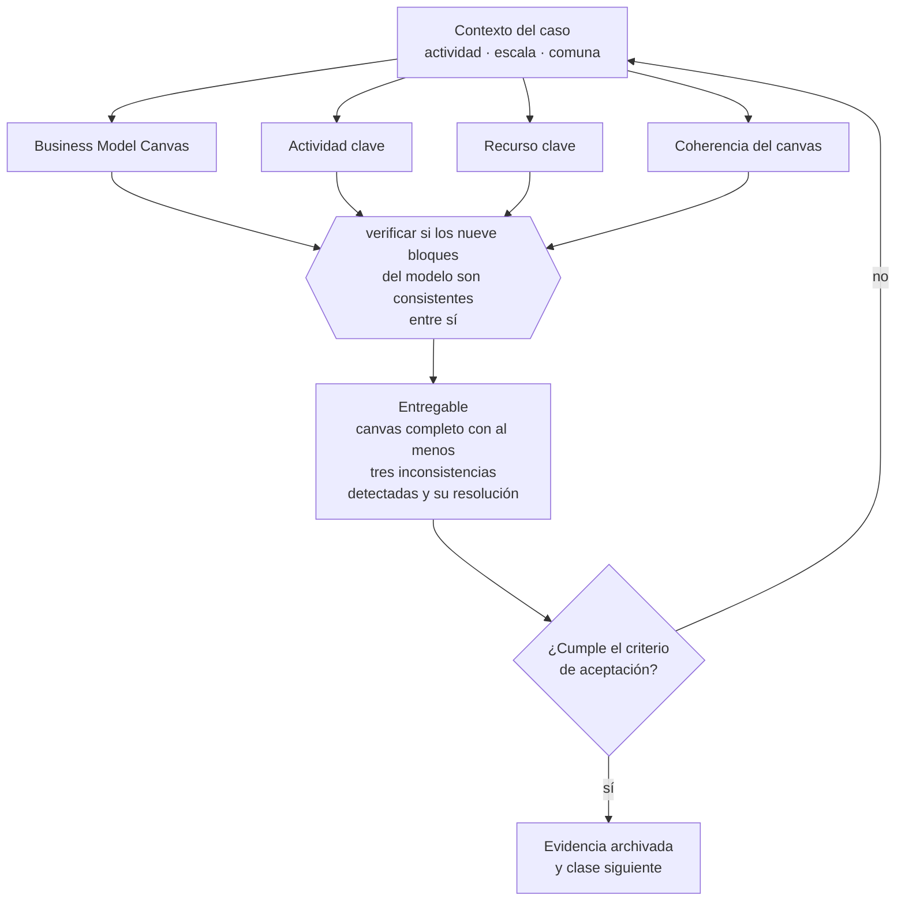

# Clase 029 — Business Model Canvas

> **Parte 03 · Modelos de negocio y líneas de ingreso** — clase 1 de 14

**Estado de evidencia:** `GUIA-PRACTICA` · **Jurisdicción:** Chile-first · **Fecha base normativa:** 07-08-2026 
**Decisión que habilita:** verificar si los nueve bloques del modelo son consistentes entre sí 
**Entregable:** canvas completo con al menos tres inconsistencias detectadas y su resolución

## 🎯 Propósito

Usar el canvas como prueba de coherencia y no como cuadro decorativo: si el canal no alcanza al segmento o los costos no soportan el ingreso, el modelo está roto y debe verse.

## 📚 Resultados de aprendizaje

Al finalizar esta clase podrás:

1. **Definir** con precisión los cuatro conceptos de la tabla siguiente y usarlos para describir un caso real.
2. **Explicar** por qué esta materia condiciona decisiones de otras partes del programa.
3. **Decidir** —verificar si los nueve bloques del modelo son consistentes entre sí— y justificar la decisión por escrito.
4. **Producir** el entregable de la clase y contrastarlo contra su criterio de aceptación.
5. **Distinguir** el dato estable del dato dinámico que exige revalidación en la fuente oficial.

## 🧩 Conceptos centrales

| Concepto | Comprensión verificable |
|---|---|
| **Business Model Canvas** | Representación de nueve bloques de cómo la empresa crea, entrega y captura valor. |
| **Actividad clave** | Proceso sin el cual la propuesta de valor no se puede entregar. |
| **Recurso clave** | Activo indispensable: equipo, licencia, dato, permiso o instalación. |
| **Coherencia del canvas** | Que los nueve bloques se sostengan entre sí. |

## 🗺️ Flujo de razonamiento

## 📖 Desarrollo

### 1. El fondo del asunto

El canvas no vale como cuadro decorativo sino como prueba de coherencia: si el canal no alcanza al segmento, si la estructura de costos no soporta la fuente de ingreso o si la actividad clave exige un recurso que no se tiene, el modelo está roto y el canvas debe mostrarlo.

### 2. Cómo se traduce en la práctica

El bloque que más inconsistencias revela es el de recursos clave. Cuando aparecen ahí activos que la empresa no tiene ni puede conseguir —una licencia, un permiso sectorial, un equipo que no existe— el modelo describe una empresa distinta de la que se está creando.

### 3. Marco aplicable y quién interviene

- Business Model Canvas y Lean Canvas como instrumentos de diseño
- Ley 19.496 sobre protección de los derechos de los consumidores para modelos B2C
- Ley 20.169 sobre competencia desleal y DL 211 en modelos de plataforma

**Autoridades o contrapartes involucradas:** SERNAC, FNE, SII.
**Profesionales de apoyo:** fundador, abogado comercial, contador de gestión. La participación concreta depende del riesgo, del
tamaño de la empresa y de la actividad económica.

## 🧪 Taller guiado

Aplica esta clase a **una** de las siguientes líneas de negocio y repite después el ejercicio con
una segunda línea de carga regulatoria distinta:

| Línea | Carga regulatoria |
|---|---|
| SaaS B2B con IA | media |
| Servicios profesionales | baja |
| E-commerce D2C | media |
| Alimentos o foodtech | alta |
| Exportación de servicios | media |
| Fintech regulada | alta |
| Construcción o servicios técnicos | alta |

**Secuencia de trabajo:**

1. Delimita el contexto: actividad económica, escala, comuna y etapa de la empresa.
2. Reúne los antecedentes que la decisión exige y anota la fecha de cada fuente.
3. Identifica las alternativas reales, incluida la de no hacer nada.
4. Evalúa el impacto en mercado, caja, personas, regulación y operación.
5. Toma la decisión y regístrala con sus supuestos.
6. Produce el entregable.
7. Contrástalo contra el criterio de aceptación.
8. Anota lo que requiere validación profesional y programa su revisión.

### 📦 Entregable

Canvas completo con al menos tres inconsistencias detectadas y su resolución.

Debe incluir decisión, supuestos, fuentes con fecha de consulta, responsable, riesgos
identificados y próximos pasos.

## 🏆 Reto verificable

Resuelve la misma materia para una segunda línea de negocio con distinta carga regulatoria y
explica por escrito **qué cambió, por qué y qué fuente lo determina**.

## ✅ Criterio de aceptación

- [ ] los nueve bloques están completos con contenido específico
- [ ] se documentan las inconsistencias detectadas y su resolución
- [ ] cada afirmación regulatoria está referida a una fuente oficial con fecha de consulta;
- [ ] los datos dinámicos quedan marcados para revalidación;
- [ ] hay un responsable asignado y evidencia reproducible del trabajo.

## ⚠️ Errores frecuentes

**Propios de esta clase:**

- Llenar los nueve bloques sin revisar la consistencia entre ellos.
- Poner en recursos clave activos que la empresa no tiene ni puede conseguir.

**Característicos de la parte 03:**

- Copiar un modelo extranjero sin verificar su viabilidad regulatoria o logística en chile.
- Sumar líneas de negocio antes de que la primera sea rentable.

## 🇨🇱 Checklist Chile

- [ ] ¿existe norma o autoridad específica para esta materia?
- [ ] ¿la fuente consultada está vigente a la fecha de ejecución?
- [ ] ¿se activa algún trámite ante el SII?
- [ ] ¿se activa algún requisito municipal o sectorial?
- [ ] ¿afecta a consumidores o al tratamiento de datos personales?
- [ ] ¿afecta a trabajadores o a la seguridad y salud en el trabajo?
- [ ] ¿afecta a impuestos, contabilidad o caja?
- [ ] ¿afecta a contratos o a propiedad intelectual?
- [ ] ¿requiere renovación, reporte periódico o revalidación?

## ❓ Preguntas de comprobación

1. ¿Qué recurso clave de tu canvas todavía no tienes y cómo lo conseguirás?
2. ¿El canal que declaraste alcanza efectivamente al segmento que declaraste?
3. ¿La estructura de costos soporta la fuente de ingreso al volumen previsto?

## 🔗 Fuentes oficiales

**Servicio Nacional del Consumidor — Ley 19.496, comercio electrónico y garantía legal**  
<https://www.sernac.cl/> · verificado 2026-08-07

- *Qué contiene:* Publica la interpretación aplicada de la Ley del Consumidor: deberes de información en la oferta, reglas del comercio electrónico, garantía legal, contratos de adhesión y el procedimiento de reclamos.
- *Cómo leerla:* Entra por el rubro de tu negocio y revisa las alertas y procedimientos colectivos publicados: muestran qué está fiscalizando el servicio ahora, que es mejor predictor de tu riesgo que la lectura abstracta de la ley.

**Servicio de Impuestos Internos — Nuevos contribuyentes, inicio de actividades y DTE**  
<https://www.sii.cl/ayudas/nuevos_contribuyentes/boleta-vys-facturador.html> · verificado 2026-08-07

- *Qué contiene:* Reúne el circuito completo del contribuyente nuevo: obtención de RUT, declaración de inicio de actividades, elección de códigos de actividad económica y habilitación para emitir documentos tributarios electrónicos.
- *Cómo leerla:* Sepáralo en dos actos distintos que la página trata seguidos: el RUT identifica, el inicio de actividades habilita. Lo que te bloquea para facturar casi siempre está en el segundo, no en el primero.

**Biblioteca del Congreso Nacional · LeyChile — Normativa oficial consolidada**  
<https://www.bcn.cl/leychile/> · verificado 2026-08-07

- *Qué contiene:* Publica el texto oficial y consolidado de leyes, decretos y reglamentos, con la versión vigente a una fecha, el historial de modificaciones y la tramitación que las originó.
- *Cómo leerla:* Usa siempre el selector de versión vigente a la fecha en que ejecutarás el trámite, no la última publicada. Y lee el artículo transitorio: en normas en implantación gradual —jornada, datos personales— ahí está la fecha que realmente te aplica.

Complementos del repositorio: [glosario](../../../docs/19_GLOSSARY.md) ·
[ruta de lecturas](../../../docs/15_BOOKS_AND_LEARNING_PATH.md) ·
[catálogo de fuentes](../../../docs/16_OFFICIAL_SOURCE_CATALOG.md).

> [!IMPORTANT]
> Material educativo. Para una decisión real de alto impacto hay que verificar la fuente oficial
> vigente y validar con el profesional competente.

---

| Anterior | Índice | Siguiente |
|---|---|---|
| **Inicio de la parte** | [Parte 03](../README.md) · [Programa](../../../README.md) | [030 · Lean Canvas →](../class-02-lean-canvas/README.md) |
