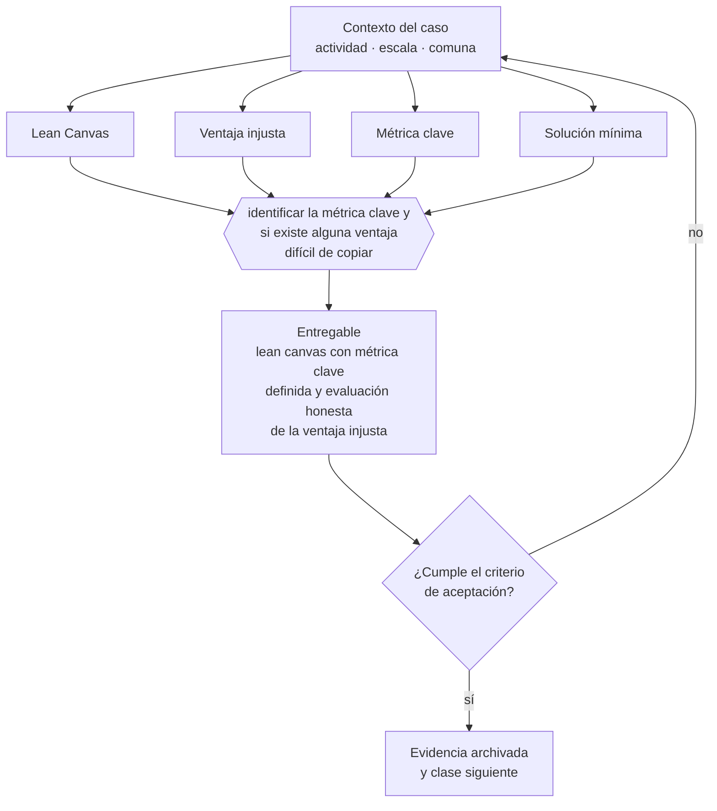

# Clase 030 — Lean Canvas

> **Parte 03 · Modelos de negocio y líneas de ingreso** — clase 2 de 14

**Estado de evidencia:** `GUIA-PRACTICA` · **Jurisdicción:** Chile-first · **Fecha base normativa:** 07-08-2026 
**Decisión que habilita:** identificar la métrica clave y si existe alguna ventaja difícil de copiar 
**Entregable:** lean canvas con métrica clave definida y evaluación honesta de la ventaja injusta

## 🎯 Propósito

Enfrentar la casilla más incómoda del Lean Canvas —la ventaja injusta— y aceptar que al principio suele estar vacía, lo que es información y no fracaso.

## 📚 Resultados de aprendizaje

Al finalizar esta clase podrás:

1. **Definir** con precisión los cuatro conceptos de la tabla siguiente y usarlos para describir un caso real.
2. **Explicar** por qué esta materia condiciona decisiones de otras partes del programa.
3. **Decidir** —identificar la métrica clave y si existe alguna ventaja difícil de copiar— y justificar la decisión por escrito.
4. **Producir** el entregable de la clase y contrastarlo contra su criterio de aceptación.
5. **Distinguir** el dato estable del dato dinámico que exige revalidación en la fuente oficial.

## 🧩 Conceptos centrales

| Concepto | Comprensión verificable |
|---|---|
| **Lean Canvas** | Variante orientada a problema, solución, métricas y ventaja injusta. |
| **Ventaja injusta** | Recurso que no se puede copiar ni comprar fácilmente. |
| **Métrica clave** | El número que resume si el modelo funciona. |
| **Solución mínima** | Las tres funciones que atacan los tres problemas principales. |

## 🗺️ Flujo de razonamiento

## 📖 Desarrollo

### 1. El fondo del asunto

El Lean Canvas sirve mejor que el BMC en etapa temprana porque obliga a nombrar problema, métrica clave y ventaja injusta. La casilla de ventaja injusta es la más incómoda y la más útil: casi siempre está vacía al principio, y reconocerlo evita construir un negocio trivialmente copiable.

### 2. Cómo se traduce en la práctica

Reconocer que no hay ventaja difícil de copiar evita construir un negocio trivialmente replicable y obliga a decidir cuál se construirá: datos acumulados, integraciones que aumentan el costo de salida, marca registrada o contratos plurianuales. La parte 04 convierte esa elección en plan.

### 3. Marco aplicable y quién interviene

- Business Model Canvas y Lean Canvas como instrumentos de diseño
- Ley 19.496 sobre protección de los derechos de los consumidores para modelos B2C
- Ley 20.169 sobre competencia desleal y DL 211 en modelos de plataforma

**Autoridades o contrapartes involucradas:** SERNAC, FNE, SII.
**Profesionales de apoyo:** fundador, abogado comercial, contador de gestión. La participación concreta depende del riesgo, del
tamaño de la empresa y de la actividad económica.

## 🧪 Taller guiado

Aplica esta clase a **una** de las siguientes líneas de negocio y repite después el ejercicio con
una segunda línea de carga regulatoria distinta:

| Línea | Carga regulatoria |
|---|---|
| SaaS B2B con IA | media |
| Servicios profesionales | baja |
| E-commerce D2C | media |
| Alimentos o foodtech | alta |
| Exportación de servicios | media |
| Fintech regulada | alta |
| Construcción o servicios técnicos | alta |

**Secuencia de trabajo:**

1. Delimita el contexto: actividad económica, escala, comuna y etapa de la empresa.
2. Reúne los antecedentes que la decisión exige y anota la fecha de cada fuente.
3. Identifica las alternativas reales, incluida la de no hacer nada.
4. Evalúa el impacto en mercado, caja, personas, regulación y operación.
5. Toma la decisión y regístrala con sus supuestos.
6. Produce el entregable.
7. Contrástalo contra el criterio de aceptación.
8. Anota lo que requiere validación profesional y programa su revisión.

### 📦 Entregable

Lean canvas con métrica clave definida y evaluación honesta de la ventaja injusta.

Debe incluir decisión, supuestos, fuentes con fecha de consulta, responsable, riesgos
identificados y próximos pasos.

## 🏆 Reto verificable

Resuelve la misma materia para una segunda línea de negocio con distinta carga regulatoria y
explica por escrito **qué cambió, por qué y qué fuente lo determina**.

## ✅ Criterio de aceptación

- [ ] hay una única métrica clave declarada
- [ ] la ventaja injusta se evalúa con criterio de replicabilidad
- [ ] cada afirmación regulatoria está referida a una fuente oficial con fecha de consulta;
- [ ] los datos dinámicos quedan marcados para revalidación;
- [ ] hay un responsable asignado y evidencia reproducible del trabajo.

## ⚠️ Errores frecuentes

**Propios de esta clase:**

- Escribir en ventaja injusta algo que cualquier competidor puede replicar en un mes.
- Definir varias métricas clave y por lo tanto ninguna.

**Característicos de la parte 03:**

- Copiar un modelo extranjero sin verificar su viabilidad regulatoria o logística en chile.
- Sumar líneas de negocio antes de que la primera sea rentable.

## 🇨🇱 Checklist Chile

- [ ] ¿existe norma o autoridad específica para esta materia?
- [ ] ¿la fuente consultada está vigente a la fecha de ejecución?
- [ ] ¿se activa algún trámite ante el SII?
- [ ] ¿se activa algún requisito municipal o sectorial?
- [ ] ¿afecta a consumidores o al tratamiento de datos personales?
- [ ] ¿afecta a trabajadores o a la seguridad y salud en el trabajo?
- [ ] ¿afecta a impuestos, contabilidad o caja?
- [ ] ¿afecta a contratos o a propiedad intelectual?
- [ ] ¿requiere renovación, reporte periódico o revalidación?

## ❓ Preguntas de comprobación

1. ¿Qué escribiste en ventaja injusta y cuánto tardaría un competidor en replicarlo?
2. ¿Cuál es tu única métrica clave y por qué esa y no otra?
3. ¿Tu solución mínima ataca los tres problemas principales o dispersa esfuerzo?

## 🔗 Fuentes oficiales

**Servicio Nacional del Consumidor — Ley 19.496, comercio electrónico y garantía legal**  
<https://www.sernac.cl/> · verificado 2026-08-19

- *Qué contiene:* Publica la interpretación aplicada de la Ley del Consumidor: deberes de información en la oferta, reglas del comercio electrónico, garantía legal, contratos de adhesión y el procedimiento de reclamos.
- *Cómo leerla:* Entra por el rubro de tu negocio y revisa las alertas y procedimientos colectivos publicados: muestran qué está fiscalizando el servicio ahora, que es mejor predictor de tu riesgo que la lectura abstracta de la ley.
- *Uso en esta clase:* aporta el marco de «Ley 19.496, comercio electrónico y garantía legal» para identificar la métrica clave y si existe alguna ventaja difícil de copiar.

**Servicio de Impuestos Internos — Nuevos contribuyentes, inicio de actividades y DTE**  
<https://www.sii.cl/ayudas/nuevos_contribuyentes/boleta-vys-facturador.html> · verificado 2026-08-19

- *Qué contiene:* Reúne el circuito completo del contribuyente nuevo: obtención de RUT, declaración de inicio de actividades, elección de códigos de actividad económica y habilitación para emitir documentos tributarios electrónicos.
- *Cómo leerla:* Sepáralo en dos actos distintos que la página trata seguidos: el RUT identifica, el inicio de actividades habilita. Lo que te bloquea para facturar casi siempre está en el segundo, no en el primero.
- *Uso en esta clase:* aporta el marco de «Nuevos contribuyentes, inicio de actividades y DTE» para identificar la métrica clave y si existe alguna ventaja difícil de copiar.

**Biblioteca del Congreso Nacional · LeyChile — Normativa oficial consolidada**  
<https://www.bcn.cl/leychile/> · verificado 2026-08-19

- *Qué contiene:* Publica el texto oficial y consolidado de leyes, decretos y reglamentos, con la versión vigente a una fecha, el historial de modificaciones y la tramitación que las originó.
- *Cómo leerla:* Usa siempre el selector de versión vigente a la fecha en que ejecutarás el trámite, no la última publicada. Y lee el artículo transitorio: en normas en implantación gradual —jornada, datos personales— ahí está la fecha que realmente te aplica.
- *Uso en esta clase:* aporta el marco de «Normativa oficial consolidada» para identificar la métrica clave y si existe alguna ventaja difícil de copiar.

Complementos del repositorio: [glosario](../../../docs/19_GLOSSARY.md) ·
[ruta de lecturas](../../../docs/15_BOOKS_AND_LEARNING_PATH.md) ·
[catálogo de fuentes](../../../docs/16_OFFICIAL_SOURCE_CATALOG.md).

> [!IMPORTANT]
> Material educativo. Para una decisión real de alto impacto hay que verificar la fuente oficial
> vigente y validar con el profesional competente.

---

| Anterior | Índice | Siguiente |
|---|---|---|
| [← 029 · Business Model Canvas](../class-01-business-model-canvas/README.md) | [Parte 03](../README.md) · [Programa](../../../README.md) | [031 · Modelo de servicios profesionales →](../class-03-modelo-de-servicios-profesionales/README.md) |
