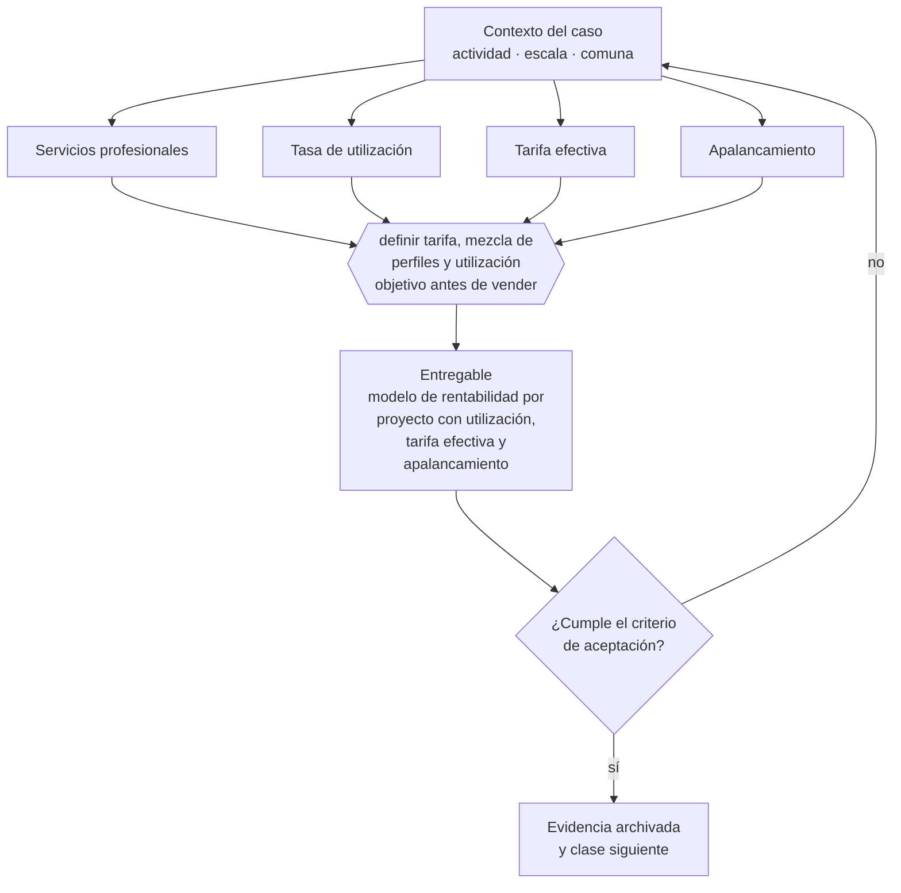

# Clase 031 — Modelo de servicios profesionales

> **Parte 03 · Modelos de negocio y líneas de ingreso** — clase 3 de 14

**Estado de evidencia:** `GUIA-PRACTICA` · **Jurisdicción:** Chile-first · **Fecha base normativa:** 07-08-2026 
**Decisión que habilita:** definir tarifa, mezcla de perfiles y utilización objetivo antes de vender 
**Entregable:** modelo de rentabilidad por proyecto con utilización, tarifa efectiva y apalancamiento

## 🎯 Propósito

Modelar la economía real de vender tiempo experto: utilización, tarifa efectiva y apalancamiento, que es donde se decide si el negocio es rentable o solo ocupado.

## 📚 Resultados de aprendizaje

Al finalizar esta clase podrás:

1. **Definir** con precisión los cuatro conceptos de la tabla siguiente y usarlos para describir un caso real.
2. **Explicar** por qué esta materia condiciona decisiones de otras partes del programa.
3. **Decidir** —definir tarifa, mezcla de perfiles y utilización objetivo antes de vender— y justificar la decisión por escrito.
4. **Producir** el entregable de la clase y contrastarlo contra su criterio de aceptación.
5. **Distinguir** el dato estable del dato dinámico que exige revalidación en la fuente oficial.

## 🧩 Conceptos centrales

| Concepto | Comprensión verificable |
|---|---|
| **Servicios profesionales** | Venta de resultado producido con horas de personas expertas. |
| **Tasa de utilización** | Porcentaje de horas facturables sobre horas disponibles. |
| **Tarifa efectiva** | Ingreso real por hora trabajada, incluidas las horas no facturadas. |
| **Apalancamiento** | Proporción de trabajo ejecutado por perfiles menos caros que el senior. |

## 🗺️ Flujo de razonamiento

## 📖 Desarrollo

### 1. El fondo del asunto

La economía de servicios profesionales se juega en utilización, tarifa efectiva y apalancamiento. El error clásico es medir la tarifa nominal e ignorar las horas de venta, coordinación y retrabajo, que pueden reducir la tarifa efectiva a la mitad. En Chile este modelo suele partir como boleta de honorarios y requiere planificar la transición a empresa.

### 2. Cómo se traduce en la práctica

La tarifa nominal engaña porque ignora las horas de venta, coordinación y retrabajo, que pueden reducir la tarifa efectiva a la mitad. En Chile este modelo suele partir como boleta de honorarios; planificar la transición a empresa antes de que el volumen la haga urgente evita decidirla bajo presión de un cliente grande.

### 3. Marco aplicable y quién interviene

- Business Model Canvas y Lean Canvas como instrumentos de diseño
- Ley 19.496 sobre protección de los derechos de los consumidores para modelos B2C
- Ley 20.169 sobre competencia desleal y DL 211 en modelos de plataforma

**Autoridades o contrapartes involucradas:** SERNAC, FNE, SII.
**Profesionales de apoyo:** fundador, abogado comercial, contador de gestión. La participación concreta depende del riesgo, del
tamaño de la empresa y de la actividad económica.

## 🧪 Taller guiado

Aplica esta clase a **una** de las siguientes líneas de negocio y repite después el ejercicio con
una segunda línea de carga regulatoria distinta:

| Línea | Carga regulatoria |
|---|---|
| SaaS B2B con IA | media |
| Servicios profesionales | baja |
| E-commerce D2C | media |
| Alimentos o foodtech | alta |
| Exportación de servicios | media |
| Fintech regulada | alta |
| Construcción o servicios técnicos | alta |

**Secuencia de trabajo:**

1. Delimita el contexto: actividad económica, escala, comuna y etapa de la empresa.
2. Reúne los antecedentes que la decisión exige y anota la fecha de cada fuente.
3. Identifica las alternativas reales, incluida la de no hacer nada.
4. Evalúa el impacto en mercado, caja, personas, regulación y operación.
5. Toma la decisión y regístrala con sus supuestos.
6. Produce el entregable.
7. Contrástalo contra el criterio de aceptación.
8. Anota lo que requiere validación profesional y programa su revisión.

### 📦 Entregable

Modelo de rentabilidad por proyecto con utilización, tarifa efectiva y apalancamiento.

Debe incluir decisión, supuestos, fuentes con fecha de consulta, responsable, riesgos
identificados y próximos pasos.

## 🏆 Reto verificable

Resuelve la misma materia para una segunda línea de negocio con distinta carga regulatoria y
explica por escrito **qué cambió, por qué y qué fuente lo determina**.

## ✅ Criterio de aceptación

- [ ] la tarifa efectiva está calculada, no la nominal
- [ ] el modelo muestra el punto en que el proyecto deja de ser rentable
- [ ] cada afirmación regulatoria está referida a una fuente oficial con fecha de consulta;
- [ ] los datos dinámicos quedan marcados para revalidación;
- [ ] hay un responsable asignado y evidencia reproducible del trabajo.

## ⚠️ Errores frecuentes

**Propios de esta clase:**

- Cotizar por hora nominal sin incluir horas de gestión y retrabajo.
- Aceptar scope creep sin orden de cambio y perder el margen del proyecto.

**Característicos de la parte 03:**

- Copiar un modelo extranjero sin verificar su viabilidad regulatoria o logística en chile.
- Sumar líneas de negocio antes de que la primera sea rentable.

## 🇨🇱 Checklist Chile

- [ ] ¿existe norma o autoridad específica para esta materia?
- [ ] ¿la fuente consultada está vigente a la fecha de ejecución?
- [ ] ¿se activa algún trámite ante el SII?
- [ ] ¿se activa algún requisito municipal o sectorial?
- [ ] ¿afecta a consumidores o al tratamiento de datos personales?
- [ ] ¿afecta a trabajadores o a la seguridad y salud en el trabajo?
- [ ] ¿afecta a impuestos, contabilidad o caja?
- [ ] ¿afecta a contratos o a propiedad intelectual?
- [ ] ¿requiere renovación, reporte periódico o revalidación?

## ❓ Preguntas de comprobación

1. ¿Cuál es tu tarifa efectiva por hora trabajada, incluidas las horas no facturables?
2. ¿Qué porcentaje del trabajo ejecuta alguien más barato que el perfil senior?
3. ¿Qué procedimiento tienes para cobrar el alcance adicional que aparece en cada proyecto?

## 🔗 Fuentes oficiales

**Servicio de Impuestos Internos — Nuevos contribuyentes, inicio de actividades y DTE**  
<https://www.sii.cl/ayudas/nuevos_contribuyentes/boleta-vys-facturador.html> · verificado 2026-08-19

- *Qué contiene:* Reúne el circuito completo del contribuyente nuevo: obtención de RUT, declaración de inicio de actividades, elección de códigos de actividad económica y habilitación para emitir documentos tributarios electrónicos.
- *Cómo leerla:* Sepáralo en dos actos distintos que la página trata seguidos: el RUT identifica, el inicio de actividades habilita. Lo que te bloquea para facturar casi siempre está en el segundo, no en el primero.
- *Uso en esta clase:* aporta el marco de «Nuevos contribuyentes, inicio de actividades y DTE» para definir tarifa, mezcla de perfiles y utilización objetivo antes de vender.

Complementos del repositorio: [glosario](../../../docs/19_GLOSSARY.md) ·
[ruta de lecturas](../../../docs/15_BOOKS_AND_LEARNING_PATH.md) ·
[catálogo de fuentes](../../../docs/16_OFFICIAL_SOURCE_CATALOG.md).

> [!IMPORTANT]
> Material educativo. Para una decisión real de alto impacto hay que verificar la fuente oficial
> vigente y validar con el profesional competente.

---

| Anterior | Índice | Siguiente |
|---|---|---|
| [← 030 · Lean Canvas](../class-02-lean-canvas/README.md) | [Parte 03](../README.md) · [Programa](../../../README.md) | [032 · Suscripción y SaaS →](../class-04-suscripcion-y-saas/README.md) |
