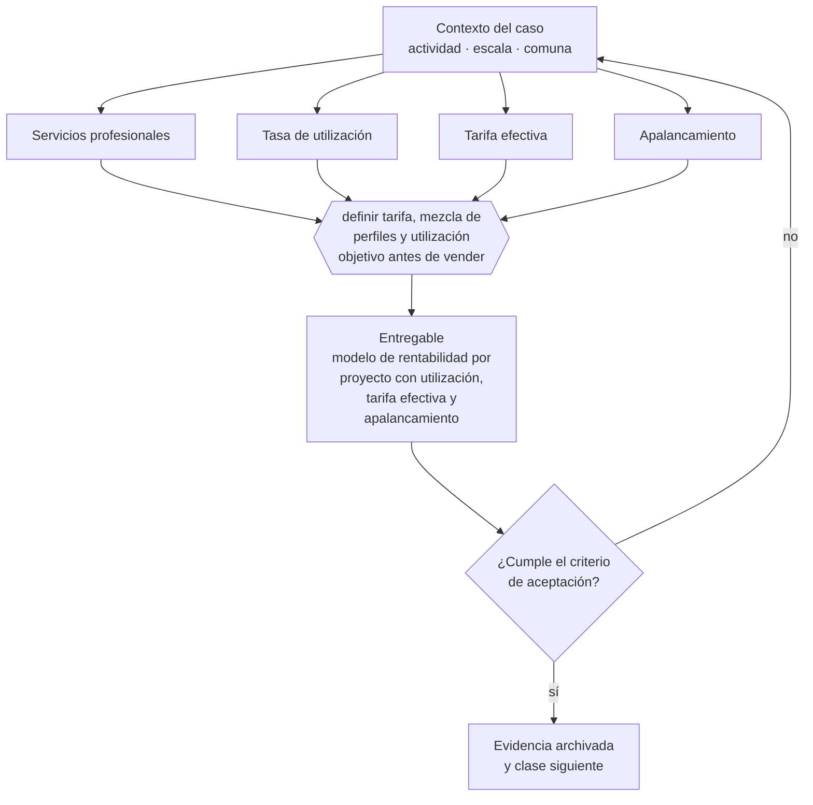

# Clase 031 — Modelo de servicios profesionales

> **Parte 03 · Modelos de negocio y líneas de ingreso** — clase 3 de 14

**Estado de evidencia:** `GUIA-PRACTICA` · **Jurisdicción:** Chile-first · **Fecha base normativa:** 07-08-2026<br>
**Decisión que habilita:** definir tarifa, mezcla de perfiles y utilización objetivo antes de vender<br>
**Entregable:** modelo de rentabilidad por proyecto con utilización, tarifa efectiva y apalancamiento

## 🎯 Propósito

Modelar la economía real de vender tiempo experto: utilización, tarifa efectiva y apalancamiento, que es donde se decide si el negocio es rentable o solo ocupado.

## 📚 Resultados de aprendizaje

Al finalizar esta clase podrás:

1. **Definir** con precisión los cuatro conceptos de la tabla siguiente y usarlos para describir un caso real.
2. **Explicar** por qué esta materia condiciona decisiones de otras partes del programa.
3. **Decidir** —definir tarifa, mezcla de perfiles y utilización objetivo antes de vender— y justificar la decisión por escrito.
4. **Producir** el entregable de la clase y contrastarlo contra su criterio de aceptación.
5. **Distinguir** el dato estable del dato dinámico que exige revalidación en la fuente oficial.

## 🧩 Conceptos centrales

| Concepto | Comprensión verificable |
|---|---|
| **Servicios profesionales** | Venta de resultado producido con horas de personas expertas. |
| **Tasa de utilización** | Porcentaje de horas facturables sobre horas disponibles. |
| **Tarifa efectiva** | Ingreso real por hora trabajada, incluidas las horas no facturadas. |
| **Apalancamiento** | Proporción de trabajo ejecutado por perfiles menos caros que el senior. |

## 🗺️ Flujo de razonamiento



## 📖 Desarrollo

### 1. El fondo del asunto

La economía de servicios profesionales se juega en utilización, tarifa efectiva y apalancamiento. El error clásico es medir la tarifa nominal e ignorar las horas de venta, coordinación y retrabajo, que pueden reducir la tarifa efectiva a la mitad. En Chile este modelo suele partir como boleta de honorarios y requiere planificar la transición a empresa.

### 2. Cómo se traduce en la práctica

La tarifa nominal engaña porque ignora las horas de venta, coordinación y retrabajo, que pueden reducir la tarifa efectiva a la mitad. En Chile este modelo suele partir como boleta de honorarios; planificar la transición a empresa antes de que el volumen la haga urgente evita decidirla bajo presión de un cliente grande.

### 2.1 Caso breve: consultoría de imagen personal y marca profesional

Este caso no enseña imagen, vestuario, colorimetría ni presencia ejecutiva. Usa una profesión concreta para comprobar si un servicio experto puede venderse con alcance controlado y margen. Una profesional independiente ofrece diagnóstico, informe, sesiones y seguimiento; el resultado comercial es claridad y un plan de acción, no una promesa de empleo, ventas o reputación.

| Segmento posible | Adquisición probable | Disposición a pagar a validar | Riesgo para alcance y rentabilidad |
|---|---|---|---|
| Profesional | contenidos, búsqueda y referidos | depende de urgencia y resultado esperado | demasiada personalización para un ticket individual |
| Ejecutivo | referidos, alianzas y red profesional | puede valorar confidencialidad y ahorro de tiempo | agenda fragmentada y revisiones tardías |
| Persona buscando empleo | alianzas laborales y búsqueda | condicionada por liquidez y urgencia | expectativa de garantizar contratación |
| Emprendedor | comunidades y partners | vinculada a ventas, inversión o vocería | mezclar marca personal con estrategia completa del negocio |
| Vendedor | empresa empleadora o contacto directo | vinculada a desempeño comercial | pedir capacitación o coaching fuera del encargo |
| Conferencista | agencias, eventos y referidos | vinculada a una fecha y exposición concretas | urgencia y múltiples piezas no cotizadas |
| Empresa | venta consultiva B2B y RR. HH. | presupuesto mayor si el resultado es colectivo | más decisores, compras, reportes y coordinación |

La segmentación sirve aquí para formular hipótesis de canal, ticket, horas y costo de adquisición. No autoriza a asumir necesidades por cargo, género, edad, apariencia u otro atributo: hay que validarlas con entrevistas y datos de conversión.

#### Formas de cobrar y paquetizar

| Forma | Unidad vendida | Cuándo ayuda | Riesgo que se debe controlar |
|---|---|---|---|
| Por hora | tiempo experto | problema incierto o sesión puntual | castiga la eficiencia y oculta preparación |
| Por proyecto | resultado y plazo definidos | encargo único con diagnóstico claro | subestimar revisiones y coordinación |
| Paquete | combinación cerrada de entregables | necesidad repetible con opciones limitadas | vender como estándar algo que sigue siendo a medida |
| Programa | secuencia de hitos y sesiones | cambio que requiere práctica en varias semanas | abandono, reprogramaciones y soporte abierto |
| Retainer | capacidad reservada por período | seguimiento recurrente con demanda previsible | disponibilidad ilimitada o tareas no definidas |
| Servicio productizado | proceso, entrada, salida y precio parametrizados | casos frecuentes que admiten checklist y plantillas | automatizar antes de estabilizar el método |

Ejemplo de paquete productizado: `diagnóstico + informe + sesión de recomendaciones + seguimiento`. El precio se obtiene del modelo de horas, costo, valor y capacidad; no se fija de forma permanente en este material.

#### Ficha de alcance del ejemplo

| Elemento | Definición contractual educativa |
|---|---|
| Incluye | briefing, revisión de antecedentes aportados, diagnóstico, un informe, una sesión de recomendaciones y un seguimiento |
| Reuniones | briefing de 45 minutos, recomendaciones de 60 minutos y seguimiento de 30 minutos |
| Entregables | briefing confirmado, diagnóstico, informe, recomendaciones, plan, checklist y registro de seguimiento |
| Revisiones | una ronda consolidada sobre errores o aclaraciones, solicitada dentro de cinco días hábiles |
| Duración | tres semanas desde la recepción completa de antecedentes |
| Responsabilidad del cliente | entregar información lícita y suficiente, responder a tiempo, asistir y aprobar dentro de plazo |
| No incluye | producción fotográfica, gestión de redes, acompañamiento de compras, coaching clínico, selección de personal ni garantía de resultados |
| Cambio de alcance | nueva pieza, reunión, revisión, urgencia o segmento exige orden de cambio con impacto en horas, plazo y precio |

La regla contra el *scope creep* es operativa: ningún pedido nuevo entra silenciosamente. Se registra, se estima y el cliente elige entre reemplazar una tarea incluida, ampliar presupuesto o dejarlo para otra etapa.

#### Economía reproducible del paquete

Los siguientes montos son un escenario pedagógico reemplazable, no una tarifa recomendada ni una referencia comercial. Se expresan en CLP y separan margen operativo de flujo tributario.

| Variable | Supuesto del ejercicio |
|---|---:|
| Ingreso del paquete `P` | $600.000 |
| Horas de entrega `Hd` | 7,5 |
| Horas de adquisición y administración asignadas `Hn` | 2,5 |
| Costo de oportunidad por hora `Ch` | $25.000 |
| Gastos directos `Gd` | $30.000 |
| Costo de adquisición asignado `CAC` | $40.000 |

```text
Ht = Hd + Hn = 10 horas
Tarifa efectiva = P / Ht = $60.000 por hora total
Costo del servicio = Ht × Ch + Gd + CAC = $320.000
Contribución antes de impuestos = P - costo del servicio = $280.000
Margen de contribución = contribución / P = 46,7 %
```

Si aparecen tres horas no cotizadas de retrabajo, `Ht` sube a 13, la tarifa efectiva baja a aproximadamente $46.154, el costo sube a $395.000 y el margen cae a 34,2 %. Así se cuantifica el *scope creep*. Con 160 horas disponibles al mes y 96 horas de entrega, la utilización es `96 / 160 = 60 %`; la capacidad máxima debe respetar tanto las horas de entrega como las horas totales de adquisición, administración y servicio. La recurrencia se mide por clientes que compran seguimiento o un nuevo encargo, no por asumir que todo cliente necesita un retainer.

Para una boleta de honorarios, el SII informa una retención de 15,25 % durante 2026: en el escenario, la retención sería $91.500 y el efectivo recibido $508.500. Es un dato dinámico verificado el 25-09-2026 y debe revalidarse; la retención es un pago provisional o flujo retenido, no un costo directo del proyecto ni necesariamente el impuesto final. La figura tributaria, IVA si correspondiera, régimen y documento aplicable dependen de cómo opere realmente el prestador.

#### Recorrido mínimo del cliente

`Lead → contacto → diagnóstico inicial → propuesta → contrato → prestación → entrega → seguimiento`

Cada transición debe dejar evidencia mínima: origen del lead y CAC; necesidad y calificación; propuesta con alcance; aceptación y condiciones; antecedentes recibidos; entregables y revisiones; cierre y próxima acción. Esto basta para aplicar CRM sin construir un sistema paralelo.

#### Privacidad, confidencialidad e IA

Fotografías, CV, perfiles sociales, información laboral y objetivos personales son datos que deben pedirse solo cuando tengan una finalidad declarada. El caso exige consentimiento o base jurídica aplicable documentada, minimización, acceso limitado, almacenamiento seguro, plazo de conservación, eliminación verificable y confidencialidad contractual, incluso respecto de herramientas y proveedores. Al 25-09-2026 rige la Ley 19.628 en su versión actual; la Ley 21.719 entra en vigor el 01-12-2026, por lo que el proceso debe prepararse para el régimen reformado y revalidarse en la fecha de ejecución.

La IA puede ordenar antecedentes, preparar borradores, comparar versiones, resumir notas y generar checklists bajo revisión humana. No debe decidir por el profesional, inventar antecedentes ni inferir salud, origen, orientación, personalidad u otros atributos sensibles desde fotografías. No se cargan datos identificables a una herramienta sin evaluar finalidad, contrato, retención, acceso y transferencias del proveedor.

Este caso se completa con [pricing basado en costos, valor y mercado](../../part-09-finanzas-caja-precios-y-economia-unitaria/class-06-pricing-basado-en-costos-valor-y-mercado/README.md), [contrato de prestación de servicios](../../part-10-contratos-y-arquitectura-legal-operativa/class-03-contrato-de-prestacion-de-servicios/README.md), [privacidad vigente](../../part-11-consumidor-e-commerce-privacidad-ip-y-seguridad-digital/class-06-privacidad-bajo-ley-19-628-vigente/README.md), [preparación para la Ley 21.719](../../part-11-consumidor-e-commerce-privacidad-ip-y-seguridad-digital/class-07-preparacion-para-ley-21-719-desde-1-dic-2026/README.md), [CRM y pipeline](../../part-14-ventas-marketing-y-experiencia-de-cliente/class-09-crm-y-pipeline/README.md) e [IA generativa en operaciones](../../part-15-tecnologia-datos-ia-y-operacion-digital/class-11-ia-generativa-en-operaciones/README.md).

### 3. Marco aplicable y quién interviene

- Business Model Canvas y Lean Canvas como instrumentos de diseño
- Ley 19.496 sobre protección de los derechos de los consumidores para modelos B2C
- Ley 20.169 sobre competencia desleal y DL 211 en modelos de plataforma

**Autoridades o contrapartes involucradas:** SERNAC, FNE, SII.
**Profesionales de apoyo:** fundador, abogado comercial, contador de gestión. La participación concreta depende del riesgo, del
tamaño de la empresa y de la actividad económica.

## 🧪 Taller guiado

Aplica esta clase a **una** de las siguientes líneas de negocio y repite después el ejercicio con
una segunda línea de carga regulatoria distinta:

| Línea | Carga regulatoria |
|---|---|
| SaaS B2B con IA | media |
| Servicios profesionales | baja |
| E-commerce D2C | media |
| Alimentos o foodtech | alta |
| Exportación de servicios | media |
| Fintech regulada | alta |
| Construcción o servicios técnicos | alta |

**Secuencia de trabajo:**

1. Delimita el contexto: actividad económica, escala, comuna y etapa de la empresa.
2. Reúne los antecedentes que la decisión exige y anota la fecha de cada fuente.
3. Identifica las alternativas reales, incluida la de no hacer nada.
4. Evalúa el impacto en mercado, caja, personas, regulación y operación.
5. Toma la decisión y regístrala con sus supuestos.
6. Produce el entregable.
7. Contrástalo contra el criterio de aceptación.
8. Anota lo que requiere validación profesional y programa su revisión.

### 📦 Entregable

Modelo de rentabilidad por proyecto con utilización, tarifa efectiva y apalancamiento.

Debe incluir decisión, supuestos, fuentes con fecha de consulta, responsable, riesgos
identificados y próximos pasos.

## 🏆 Reto verificable

Resuelve la misma materia para una segunda línea de negocio con distinta carga regulatoria y
explica por escrito **qué cambió, por qué y qué fuente lo determina**.

## ✅ Criterio de aceptación

- [ ] la tarifa efectiva está calculada, no la nominal
- [ ] el modelo muestra el punto en que el proyecto deja de ser rentable
- [ ] cada afirmación regulatoria está referida a una fuente oficial con fecha de consulta;
- [ ] los datos dinámicos quedan marcados para revalidación;
- [ ] hay un responsable asignado y evidencia reproducible del trabajo.

## ⚠️ Errores frecuentes

**Propios de esta clase:**

- Cotizar por hora nominal sin incluir horas de gestión y retrabajo.
- Aceptar scope creep sin orden de cambio y perder el margen del proyecto.

**Característicos de la parte 03:**

- Copiar un modelo extranjero sin verificar su viabilidad regulatoria o logística en chile.
- Sumar líneas de negocio antes de que la primera sea rentable.

## 🇨🇱 Checklist Chile

- [ ] ¿existe norma o autoridad específica para esta materia?
- [ ] ¿la fuente consultada está vigente a la fecha de ejecución?
- [ ] ¿se activa algún trámite ante el SII?
- [ ] ¿se activa algún requisito municipal o sectorial?
- [ ] ¿afecta a consumidores o al tratamiento de datos personales?
- [ ] ¿afecta a trabajadores o a la seguridad y salud en el trabajo?
- [ ] ¿afecta a impuestos, contabilidad o caja?
- [ ] ¿afecta a contratos o a propiedad intelectual?
- [ ] ¿requiere renovación, reporte periódico o revalidación?

## ❓ Preguntas de comprobación

1. ¿Cuál es tu tarifa efectiva por hora trabajada, incluidas las horas no facturables?
2. ¿Qué porcentaje del trabajo ejecuta alguien más barato que el perfil senior?
3. ¿Qué procedimiento tienes para cobrar el alcance adicional que aparece en cada proyecto?

## 🔗 Fuentes oficiales

**Servicio de Impuestos Internos — Nuevos contribuyentes, inicio de actividades y DTE**  
<https://www.sii.cl/ayudas/nuevos_contribuyentes/boleta-vys-facturador.html> · verificado 2026-08-19

- *Qué contiene:* Reúne el circuito completo del contribuyente nuevo: obtención de RUT, declaración de inicio de actividades, elección de códigos de actividad económica y habilitación para emitir documentos tributarios electrónicos.
- *Cómo leerla:* Sepáralo en dos actos distintos que la página trata seguidos: el RUT identifica, el inicio de actividades habilita. Lo que te bloquea para facturar casi siempre está en el segundo, no en el primero.
- *Uso en esta clase:* aporta el marco de «Nuevos contribuyentes, inicio de actividades y DTE» para definir tarifa, mezcla de perfiles y utilización objetivo antes de vender.

**Biblioteca del Congreso Nacional · LeyChile — Normativa oficial consolidada**  
<https://www.bcn.cl/leychile/> · verificado 2026-08-19

- *Qué contiene:* Publica el texto oficial y consolidado de leyes, decretos y reglamentos, con la versión vigente a una fecha, el historial de modificaciones y la tramitación que las originó.
- *Cómo leerla:* Usa siempre el selector de versión vigente a la fecha en que ejecutarás el trámite, no la última publicada. Y lee el artículo transitorio: en normas en implantación gradual —jornada, datos personales— ahí está la fecha que realmente te aplica.
- *Uso en esta clase:* aporta el marco de «Normativa oficial consolidada» para definir tarifa, mezcla de perfiles y utilización objetivo antes de vender.

Complementos del repositorio: [glosario](../../../docs/19_GLOSSARY.md) ·
[ruta de lecturas](../../../docs/15_BOOKS_AND_LEARNING_PATH.md) ·
[catálogo de fuentes](../../../docs/16_OFFICIAL_SOURCE_CATALOG.md).

> [!IMPORTANT]
> Material educativo. Para una decisión real de alto impacto hay que verificar la fuente oficial
> vigente y validar con el profesional competente.

---

| Anterior | Índice | Siguiente |
|---|---|---|
| [← 030 · Lean Canvas](../class-02-lean-canvas/README.md) | [Parte 03](../README.md) · [Programa](../../../README.md) | [032 · Suscripción y SaaS →](../class-04-suscripcion-y-saas/README.md) |
