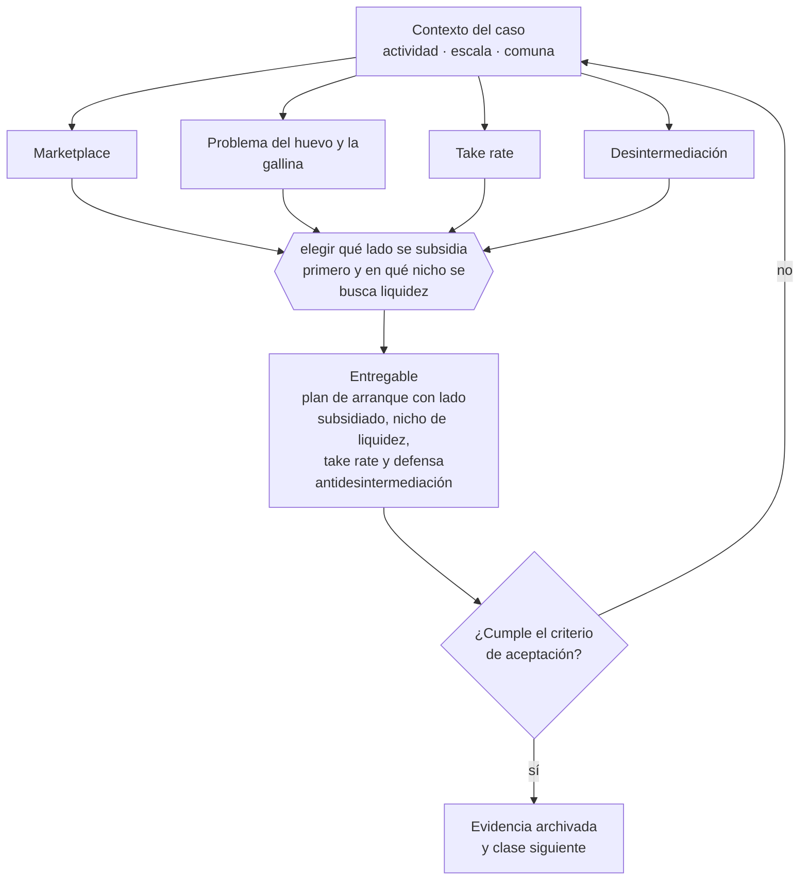

# Clase 035 — Marketplace de dos lados

> **Parte 03 · Modelos de negocio y líneas de ingreso** — clase 7 de 14

**Estado de evidencia:** `GUIA-PRACTICA` · **Jurisdicción:** Chile-first · **Fecha base normativa:** 07-08-2026 
**Decisión que habilita:** elegir qué lado se subsidia primero y en qué nicho se busca liquidez 
**Entregable:** plan de arranque con lado subsidiado, nicho de liquidez, take rate y defensa antidesintermediación

## 🎯 Propósito

Reconocer que un marketplace no escala por producto sino por densidad, y que la estrategia correcta es concentrarse hasta lograr liquidez antes de expandir.

## 📚 Resultados de aprendizaje

Al finalizar esta clase podrás:

1. **Definir** con precisión los cuatro conceptos de la tabla siguiente y usarlos para describir un caso real.
2. **Explicar** por qué esta materia condiciona decisiones de otras partes del programa.
3. **Decidir** —elegir qué lado se subsidia primero y en qué nicho se busca liquidez— y justificar la decisión por escrito.
4. **Producir** el entregable de la clase y contrastarlo contra su criterio de aceptación.
5. **Distinguir** el dato estable del dato dinámico que exige revalidación en la fuente oficial.

## 🧩 Conceptos centrales

| Concepto | Comprensión verificable |
|---|---|
| **Marketplace** | Plataforma que intermedia entre oferta y demanda. |
| **Problema del huevo y la gallina** | Ningún lado llega si el otro no está. |
| **Take rate** | Porcentaje de la transacción que retiene la plataforma. |
| **Desintermediación** | Riesgo de que las partes transaccionen fuera de la plataforma. |

## 🗺️ Flujo de razonamiento

## 📖 Desarrollo

### 1. El fondo del asunto

Un marketplace no escala por producto sino por densidad de un lado del mercado. La estrategia habitual es concentrarse geográfica o verticalmente hasta lograr liquidez, y solo después expandir. La desintermediación se combate con valor en la transacción —pago, garantía, resolución de disputas— y no con cláusulas.

### 2. Cómo se traduce en la práctica

Lanzar en todo el país produce presencia sin densidad en ningún lugar y quema capital sin construir defensa. La desintermediación, por su parte, no se combate con cláusulas sino con valor dentro de la transacción: pago protegido, garantía, resolución de disputas y reputación verificable.

### 3. Marco aplicable y quién interviene

- Business Model Canvas y Lean Canvas como instrumentos de diseño
- Ley 19.496 sobre protección de los derechos de los consumidores para modelos B2C
- Ley 20.169 sobre competencia desleal y DL 211 en modelos de plataforma

**Autoridades o contrapartes involucradas:** SERNAC, FNE, SII.
**Profesionales de apoyo:** fundador, abogado comercial, contador de gestión. La participación concreta depende del riesgo, del
tamaño de la empresa y de la actividad económica.

## 🧪 Taller guiado

Aplica esta clase a **una** de las siguientes líneas de negocio y repite después el ejercicio con
una segunda línea de carga regulatoria distinta:

| Línea | Carga regulatoria |
|---|---|
| SaaS B2B con IA | media |
| Servicios profesionales | baja |
| E-commerce D2C | media |
| Alimentos o foodtech | alta |
| Exportación de servicios | media |
| Fintech regulada | alta |
| Construcción o servicios técnicos | alta |

**Secuencia de trabajo:**

1. Delimita el contexto: actividad económica, escala, comuna y etapa de la empresa.
2. Reúne los antecedentes que la decisión exige y anota la fecha de cada fuente.
3. Identifica las alternativas reales, incluida la de no hacer nada.
4. Evalúa el impacto en mercado, caja, personas, regulación y operación.
5. Toma la decisión y regístrala con sus supuestos.
6. Produce el entregable.
7. Contrástalo contra el criterio de aceptación.
8. Anota lo que requiere validación profesional y programa su revisión.

### 📦 Entregable

Plan de arranque con lado subsidiado, nicho de liquidez, take rate y defensa antidesintermediación.

Debe incluir decisión, supuestos, fuentes con fecha de consulta, responsable, riesgos
identificados y próximos pasos.

## 🏆 Reto verificable

Resuelve la misma materia para una segunda línea de negocio con distinta carga regulatoria y
explica por escrito **qué cambió, por qué y qué fuente lo determina**.

## ✅ Criterio de aceptación

- [ ] el nicho de arranque está acotado y justificado
- [ ] hay al menos dos mecanismos de valor que retienen la transacción
- [ ] cada afirmación regulatoria está referida a una fuente oficial con fecha de consulta;
- [ ] los datos dinámicos quedan marcados para revalidación;
- [ ] hay un responsable asignado y evidencia reproducible del trabajo.

## ⚠️ Errores frecuentes

**Propios de esta clase:**

- Lanzar en todo el país y no lograr densidad en ningún lugar.
- Asumir que la plataforma no responde por la calidad de lo transado.

**Característicos de la parte 03:**

- Copiar un modelo extranjero sin verificar su viabilidad regulatoria o logística en chile.
- Sumar líneas de negocio antes de que la primera sea rentable.

## 🇨🇱 Checklist Chile

- [ ] ¿existe norma o autoridad específica para esta materia?
- [ ] ¿la fuente consultada está vigente a la fecha de ejecución?
- [ ] ¿se activa algún trámite ante el SII?
- [ ] ¿se activa algún requisito municipal o sectorial?
- [ ] ¿afecta a consumidores o al tratamiento de datos personales?
- [ ] ¿afecta a trabajadores o a la seguridad y salud en el trabajo?
- [ ] ¿afecta a impuestos, contabilidad o caja?
- [ ] ¿afecta a contratos o a propiedad intelectual?
- [ ] ¿requiere renovación, reporte periódico o revalidación?

## ❓ Preguntas de comprobación

1. ¿En qué nicho o zona acotada buscarás liquidez primero y con qué meta?
2. ¿Qué valor concreto retiene la transacción dentro de la plataforma?
3. ¿De qué responde tu plataforma frente al usuario final si algo sale mal?

## 🔗 Fuentes oficiales

**Servicio Nacional del Consumidor — Ley 19.496, comercio electrónico y garantía legal**  
<https://www.sernac.cl/> · verificado 2026-08-07

- *Qué contiene:* Publica la interpretación aplicada de la Ley del Consumidor: deberes de información en la oferta, reglas del comercio electrónico, garantía legal, contratos de adhesión y el procedimiento de reclamos.
- *Cómo leerla:* Entra por el rubro de tu negocio y revisa las alertas y procedimientos colectivos publicados: muestran qué está fiscalizando el servicio ahora, que es mejor predictor de tu riesgo que la lectura abstracta de la ley.

Complementos del repositorio: [glosario](../../../docs/19_GLOSSARY.md) ·
[ruta de lecturas](../../../docs/15_BOOKS_AND_LEARNING_PATH.md) ·
[catálogo de fuentes](../../../docs/16_OFFICIAL_SOURCE_CATALOG.md).

> [!IMPORTANT]
> Material educativo. Para una decisión real de alto impacto hay que verificar la fuente oficial
> vigente y validar con el profesional competente.

---

| Anterior | Índice | Siguiente |
|---|---|---|
| [← 034 · Retail físico y omnicanal](../class-06-retail-fisico-y-omnicanal/README.md) | [Parte 03](../README.md) · [Programa](../../../README.md) | [036 · Licencias, royalties y propiedad intelectual →](../class-08-licencias-royalties-y-propiedad-intelectual/README.md) |
