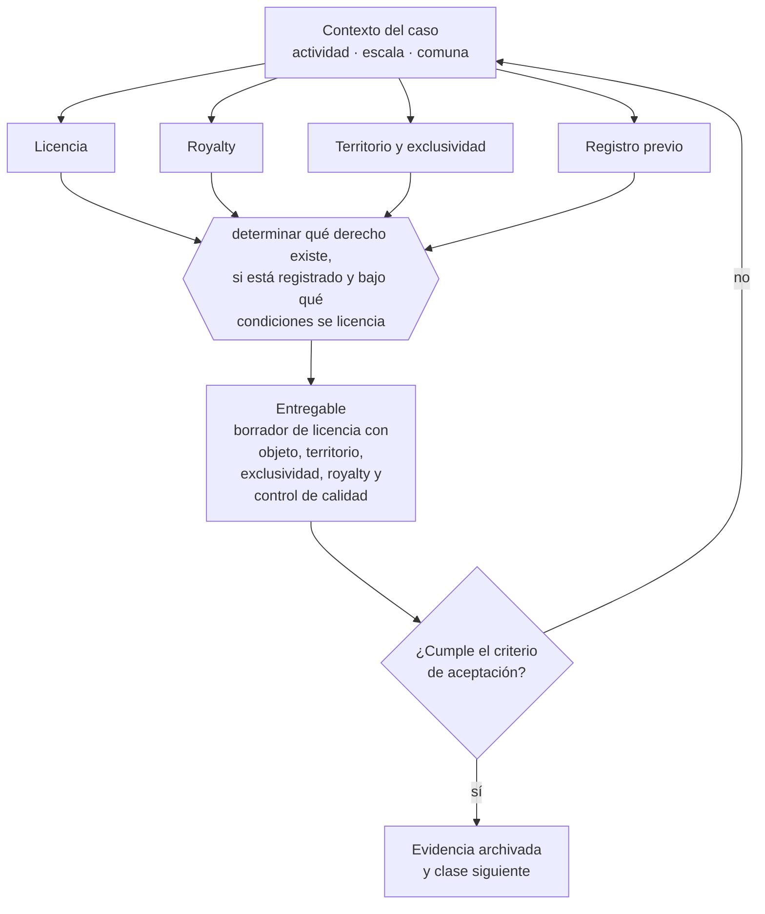

# Clase 036 — Licencias, royalties y propiedad intelectual

> **Parte 03 · Modelos de negocio y líneas de ingreso** — clase 8 de 14

**Estado de evidencia:** `GUIA-PRACTICA` · **Jurisdicción:** Chile-first · **Fecha base normativa:** 07-08-2026 
**Decisión que habilita:** determinar qué derecho existe, si está registrado y bajo qué condiciones se licencia 
**Entregable:** borrador de licencia con objeto, territorio, exclusividad, royalty y control de calidad

## 🎯 Propósito

Verificar que existe un derecho registrado antes de licenciarlo, porque sin registro la licencia solo obliga entre las partes y no permite actuar contra un tercero que copie.

## 📚 Resultados de aprendizaje

Al finalizar esta clase podrás:

1. **Definir** con precisión los cuatro conceptos de la tabla siguiente y usarlos para describir un caso real.
2. **Explicar** por qué esta materia condiciona decisiones de otras partes del programa.
3. **Decidir** —determinar qué derecho existe, si está registrado y bajo qué condiciones se licencia— y justificar la decisión por escrito.
4. **Producir** el entregable de la clase y contrastarlo contra su criterio de aceptación.
5. **Distinguir** el dato estable del dato dinámico que exige revalidación en la fuente oficial.

## 🧩 Conceptos centrales

| Concepto | Comprensión verificable |
|---|---|
| **Licencia** | Autorización de uso de un derecho conservando la titularidad. |
| **Royalty** | Pago recurrente asociado al uso o a las ventas del licenciatario. |
| **Territorio y exclusividad** | Alcance geográfico y de mercado de la licencia. |
| **Registro previo** | Inscripción del derecho que hace exigible la licencia frente a terceros. |

## 🗺️ Flujo de razonamiento

## 📖 Desarrollo

### 1. El fondo del asunto

Licenciar exige tener primero un derecho registrado o protegible: marca en INAPI, patente, diseño industrial o software con autoría acreditada. Sin registro, la licencia solo obliga entre las partes y no permite actuar contra un tercero que copie.

### 2. Cómo se traduce en la práctica

En Chile la marca se protege por clases de la clasificación de Niza y la protección es territorial: registrar en la clase equivocada deja desprotegido el uso real. Toda licencia debe además pactar control de calidad, porque el uso descuidado del licenciatario daña una marca que sigue siendo del licenciante.

### 3. Marco aplicable y quién interviene

- Business Model Canvas y Lean Canvas como instrumentos de diseño
- Ley 19.496 sobre protección de los derechos de los consumidores para modelos B2C
- Ley 20.169 sobre competencia desleal y DL 211 en modelos de plataforma

**Autoridades o contrapartes involucradas:** SERNAC, FNE, SII.
**Profesionales de apoyo:** fundador, abogado comercial, contador de gestión. La participación concreta depende del riesgo, del
tamaño de la empresa y de la actividad económica.

## 🧪 Taller guiado

Aplica esta clase a **una** de las siguientes líneas de negocio y repite después el ejercicio con
una segunda línea de carga regulatoria distinta:

| Línea | Carga regulatoria |
|---|---|
| SaaS B2B con IA | media |
| Servicios profesionales | baja |
| E-commerce D2C | media |
| Alimentos o foodtech | alta |
| Exportación de servicios | media |
| Fintech regulada | alta |
| Construcción o servicios técnicos | alta |

**Secuencia de trabajo:**

1. Delimita el contexto: actividad económica, escala, comuna y etapa de la empresa.
2. Reúne los antecedentes que la decisión exige y anota la fecha de cada fuente.
3. Identifica las alternativas reales, incluida la de no hacer nada.
4. Evalúa el impacto en mercado, caja, personas, regulación y operación.
5. Toma la decisión y regístrala con sus supuestos.
6. Produce el entregable.
7. Contrástalo contra el criterio de aceptación.
8. Anota lo que requiere validación profesional y programa su revisión.

### 📦 Entregable

Borrador de licencia con objeto, territorio, exclusividad, royalty y control de calidad.

Debe incluir decisión, supuestos, fuentes con fecha de consulta, responsable, riesgos
identificados y próximos pasos.

## 🏆 Reto verificable

Resuelve la misma materia para una segunda línea de negocio con distinta carga regulatoria y
explica por escrito **qué cambió, por qué y qué fuente lo determina**.

## ✅ Criterio de aceptación

- [ ] el derecho licenciado está registrado o su protección está identificada
- [ ] la licencia define territorio, plazo, royalty y control de calidad
- [ ] cada afirmación regulatoria está referida a una fuente oficial con fecha de consulta;
- [ ] los datos dinámicos quedan marcados para revalidación;
- [ ] hay un responsable asignado y evidencia reproducible del trabajo.

## ⚠️ Errores frecuentes

**Propios de esta clase:**

- Licenciar una marca no registrada y perder la capacidad de defenderla.
- No pactar control de calidad y dañar la marca por el uso del licenciatario.

**Característicos de la parte 03:**

- Copiar un modelo extranjero sin verificar su viabilidad regulatoria o logística en chile.
- Sumar líneas de negocio antes de que la primera sea rentable.

## 🇨🇱 Checklist Chile

- [ ] ¿existe norma o autoridad específica para esta materia?
- [ ] ¿la fuente consultada está vigente a la fecha de ejecución?
- [ ] ¿se activa algún trámite ante el SII?
- [ ] ¿se activa algún requisito municipal o sectorial?
- [ ] ¿afecta a consumidores o al tratamiento de datos personales?
- [ ] ¿afecta a trabajadores o a la seguridad y salud en el trabajo?
- [ ] ¿afecta a impuestos, contabilidad o caja?
- [ ] ¿afecta a contratos o a propiedad intelectual?
- [ ] ¿requiere renovación, reporte periódico o revalidación?

## ❓ Preguntas de comprobación

1. ¿El derecho que quieres licenciar está registrado y en qué clases?
2. ¿Qué mecanismo de control de calidad incluye tu licencia?
3. ¿Qué pasa con el derecho si el licenciatario incumple o desaparece?

## 🔗 Fuentes oficiales

**Instituto Nacional de Propiedad Industrial — Marcas, patentes y diseños industriales**  
<https://www.inapi.cl/> · verificado 2026-08-07

- *Qué contiene:* Administra el registro de marcas, patentes, diseños e indicaciones geográficas, y ofrece el buscador público de solicitudes y registros vigentes por clase.
- *Cómo leerla:* Empieza siempre por el buscador de anterioridades y por clases, no por el formulario de solicitud. Una marca disponible en tu clase puede estar tomada en la clase donde realmente operas, y eso solo se ve buscando por actividad.

**Biblioteca del Congreso Nacional · LeyChile — Normativa oficial consolidada**  
<https://www.bcn.cl/leychile/> · verificado 2026-08-07

- *Qué contiene:* Publica el texto oficial y consolidado de leyes, decretos y reglamentos, con la versión vigente a una fecha, el historial de modificaciones y la tramitación que las originó.
- *Cómo leerla:* Usa siempre el selector de versión vigente a la fecha en que ejecutarás el trámite, no la última publicada. Y lee el artículo transitorio: en normas en implantación gradual —jornada, datos personales— ahí está la fecha que realmente te aplica.

Complementos del repositorio: [glosario](../../../docs/19_GLOSSARY.md) ·
[ruta de lecturas](../../../docs/15_BOOKS_AND_LEARNING_PATH.md) ·
[catálogo de fuentes](../../../docs/16_OFFICIAL_SOURCE_CATALOG.md).

> [!IMPORTANT]
> Material educativo. Para una decisión real de alto impacto hay que verificar la fuente oficial
> vigente y validar con el profesional competente.

---

| Anterior | Índice | Siguiente |
|---|---|---|
| [← 035 · Marketplace de dos lados](../class-07-marketplace-de-dos-lados/README.md) | [Parte 03](../README.md) · [Programa](../../../README.md) | [037 · Agencia y servicios administrados →](../class-09-agencia-y-servicios-administrados/README.md) |
