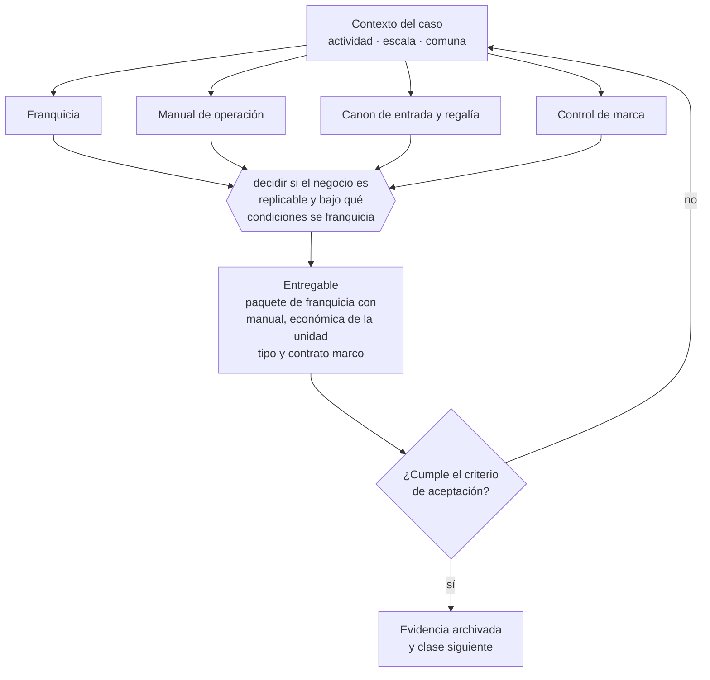

# Clase 039 — Franquicia y licenciamiento de formato

> **Parte 03 · Modelos de negocio y líneas de ingreso** — clase 11 de 14

**Estado de evidencia:** `GUIA-PRACTICA` · **Jurisdicción:** Chile-first · **Fecha base normativa:** 07-08-2026 
**Decisión que habilita:** decidir si el negocio es replicable y bajo qué condiciones se franquicia 
**Entregable:** paquete de franquicia con manual, económica de la unidad tipo y contrato marco

## 🎯 Propósito

Determinar si el negocio es replicable antes de franquiciarlo, porque franquiciar sin sistema transfiere un problema en vez de un modelo.

## 📚 Resultados de aprendizaje

Al finalizar esta clase podrás:

1. **Definir** con precisión los cuatro conceptos de la tabla siguiente y usarlos para describir un caso real.
2. **Explicar** por qué esta materia condiciona decisiones de otras partes del programa.
3. **Decidir** —decidir si el negocio es replicable y bajo qué condiciones se franquicia— y justificar la decisión por escrito.
4. **Producir** el entregable de la clase y contrastarlo contra su criterio de aceptación.
5. **Distinguir** el dato estable del dato dinámico que exige revalidación en la fuente oficial.

## 🧩 Conceptos centrales

| Concepto | Comprensión verificable |
|---|---|
| **Franquicia** | Cesión de un formato completo de negocio bajo marca y manual. |
| **Manual de operación** | Documento que estandariza cómo se opera la unidad. |
| **Canon de entrada y regalía** | Pago inicial y pago recurrente del franquiciado. |
| **Control de marca** | Mecanismo que asegura consistencia entre unidades. |

## 🗺️ Flujo de razonamiento

## 📖 Desarrollo

### 1. El fondo del asunto

En Chile la franquicia no tiene ley especial: se estructura por contrato, marca registrada y know-how. Franquiciar sin manual operativo probado ni unidad propia rentable transfiere un problema en vez de un sistema, y el daño de marca por una unidad mal operada afecta a toda la red.

### 2. Cómo se traduce en la práctica

En Chile la franquicia no tiene ley especial: se estructura por contrato, marca registrada y know-how documentado. La falla típica es franquiciar para resolver un problema de caja: el canon inicial alivia el mes y una red mal soportada destruye la marca en un año.

### 3. Marco aplicable y quién interviene

- Business Model Canvas y Lean Canvas como instrumentos de diseño
- Ley 19.496 sobre protección de los derechos de los consumidores para modelos B2C
- Ley 20.169 sobre competencia desleal y DL 211 en modelos de plataforma

**Autoridades o contrapartes involucradas:** SERNAC, FNE, SII.
**Profesionales de apoyo:** fundador, abogado comercial, contador de gestión. La participación concreta depende del riesgo, del
tamaño de la empresa y de la actividad económica.

## 🧪 Taller guiado

Aplica esta clase a **una** de las siguientes líneas de negocio y repite después el ejercicio con
una segunda línea de carga regulatoria distinta:

| Línea | Carga regulatoria |
|---|---|
| SaaS B2B con IA | media |
| Servicios profesionales | baja |
| E-commerce D2C | media |
| Alimentos o foodtech | alta |
| Exportación de servicios | media |
| Fintech regulada | alta |
| Construcción o servicios técnicos | alta |

**Secuencia de trabajo:**

1. Delimita el contexto: actividad económica, escala, comuna y etapa de la empresa.
2. Reúne los antecedentes que la decisión exige y anota la fecha de cada fuente.
3. Identifica las alternativas reales, incluida la de no hacer nada.
4. Evalúa el impacto en mercado, caja, personas, regulación y operación.
5. Toma la decisión y regístrala con sus supuestos.
6. Produce el entregable.
7. Contrástalo contra el criterio de aceptación.
8. Anota lo que requiere validación profesional y programa su revisión.

### 📦 Entregable

Paquete de franquicia con manual, económica de la unidad tipo y contrato marco.

Debe incluir decisión, supuestos, fuentes con fecha de consulta, responsable, riesgos
identificados y próximos pasos.

## 🏆 Reto verificable

Resuelve la misma materia para una segunda línea de negocio con distinta carga regulatoria y
explica por escrito **qué cambió, por qué y qué fuente lo determina**.

## ✅ Criterio de aceptación

- [ ] existe una unidad propia con resultados documentados
- [ ] la marca está registrada y el manual operativo es ejecutable
- [ ] cada afirmación regulatoria está referida a una fuente oficial con fecha de consulta;
- [ ] los datos dinámicos quedan marcados para revalidación;
- [ ] hay un responsable asignado y evidencia reproducible del trabajo.

## ⚠️ Errores frecuentes

**Propios de esta clase:**

- Franquiciar antes de tener una unidad propia rentable y estable.
- No registrar la marca antes de licenciarla a terceros.

**Característicos de la parte 03:**

- Copiar un modelo extranjero sin verificar su viabilidad regulatoria o logística en chile.
- Sumar líneas de negocio antes de que la primera sea rentable.

## 🇨🇱 Checklist Chile

- [ ] ¿existe norma o autoridad específica para esta materia?
- [ ] ¿la fuente consultada está vigente a la fecha de ejecución?
- [ ] ¿se activa algún trámite ante el SII?
- [ ] ¿se activa algún requisito municipal o sectorial?
- [ ] ¿afecta a consumidores o al tratamiento de datos personales?
- [ ] ¿afecta a trabajadores o a la seguridad y salud en el trabajo?
- [ ] ¿afecta a impuestos, contabilidad o caja?
- [ ] ¿afecta a contratos o a propiedad intelectual?
- [ ] ¿requiere renovación, reporte periódico o revalidación?

## ❓ Preguntas de comprobación

1. ¿Tienes una unidad propia rentable y estable con resultados documentados?
2. ¿Existe un manual operativo que alguien nuevo pueda ejecutar sin ti?
3. ¿La marca está registrada en todas las clases en que operará la red?

## 🔗 Fuentes oficiales

**Instituto Nacional de Propiedad Industrial — Marcas, patentes y diseños industriales**  
<https://www.inapi.cl/> · verificado 2026-08-19

- *Qué contiene:* Administra el registro de marcas, patentes, diseños e indicaciones geográficas, y ofrece el buscador público de solicitudes y registros vigentes por clase.
- *Cómo leerla:* Empieza siempre por el buscador de anterioridades y por clases, no por el formulario de solicitud. Una marca disponible en tu clase puede estar tomada en la clase donde realmente operas, y eso solo se ve buscando por actividad.
- *Uso en esta clase:* aporta el marco de «Marcas, patentes y diseños industriales» para decidir si el negocio es replicable y bajo qué condiciones se franquicia.

**Biblioteca del Congreso Nacional · LeyChile — Normativa oficial consolidada**  
<https://www.bcn.cl/leychile/> · verificado 2026-08-19

- *Qué contiene:* Publica el texto oficial y consolidado de leyes, decretos y reglamentos, con la versión vigente a una fecha, el historial de modificaciones y la tramitación que las originó.
- *Cómo leerla:* Usa siempre el selector de versión vigente a la fecha en que ejecutarás el trámite, no la última publicada. Y lee el artículo transitorio: en normas en implantación gradual —jornada, datos personales— ahí está la fecha que realmente te aplica.
- *Uso en esta clase:* aporta el marco de «Normativa oficial consolidada» para decidir si el negocio es replicable y bajo qué condiciones se franquicia.

Complementos del repositorio: [glosario](../../../docs/19_GLOSSARY.md) ·
[ruta de lecturas](../../../docs/15_BOOKS_AND_LEARNING_PATH.md) ·
[catálogo de fuentes](../../../docs/16_OFFICIAL_SOURCE_CATALOG.md).

> [!IMPORTANT]
> Material educativo. Para una decisión real de alto impacto hay que verificar la fuente oficial
> vigente y validar con el profesional competente.

---

| Anterior | Índice | Siguiente |
|---|---|---|
| [← 038 · Manufactura y venta de productos](../class-10-manufactura-y-venta-de-productos/README.md) | [Parte 03](../README.md) · [Programa](../../../README.md) | [040 · Publicidad, afiliación y contenido →](../class-12-publicidad-afiliacion-y-contenido/README.md) |
