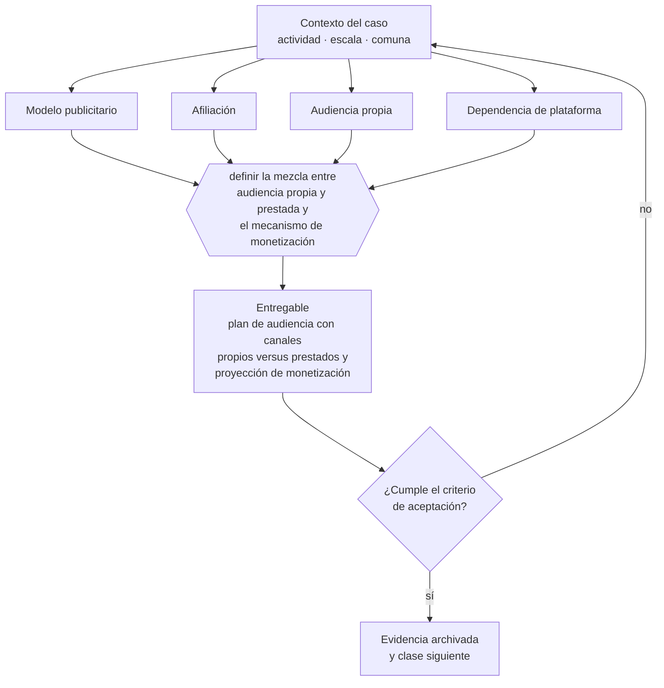

# Clase 040 — Publicidad, afiliación y contenido

> **Parte 03 · Modelos de negocio y líneas de ingreso** — clase 12 de 14

**Estado de evidencia:** `GUIA-PRACTICA` · **Jurisdicción:** Chile-first · **Fecha base normativa:** 07-08-2026 
**Decisión que habilita:** definir la mezcla entre audiencia propia y prestada y el mecanismo de monetización 
**Entregable:** plan de audiencia con canales propios versus prestados y proyección de monetización

## 🎯 Propósito

Distinguir audiencia propia de audiencia prestada, porque solo la primera es un activo que la empresa controla.

## 📚 Resultados de aprendizaje

Al finalizar esta clase podrás:

1. **Definir** con precisión los cuatro conceptos de la tabla siguiente y usarlos para describir un caso real.
2. **Explicar** por qué esta materia condiciona decisiones de otras partes del programa.
3. **Decidir** —definir la mezcla entre audiencia propia y prestada y el mecanismo de monetización— y justificar la decisión por escrito.
4. **Producir** el entregable de la clase y contrastarlo contra su criterio de aceptación.
5. **Distinguir** el dato estable del dato dinámico que exige revalidación en la fuente oficial.

## 🧩 Conceptos centrales

| Concepto | Comprensión verificable |
|---|---|
| **Modelo publicitario** | Monetización de la atención de una audiencia propia. |
| **Afiliación** | Comisión por venta referida a un tercero. |
| **Audiencia propia** | Canal que la empresa controla: base de correo, comunidad, sitio. |
| **Dependencia de plataforma** | Riesgo de que un cambio de algoritmo elimine la distribución. |

## 🗺️ Flujo de razonamiento

## 📖 Desarrollo

### 1. El fondo del asunto

Monetizar contenido exige volumen y consistencia antes de generar ingresos, y expone a un riesgo específico: la audiencia construida sobre una plataforma ajena puede desaparecer con un cambio de reglas. La conversión a canal propio es lo que convierte audiencia en activo. La publicidad y el contenido pagado deben identificarse como tales.

### 2. Cómo se traduce en la práctica

Una comunidad construida íntegramente sobre una plataforma ajena puede desaparecer con un cambio de algoritmo o de reglas. La conversión a canal propio —base de correo, comunidad, sitio— es lo que transforma alcance en activo. Y el contenido comercial debe identificarse como tal: la publicidad no identificada es infracción a la Ley del Consumidor.

### 3. Marco aplicable y quién interviene

- Business Model Canvas y Lean Canvas como instrumentos de diseño
- Ley 19.496 sobre protección de los derechos de los consumidores para modelos B2C
- Ley 20.169 sobre competencia desleal y DL 211 en modelos de plataforma

**Autoridades o contrapartes involucradas:** SERNAC, FNE, SII.
**Profesionales de apoyo:** fundador, abogado comercial, contador de gestión. La participación concreta depende del riesgo, del
tamaño de la empresa y de la actividad económica.

## 🧪 Taller guiado

Aplica esta clase a **una** de las siguientes líneas de negocio y repite después el ejercicio con
una segunda línea de carga regulatoria distinta:

| Línea | Carga regulatoria |
|---|---|
| SaaS B2B con IA | media |
| Servicios profesionales | baja |
| E-commerce D2C | media |
| Alimentos o foodtech | alta |
| Exportación de servicios | media |
| Fintech regulada | alta |
| Construcción o servicios técnicos | alta |

**Secuencia de trabajo:**

1. Delimita el contexto: actividad económica, escala, comuna y etapa de la empresa.
2. Reúne los antecedentes que la decisión exige y anota la fecha de cada fuente.
3. Identifica las alternativas reales, incluida la de no hacer nada.
4. Evalúa el impacto en mercado, caja, personas, regulación y operación.
5. Toma la decisión y regístrala con sus supuestos.
6. Produce el entregable.
7. Contrástalo contra el criterio de aceptación.
8. Anota lo que requiere validación profesional y programa su revisión.

### 📦 Entregable

Plan de audiencia con canales propios versus prestados y proyección de monetización.

Debe incluir decisión, supuestos, fuentes con fecha de consulta, responsable, riesgos
identificados y próximos pasos.

## 🏆 Reto verificable

Resuelve la misma materia para una segunda línea de negocio con distinta carga regulatoria y
explica por escrito **qué cambió, por qué y qué fuente lo determina**.

## ✅ Criterio de aceptación

- [ ] hay una meta explícita de conversión a canal propio
- [ ] el contenido comercial se identifica según normativa de consumo
- [ ] cada afirmación regulatoria está referida a una fuente oficial con fecha de consulta;
- [ ] los datos dinámicos quedan marcados para revalidación;
- [ ] hay un responsable asignado y evidencia reproducible del trabajo.

## ⚠️ Errores frecuentes

**Propios de esta clase:**

- Construir toda la audiencia en una plataforma que no se controla.
- No identificar el contenido comercial y exponerse a publicidad engañosa.

**Característicos de la parte 03:**

- Copiar un modelo extranjero sin verificar su viabilidad regulatoria o logística en chile.
- Sumar líneas de negocio antes de que la primera sea rentable.

## 🇨🇱 Checklist Chile

- [ ] ¿existe norma o autoridad específica para esta materia?
- [ ] ¿la fuente consultada está vigente a la fecha de ejecución?
- [ ] ¿se activa algún trámite ante el SII?
- [ ] ¿se activa algún requisito municipal o sectorial?
- [ ] ¿afecta a consumidores o al tratamiento de datos personales?
- [ ] ¿afecta a trabajadores o a la seguridad y salud en el trabajo?
- [ ] ¿afecta a impuestos, contabilidad o caja?
- [ ] ¿afecta a contratos o a propiedad intelectual?
- [ ] ¿requiere renovación, reporte periódico o revalidación?

## ❓ Preguntas de comprobación

1. ¿Qué proporción de tu audiencia vive en canales que tú controlas?
2. ¿Qué pasaría con tu distribución si la plataforma principal cambiara sus reglas mañana?
3. ¿Tu contenido pagado o comercial está identificado de forma visible?

## 🔗 Fuentes oficiales

**Servicio Nacional del Consumidor — Ley 19.496, comercio electrónico y garantía legal**  
<https://www.sernac.cl/> · verificado 2026-08-19

- *Qué contiene:* Publica la interpretación aplicada de la Ley del Consumidor: deberes de información en la oferta, reglas del comercio electrónico, garantía legal, contratos de adhesión y el procedimiento de reclamos.
- *Cómo leerla:* Entra por el rubro de tu negocio y revisa las alertas y procedimientos colectivos publicados: muestran qué está fiscalizando el servicio ahora, que es mejor predictor de tu riesgo que la lectura abstracta de la ley.
- *Uso en esta clase:* aporta el marco de «Ley 19.496, comercio electrónico y garantía legal» para definir la mezcla entre audiencia propia y prestada y el mecanismo de monetización.

Complementos del repositorio: [glosario](../../../docs/19_GLOSSARY.md) ·
[ruta de lecturas](../../../docs/15_BOOKS_AND_LEARNING_PATH.md) ·
[catálogo de fuentes](../../../docs/16_OFFICIAL_SOURCE_CATALOG.md).

> [!IMPORTANT]
> Material educativo. Para una decisión real de alto impacto hay que verificar la fuente oficial
> vigente y validar con el profesional competente.

---

| Anterior | Índice | Siguiente |
|---|---|---|
| [← 039 · Franquicia y licenciamiento de formato](../class-11-franquicia-y-licenciamiento-de-formato/README.md) | [Parte 03](../README.md) · [Programa](../../../README.md) | [041 · Modelos freemium, usage-based y outcome-based →](../class-13-modelos-freemium-usage-based-y-outcome-based/README.md) |
