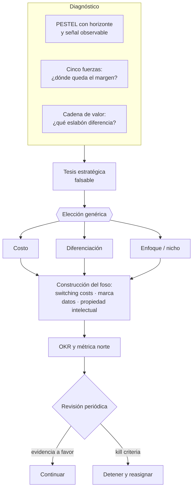

# Parte 04 — Estrategia y ventaja competitiva

> *Elegir dónde competir importa más que competir bien en el lugar equivocado*

🟢 **Etapa 1 — Antes de que la empresa exista** · salida de la etapa: Tesis validada con evidencia primaria

**Estado de evidencia:** `GUIA-PRACTICA` · **Clases:** 14 (043–056) · **Fecha base normativa:** 07-08-2026 
**Contenido central:** PESTEL, cinco fuerzas, cadena de valor, ventaja defendible, nicho, OKR, roadmap y kill criteria 
**Conceptos definidos en esta parte:** 56

## 🎯 De qué trata esta parte

Estrategia es elegir qué no hacer y sostener una posición que otros no puedan copiar barato. Esta parte se ocupa primero del diagnóstico —estructura de la industria, cadena de valor, entorno— porque una empresa excelente en una industria sin margen estructural obtiene resultados mediocres, y una mediocre en una industria protegida obtiene buenos resultados. El diagnóstico decide antes que el esfuerzo.

La pieza que más suele faltar es la tesis estratégica: un enunciado falsable sobre cómo cambiará el mercado y por qué esta empresa está mejor situada. A diferencia de la visión, la tesis se contrasta con hechos y se actualiza. Para una empresa chilena en 2026 la tesis debe incorporar cambios con fecha cierta —la vigencia de la Ley 21.719 el 1 de diciembre, la jornada de 42 horas desde abril, el catálogo ampliado de la Ley 21.595—, porque son alteraciones del entorno que ya están calendarizadas.

La parte termina donde casi ningún programa se atreve: los criterios para matar una apuesta. Sin kill criteria escritos antes de conocer el resultado, toda evidencia se reinterpreta como alentadora y la empresa financia indefinidamente algo que ya murió.

## 📚 Resultados de la parte

Al terminar esta parte podrás:

1. **Diagnosticar la estructura de la industria y dónde queda el margen**.
2. **Identificar qué ventaja es real y cuál es solo una ventaja temporal de ejecución**.
3. **Traducir estrategia en OKR y métricas norte verificables**.
4. **Definir kill criteria antes de comprometerse con una apuesta**.

## 🗺️ Mapa de la parte

## ⚖️ Marco aplicable

- PESTEL, cinco fuerzas, cadena de valor y estrategias genéricas
- opciones reales para decisiones bajo incertidumbre
- OKR y métrica norte como sistema de dirección

**Autoridades o contrapartes:** FNE en materias de competencia, CMF para sociedades supervisadas.
**Profesionales de apoyo:** fundador o directorio, consultor de estrategia, control de gestión.

## ⚠️ Riesgos característicos

- Declarar una ventaja competitiva que en realidad es solo precio bajo insostenible.
- Definir okr que miden actividad y no resultado.
- Revisar la estrategia solo cuando ya hay crisis de caja.
- No fijar criterios de abandono y financiar indefinidamente una apuesta muerta.

## 📘 Las 14 clases

| # | Global | Clase | Decisión que habilita |
|---:|---:|---|---|
| 01 | 043 | [Misión, visión, propósito y tesis estratégica](class-01-mision-vision-proposito-y-tesis-estrategica/README.md) | declarar la apuesta sobre el futuro del mercado que justifica la estrategia |
| 02 | 044 | [Análisis PESTEL](class-02-analisis-pestel/README.md) | identificar qué factores del entorno exigen preparación y en qué plazo |
| 03 | 045 | [Cinco fuerzas y estructura competitiva](class-03-cinco-fuerzas-y-estructura-competitiva/README.md) | decidir si la estructura de la industria admite el margen que el negocio necesita |
| 04 | 046 | [Cadena de valor](class-04-cadena-de-valor/README.md) | definir qué eslabones se internalizan y cuáles se externalizan |
| 05 | 047 | [Ventaja por costo, diferenciación y enfoque](class-05-ventaja-por-costo-diferenciacion-y-enfoque/README.md) | elegir una estrategia genérica y aceptar lo que implica renunciar |
| 06 | 048 | [Efectos de red y economías de escala](class-06-efectos-de-red-y-economias-de-escala/README.md) | determinar si existe efecto de red real y a qué nivel opera |
| 07 | 049 | [Switching costs, marca, datos y propiedad intelectual](class-07-switching-costs-marca-datos-y-propiedad-intelectual/README.md) | decidir qué defensa se construye y con qué inversión |
| 08 | 050 | [Estrategia de nicho y beachhead market](class-08-estrategia-de-nicho-y-beachhead-market/README.md) | elegir el segmento inicial donde la empresa puede ser la opción por defecto |
| 09 | 051 | [Posicionamiento estratégico](class-09-posicionamiento-estrategico/README.md) | elegir la categoría de comparación y el punto de diferencia dentro de ella |
| 10 | 052 | [Portafolio de apuestas y opciones reales](class-10-portafolio-de-apuestas-y-opciones-reales/README.md) | decidir qué apuestas se mantienen como opción y cuáles se ejercen |
| 11 | 053 | [OKR, KPI y métricas norte](class-11-okr-kpi-y-metricas-norte/README.md) | definir la métrica norte y los resultados clave del período |
| 12 | 054 | [Roadmap estratégico de 12, 36 y 60 meses](class-12-roadmap-estrategico-de-12-36-y-60-meses/README.md) | secuenciar las apuestas según dependencias y capacidad real |
| 13 | 055 | [Escenarios y señales tempranas](class-13-escenarios-y-senales-tempranas/README.md) | definir escenarios relevantes, sus señales y la respuesta preparada |
| 14 | 056 | [Revisión estratégica y kill criteria](class-14-revision-estrategica-y-kill-criteria/README.md) | decidir qué iniciativas continúan, cuáles se ajustan y cuáles se detienen |

## 🔤 Glosario de la parte

| Concepto | Definición operacional |
|---|---|
| **Actividad de apoyo** | La que habilita a las primarias: personas, tecnología, compras, infraestructura. |
| **Actividad primaria** | La que participa directamente en producir y entregar. |
| **Amenaza de sustitutos** | Riesgo de que otra forma de resolver el job desplace a la industria. |
| **Barrera de entrada** | Costo o requisito que dificulta el ingreso de nuevos competidores. |
| **Beachhead** | Segmento inicial acotado que se puede dominar. |
| **Cadena de valor** | Secuencia de actividades que transforman insumos en valor entregado. |
| **Capacidad comprometida** | Recursos ya asignados que limitan lo que se puede agregar. |
| **Costo de la opción** | Gasto necesario para mantener abierta la posibilidad. |
| **Costo hundido** | Inversión pasada irrecuperable que no debe influir en la decisión. |
| **Dato propietario** | Información acumulada que mejora el servicio y no es replicable. |
| **Dependencia** | Condición que debe cumplirse antes de iniciar el hito siguiente. |
| **Diferenciación** | Atributo valorado que permite cobrar más. |
| **Dominancia** | Participación suficiente para ser la opción por defecto del segmento. |
| **Economía de escala** | El costo unitario baja al aumentar el volumen. |
| **Efecto de red** | El valor aumenta con la cantidad de usuarios. |
| **Efecto de red local** | El efecto opera por zona o vertical y no globalmente. |
| **Ejercicio** | Decisión de invertir en serio cuando la incertidumbre bajó. |
| **Enfoque** | Concentración en un segmento donde la empresa es la mejor opción. |
| **Escenario** | Descripción coherente de un futuro posible con sus implicancias. |
| **Expansión adyacente** | Paso al segmento contiguo apoyado en la posición ganada. |
| **Factor accionable** | Elemento del entorno sobre el que la empresa puede prepararse. |
| **Horizonte** | Plazo en el que el factor se vuelve relevante. |
| **Horizonte 1, 2 y 3** | Operación actual, expansión próxima y apuesta lejana. |
| **Kill criteria** | Condición predefinida que obliga a detener una iniciativa. |
| **KPI** | Indicador que monitorea la salud de un proceso permanente. |
| **Marca** | Asociación mental que reduce el riesgo percibido de comprar. |
| **Marco de referencia** | Categoría con la que el cliente compara. |
| **Margen por eslabón** | Contribución que aporta cada actividad al valor final. |
| **Masa crítica** | Volumen mínimo desde el que el efecto se vuelve autosostenido. |
| **Misión** | Qué hace la empresa y para quién, en presente. |
| **Métrica de vanidad** | Indicador que sube sin relación con el resultado del negocio. |
| **Métrica norte** | El número que mejor resume el valor entregado al cliente. |
| **Nicho** | Mercado con necesidad específica y competencia limitada. |
| **OKR** | Objetivo cualitativo con resultados clave medibles en un período. |
| **Opción real** | Inversión pequeña que compra el derecho a invertir más tarde. |
| **PESTEL** | Análisis de entorno político, económico, social, tecnológico, ecológico y legal. |
| **Plan de contingencia** | Respuesta preparada para un escenario específico. |
| **Poder de negociación** | Capacidad de una parte de imponer condiciones. |
| **Portafolio de apuestas** | Conjunto de iniciativas con distinto riesgo y horizonte. |
| **Posicionamiento** | Lugar que la oferta ocupa en la mente del cliente frente a alternativas. |
| **Posición intermedia** | Riesgo de no ser ni el más barato ni el más valorado. |
| **Propiedad intelectual** | Derecho registrado que impide la copia legal. |
| **Propósito** | Razón por la que la empresa merece existir más allá del lucro. |
| **Prueba de posicionamiento** | Evidencia que hace creíble la afirmación. |
| **Punto de diferencia** | Atributo que distingue dentro de esa categoría. |
| **Punto de no retorno** | Momento a partir del cual la respuesta ya no es efectiva. |
| **Reasignación** | Traslado de recursos desde una apuesta detenida a otra. |
| **Revisión estratégica** | Instancia periódica de evaluación de la tesis y las apuestas. |
| **Rivalidad** | Intensidad de la competencia entre los actores existentes. |
| **Roadmap estratégico** | Secuencia de apuestas con hitos y dependencias. |
| **Señal** | Indicador observable de que el factor se está materializando. |
| **Señal temprana** | Indicador observable de que un escenario se está materializando. |
| **Switching cost** | Costo para el cliente de cambiarse a otro proveedor. |
| **Tesis estratégica** | Apuesta explícita sobre cómo cambiará el mercado y por qué esta empresa gana. |
| **Ventaja en costo** | Capacidad estructural de producir más barato que el competidor. |
| **Visión** | Estado futuro al que aspira en un horizonte declarado. |

## 🔗 Cómo se conecta

Toma el modelo de la parte 03 y le añade defensa y dirección. Entrega a la parte 20 el roadmap que el escalamiento ejecuta, y a la parte 21 los escenarios que la gestión de crisis convierte en planes de contingencia.

## 📖 Pauta bibliográfica

- Porter, M. — *Competitive Strategy* y *Competitive Advantage*: estructura de industria, cadena de valor y estrategias genéricas.
- Rumelt, R. — *Good Strategy / Bad Strategy*: la diferencia entre estrategia y lista de aspiraciones.
- Doerr, J. — *Measure What Matters*: OKR como sistema de dirección, no de control.

## 🏛️ Fuentes oficiales de la parte

**Biblioteca del Congreso Nacional · LeyChile — Normativa oficial consolidada**  
<https://www.bcn.cl/leychile/> · verificado 2026-08-07

- *Qué contiene:* Publica el texto oficial y consolidado de leyes, decretos y reglamentos, con la versión vigente a una fecha, el historial de modificaciones y la tramitación que las originó.
- *Cómo leerla:* Usa siempre el selector de versión vigente a la fecha en que ejecutarás el trámite, no la última publicada. Y lee el artículo transitorio: en normas en implantación gradual —jornada, datos personales— ahí está la fecha que realmente te aplica.

**Corporación de Fomento de la Producción — Innovación, inversión y garantías**  
<https://www.corfo.cl/> · verificado 2026-08-07

- *Qué contiene:* Reúne los instrumentos de fomento a la innovación y la inversión, incluidos programas de capital semilla, escalamiento, garantías y cobertura de riesgo para el sistema financiero.
- *Cómo leerla:* Filtra por etapa de la empresa antes que por monto. Y verifica el componente de innovación que exige cada instrumento: presentar una expansión comercial como innovación es la causa más común de rechazo.

---

| Anterior | Índice | Siguiente |
|---|---|---|
| [← Parte 03 · Modelos de negocio y líneas de ingreso](../part-03-modelos-de-negocio-y-lineas-de-ingreso/README.md) | [Currículo](../../CURRICULUM.md) · [Programa](../../README.md) | [Parte 05 · Diseño societario y gobierno inicial →](../part-05-diseno-societario-y-gobierno-inicial/README.md) |
