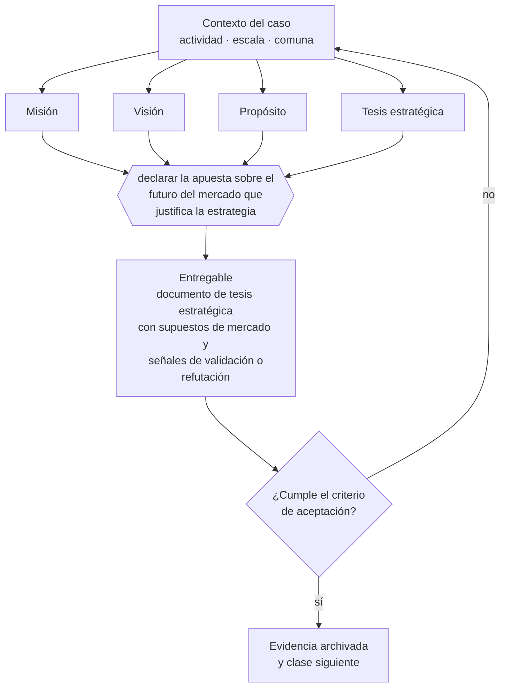

# Clase 043 — Misión, visión, propósito y tesis estratégica

> **Parte 04 · Estrategia y ventaja competitiva** — clase 1 de 14

**Estado de evidencia:** `GUIA-PRACTICA` · **Jurisdicción:** Chile-first · **Fecha base normativa:** 07-08-2026 
**Decisión que habilita:** declarar la apuesta sobre el futuro del mercado que justifica la estrategia 
**Entregable:** documento de tesis estratégica con supuestos de mercado y señales de validación o refutación

## 🎯 Propósito

Redactar la pieza que casi siempre falta: una tesis estratégica falsable sobre cómo cambiará el mercado y por qué esta empresa está mejor situada.

## 📚 Resultados de aprendizaje

Al finalizar esta clase podrás:

1. **Definir** con precisión los cuatro conceptos de la tabla siguiente y usarlos para describir un caso real.
2. **Explicar** por qué esta materia condiciona decisiones de otras partes del programa.
3. **Decidir** —declarar la apuesta sobre el futuro del mercado que justifica la estrategia— y justificar la decisión por escrito.
4. **Producir** el entregable de la clase y contrastarlo contra su criterio de aceptación.
5. **Distinguir** el dato estable del dato dinámico que exige revalidación en la fuente oficial.

## 🧩 Conceptos centrales

| Concepto | Comprensión verificable |
|---|---|
| **Misión** | Qué hace la empresa y para quién, en presente. |
| **Visión** | Estado futuro al que aspira en un horizonte declarado. |
| **Propósito** | Razón por la que la empresa merece existir más allá del lucro. |
| **Tesis estratégica** | Apuesta explícita sobre cómo cambiará el mercado y por qué esta empresa gana. |

## 🗺️ Flujo de razonamiento

## 📖 Desarrollo

### 1. El fondo del asunto

La tesis estratégica es la pieza útil y la que casi siempre falta: un enunciado falsable sobre cómo evolucionará el mercado y por qué esta empresa está mejor posicionada. A diferencia de la visión, la tesis se puede revisar contra hechos y actualizar cuando la realidad la contradice.

### 2. Cómo se traduce en la práctica

A diferencia de la visión, la tesis se contrasta con hechos y se actualiza. Para una empresa chilena en 2026 debe incorporar cambios con fecha cierta: la vigencia de la Ley 21.719 el 1 de diciembre, la jornada de 42 horas desde abril y el catálogo ampliado de la Ley 21.595. Son alteraciones del entorno ya calendarizadas.

### 3. Marco aplicable y quién interviene

- PESTEL, cinco fuerzas, cadena de valor y estrategias genéricas
- opciones reales para decisiones bajo incertidumbre
- OKR y métrica norte como sistema de dirección

**Autoridades o contrapartes involucradas:** FNE en materias de competencia, CMF para sociedades supervisadas.
**Profesionales de apoyo:** fundador o directorio, consultor de estrategia, control de gestión. La participación concreta depende del riesgo, del
tamaño de la empresa y de la actividad económica.

## 🧪 Taller guiado

Aplica esta clase a **una** de las siguientes líneas de negocio y repite después el ejercicio con
una segunda línea de carga regulatoria distinta:

| Línea | Carga regulatoria |
|---|---|
| SaaS B2B con IA | media |
| Servicios profesionales | baja |
| E-commerce D2C | media |
| Alimentos o foodtech | alta |
| Exportación de servicios | media |
| Fintech regulada | alta |
| Construcción o servicios técnicos | alta |

**Secuencia de trabajo:**

1. Delimita el contexto: actividad económica, escala, comuna y etapa de la empresa.
2. Reúne los antecedentes que la decisión exige y anota la fecha de cada fuente.
3. Identifica las alternativas reales, incluida la de no hacer nada.
4. Evalúa el impacto en mercado, caja, personas, regulación y operación.
5. Toma la decisión y regístrala con sus supuestos.
6. Produce el entregable.
7. Contrástalo contra el criterio de aceptación.
8. Anota lo que requiere validación profesional y programa su revisión.

### 📦 Entregable

Documento de tesis estratégica con supuestos de mercado y señales de validación o refutación.

Debe incluir decisión, supuestos, fuentes con fecha de consulta, responsable, riesgos
identificados y próximos pasos.

## 🏆 Reto verificable

Resuelve la misma materia para una segunda línea de negocio con distinta carga regulatoria y
explica por escrito **qué cambió, por qué y qué fuente lo determina**.

## ✅ Criterio de aceptación

- [ ] la tesis contiene supuestos verificables sobre el mercado
- [ ] hay señales definidas que la refutarían
- [ ] cada afirmación regulatoria está referida a una fuente oficial con fecha de consulta;
- [ ] los datos dinámicos quedan marcados para revalidación;
- [ ] hay un responsable asignado y evidencia reproducible del trabajo.

## ⚠️ Errores frecuentes

**Propios de esta clase:**

- Confundir una declaración inspiradora con una tesis verificable.
- No revisar nunca la tesis cuando el mercado cambia.

**Característicos de la parte 04:**

- Declarar una ventaja competitiva que en realidad es solo precio bajo insostenible.
- Definir okr que miden actividad y no resultado.

## 🇨🇱 Checklist Chile

- [ ] ¿existe norma o autoridad específica para esta materia?
- [ ] ¿la fuente consultada está vigente a la fecha de ejecución?
- [ ] ¿se activa algún trámite ante el SII?
- [ ] ¿se activa algún requisito municipal o sectorial?
- [ ] ¿afecta a consumidores o al tratamiento de datos personales?
- [ ] ¿afecta a trabajadores o a la seguridad y salud en el trabajo?
- [ ] ¿afecta a impuestos, contabilidad o caja?
- [ ] ¿afecta a contratos o a propiedad intelectual?
- [ ] ¿requiere renovación, reporte periódico o revalidación?

## ❓ Preguntas de comprobación

1. ¿Qué supuesto sobre el futuro del mercado sostiene tu estrategia?
2. ¿Qué señal observable te indicaría que esa tesis es falsa?
3. ¿Cuándo revisaste tu tesis por última vez contra hechos, no contra deseos?

## 🔗 Fuentes oficiales

**Biblioteca del Congreso Nacional · LeyChile — Normativa oficial consolidada**  
<https://www.bcn.cl/leychile/> · verificado 2026-08-19

- *Qué contiene:* Publica el texto oficial y consolidado de leyes, decretos y reglamentos, con la versión vigente a una fecha, el historial de modificaciones y la tramitación que las originó.
- *Cómo leerla:* Usa siempre el selector de versión vigente a la fecha en que ejecutarás el trámite, no la última publicada. Y lee el artículo transitorio: en normas en implantación gradual —jornada, datos personales— ahí está la fecha que realmente te aplica.
- *Uso en esta clase:* aporta el marco de «Normativa oficial consolidada» para declarar la apuesta sobre el futuro del mercado que justifica la estrategia.

**Corporación de Fomento de la Producción — Innovación, inversión y garantías**  
<https://www.corfo.cl/> · verificado 2026-08-19

- *Qué contiene:* Reúne los instrumentos de fomento a la innovación y la inversión, incluidos programas de capital semilla, escalamiento, garantías y cobertura de riesgo para el sistema financiero.
- *Cómo leerla:* Filtra por etapa de la empresa antes que por monto. Y verifica el componente de innovación que exige cada instrumento: presentar una expansión comercial como innovación es la causa más común de rechazo.
- *Uso en esta clase:* aporta el marco de «Innovación, inversión y garantías» para declarar la apuesta sobre el futuro del mercado que justifica la estrategia.

Complementos del repositorio: [glosario](../../../docs/19_GLOSSARY.md) ·
[ruta de lecturas](../../../docs/15_BOOKS_AND_LEARNING_PATH.md) ·
[catálogo de fuentes](../../../docs/16_OFFICIAL_SOURCE_CATALOG.md).

> [!IMPORTANT]
> Material educativo. Para una decisión real de alto impacto hay que verificar la fuente oficial
> vigente y validar con el profesional competente.

---

| Anterior | Índice | Siguiente |
|---|---|---|
| **Inicio de la parte** | [Parte 04](../README.md) · [Programa](../../../README.md) | [044 · Análisis PESTEL →](../class-02-analisis-pestel/README.md) |
