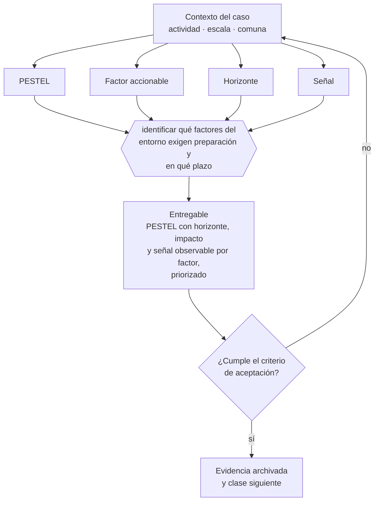

# Clase 044 — Análisis PESTEL

> **Parte 04 · Estrategia y ventaja competitiva** — clase 2 de 14

**Estado de evidencia:** `GUIA-PRACTICA` · **Jurisdicción:** Chile-first · **Fecha base normativa:** 07-08-2026 
**Decisión que habilita:** identificar qué factores del entorno exigen preparación y en qué plazo 
**Entregable:** PESTEL con horizonte, impacto y señal observable por factor, priorizado

## 🎯 Propósito

Convertir el análisis de entorno en algo accionable dándole a cada factor un horizonte, un impacto estimado y una señal observable.

## 📚 Resultados de aprendizaje

Al finalizar esta clase podrás:

1. **Definir** con precisión los cuatro conceptos de la tabla siguiente y usarlos para describir un caso real.
2. **Explicar** por qué esta materia condiciona decisiones de otras partes del programa.
3. **Decidir** —identificar qué factores del entorno exigen preparación y en qué plazo— y justificar la decisión por escrito.
4. **Producir** el entregable de la clase y contrastarlo contra su criterio de aceptación.
5. **Distinguir** el dato estable del dato dinámico que exige revalidación en la fuente oficial.

## 🧩 Conceptos centrales

| Concepto | Comprensión verificable |
|---|---|
| **PESTEL** | Análisis de entorno político, económico, social, tecnológico, ecológico y legal. |
| **Factor accionable** | Elemento del entorno sobre el que la empresa puede prepararse. |
| **Horizonte** | Plazo en el que el factor se vuelve relevante. |
| **Señal** | Indicador observable de que el factor se está materializando. |

## 🗺️ Flujo de razonamiento

## 📖 Desarrollo

### 1. El fondo del asunto

Un PESTEL sirve solo si cada factor tiene horizonte, impacto estimado y señal observable. Para una empresa chilena en 2026 los factores legales relevantes incluyen la entrada en vigencia de la Ley 21.719 de datos personales, la reducción de jornada a 42 horas y la Ley 21.595 de delitos económicos.

### 2. Cómo se traduce en la práctica

Un PESTEL sin esos tres campos es una lista de temas de actualidad. Los factores legales con fecha cierta son los más fáciles de trabajar porque el horizonte ya está dado: basta contar hacia atrás desde la vigencia para saber cuándo debe estar lista la adecuación.

### 3. Marco aplicable y quién interviene

- PESTEL, cinco fuerzas, cadena de valor y estrategias genéricas
- opciones reales para decisiones bajo incertidumbre
- OKR y métrica norte como sistema de dirección

**Autoridades o contrapartes involucradas:** FNE en materias de competencia, CMF para sociedades supervisadas.
**Profesionales de apoyo:** fundador o directorio, consultor de estrategia, control de gestión. La participación concreta depende del riesgo, del
tamaño de la empresa y de la actividad económica.

## 🧪 Taller guiado

Aplica esta clase a **una** de las siguientes líneas de negocio y repite después el ejercicio con
una segunda línea de carga regulatoria distinta:

| Línea | Carga regulatoria |
|---|---|
| SaaS B2B con IA | media |
| Servicios profesionales | baja |
| E-commerce D2C | media |
| Alimentos o foodtech | alta |
| Exportación de servicios | media |
| Fintech regulada | alta |
| Construcción o servicios técnicos | alta |

**Secuencia de trabajo:**

1. Delimita el contexto: actividad económica, escala, comuna y etapa de la empresa.
2. Reúne los antecedentes que la decisión exige y anota la fecha de cada fuente.
3. Identifica las alternativas reales, incluida la de no hacer nada.
4. Evalúa el impacto en mercado, caja, personas, regulación y operación.
5. Toma la decisión y regístrala con sus supuestos.
6. Produce el entregable.
7. Contrástalo contra el criterio de aceptación.
8. Anota lo que requiere validación profesional y programa su revisión.

### 📦 Entregable

Pestel con horizonte, impacto y señal observable por factor, priorizado.

Debe incluir decisión, supuestos, fuentes con fecha de consulta, responsable, riesgos
identificados y próximos pasos.

## 🏆 Reto verificable

Resuelve la misma materia para una segunda línea de negocio con distinta carga regulatoria y
explica por escrito **qué cambió, por qué y qué fuente lo determina**.

## ✅ Criterio de aceptación

- [ ] cada factor tiene horizonte, impacto y señal observable
- [ ] los cambios normativos con fecha están incluidos
- [ ] cada afirmación regulatoria está referida a una fuente oficial con fecha de consulta;
- [ ] los datos dinámicos quedan marcados para revalidación;
- [ ] hay un responsable asignado y evidencia reproducible del trabajo.

## ⚠️ Errores frecuentes

**Propios de esta clase:**

- Listar factores genéricos sin impacto ni horizonte para la empresa concreta.
- Ignorar cambios normativos con fecha cierta de vigencia.

**Característicos de la parte 04:**

- Declarar una ventaja competitiva que en realidad es solo precio bajo insostenible.
- Definir okr que miden actividad y no resultado.

## 🇨🇱 Checklist Chile

- [ ] ¿existe norma o autoridad específica para esta materia?
- [ ] ¿la fuente consultada está vigente a la fecha de ejecución?
- [ ] ¿se activa algún trámite ante el SII?
- [ ] ¿se activa algún requisito municipal o sectorial?
- [ ] ¿afecta a consumidores o al tratamiento de datos personales?
- [ ] ¿afecta a trabajadores o a la seguridad y salud en el trabajo?
- [ ] ¿afecta a impuestos, contabilidad o caja?
- [ ] ¿afecta a contratos o a propiedad intelectual?
- [ ] ¿requiere renovación, reporte periódico o revalidación?

## ❓ Preguntas de comprobación

1. ¿Qué factor del entorno tiene fecha cierta y aún no tiene plan asociado?
2. ¿Cuál es la señal observable de que un factor se está materializando?
3. ¿Quién vigila cada señal y con qué frecuencia?

## 🔗 Fuentes oficiales

**Biblioteca del Congreso Nacional · LeyChile — Normativa oficial consolidada**  
<https://www.bcn.cl/leychile/> · verificado 2026-08-19

- *Qué contiene:* Publica el texto oficial y consolidado de leyes, decretos y reglamentos, con la versión vigente a una fecha, el historial de modificaciones y la tramitación que las originó.
- *Cómo leerla:* Usa siempre el selector de versión vigente a la fecha en que ejecutarás el trámite, no la última publicada. Y lee el artículo transitorio: en normas en implantación gradual —jornada, datos personales— ahí está la fecha que realmente te aplica.
- *Uso en esta clase:* aporta el marco de «Normativa oficial consolidada» para identificar qué factores del entorno exigen preparación y en qué plazo.

**Dirección del Trabajo — Relaciones laborales y obligaciones del empleador**  
<https://www.dt.gob.cl/> · verificado 2026-08-19

- *Qué contiene:* Concentra el Código del Trabajo aplicado: dictámenes que interpretan la norma en casos concretos, la plataforma Mi DT para registrar contratos y finiquitos, y las guías de fiscalización.
- *Cómo leerla:* Los dictámenes valen más que las guías divulgativas: describen cómo la autoridad resolvió un caso real. Busca por materia y contrasta la fecha, porque un dictamen posterior puede cambiar el criterio anterior.
- *Uso en esta clase:* aporta el marco de «Relaciones laborales y obligaciones del empleador» para identificar qué factores del entorno exigen preparación y en qué plazo.

Complementos del repositorio: [glosario](../../../docs/19_GLOSSARY.md) ·
[ruta de lecturas](../../../docs/15_BOOKS_AND_LEARNING_PATH.md) ·
[catálogo de fuentes](../../../docs/16_OFFICIAL_SOURCE_CATALOG.md).

> [!IMPORTANT]
> Material educativo. Para una decisión real de alto impacto hay que verificar la fuente oficial
> vigente y validar con el profesional competente.

---

| Anterior | Índice | Siguiente |
|---|---|---|
| [← 043 · Misión, visión, propósito y tesis estratégica](../class-01-mision-vision-proposito-y-tesis-estrategica/README.md) | [Parte 04](../README.md) · [Programa](../../../README.md) | [045 · Cinco fuerzas y estructura competitiva →](../class-03-cinco-fuerzas-y-estructura-competitiva/README.md) |
