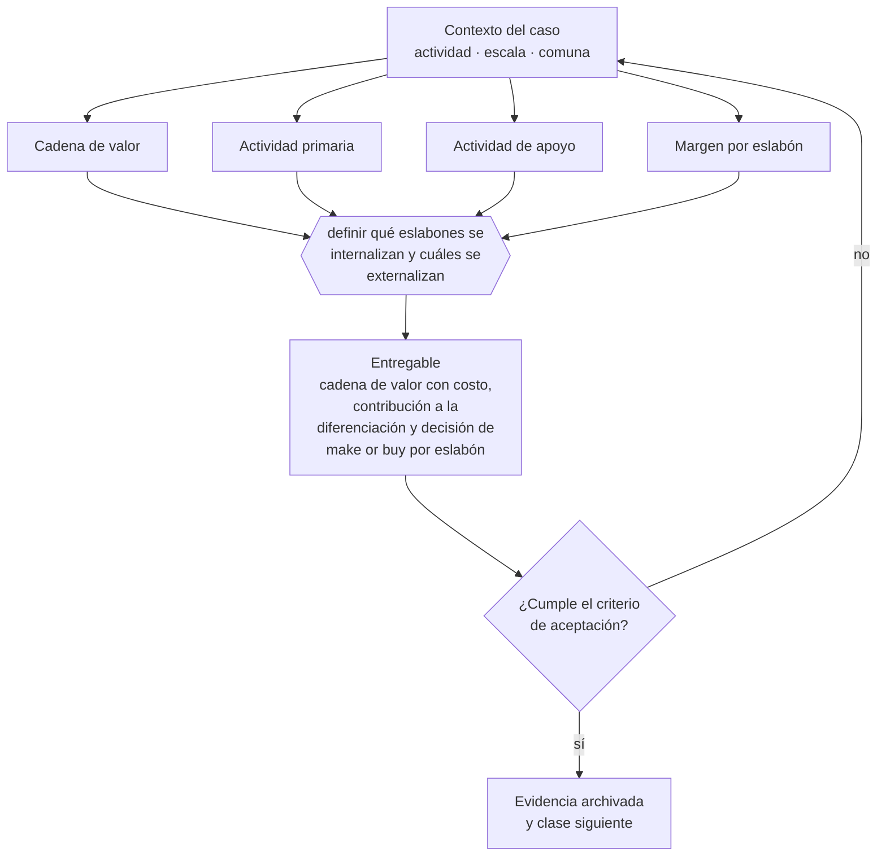

# Clase 046 — Cadena de valor

> **Parte 04 · Estrategia y ventaja competitiva** — clase 4 de 14

**Estado de evidencia:** `GUIA-PRACTICA` · **Jurisdicción:** Chile-first · **Fecha base normativa:** 07-08-2026 
**Decisión que habilita:** definir qué eslabones se internalizan y cuáles se externalizan 
**Entregable:** cadena de valor con costo, contribución a la diferenciación y decisión de make or buy por eslabón

## 🎯 Propósito

Decidir qué eslabones se internalizan y cuáles se externalizan, con la regla de no externalizar lo que sostiene la diferenciación.

## 📚 Resultados de aprendizaje

Al finalizar esta clase podrás:

1. **Definir** con precisión los cuatro conceptos de la tabla siguiente y usarlos para describir un caso real.
2. **Explicar** por qué esta materia condiciona decisiones de otras partes del programa.
3. **Decidir** —definir qué eslabones se internalizan y cuáles se externalizan— y justificar la decisión por escrito.
4. **Producir** el entregable de la clase y contrastarlo contra su criterio de aceptación.
5. **Distinguir** el dato estable del dato dinámico que exige revalidación en la fuente oficial.

## 🧩 Conceptos centrales

| Concepto | Comprensión verificable |
|---|---|
| **Cadena de valor** | Secuencia de actividades que transforman insumos en valor entregado. |
| **Actividad primaria** | La que participa directamente en producir y entregar. |
| **Actividad de apoyo** | La que habilita a las primarias: personas, tecnología, compras, infraestructura. |
| **Margen por eslabón** | Contribución que aporta cada actividad al valor final. |

## 🗺️ Flujo de razonamiento

## 📖 Desarrollo

### 1. El fondo del asunto

Mapear la cadena permite decidir qué actividades merecen inversión y cuáles conviene externalizar. La regla práctica es internalizar lo que sostiene la diferenciación y externalizar lo que es paridad de mercado, siempre que la externalización no cree una dependencia crítica sin alternativa.

### 2. Cómo se traduce en la práctica

La externalización por ahorro de corto plazo del eslabón diferenciador es reversible en el papel e irreversible en la práctica: cuando la empresa quiere recuperarlo ya perdió el equipo, el conocimiento y la relación con el cliente. La parte 13 aporta el criterio de costo total de propiedad para decidirlo con números.

### 3. Marco aplicable y quién interviene

- PESTEL, cinco fuerzas, cadena de valor y estrategias genéricas
- opciones reales para decisiones bajo incertidumbre
- OKR y métrica norte como sistema de dirección

**Autoridades o contrapartes involucradas:** FNE en materias de competencia, CMF para sociedades supervisadas.
**Profesionales de apoyo:** fundador o directorio, consultor de estrategia, control de gestión. La participación concreta depende del riesgo, del
tamaño de la empresa y de la actividad económica.

## 🧪 Taller guiado

Aplica esta clase a **una** de las siguientes líneas de negocio y repite después el ejercicio con
una segunda línea de carga regulatoria distinta:

| Línea | Carga regulatoria |
|---|---|
| SaaS B2B con IA | media |
| Servicios profesionales | baja |
| E-commerce D2C | media |
| Alimentos o foodtech | alta |
| Exportación de servicios | media |
| Fintech regulada | alta |
| Construcción o servicios técnicos | alta |

**Secuencia de trabajo:**

1. Delimita el contexto: actividad económica, escala, comuna y etapa de la empresa.
2. Reúne los antecedentes que la decisión exige y anota la fecha de cada fuente.
3. Identifica las alternativas reales, incluida la de no hacer nada.
4. Evalúa el impacto en mercado, caja, personas, regulación y operación.
5. Toma la decisión y regístrala con sus supuestos.
6. Produce el entregable.
7. Contrástalo contra el criterio de aceptación.
8. Anota lo que requiere validación profesional y programa su revisión.

### 📦 Entregable

Cadena de valor con costo, contribución a la diferenciación y decisión de make or buy por eslabón.

Debe incluir decisión, supuestos, fuentes con fecha de consulta, responsable, riesgos
identificados y próximos pasos.

## 🏆 Reto verificable

Resuelve la misma materia para una segunda línea de negocio con distinta carga regulatoria y
explica por escrito **qué cambió, por qué y qué fuente lo determina**.

## ✅ Criterio de aceptación

- [ ] cada eslabón tiene decisión de make or buy justificada
- [ ] los eslabones que sostienen diferenciación están identificados
- [ ] cada afirmación regulatoria está referida a una fuente oficial con fecha de consulta;
- [ ] los datos dinámicos quedan marcados para revalidación;
- [ ] hay un responsable asignado y evidencia reproducible del trabajo.

## ⚠️ Errores frecuentes

**Propios de esta clase:**

- Externalizar el eslabón que sostiene la diferenciación por ahorro de corto plazo.
- Internalizar todo y perder foco y capital.

**Característicos de la parte 04:**

- Declarar una ventaja competitiva que en realidad es solo precio bajo insostenible.
- Definir okr que miden actividad y no resultado.

## 🇨🇱 Checklist Chile

- [ ] ¿existe norma o autoridad específica para esta materia?
- [ ] ¿la fuente consultada está vigente a la fecha de ejecución?
- [ ] ¿se activa algún trámite ante el SII?
- [ ] ¿se activa algún requisito municipal o sectorial?
- [ ] ¿afecta a consumidores o al tratamiento de datos personales?
- [ ] ¿afecta a trabajadores o a la seguridad y salud en el trabajo?
- [ ] ¿afecta a impuestos, contabilidad o caja?
- [ ] ¿afecta a contratos o a propiedad intelectual?
- [ ] ¿requiere renovación, reporte periódico o revalidación?

## ❓ Preguntas de comprobación

1. ¿Qué eslabón de tu cadena sostiene realmente tu diferenciación?
2. ¿Qué externalizaste que hoy te gustaría controlar y por qué lo cediste?
3. ¿Qué dependencia crítica sin alternativa creó tu última decisión de externalizar?

## 🔗 Fuentes oficiales

**Biblioteca del Congreso Nacional · LeyChile — Normativa oficial consolidada**  
<https://www.bcn.cl/leychile/> · verificado 2026-08-19

- *Qué contiene:* Publica el texto oficial y consolidado de leyes, decretos y reglamentos, con la versión vigente a una fecha, el historial de modificaciones y la tramitación que las originó.
- *Cómo leerla:* Usa siempre el selector de versión vigente a la fecha en que ejecutarás el trámite, no la última publicada. Y lee el artículo transitorio: en normas en implantación gradual —jornada, datos personales— ahí está la fecha que realmente te aplica.
- *Uso en esta clase:* aporta el marco de «Normativa oficial consolidada» para definir qué eslabones se internalizan y cuáles se externalizan.

**Corporación de Fomento de la Producción — Innovación, inversión y garantías**  
<https://www.corfo.cl/> · verificado 2026-08-19

- *Qué contiene:* Reúne los instrumentos de fomento a la innovación y la inversión, incluidos programas de capital semilla, escalamiento, garantías y cobertura de riesgo para el sistema financiero.
- *Cómo leerla:* Filtra por etapa de la empresa antes que por monto. Y verifica el componente de innovación que exige cada instrumento: presentar una expansión comercial como innovación es la causa más común de rechazo.
- *Uso en esta clase:* aporta el marco de «Innovación, inversión y garantías» para definir qué eslabones se internalizan y cuáles se externalizan.

Complementos del repositorio: [glosario](../../../docs/19_GLOSSARY.md) ·
[ruta de lecturas](../../../docs/15_BOOKS_AND_LEARNING_PATH.md) ·
[catálogo de fuentes](../../../docs/16_OFFICIAL_SOURCE_CATALOG.md).

> [!IMPORTANT]
> Material educativo. Para una decisión real de alto impacto hay que verificar la fuente oficial
> vigente y validar con el profesional competente.

---

| Anterior | Índice | Siguiente |
|---|---|---|
| [← 045 · Cinco fuerzas y estructura competitiva](../class-03-cinco-fuerzas-y-estructura-competitiva/README.md) | [Parte 04](../README.md) · [Programa](../../../README.md) | [047 · Ventaja por costo, diferenciación y enfoque →](../class-05-ventaja-por-costo-diferenciacion-y-enfoque/README.md) |
