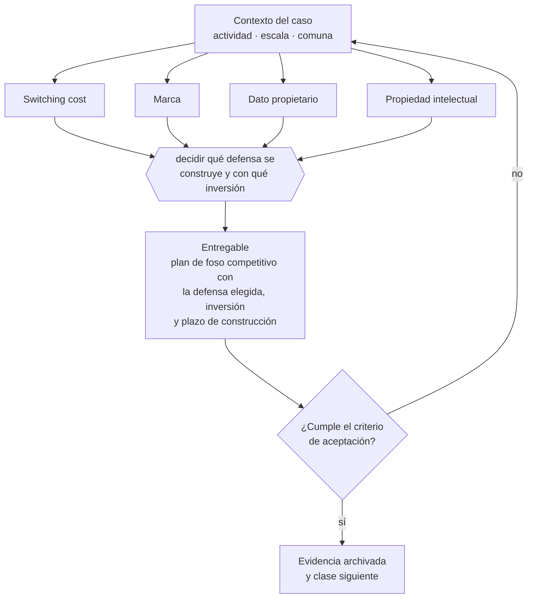

# Clase 049 — Switching costs, marca, datos y propiedad intelectual

> **Parte 04 · Estrategia y ventaja competitiva** — clase 7 de 14

**Estado de evidencia:** `GUIA-PRACTICA` · **Jurisdicción:** Chile-first · **Fecha base normativa:** 07-08-2026 
**Decisión que habilita:** decidir qué defensa se construye y con qué inversión 
**Entregable:** plan de foso competitivo con la defensa elegida, inversión y plazo de construcción

## 🎯 Propósito

Decidir deliberadamente qué defensa se construye, porque ninguna aparece sola y el producto superior no es defensa suficiente.

## 📚 Resultados de aprendizaje

Al finalizar esta clase podrás:

1. **Definir** con precisión los cuatro conceptos de la tabla siguiente y usarlos para describir un caso real.
2. **Explicar** por qué esta materia condiciona decisiones de otras partes del programa.
3. **Decidir** —decidir qué defensa se construye y con qué inversión— y justificar la decisión por escrito.
4. **Producir** el entregable de la clase y contrastarlo contra su criterio de aceptación.
5. **Distinguir** el dato estable del dato dinámico que exige revalidación en la fuente oficial.

## 🧩 Conceptos centrales

| Concepto | Comprensión verificable |
|---|---|
| **Switching cost** | Costo para el cliente de cambiarse a otro proveedor. |
| **Marca** | Asociación mental que reduce el riesgo percibido de comprar. |
| **Dato propietario** | Información acumulada que mejora el servicio y no es replicable. |
| **Propiedad intelectual** | Derecho registrado que impide la copia legal. |

## 🗺️ Flujo de razonamiento

## 📖 Desarrollo

### 1. El fondo del asunto

Las defensas duraderas se construyen deliberadamente: integraciones que aumentan el costo de salida, datos que mejoran el servicio con el uso, marca registrada y contratos plurianuales. Ninguna aparece sola. La marca no registrada en INAPI no es una defensa: es una vulnerabilidad.

### 2. Cómo se traduce en la práctica

Integraciones que aumentan el costo de salida, datos que mejoran el servicio con el uso, marca registrada y contratos plurianuales son construcciones que llevan tiempo y presupuesto. La marca no registrada en INAPI, en particular, no es una defensa sino una vulnerabilidad: cualquiera puede registrarla y exigir que dejes de usarla.

### 3. Marco aplicable y quién interviene

- PESTEL, cinco fuerzas, cadena de valor y estrategias genéricas
- opciones reales para decisiones bajo incertidumbre
- OKR y métrica norte como sistema de dirección

**Autoridades o contrapartes involucradas:** FNE en materias de competencia, CMF para sociedades supervisadas.
**Profesionales de apoyo:** fundador o directorio, consultor de estrategia, control de gestión. La participación concreta depende del riesgo, del
tamaño de la empresa y de la actividad económica.

## 🧪 Taller guiado

Aplica esta clase a **una** de las siguientes líneas de negocio y repite después el ejercicio con
una segunda línea de carga regulatoria distinta:

| Línea | Carga regulatoria |
|---|---|
| SaaS B2B con IA | media |
| Servicios profesionales | baja |
| E-commerce D2C | media |
| Alimentos o foodtech | alta |
| Exportación de servicios | media |
| Fintech regulada | alta |
| Construcción o servicios técnicos | alta |

**Secuencia de trabajo:**

1. Delimita el contexto: actividad económica, escala, comuna y etapa de la empresa.
2. Reúne los antecedentes que la decisión exige y anota la fecha de cada fuente.
3. Identifica las alternativas reales, incluida la de no hacer nada.
4. Evalúa el impacto en mercado, caja, personas, regulación y operación.
5. Toma la decisión y regístrala con sus supuestos.
6. Produce el entregable.
7. Contrástalo contra el criterio de aceptación.
8. Anota lo que requiere validación profesional y programa su revisión.

### 📦 Entregable

Plan de foso competitivo con la defensa elegida, inversión y plazo de construcción.

Debe incluir decisión, supuestos, fuentes con fecha de consulta, responsable, riesgos
identificados y próximos pasos.

## 🏆 Reto verificable

Resuelve la misma materia para una segunda línea de negocio con distinta carga regulatoria y
explica por escrito **qué cambió, por qué y qué fuente lo determina**.

## ✅ Criterio de aceptación

- [ ] la defensa elegida tiene plan de construcción con plazo
- [ ] el estado de registro de la marca está verificado
- [ ] cada afirmación regulatoria está referida a una fuente oficial con fecha de consulta;
- [ ] los datos dinámicos quedan marcados para revalidación;
- [ ] hay un responsable asignado y evidencia reproducible del trabajo.

## ⚠️ Errores frecuentes

**Propios de esta clase:**

- Confiar en que el producto superior es defensa suficiente.
- Operar una marca comercial sin registro en las clases relevantes.

**Característicos de la parte 04:**

- Declarar una ventaja competitiva que en realidad es solo precio bajo insostenible.
- Definir okr que miden actividad y no resultado.

## 🇨🇱 Checklist Chile

- [ ] ¿existe norma o autoridad específica para esta materia?
- [ ] ¿la fuente consultada está vigente a la fecha de ejecución?
- [ ] ¿se activa algún trámite ante el SII?
- [ ] ¿se activa algún requisito municipal o sectorial?
- [ ] ¿afecta a consumidores o al tratamiento de datos personales?
- [ ] ¿afecta a trabajadores o a la seguridad y salud en el trabajo?
- [ ] ¿afecta a impuestos, contabilidad o caja?
- [ ] ¿afecta a contratos o a propiedad intelectual?
- [ ] ¿requiere renovación, reporte periódico o revalidación?

## ❓ Preguntas de comprobación

1. ¿Qué defensa estás construyendo activamente y con qué inversión y plazo?
2. ¿Está tu marca registrada en las clases donde realmente operas?
3. ¿Cuánto tardaría un competidor con recursos en replicar tu ventaja actual?

## 🔗 Fuentes oficiales

**Instituto Nacional de Propiedad Industrial — Marcas, patentes y diseños industriales**  
<https://www.inapi.cl/> · verificado 2026-08-19

- *Qué contiene:* Administra el registro de marcas, patentes, diseños e indicaciones geográficas, y ofrece el buscador público de solicitudes y registros vigentes por clase.
- *Cómo leerla:* Empieza siempre por el buscador de anterioridades y por clases, no por el formulario de solicitud. Una marca disponible en tu clase puede estar tomada en la clase donde realmente operas, y eso solo se ve buscando por actividad.
- *Uso en esta clase:* aporta el marco de «Marcas, patentes y diseños industriales» para decidir qué defensa se construye y con qué inversión.

Complementos del repositorio: [glosario](../../../docs/19_GLOSSARY.md) ·
[ruta de lecturas](../../../docs/15_BOOKS_AND_LEARNING_PATH.md) ·
[catálogo de fuentes](../../../docs/16_OFFICIAL_SOURCE_CATALOG.md).

> [!IMPORTANT]
> Material educativo. Para una decisión real de alto impacto hay que verificar la fuente oficial
> vigente y validar con el profesional competente.

---

| Anterior | Índice | Siguiente |
|---|---|---|
| [← 048 · Efectos de red y economías de escala](../class-06-efectos-de-red-y-economias-de-escala/README.md) | [Parte 04](../README.md) · [Programa](../../../README.md) | [050 · Estrategia de nicho y beachhead market →](../class-08-estrategia-de-nicho-y-beachhead-market/README.md) |
