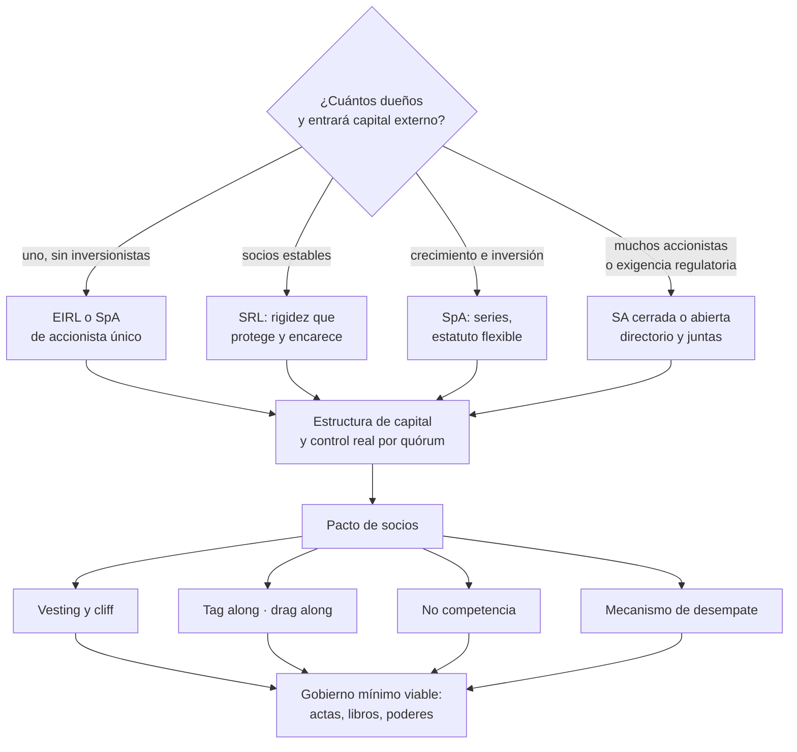

# Parte 05 — Diseño societario y gobierno inicial

> *Las reglas entre socios se escriben cuando la relación está bien*

**Estado de evidencia:** `VERIFICADO-FUENTE` · **Clases:** 14 (057–070) · **Fecha base normativa:** 07-08-2026 
**Conceptos definidos en esta parte:** 56

## 🎯 De qué trata esta parte

El tipo societario decide cuatro cosas a la vez: hasta dónde responde el patrimonio personal, qué régimen tributario queda disponible, con qué facilidad entra un inversionista y cuánto cuesta vender. Elegirlo por costumbre o por lo que hizo un conocido es la forma más barata de comprometer las cuatro. La comparación honesta se hace con cuatro preguntas —cuántos dueños habrá, si entrará capital externo, qué exposición se acepta y qué tramo tributario tienen los socios— y se documenta.

En Chile la SpA se ha vuelto el vehículo por defecto de las empresas con proyección: admite accionista único, permite series con derechos distintos y su estatuto es flexible. Esa flexibilidad tiene contrapartida: lo que el estatuto no diga, no existe. Quórums, reglas de transferencia y mecanismos de desempate deben redactarse, no heredarse de una plantilla.

La segunda mitad de la parte es el pacto entre socios, y su regla operativa es una: se negocia cuando la relación funciona. Vesting, tag along, drag along, no competencia y salida por muerte o incumplimiento son cláusulas que nadie quiere discutir al principio y que nadie puede acordar después del primer conflicto.

## 📚 Resultados de la parte

Al terminar esta parte podrás:

1. **Elegir tipo societario con criterio de responsabilidad, tributación y entrada de inversionistas**.
2. **Diseñar la estructura de capital y control entre fundadores**.
3. **Redactar las reglas que gobiernan salida, incumplimiento y competencia de un socio**.
4. **Instalar un gobierno mínimo con actas y libros desde el primer día**.

## 🗺️ Mapa de la parte

## ⚖️ Marco aplicable

- Ley 20.190 (SpA) y Código de Comercio arts. 424-446
- Ley 18.046 sobre sociedades anónimas y su reglamento
- Ley 19.857 sobre empresas individuales de responsabilidad limitada
- Ley 3.918 sobre sociedades de responsabilidad limitada

**Autoridades o contrapartes:** Registro de Empresas y Sociedades, Conservador de Bienes Raíces, CMF para sociedades anónimas abiertas.
**Profesionales de apoyo:** abogado corporativo, notario, contador.

## ⚠️ Riesgos característicos

- Repartir participaciones 50/50 sin mecanismo de desempate.
- Entregar equity completo sin vesting ni condiciones de permanencia.
- Otorgar poderes amplios sin límite de monto ni actuación conjunta.
- No dejar constancia escrita de decisiones que después se discuten.

## 📘 Las 14 clases

| # | Global | Clase | Decisión que habilita |
|---:|---:|---|---|
| 01 | 057 | [Persona natural versus persona jurídica](class-01-persona-natural-versus-persona-juridica/README.md) | decidir si la actividad se ejerce como persona natural o mediante persona jurídica |
| 02 | 058 | [EIRL: cuándo sirve y cuándo limita](class-02-eirl-cuando-sirve-y-cuando-limita/README.md) | determinar si la EIRL sirve al caso o si conviene partir directamente en SpA |
| 03 | 059 | [Sociedad de Responsabilidad Limitada](class-03-sociedad-de-responsabilidad-limitada/README.md) | determinar si la estabilidad de socios justifica la rigidez de la SRL |
| 04 | 060 | [Sociedad por Acciones SpA](class-04-sociedad-por-acciones-spa/README.md) | definir estructura de capital, series y reglas estatutarias de la SpA |
| 05 | 061 | [Sociedad Anónima cerrada y abierta](class-05-sociedad-anonima-cerrada-y-abierta/README.md) | determinar si el caso requiere la formalidad de una SA |
| 06 | 062 | [Sociedades colectivas y comanditarias](class-06-sociedades-colectivas-y-comanditarias/README.md) | reconocer estas estructuras al evaluar una empresa preexistente |
| 07 | 063 | [Comparación jurídica para elegir forma societaria](class-07-comparacion-juridica-para-elegir-forma-societaria/README.md) | elegir la forma societaria con criterio explícito y documentado |
| 08 | 064 | [Socios, accionistas, porcentajes y control](class-08-socios-accionistas-porcentajes-y-control/README.md) | definir el reparto de participación y los quórums que determinan el control real |
| 09 | 065 | [Capital, aportes, valorización y vesting](class-09-capital-aportes-valorizacion-y-vesting/README.md) | definir cómo se aportan y valorizan las contribuciones y bajo qué vesting se consolidan |
| 10 | 066 | [Administración, poderes y representación legal](class-10-administracion-poderes-y-representacion-legal/README.md) | definir quién representa a la sociedad, en qué materias y hasta qué monto |
| 11 | 067 | [Pactos de accionistas y acuerdos de fundadores](class-11-pactos-de-accionistas-y-acuerdos-de-fundadores/README.md) | definir las reglas de salida, transferencia y conducta entre socios |
| 12 | 068 | [Conflictos de interés y partes relacionadas](class-12-conflictos-de-interes-y-partes-relacionadas/README.md) | definir cómo se aprueban y registran las operaciones con partes relacionadas |
| 13 | 069 | [Juntas, actas, libros y trazabilidad de decisiones](class-13-juntas-actas-libros-y-trazabilidad-de-decisiones/README.md) | definir la rutina de juntas, actas y libros que la sociedad mantendrá |
| 14 | 070 | [Gobierno mínimo viable desde el día uno](class-14-gobierno-minimo-viable-desde-el-dia-uno/README.md) | definir el gobierno mínimo que la empresa sostendrá desde el primer mes |

## 🔤 Glosario de la parte

| Concepto | Definición operacional |
|---|---|
| **Acción** | Título que representa una fracción del capital. |
| **Acta** | Documento que registra los acuerdos adoptados. |
| **Actuación conjunta** | Exigencia de dos o más firmas para actos sobre cierto monto. |
| **Administración** | Órgano o persona con facultad de dirigir la sociedad. |
| **Administración estatutaria** | Reparto de facultades definido en el estatuto. |
| **Aporte** | Bien, dinero o derecho entregado a cambio de participación. |
| **Aumento de capital** | Emisión de nuevas acciones que puede diluir a los existentes. |
| **Bloqueo** | Situación de empate que impide decidir. |
| **Cesión de derechos** | Transferencia de participación, que requiere acuerdo unánime. |
| **Cliff** | Período inicial durante el cual no se consolida nada. |
| **Compatibilidad con inversionistas** | Facilidad para incorporar capital externo. |
| **Conflicto de interés** | Situación donde el interés personal compite con el de la sociedad. |
| **Control** | Capacidad de decidir, que depende de quórums y no solo de porcentaje. |
| **Costo de cambio** | Costo de transformar la sociedad más adelante. |
| **Criterio de elección** | Conjunto de factores que determinan la forma societaria adecuada. |
| **Deber de lealtad** | Obligación del administrador de anteponer el interés social. |
| **Directorio** | Órgano colegiado de administración obligatorio en la sa. |
| **Drag along** | Derecho del mayoritario a arrastrar al minoritario en una venta. |
| **EIRL** | Empresa individual de responsabilidad limitada, con un único titular. |
| **Escalamiento** | Regla que define qué decisiones suben de nivel. |
| **Gobierno mínimo viable** | Conjunto de prácticas de decisión proporcional al tamaño. |
| **Intuito personae** | Carácter personal de la sociedad, que dificulta el ingreso de terceros. |
| **Junta** | Reunión formal de socios o accionistas con quórum y materias definidas. |
| **Junta de accionistas** | Órgano soberano que aprueba estados financieros y elige directorio. |
| **Levantamiento del velo** | Situación en que un tribunal desconoce la separación patrimonial por abuso. |
| **Libro societario** | Registro obligatorio de accionistas, actas y ciertos actos. |
| **Modificación estatutaria** | Cambio que requiere escritura y publicidad. |
| **No competencia** | Obligación de no competir durante y después de la relación societaria. |
| **Objeto único** | La eirl debe declarar un giro determinado. |
| **Operación con parte relacionada** | Transacción que requiere aprobación y condiciones de mercado. |
| **Pacto de accionistas** | Acuerdo privado que regula relaciones entre socios. |
| **Parte relacionada** | Persona o entidad vinculada a un socio o administrador. |
| **Participación** | Porcentaje del capital que posee cada socio. |
| **Persona jurídica** | Entidad distinta de los socios, con patrimonio propio. |
| **Persona natural** | El titular responde con todo su patrimonio personal. |
| **Poder** | Facultad específica otorgada para actuar en nombre de la sociedad. |
| **Quórum** | Mayoría exigida para adoptar cada tipo de acuerdo. |
| **Registro de decisiones** | Bitácora de decisiones con contexto y responsable. |
| **Representación legal** | Capacidad de obligar a la sociedad frente a terceros. |
| **Responsabilidad limitada** | El socio arriesga hasta el monto de su aporte, salvo excepciones. |
| **Responsabilidad solidaria** | Cada socio puede ser perseguido por el total de la deuda. |
| **Ritmo de gestión** | Frecuencia definida de revisión de resultados y decisiones. |
| **Serie** | Categoría de acciones con derechos diferenciados. |
| **Sociedad anónima abierta** | Sa con oferta pública, supervisada por la cmf. |
| **Sociedad anónima cerrada** | Sa sin oferta pública, con junta y directorio obligatorios. |
| **Sociedad colectiva** | Los socios responden solidaria e ilimitadamente. |
| **Sociedad de responsabilidad limitada** | Sociedad de personas con responsabilidad limitada al aporte. |
| **Sociedad en comandita** | Combina socios gestores responsables y socios comanditarios limitados. |
| **SpA** | Sociedad por acciones, admite uno o más accionistas y estatutos flexibles. |
| **Tag along** | Derecho del minoritario a vender en las mismas condiciones que el mayoritario. |
| **Titular** | Persona natural única dueña de la eirl. |
| **Transformación** | Conversión de la eirl en otro tipo societario. |
| **Trazabilidad** | Posibilidad de reconstruir quién decidió qué y cuándo. |
| **Tributación del vehículo** | Régimen aplicable según tipo y estructura de propietarios. |
| **Valorización** | Criterio para asignar valor a un aporte no dinerario. |
| **Vesting** | Adquisición gradual de la participación según permanencia o hitos. |

## 🔗 Cómo se conecta

Es el paso previo obligatorio de la parte 06, que ejecuta la constitución de lo aquí decidido. Su elección condiciona los regímenes disponibles en la parte 07 y determina, en la parte 22, si la empresa se puede vender como acciones o solo como activos.

## 📖 Pauta bibliográfica

- Ley 20.190 y Código de Comercio arts. 424-446 — sociedad por acciones.
- Ley 18.046 sobre sociedades anónimas; Ley 3.918 (SRL); Ley 19.857 (EIRL).
- Registro de Empresas y Sociedades — qué cláusulas admite el formulario y cuáles obligan a escritura pública.

## 🏛️ Fuentes oficiales de la parte

**Registro de Empresas y Sociedades / ChileAtiende — Constitución de empresas**  
<https://www.chileatiende.gob.cl/fichas/21409-tu-empresa> · verificado 2026-08-07

- *Qué contiene:* Describe el régimen simplificado de la Ley 20.659: qué tipos societarios admite el formulario electrónico, quiénes deben firmar, qué documentos entrega el sistema y cómo se hacen después las modificaciones.
- *Cómo leerla:* Entra por el tipo societario que ya elegiste, no al revés. La ficha dice qué campos pide el formulario; si tu estatuto necesita una cláusula que el formulario no soporta, la respuesta es la ruta notarial.

**Biblioteca del Congreso Nacional · LeyChile — Normativa oficial consolidada**  
<https://www.bcn.cl/leychile/> · verificado 2026-08-07

- *Qué contiene:* Publica el texto oficial y consolidado de leyes, decretos y reglamentos, con la versión vigente a una fecha, el historial de modificaciones y la tramitación que las originó.
- *Cómo leerla:* Usa siempre el selector de versión vigente a la fecha en que ejecutarás el trámite, no la última publicada. Y lee el artículo transitorio: en normas en implantación gradual —jornada, datos personales— ahí está la fecha que realmente te aplica.

---

| Anterior | Índice | Siguiente |
|---|---|---|
| [← Parte 04 · Estrategia y ventaja competitiva](../part-04-estrategia-y-ventaja-competitiva/README.md) | [Currículo](../../CURRICULUM.md) · [Programa](../../README.md) | [Parte 06 · Constitución formal de la empresa en Chile →](../part-06-constitucion-formal-de-la-empresa-en-chile/README.md) |
