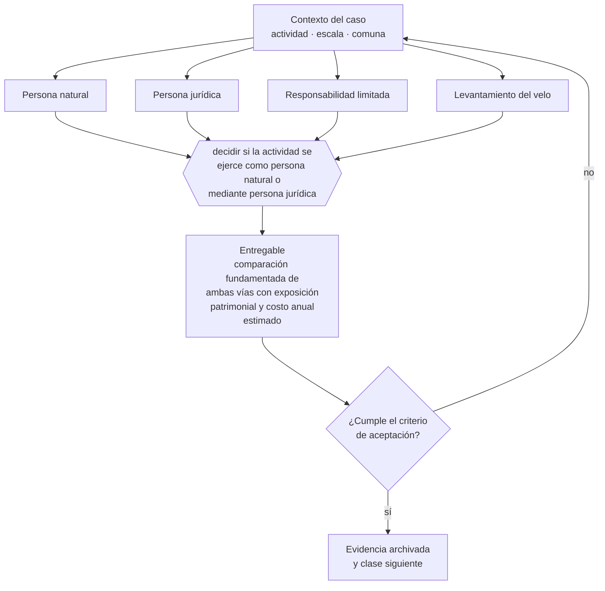

# Clase 057 — Persona natural versus persona jurídica

> **Parte 05 · Diseño societario y gobierno inicial** — clase 1 de 14

**Estado de evidencia:** `VERIFICADO-FUENTE` · **Jurisdicción:** Chile-first · **Fecha base normativa:** 07-08-2026 
**Decisión que habilita:** decidir si la actividad se ejerce como persona natural o mediante persona jurídica 
**Entregable:** comparación fundamentada de ambas vías con exposición patrimonial y costo anual estimado

## 🎯 Propósito

Comparar con números la exposición patrimonial y el costo anual de operar como persona natural frente a hacerlo mediante persona jurídica, antes de que la decisión la imponga un cliente grande.

## 📚 Resultados de aprendizaje

Al finalizar esta clase podrás:

1. **Definir** con precisión los cuatro conceptos de la tabla siguiente y usarlos para describir un caso real.
2. **Explicar** por qué esta materia condiciona decisiones de otras partes del programa.
3. **Decidir** —decidir si la actividad se ejerce como persona natural o mediante persona jurídica— y justificar la decisión por escrito.
4. **Producir** el entregable de la clase y contrastarlo contra su criterio de aceptación.
5. **Distinguir** el dato estable del dato dinámico que exige revalidación en la fuente oficial.

## 🧩 Conceptos centrales

| Concepto | Comprensión verificable |
|---|---|
| **Persona natural** | El titular responde con todo su patrimonio personal. |
| **Persona jurídica** | Entidad distinta de los socios, con patrimonio propio. |
| **Responsabilidad limitada** | El socio arriesga hasta el monto de su aporte, salvo excepciones. |
| **Levantamiento del velo** | Situación en que un tribunal desconoce la separación patrimonial por abuso. |

## 🗺️ Flujo de razonamiento

## 📖 Desarrollo

### 1. El fondo del asunto

Operar como persona natural con boleta de honorarios es simple y barato, pero expone todo el patrimonio personal y limita el acceso a clientes grandes, crédito y socios. La responsabilidad limitada de la persona jurídica no es absoluta: se pierde cuando hay confusión patrimonial, fraude o incumplimiento de deberes.

### 2. Cómo se traduce en la práctica

La responsabilidad limitada no es absoluta: se pierde cuando hay confusión patrimonial, fraude o incumplimiento de deberes del administrador. Mezclar la cuenta personal con la de la empresa es la forma más común y más silenciosa de perder la protección que se pagó por obtener.

### 3. Marco aplicable y quién interviene

- Ley 20.190 (SpA) y Código de Comercio arts. 424-446
- Ley 18.046 sobre sociedades anónimas y su reglamento
- Ley 19.857 sobre empresas individuales de responsabilidad limitada
- Ley 3.918 sobre sociedades de responsabilidad limitada

**Autoridades o contrapartes involucradas:** Registro de Empresas y Sociedades, Conservador de Bienes Raíces, CMF para sociedades anónimas abiertas.
**Profesionales de apoyo:** abogado corporativo, notario, contador. La participación concreta depende del riesgo, del
tamaño de la empresa y de la actividad económica.

## 🧪 Taller guiado

Aplica esta clase a **una** de las siguientes líneas de negocio y repite después el ejercicio con
una segunda línea de carga regulatoria distinta:

| Línea | Carga regulatoria |
|---|---|
| SaaS B2B con IA | media |
| Servicios profesionales | baja |
| E-commerce D2C | media |
| Alimentos o foodtech | alta |
| Exportación de servicios | media |
| Fintech regulada | alta |
| Construcción o servicios técnicos | alta |

**Secuencia de trabajo:**

1. Delimita el contexto: actividad económica, escala, comuna y etapa de la empresa.
2. Reúne los antecedentes que la decisión exige y anota la fecha de cada fuente.
3. Identifica las alternativas reales, incluida la de no hacer nada.
4. Evalúa el impacto en mercado, caja, personas, regulación y operación.
5. Toma la decisión y regístrala con sus supuestos.
6. Produce el entregable.
7. Contrástalo contra el criterio de aceptación.
8. Anota lo que requiere validación profesional y programa su revisión.

### 📦 Entregable

Comparación fundamentada de ambas vías con exposición patrimonial y costo anual estimado.

Debe incluir decisión, supuestos, fuentes con fecha de consulta, responsable, riesgos
identificados y próximos pasos.

## 🏆 Reto verificable

Resuelve la misma materia para una segunda línea de negocio con distinta carga regulatoria y
explica por escrito **qué cambió, por qué y qué fuente lo determina**.

## ✅ Criterio de aceptación

- [ ] la exposición patrimonial de cada vía está cuantificada
- [ ] la decisión considera acceso a clientes, crédito y socios
- [ ] cada afirmación regulatoria está referida a una fuente oficial con fecha de consulta;
- [ ] los datos dinámicos quedan marcados para revalidación;
- [ ] hay un responsable asignado y evidencia reproducible del trabajo.

## ⚠️ Errores frecuentes

**Propios de esta clase:**

- Mantener honorarios cuando el volumen ya justifica una sociedad.
- Confundir patrimonio personal y societario y perder la limitación de responsabilidad.

**Característicos de la parte 05:**

- Repartir participaciones 50/50 sin mecanismo de desempate.
- Entregar equity completo sin vesting ni condiciones de permanencia.

## 🇨🇱 Checklist Chile

- [ ] ¿existe norma o autoridad específica para esta materia?
- [ ] ¿la fuente consultada está vigente a la fecha de ejecución?
- [ ] ¿se activa algún trámite ante el SII?
- [ ] ¿se activa algún requisito municipal o sectorial?
- [ ] ¿afecta a consumidores o al tratamiento de datos personales?
- [ ] ¿afecta a trabajadores o a la seguridad y salud en el trabajo?
- [ ] ¿afecta a impuestos, contabilidad o caja?
- [ ] ¿afecta a contratos o a propiedad intelectual?
- [ ] ¿requiere renovación, reporte periódico o revalidación?

## ❓ Preguntas de comprobación

1. ¿Cuánto de tu patrimonio personal está expuesto hoy si la actividad genera una deuda?
2. ¿Qué clientes o créditos no puedes acceder por no tener persona jurídica?
3. ¿Usas la misma cuenta bancaria para gastos personales y del negocio?

## 🔗 Fuentes oficiales

**Registro de Empresas y Sociedades / ChileAtiende — Constitución de empresas**  
<https://www.chileatiende.gob.cl/fichas/21409-tu-empresa> · verificado 2026-08-07

- *Qué contiene:* Describe el régimen simplificado de la Ley 20.659: qué tipos societarios admite el formulario electrónico, quiénes deben firmar, qué documentos entrega el sistema y cómo se hacen después las modificaciones.
- *Cómo leerla:* Entra por el tipo societario que ya elegiste, no al revés. La ficha dice qué campos pide el formulario; si tu estatuto necesita una cláusula que el formulario no soporta, la respuesta es la ruta notarial.

**Servicio de Impuestos Internos — Nuevos contribuyentes, inicio de actividades y DTE**  
<https://www.sii.cl/ayudas/nuevos_contribuyentes/boleta-vys-facturador.html> · verificado 2026-08-07

- *Qué contiene:* Reúne el circuito completo del contribuyente nuevo: obtención de RUT, declaración de inicio de actividades, elección de códigos de actividad económica y habilitación para emitir documentos tributarios electrónicos.
- *Cómo leerla:* Sepáralo en dos actos distintos que la página trata seguidos: el RUT identifica, el inicio de actividades habilita. Lo que te bloquea para facturar casi siempre está en el segundo, no en el primero.

**Biblioteca del Congreso Nacional · LeyChile — Normativa oficial consolidada**  
<https://www.bcn.cl/leychile/> · verificado 2026-08-07

- *Qué contiene:* Publica el texto oficial y consolidado de leyes, decretos y reglamentos, con la versión vigente a una fecha, el historial de modificaciones y la tramitación que las originó.
- *Cómo leerla:* Usa siempre el selector de versión vigente a la fecha en que ejecutarás el trámite, no la última publicada. Y lee el artículo transitorio: en normas en implantación gradual —jornada, datos personales— ahí está la fecha que realmente te aplica.

Complementos del repositorio: [glosario](../../../docs/19_GLOSSARY.md) ·
[ruta de lecturas](../../../docs/15_BOOKS_AND_LEARNING_PATH.md) ·
[catálogo de fuentes](../../../docs/16_OFFICIAL_SOURCE_CATALOG.md).

> [!IMPORTANT]
> Material educativo. Para una decisión real de alto impacto hay que verificar la fuente oficial
> vigente y validar con el profesional competente.

---

| Anterior | Índice | Siguiente |
|---|---|---|
| **Inicio de la parte** | [Parte 05](../README.md) · [Programa](../../../README.md) | [058 · EIRL: cuándo sirve y cuándo limita →](../class-02-eirl-cuando-sirve-y-cuando-limita/README.md) |
