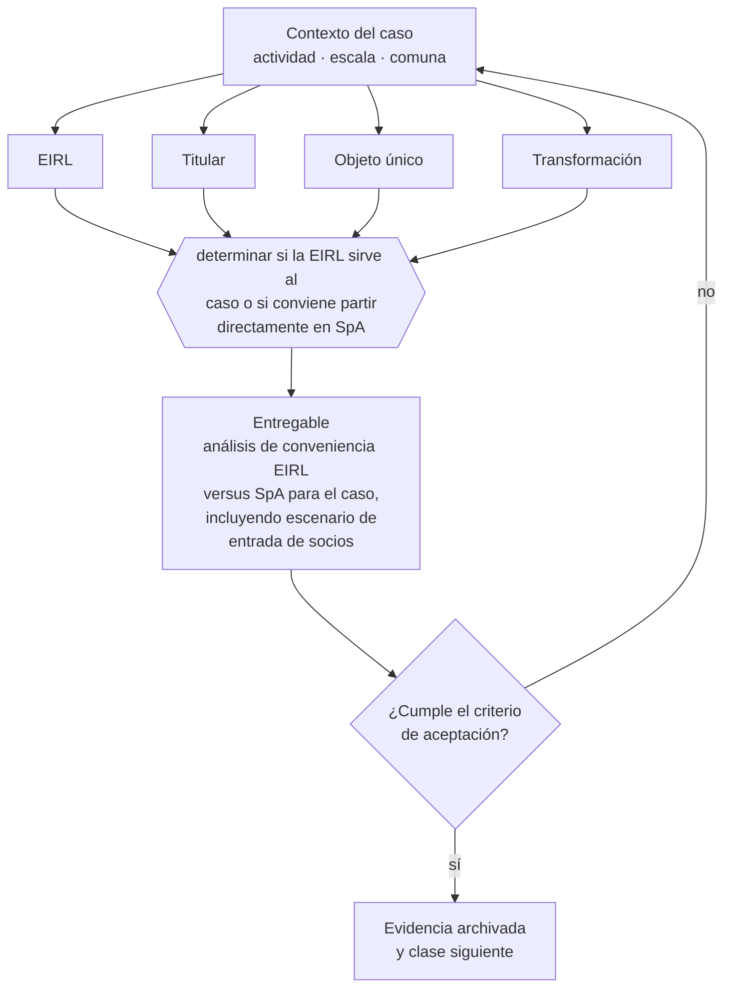

# Clase 058 — EIRL: cuándo sirve y cuándo limita

> **Parte 05 · Diseño societario y gobierno inicial** — clase 2 de 14

**Estado de evidencia:** `VERIFICADO-FUENTE` · **Jurisdicción:** Chile-first · **Fecha base normativa:** 07-08-2026 
**Decisión que habilita:** determinar si la EIRL sirve al caso o si conviene partir directamente en SpA 
**Entregable:** análisis de conveniencia EIRL versus SpA para el caso, incluyendo escenario de entrada de socios

## 🎯 Propósito

Evaluar la EIRL contra la SpA sabiendo de antemano que la primera tiene un techo estructural: no admite un segundo titular.

## 📚 Resultados de aprendizaje

Al finalizar esta clase podrás:

1. **Definir** con precisión los cuatro conceptos de la tabla siguiente y usarlos para describir un caso real.
2. **Explicar** por qué esta materia condiciona decisiones de otras partes del programa.
3. **Decidir** —determinar si la EIRL sirve al caso o si conviene partir directamente en SpA— y justificar la decisión por escrito.
4. **Producir** el entregable de la clase y contrastarlo contra su criterio de aceptación.
5. **Distinguir** el dato estable del dato dinámico que exige revalidación en la fuente oficial.

## 🧩 Conceptos centrales

| Concepto | Comprensión verificable |
|---|---|
| **EIRL** | Empresa individual de responsabilidad limitada, con un único titular. |
| **Titular** | Persona natural única dueña de la eirl. |
| **Objeto único** | La eirl debe declarar un giro determinado. |
| **Transformación** | Conversión de la eirl en otro tipo societario. |

## 🗺️ Flujo de razonamiento

## 📖 Desarrollo

### 1. El fondo del asunto

La EIRL (Ley 19.857) permite limitar responsabilidad sin socios, pero tiene un techo estructural: no admite más de un titular, lo que obliga a transformarla apenas aparece un socio o un inversionista. Por eso hoy la SpA suele ser preferida incluso para un fundador único.

### 2. Cómo se traduce en la práctica

Ese techo obliga a transformar la sociedad apenas aparece un socio o un inversionista, con costo y tiempo. Por eso hoy la SpA de accionista único suele ser preferible incluso para un fundador solo: cuesta lo mismo constituirla y no obliga a rehacer la estructura cuando el negocio funciona.

### 3. Marco aplicable y quién interviene

- Ley 20.190 (SpA) y Código de Comercio arts. 424-446
- Ley 18.046 sobre sociedades anónimas y su reglamento
- Ley 19.857 sobre empresas individuales de responsabilidad limitada
- Ley 3.918 sobre sociedades de responsabilidad limitada

**Autoridades o contrapartes involucradas:** Registro de Empresas y Sociedades, Conservador de Bienes Raíces, CMF para sociedades anónimas abiertas.
**Profesionales de apoyo:** abogado corporativo, notario, contador. La participación concreta depende del riesgo, del
tamaño de la empresa y de la actividad económica.

## 🧪 Taller guiado

Aplica esta clase a **una** de las siguientes líneas de negocio y repite después el ejercicio con
una segunda línea de carga regulatoria distinta:

| Línea | Carga regulatoria |
|---|---|
| SaaS B2B con IA | media |
| Servicios profesionales | baja |
| E-commerce D2C | media |
| Alimentos o foodtech | alta |
| Exportación de servicios | media |
| Fintech regulada | alta |
| Construcción o servicios técnicos | alta |

**Secuencia de trabajo:**

1. Delimita el contexto: actividad económica, escala, comuna y etapa de la empresa.
2. Reúne los antecedentes que la decisión exige y anota la fecha de cada fuente.
3. Identifica las alternativas reales, incluida la de no hacer nada.
4. Evalúa el impacto en mercado, caja, personas, regulación y operación.
5. Toma la decisión y regístrala con sus supuestos.
6. Produce el entregable.
7. Contrástalo contra el criterio de aceptación.
8. Anota lo que requiere validación profesional y programa su revisión.

### 📦 Entregable

Análisis de conveniencia eirl versus spa para el caso, incluyendo escenario de entrada de socios.

Debe incluir decisión, supuestos, fuentes con fecha de consulta, responsable, riesgos
identificados y próximos pasos.

## 🏆 Reto verificable

Resuelve la misma materia para una segunda línea de negocio con distinta carga regulatoria y
explica por escrito **qué cambió, por qué y qué fuente lo determina**.

## ✅ Criterio de aceptación

- [ ] se evalúa explícitamente el escenario de entrada de socios
- [ ] el costo de una eventual transformación está estimado
- [ ] cada afirmación regulatoria está referida a una fuente oficial con fecha de consulta;
- [ ] los datos dinámicos quedan marcados para revalidación;
- [ ] hay un responsable asignado y evidencia reproducible del trabajo.

## ⚠️ Errores frecuentes

**Propios de esta clase:**

- Constituir eirl cuando ya se sabe que entrarán socios.
- Declarar un objeto tan estrecho que impide facturar actividades relacionadas.

**Característicos de la parte 05:**

- Repartir participaciones 50/50 sin mecanismo de desempate.
- Entregar equity completo sin vesting ni condiciones de permanencia.

## 🇨🇱 Checklist Chile

- [ ] ¿existe norma o autoridad específica para esta materia?
- [ ] ¿la fuente consultada está vigente a la fecha de ejecución?
- [ ] ¿se activa algún trámite ante el SII?
- [ ] ¿se activa algún requisito municipal o sectorial?
- [ ] ¿afecta a consumidores o al tratamiento de datos personales?
- [ ] ¿afecta a trabajadores o a la seguridad y salud en el trabajo?
- [ ] ¿afecta a impuestos, contabilidad o caja?
- [ ] ¿afecta a contratos o a propiedad intelectual?
- [ ] ¿requiere renovación, reporte periódico o revalidación?

## ❓ Preguntas de comprobación

1. ¿Qué probabilidad real hay de que entre un socio o inversionista en tres años?
2. ¿Cuánto costaría transformar la EIRL en SpA cuando eso ocurra?
3. ¿Tu objeto declarado permite las actividades que planeas facturar?

## 🔗 Fuentes oficiales

**Registro de Empresas y Sociedades / ChileAtiende — Constitución de empresas**  
<https://www.chileatiende.gob.cl/fichas/21409-tu-empresa> · verificado 2026-08-07

- *Qué contiene:* Describe el régimen simplificado de la Ley 20.659: qué tipos societarios admite el formulario electrónico, quiénes deben firmar, qué documentos entrega el sistema y cómo se hacen después las modificaciones.
- *Cómo leerla:* Entra por el tipo societario que ya elegiste, no al revés. La ficha dice qué campos pide el formulario; si tu estatuto necesita una cláusula que el formulario no soporta, la respuesta es la ruta notarial.

**Biblioteca del Congreso Nacional · LeyChile — Normativa oficial consolidada**  
<https://www.bcn.cl/leychile/> · verificado 2026-08-07

- *Qué contiene:* Publica el texto oficial y consolidado de leyes, decretos y reglamentos, con la versión vigente a una fecha, el historial de modificaciones y la tramitación que las originó.
- *Cómo leerla:* Usa siempre el selector de versión vigente a la fecha en que ejecutarás el trámite, no la última publicada. Y lee el artículo transitorio: en normas en implantación gradual —jornada, datos personales— ahí está la fecha que realmente te aplica.

Complementos del repositorio: [glosario](../../../docs/19_GLOSSARY.md) ·
[ruta de lecturas](../../../docs/15_BOOKS_AND_LEARNING_PATH.md) ·
[catálogo de fuentes](../../../docs/16_OFFICIAL_SOURCE_CATALOG.md).

> [!IMPORTANT]
> Material educativo. Para una decisión real de alto impacto hay que verificar la fuente oficial
> vigente y validar con el profesional competente.

---

| Anterior | Índice | Siguiente |
|---|---|---|
| [← 057 · Persona natural versus persona jurídica](../class-01-persona-natural-versus-persona-juridica/README.md) | [Parte 05](../README.md) · [Programa](../../../README.md) | [059 · Sociedad de Responsabilidad Limitada →](../class-03-sociedad-de-responsabilidad-limitada/README.md) |
