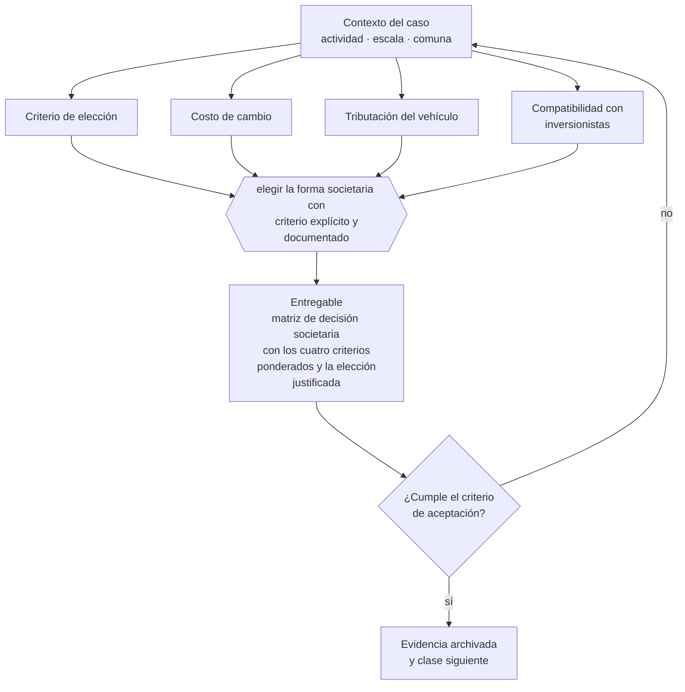

# Clase 063 — Comparación jurídica para elegir forma societaria

> **Parte 05 · Diseño societario y gobierno inicial** — clase 7 de 14

**Estado de evidencia:** `VERIFICADO-FUENTE` · **Jurisdicción:** Chile-first · **Fecha base normativa:** 07-08-2026 
**Decisión que habilita:** elegir la forma societaria con criterio explícito y documentado 
**Entregable:** matriz de decisión societaria con los cuatro criterios ponderados y la elección justificada

## 🎯 Propósito

Documentar la elección societaria con una matriz de cuatro criterios ponderados, para que sea defendible y no una preferencia heredada.

## 📚 Resultados de aprendizaje

Al finalizar esta clase podrás:

1. **Definir** con precisión los cuatro conceptos de la tabla siguiente y usarlos para describir un caso real.
2. **Explicar** por qué esta materia condiciona decisiones de otras partes del programa.
3. **Decidir** —elegir la forma societaria con criterio explícito y documentado— y justificar la decisión por escrito.
4. **Producir** el entregable de la clase y contrastarlo contra su criterio de aceptación.
5. **Distinguir** el dato estable del dato dinámico que exige revalidación en la fuente oficial.

## 🧩 Conceptos centrales

| Concepto | Comprensión verificable |
|---|---|
| **Criterio de elección** | Conjunto de factores que determinan la forma societaria adecuada. |
| **Costo de cambio** | Costo de transformar la sociedad más adelante. |
| **Tributación del vehículo** | Régimen aplicable según tipo y estructura de propietarios. |
| **Compatibilidad con inversionistas** | Facilidad para incorporar capital externo. |

## 🗺️ Flujo de razonamiento

## 📖 Desarrollo

### 1. El fondo del asunto

La elección se resuelve con cuatro preguntas: cuántos dueños habrá, si entrará capital externo, qué exposición patrimonial se acepta y qué régimen tributario conviene a los socios. Una sociedad con socios personas naturales que retiran habitualmente califica distinto que una con socios personas jurídicas.

### 2. Cómo se traduce en la práctica

Las cuatro preguntas son cuántos dueños habrá, si entrará capital externo, qué exposición patrimonial se acepta y qué tramo tributario tienen los socios. La cuarta es la que más se omite y la que más impacto tiene: la estructura de propietarios determina qué regímenes de la parte 07 quedan disponibles.

### 3. Marco aplicable y quién interviene

- Ley 20.190 (SpA) y Código de Comercio arts. 424-446
- Ley 18.046 sobre sociedades anónimas y su reglamento
- Ley 19.857 sobre empresas individuales de responsabilidad limitada
- Ley 3.918 sobre sociedades de responsabilidad limitada

**Autoridades o contrapartes involucradas:** Registro de Empresas y Sociedades, Conservador de Bienes Raíces, CMF para sociedades anónimas abiertas.
**Profesionales de apoyo:** abogado corporativo, notario, contador. La participación concreta depende del riesgo, del
tamaño de la empresa y de la actividad económica.

## 🧪 Taller guiado

Aplica esta clase a **una** de las siguientes líneas de negocio y repite después el ejercicio con
una segunda línea de carga regulatoria distinta:

| Línea | Carga regulatoria |
|---|---|
| SaaS B2B con IA | media |
| Servicios profesionales | baja |
| E-commerce D2C | media |
| Alimentos o foodtech | alta |
| Exportación de servicios | media |
| Fintech regulada | alta |
| Construcción o servicios técnicos | alta |

**Secuencia de trabajo:**

1. Delimita el contexto: actividad económica, escala, comuna y etapa de la empresa.
2. Reúne los antecedentes que la decisión exige y anota la fecha de cada fuente.
3. Identifica las alternativas reales, incluida la de no hacer nada.
4. Evalúa el impacto en mercado, caja, personas, regulación y operación.
5. Toma la decisión y regístrala con sus supuestos.
6. Produce el entregable.
7. Contrástalo contra el criterio de aceptación.
8. Anota lo que requiere validación profesional y programa su revisión.

### 📦 Entregable

Matriz de decisión societaria con los cuatro criterios ponderados y la elección justificada.

Debe incluir decisión, supuestos, fuentes con fecha de consulta, responsable, riesgos
identificados y próximos pasos.

## 🏆 Reto verificable

Resuelve la misma materia para una segunda línea de negocio con distinta carga regulatoria y
explica por escrito **qué cambió, por qué y qué fuente lo determina**.

## ✅ Criterio de aceptación

- [ ] la matriz pondera responsabilidad, socios, tributación y financiamiento
- [ ] la elección está justificada por escrito
- [ ] cada afirmación regulatoria está referida a una fuente oficial con fecha de consulta;
- [ ] los datos dinámicos quedan marcados para revalidación;
- [ ] hay un responsable asignado y evidencia reproducible del trabajo.

## ⚠️ Errores frecuentes

**Propios de esta clase:**

- Elegir por lo que hizo un conocido sin analizar la estructura de socios.
- Ignorar el efecto de la estructura de propietarios sobre el régimen tributario disponible.

**Característicos de la parte 05:**

- Repartir participaciones 50/50 sin mecanismo de desempate.
- Entregar equity completo sin vesting ni condiciones de permanencia.

## 🇨🇱 Checklist Chile

- [ ] ¿existe norma o autoridad específica para esta materia?
- [ ] ¿la fuente consultada está vigente a la fecha de ejecución?
- [ ] ¿se activa algún trámite ante el SII?
- [ ] ¿se activa algún requisito municipal o sectorial?
- [ ] ¿afecta a consumidores o al tratamiento de datos personales?
- [ ] ¿afecta a trabajadores o a la seguridad y salud en el trabajo?
- [ ] ¿afecta a impuestos, contabilidad o caja?
- [ ] ¿afecta a contratos o a propiedad intelectual?
- [ ] ¿requiere renovación, reporte periódico o revalidación?

## ❓ Preguntas de comprobación

1. ¿Cómo pesa cada uno de los cuatro criterios en tu caso concreto?
2. ¿Qué régimen tributario quedaría descartado por tu estructura de socios?
3. ¿Cuánto costaría cambiar de vehículo dentro de tres años?

## 🔗 Fuentes oficiales

**Registro de Empresas y Sociedades / ChileAtiende — Constitución de empresas**  
<https://www.chileatiende.gob.cl/fichas/21409-tu-empresa> · verificado 2026-08-19

- *Qué contiene:* Describe el régimen simplificado de la Ley 20.659: qué tipos societarios admite el formulario electrónico, quiénes deben firmar, qué documentos entrega el sistema y cómo se hacen después las modificaciones.
- *Cómo leerla:* Entra por el tipo societario que ya elegiste, no al revés. La ficha dice qué campos pide el formulario; si tu estatuto necesita una cláusula que el formulario no soporta, la respuesta es la ruta notarial.
- *Uso en esta clase:* aporta el marco de «Constitución de empresas» para elegir la forma societaria con criterio explícito y documentado.

**Servicio de Impuestos Internos — Regímenes tributarios · Operación Renta 2026**  
<https://www.sii.cl/destacados/renta/2026/intermediarios/regimenes_tributarios/> · verificado 2026-08-19

- *Qué contiene:* Compara los regímenes vigentes: requisitos de ingreso y permanencia, tipo de propietarios admitidos, forma de determinar la base imponible y cómo se imputa el crédito contra los impuestos finales de los dueños.
- *Cómo leerla:* Lee primero la columna de requisitos de propietarios: descarta regímenes antes de comparar tasas. Las tasas cambian por ley y por período transitorio, así que anota la fecha de consulta junto a cada cifra que uses.
- *Uso en esta clase:* aporta el marco de «Regímenes tributarios · Operación Renta 2026» para elegir la forma societaria con criterio explícito y documentado.

**Biblioteca del Congreso Nacional · LeyChile — Normativa oficial consolidada**  
<https://www.bcn.cl/leychile/> · verificado 2026-08-19

- *Qué contiene:* Publica el texto oficial y consolidado de leyes, decretos y reglamentos, con la versión vigente a una fecha, el historial de modificaciones y la tramitación que las originó.
- *Cómo leerla:* Usa siempre el selector de versión vigente a la fecha en que ejecutarás el trámite, no la última publicada. Y lee el artículo transitorio: en normas en implantación gradual —jornada, datos personales— ahí está la fecha que realmente te aplica.
- *Uso en esta clase:* aporta el marco de «Normativa oficial consolidada» para elegir la forma societaria con criterio explícito y documentado.

Complementos del repositorio: [glosario](../../../docs/19_GLOSSARY.md) ·
[ruta de lecturas](../../../docs/15_BOOKS_AND_LEARNING_PATH.md) ·
[catálogo de fuentes](../../../docs/16_OFFICIAL_SOURCE_CATALOG.md).

> [!IMPORTANT]
> Material educativo. Para una decisión real de alto impacto hay que verificar la fuente oficial
> vigente y validar con el profesional competente.

---

| Anterior | Índice | Siguiente |
|---|---|---|
| [← 062 · Sociedades colectivas y comanditarias](../class-06-sociedades-colectivas-y-comanditarias/README.md) | [Parte 05](../README.md) · [Programa](../../../README.md) | [064 · Socios, accionistas, porcentajes y control →](../class-08-socios-accionistas-porcentajes-y-control/README.md) |
