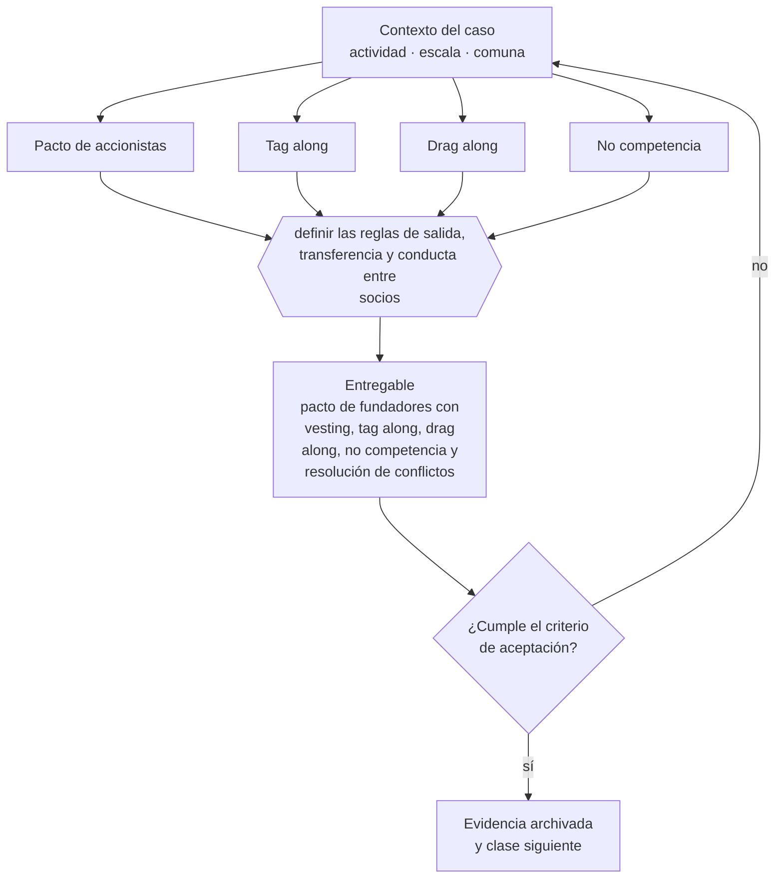

# Clase 067 — Pactos de accionistas y acuerdos de fundadores

> **Parte 05 · Diseño societario y gobierno inicial** — clase 11 de 14

**Estado de evidencia:** `VERIFICADO-FUENTE` · **Jurisdicción:** Chile-first · **Fecha base normativa:** 07-08-2026 
**Decisión que habilita:** definir las reglas de salida, transferencia y conducta entre socios 
**Entregable:** pacto de fundadores con vesting, tag along, drag along, no competencia y resolución de conflictos

## 🎯 Propósito

Negociar el pacto de fundadores cuando la relación está bien, porque después del primer conflicto ya no hay acuerdo posible sobre estas materias.

## 📚 Resultados de aprendizaje

Al finalizar esta clase podrás:

1. **Definir** con precisión los cuatro conceptos de la tabla siguiente y usarlos para describir un caso real.
2. **Explicar** por qué esta materia condiciona decisiones de otras partes del programa.
3. **Decidir** —definir las reglas de salida, transferencia y conducta entre socios— y justificar la decisión por escrito.
4. **Producir** el entregable de la clase y contrastarlo contra su criterio de aceptación.
5. **Distinguir** el dato estable del dato dinámico que exige revalidación en la fuente oficial.

## 🧩 Conceptos centrales

| Concepto | Comprensión verificable |
|---|---|
| **Pacto de accionistas** | Acuerdo privado que regula relaciones entre socios. |
| **Tag along** | Derecho del minoritario a vender en las mismas condiciones que el mayoritario. |
| **Drag along** | Derecho del mayoritario a arrastrar al minoritario en una venta. |
| **No competencia** | Obligación de no competir durante y después de la relación societaria. |

## 🗺️ Flujo de razonamiento

## 📖 Desarrollo

### 1. El fondo del asunto

El pacto de accionistas resuelve por anticipado los escenarios que destruyen sociedades: salida, muerte, incapacidad, incumplimiento, competencia y desacuerdo. Es un documento privado que complementa los estatutos y debe negociarse cuando la relación está bien, porque después es imposible.

### 2. Cómo se traduce en la práctica

El pacto resuelve por anticipado los escenarios que destruyen sociedades: salida, muerte, incapacidad, incumplimiento, competencia y desacuerdo. Es un documento privado que complementa los estatutos, y copiar uno extranjero sin adaptarlo produce cláusulas inaplicables en Chile justo cuando se necesitan.

### 3. Marco aplicable y quién interviene

- Ley 20.190 (SpA) y Código de Comercio arts. 424-446
- Ley 18.046 sobre sociedades anónimas y su reglamento
- Ley 19.857 sobre empresas individuales de responsabilidad limitada
- Ley 3.918 sobre sociedades de responsabilidad limitada

**Autoridades o contrapartes involucradas:** Registro de Empresas y Sociedades, Conservador de Bienes Raíces, CMF para sociedades anónimas abiertas.
**Profesionales de apoyo:** abogado corporativo, notario, contador. La participación concreta depende del riesgo, del
tamaño de la empresa y de la actividad económica.

## 🧪 Taller guiado

Aplica esta clase a **una** de las siguientes líneas de negocio y repite después el ejercicio con
una segunda línea de carga regulatoria distinta:

| Línea | Carga regulatoria |
|---|---|
| SaaS B2B con IA | media |
| Servicios profesionales | baja |
| E-commerce D2C | media |
| Alimentos o foodtech | alta |
| Exportación de servicios | media |
| Fintech regulada | alta |
| Construcción o servicios técnicos | alta |

**Secuencia de trabajo:**

1. Delimita el contexto: actividad económica, escala, comuna y etapa de la empresa.
2. Reúne los antecedentes que la decisión exige y anota la fecha de cada fuente.
3. Identifica las alternativas reales, incluida la de no hacer nada.
4. Evalúa el impacto en mercado, caja, personas, regulación y operación.
5. Toma la decisión y regístrala con sus supuestos.
6. Produce el entregable.
7. Contrástalo contra el criterio de aceptación.
8. Anota lo que requiere validación profesional y programa su revisión.

### 📦 Entregable

Pacto de fundadores con vesting, tag along, drag along, no competencia y resolución de conflictos.

Debe incluir decisión, supuestos, fuentes con fecha de consulta, responsable, riesgos
identificados y próximos pasos.

## 🏆 Reto verificable

Resuelve la misma materia para una segunda línea de negocio con distinta carga regulatoria y
explica por escrito **qué cambió, por qué y qué fuente lo determina**.

## ✅ Criterio de aceptación

- [ ] el pacto cubre salida, muerte, incumplimiento y competencia
- [ ] el mecanismo de resolución de conflictos está definido
- [ ] cada afirmación regulatoria está referida a una fuente oficial con fecha de consulta;
- [ ] los datos dinámicos quedan marcados para revalidación;
- [ ] hay un responsable asignado y evidencia reproducible del trabajo.

## ⚠️ Errores frecuentes

**Propios de esta clase:**

- Postergar el pacto hasta que aparezca el primer conflicto.
- Copiar un pacto extranjero con cláusulas inaplicables en chile.

**Característicos de la parte 05:**

- Repartir participaciones 50/50 sin mecanismo de desempate.
- Entregar equity completo sin vesting ni condiciones de permanencia.

## 🇨🇱 Checklist Chile

- [ ] ¿existe norma o autoridad específica para esta materia?
- [ ] ¿la fuente consultada está vigente a la fecha de ejecución?
- [ ] ¿se activa algún trámite ante el SII?
- [ ] ¿se activa algún requisito municipal o sectorial?
- [ ] ¿afecta a consumidores o al tratamiento de datos personales?
- [ ] ¿afecta a trabajadores o a la seguridad y salud en el trabajo?
- [ ] ¿afecta a impuestos, contabilidad o caja?
- [ ] ¿afecta a contratos o a propiedad intelectual?
- [ ] ¿requiere renovación, reporte periódico o revalidación?

## ❓ Preguntas de comprobación

1. ¿Qué ocurre con las acciones si un socio muere, se incapacita o incumple?
2. ¿Tienes tag along y drag along definidos y sabes qué protege cada uno?
3. ¿Qué mecanismo resuelve un conflicto sin llegar a tribunales?

## 🔗 Fuentes oficiales

**Biblioteca del Congreso Nacional · LeyChile — Normativa oficial consolidada**  
<https://www.bcn.cl/leychile/> · verificado 2026-08-19

- *Qué contiene:* Publica el texto oficial y consolidado de leyes, decretos y reglamentos, con la versión vigente a una fecha, el historial de modificaciones y la tramitación que las originó.
- *Cómo leerla:* Usa siempre el selector de versión vigente a la fecha en que ejecutarás el trámite, no la última publicada. Y lee el artículo transitorio: en normas en implantación gradual —jornada, datos personales— ahí está la fecha que realmente te aplica.
- *Uso en esta clase:* aporta el marco de «Normativa oficial consolidada» para definir las reglas de salida, transferencia y conducta entre socios.

Complementos del repositorio: [glosario](../../../docs/19_GLOSSARY.md) ·
[ruta de lecturas](../../../docs/15_BOOKS_AND_LEARNING_PATH.md) ·
[catálogo de fuentes](../../../docs/16_OFFICIAL_SOURCE_CATALOG.md).

> [!IMPORTANT]
> Material educativo. Para una decisión real de alto impacto hay que verificar la fuente oficial
> vigente y validar con el profesional competente.

---

| Anterior | Índice | Siguiente |
|---|---|---|
| [← 066 · Administración, poderes y representación legal](../class-10-administracion-poderes-y-representacion-legal/README.md) | [Parte 05](../README.md) · [Programa](../../../README.md) | [068 · Conflictos de interés y partes relacionadas →](../class-12-conflictos-de-interes-y-partes-relacionadas/README.md) |
