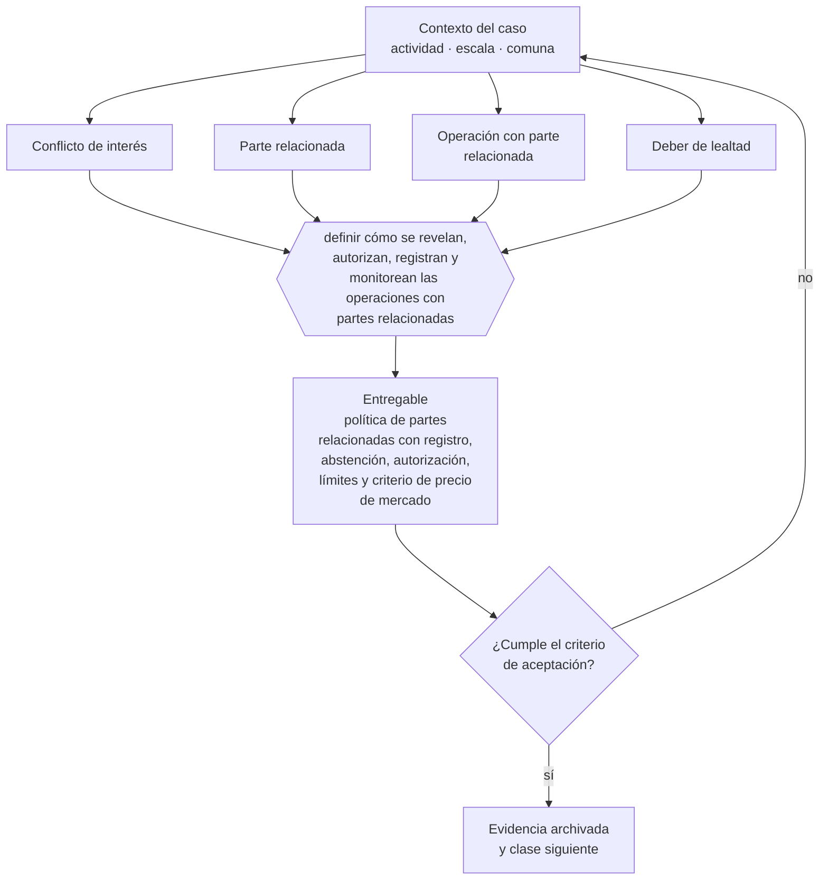

# Clase 068 — Conflictos de interés y partes relacionadas

> **Parte 05 · Diseño societario y gobierno inicial** — clase 12 de 14

**Estado de evidencia:** `VERIFICADO-FUENTE` · **Jurisdicción:** Chile-first · **Fecha base normativa:** 07-08-2026 
**Decisión que habilita:** definir cómo se revelan, autorizan, registran y monitorean las operaciones con partes relacionadas 
**Entregable:** política de partes relacionadas con registro, abstención, autorización, límites y criterio de precio de mercado

## 🎯 Propósito

Gobernar las operaciones relacionadas mediante revelación, abstención, autorización, límites y monitoreo, sin presumir que la relación es ilícita.

## 📚 Resultados de aprendizaje

Al finalizar esta clase podrás:

1. **Definir** con precisión los cuatro conceptos de la tabla siguiente y usarlos para describir un caso real.
2. **Explicar** por qué esta materia condiciona decisiones de otras partes del programa.
3. **Decidir** —definir cómo se revelan, autorizan, registran y monitorean las operaciones con partes relacionadas— y justificar la decisión por escrito.
4. **Producir** el entregable de la clase y contrastarlo contra su criterio de aceptación.
5. **Distinguir** el dato estable del dato dinámico que exige revalidación en la fuente oficial.

## 🧩 Conceptos centrales

| Concepto | Comprensión verificable |
|---|---|
| **Conflicto de interés** | Situación donde el interés personal compite con el de la sociedad. |
| **Parte relacionada** | Persona o entidad vinculada a un socio o administrador. |
| **Operación con parte relacionada** | Transacción que requiere aprobación, revelación y condiciones de mercado. |
| **Deber de lealtad** | Obligación del administrador de anteponer el interés social. |

## 🗺️ Flujo de razonamiento

```mermaid
flowchart TB
    C["Contexto del caso<br/>actividad · escala · comuna"]
    C --> A1["Conflicto de interés"]
    C --> A2["Parte relacionada"]
    C --> A3["Operación con parte<br/>relacionada"]
    C --> A4["Deber de lealtad"]
    A1 & A2 & A3 & A4 --> D{{"definir cómo se revelan,<br/>autorizan, registran y<br/>monitorean las operaciones con<br/>partes relacionadas"}}
    D --> E["Entregable<br/>política de partes<br/>relacionadas con registro,<br/>abstención, autorización,<br/>límites y criterio de precio<br/>de mercado"]
    E --> V{"¿Cumple el criterio<br/>de aceptación?"}
    V -->|sí| S["Evidencia archivada<br/>y clase siguiente"]
    V -->|no| C
```

## 📖 Desarrollo

### 1. El fondo del asunto

Las operaciones con partes relacionadas no son ilícitas por definición: requieren identificación, revelación, abstención del interesado, autorización competente, condiciones de mercado y monitoreo. El caso FTX/Alameda, documentado aquí desde una sentencia penal estadounidense y sin trasladar automáticamente ese derecho a Chile, muestra el riesgo empresarial de permitir privilegios, líneas de crédito o transferencias de fondos de clientes hacia una relacionada sin gobierno efectivo ni trazabilidad.

### 2. Cómo se traduce en la práctica

FTX/Alameda permite observar un extremo de concentración y privilegios entre relacionadas, pero la competencia transferible es más amplia: construir un inventario completo, exigir propósito empresarial y condiciones comparables, impedir que el interesado apruebe, limitar exposición y reportar excepciones. La política debe operar antes de la transacción y no reconstruirse cuando aparece una crisis.

### 3. Marco aplicable y quién interviene

- Ley 20.190 (SpA) y Código de Comercio arts. 424-446
- Ley 18.046 sobre sociedades anónimas y su reglamento
- Ley 19.857 sobre empresas individuales de responsabilidad limitada
- Ley 3.918 sobre sociedades de responsabilidad limitada

**Autoridades o contrapartes involucradas:** Registro de Empresas y Sociedades, Conservador de Bienes Raíces, CMF para sociedades anónimas abiertas.
**Profesionales de apoyo:** abogado corporativo, notario, contador. La participación concreta depende del riesgo, del
tamaño de la empresa y de la actividad económica.

## 🧪 Taller guiado

Aplica esta clase a **una** de las siguientes líneas de negocio y repite después el ejercicio con
una segunda línea de carga regulatoria distinta:

| Línea | Carga regulatoria |
|---|---|
| SaaS B2B con IA | media |
| Servicios profesionales | baja |
| E-commerce D2C | media |
| Alimentos o foodtech | alta |
| Exportación de servicios | media |
| Fintech regulada | alta |
| Construcción o servicios técnicos | alta |

**Secuencia de trabajo:**

1. Delimita el contexto: actividad económica, escala, comuna y etapa de la empresa.
2. Reúne los antecedentes que la decisión exige y anota la fecha de cada fuente.
3. Identifica las alternativas reales, incluida la de no hacer nada.
4. Evalúa el impacto en mercado, caja, personas, regulación y operación.
5. Toma la decisión y regístrala con sus supuestos.
6. Produce el entregable.
7. Contrástalo contra el criterio de aceptación.
8. Anota lo que requiere validación profesional y programa su revisión.

### 📦 Entregable

Política de partes relacionadas con registro, abstención, autorización, límites y criterio de precio de mercado.

Debe incluir decisión, supuestos, fuentes con fecha de consulta, responsable, riesgos
identificados y próximos pasos.

## 🏆 Reto verificable

Resuelve la misma materia para una segunda línea de negocio con distinta carga regulatoria y
explica por escrito **qué cambió, por qué y qué fuente lo determina**.

## ✅ Criterio de aceptación

- [ ] existe registro de partes y operaciones relacionadas con abstención y autorización trazables
- [ ] cada operación tiene propósito empresarial, límite y justificación de condiciones de mercado
- [ ] cada afirmación regulatoria está referida a una fuente oficial con fecha de consulta;
- [ ] los datos dinámicos quedan marcados para revalidación;
- [ ] hay un responsable asignado y evidencia reproducible del trabajo.

## ⚠️ Errores frecuentes

**Propios de esta clase:**

- Tratar toda relación con una parte relacionada como ilícita en vez de gobernarla y revelarla.
- Permitir excepciones operativas o financieras a una relacionada sin autorización, límite ni monitoreo independiente.

**Característicos de la parte 05:**

- Repartir participaciones 50/50 sin mecanismo de desempate.
- Entregar equity completo sin vesting ni condiciones de permanencia.

## 🇨🇱 Checklist Chile

- [ ] ¿existe norma o autoridad específica para esta materia?
- [ ] ¿la fuente consultada está vigente a la fecha de ejecución?
- [ ] ¿se activa algún trámite ante el SII?
- [ ] ¿se activa algún requisito municipal o sectorial?
- [ ] ¿afecta a consumidores o al tratamiento de datos personales?
- [ ] ¿afecta a trabajadores o a la seguridad y salud en el trabajo?
- [ ] ¿afecta a impuestos, contabilidad o caja?
- [ ] ¿afecta a contratos o a propiedad intelectual?
- [ ] ¿requiere renovación, reporte periódico o revalidación?

## ❓ Preguntas de comprobación

1. ¿Qué personas y entidades integran tu perímetro de relacionadas y quién actualiza el registro?
2. ¿Qué órgano aprueba, quién se abstiene y qué límite se aplica a cada operación?
3. ¿Qué alerta detectaría un privilegio técnico, financiero o de tesorería fuera de política?

## 🔗 Fuentes oficiales

**Servicio de Impuestos Internos — Nuevos contribuyentes, inicio de actividades y DTE**  
<https://www.sii.cl/ayudas/nuevos_contribuyentes/boleta-vys-facturador.html> · verificado 2026-10-01

- *Qué contiene:* Reúne el circuito completo del contribuyente nuevo: obtención de RUT, declaración de inicio de actividades, elección de códigos de actividad económica y habilitación para emitir documentos tributarios electrónicos.
- *Cómo leerla:* Sepáralo en dos actos distintos que la página trata seguidos: el RUT identifica, el inicio de actividades habilita. Lo que te bloquea para facturar casi siempre está en el segundo, no en el primero.
- *Uso en esta clase:* aporta el marco de «Nuevos contribuyentes, inicio de actividades y DTE» para definir cómo se revelan, autorizan, registran y monitorean las operaciones con partes relacionadas.

**Biblioteca del Congreso Nacional · LeyChile — Normativa oficial consolidada**  
<https://www.bcn.cl/leychile/> · verificado 2026-10-01

- *Qué contiene:* Publica el texto oficial y consolidado de leyes, decretos y reglamentos, con la versión vigente a una fecha, el historial de modificaciones y la tramitación que las originó.
- *Cómo leerla:* Usa siempre el selector de versión vigente a la fecha en que ejecutarás el trámite, no la última publicada. Y lee el artículo transitorio: en normas en implantación gradual —jornada, datos personales— ahí está la fecha que realmente te aplica.
- *Uso en esta clase:* aporta el marco de «Normativa oficial consolidada» para definir cómo se revelan, autorizan, registran y monitorean las operaciones con partes relacionadas.

**Departamento de Justicia de Estados Unidos — FTX y Alameda: condena y sentencia de Samuel Bankman-Fried**  
<https://www.justice.gov/archives/opa/pr/samuel-bankman-fried-sentenced-25-years-his-orchestration-multiple-fraudulent-schemes> · verificado 2026-10-01

- *Qué contiene:* Resume la condena dictada tras juicio y la sentencia de marzo de 2024, incluidos hechos acreditados sobre fondos de clientes, privilegios de Alameda, información financiera y ocultamiento a clientes, inversionistas y prestamistas.
- *Cómo leerla:* Úsala para estudiar segregación de fondos, partes relacionadas, autorización, tesorería y evidencia de gobierno. No copies tipos penales ni reglas estadounidenses a Chile: contrasta cada obligación local con contrato, actividad y norma chilena aplicable.
- *Uso en esta clase:* aporta el marco de «FTX y Alameda: condena y sentencia de Samuel Bankman-Fried» para definir cómo se revelan, autorizan, registran y monitorean las operaciones con partes relacionadas.

Complementos del repositorio: [glosario](../../../docs/19_GLOSSARY.md) ·
[ruta de lecturas](../../../docs/15_BOOKS_AND_LEARNING_PATH.md) ·
[catálogo de fuentes](../../../docs/16_OFFICIAL_SOURCE_CATALOG.md).

> [!IMPORTANT]
> Material educativo. Para una decisión real de alto impacto hay que verificar la fuente oficial
> vigente y validar con el profesional competente.

---

| Anterior | Índice | Siguiente |
|---|---|---|
| [← 067 · Pactos de accionistas y acuerdos de fundadores](../class-11-pactos-de-accionistas-y-acuerdos-de-fundadores/README.md) | [Parte 05](../README.md) · [Programa](../../../README.md) | [069 · Juntas, actas, libros y trazabilidad de decisiones →](../class-13-juntas-actas-libros-y-trazabilidad-de-decisiones/README.md) |
