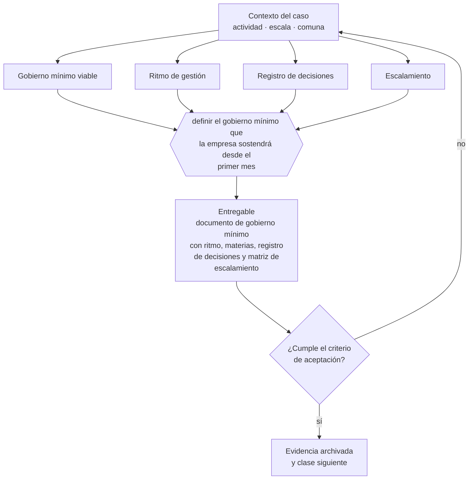

# Clase 070 — Gobierno mínimo viable desde el día uno

> **Parte 05 · Diseño societario y gobierno inicial** — clase 14 de 14

**Estado de evidencia:** `VERIFICADO-FUENTE` · **Jurisdicción:** Chile-first · **Fecha base normativa:** 07-08-2026 
**Decisión que habilita:** definir el gobierno mínimo que la empresa sostendrá desde el primer mes 
**Entregable:** documento de gobierno mínimo con ritmo, materias, registro de decisiones y matriz de escalamiento

## 🎯 Propósito

Definir un gobierno proporcional al tamaño que la empresa pueda sostener desde el primer mes, en vez de uno ambicioso que se abandona.

## 📚 Resultados de aprendizaje

Al finalizar esta clase podrás:

1. **Definir** con precisión los cuatro conceptos de la tabla siguiente y usarlos para describir un caso real.
2. **Explicar** por qué esta materia condiciona decisiones de otras partes del programa.
3. **Decidir** —definir el gobierno mínimo que la empresa sostendrá desde el primer mes— y justificar la decisión por escrito.
4. **Producir** el entregable de la clase y contrastarlo contra su criterio de aceptación.
5. **Distinguir** el dato estable del dato dinámico que exige revalidación en la fuente oficial.

## 🧩 Conceptos centrales

| Concepto | Comprensión verificable |
|---|---|
| **Gobierno mínimo viable** | Conjunto de prácticas de decisión proporcional al tamaño. |
| **Ritmo de gestión** | Frecuencia definida de revisión de resultados y decisiones. |
| **Registro de decisiones** | Bitácora de decisiones con contexto y responsable. |
| **Escalamiento** | Regla que define qué decisiones suben de nivel. |

## 🗺️ Flujo de razonamiento

## 📖 Desarrollo

### 1. El fondo del asunto

El gobierno mínimo viable de una empresa de dos socios cabe en una página: reunión mensual con estados financieros, acta breve, registro de decisiones y matriz de poderes. Instalarlo desde el día uno cuesta poco; instalarlo después de un conflicto cuesta la sociedad.

### 2. Cómo se traduce en la práctica

El gobierno mínimo viable de una empresa de dos socios cabe en una página: reunión mensual con estados financieros, acta breve, registro de decisiones y matriz de poderes. Instalarlo al inicio cuesta poco; instalarlo después de un conflicto ya no es posible porque cada regla se lee como acusación.

### 3. Marco aplicable y quién interviene

- Ley 20.190 (SpA) y Código de Comercio arts. 424-446
- Ley 18.046 sobre sociedades anónimas y su reglamento
- Ley 19.857 sobre empresas individuales de responsabilidad limitada
- Ley 3.918 sobre sociedades de responsabilidad limitada

**Autoridades o contrapartes involucradas:** Registro de Empresas y Sociedades, Conservador de Bienes Raíces, CMF para sociedades anónimas abiertas.
**Profesionales de apoyo:** abogado corporativo, notario, contador. La participación concreta depende del riesgo, del
tamaño de la empresa y de la actividad económica.

## 🧪 Taller guiado

Aplica esta clase a **una** de las siguientes líneas de negocio y repite después el ejercicio con
una segunda línea de carga regulatoria distinta:

| Línea | Carga regulatoria |
|---|---|
| SaaS B2B con IA | media |
| Servicios profesionales | baja |
| E-commerce D2C | media |
| Alimentos o foodtech | alta |
| Exportación de servicios | media |
| Fintech regulada | alta |
| Construcción o servicios técnicos | alta |

**Secuencia de trabajo:**

1. Delimita el contexto: actividad económica, escala, comuna y etapa de la empresa.
2. Reúne los antecedentes que la decisión exige y anota la fecha de cada fuente.
3. Identifica las alternativas reales, incluida la de no hacer nada.
4. Evalúa el impacto en mercado, caja, personas, regulación y operación.
5. Toma la decisión y regístrala con sus supuestos.
6. Produce el entregable.
7. Contrástalo contra el criterio de aceptación.
8. Anota lo que requiere validación profesional y programa su revisión.

### 📦 Entregable

Documento de gobierno mínimo con ritmo, materias, registro de decisiones y matriz de escalamiento.

Debe incluir decisión, supuestos, fuentes con fecha de consulta, responsable, riesgos
identificados y próximos pasos.

## 🏆 Reto verificable

Resuelve la misma materia para una segunda línea de negocio con distinta carga regulatoria y
explica por escrito **qué cambió, por qué y qué fuente lo determina**.

## ✅ Criterio de aceptación

- [ ] el gobierno definido es sostenible con el equipo actual
- [ ] existe registro de decisiones con responsable y fecha
- [ ] cada afirmación regulatoria está referida a una fuente oficial con fecha de consulta;
- [ ] los datos dinámicos quedan marcados para revalidación;
- [ ] hay un responsable asignado y evidencia reproducible del trabajo.

## ⚠️ Errores frecuentes

**Propios de esta clase:**

- Postergar el gobierno hasta que la empresa sea grande.
- Instalar un gobierno pesado que la empresa no puede sostener y abandona.

**Característicos de la parte 05:**

- Repartir participaciones 50/50 sin mecanismo de desempate.
- Entregar equity completo sin vesting ni condiciones de permanencia.

## 🇨🇱 Checklist Chile

- [ ] ¿existe norma o autoridad específica para esta materia?
- [ ] ¿la fuente consultada está vigente a la fecha de ejecución?
- [ ] ¿se activa algún trámite ante el SII?
- [ ] ¿se activa algún requisito municipal o sectorial?
- [ ] ¿afecta a consumidores o al tratamiento de datos personales?
- [ ] ¿afecta a trabajadores o a la seguridad y salud en el trabajo?
- [ ] ¿afecta a impuestos, contabilidad o caja?
- [ ] ¿afecta a contratos o a propiedad intelectual?
- [ ] ¿requiere renovación, reporte periódico o revalidación?

## ❓ Preguntas de comprobación

1. ¿Qué instancia periódica de decisión existe hoy y con qué información se alimenta?
2. ¿Dónde queda registrada una decisión y quién la puede consultar después?
3. ¿Qué decisiones suben de nivel y cuáles se toman sin consultar?

## 🔗 Fuentes oficiales

**Registro de Empresas y Sociedades / ChileAtiende — Constitución de empresas**  
<https://www.chileatiende.gob.cl/fichas/21409-tu-empresa> · verificado 2026-08-19

- *Qué contiene:* Describe el régimen simplificado de la Ley 20.659: qué tipos societarios admite el formulario electrónico, quiénes deben firmar, qué documentos entrega el sistema y cómo se hacen después las modificaciones.
- *Cómo leerla:* Entra por el tipo societario que ya elegiste, no al revés. La ficha dice qué campos pide el formulario; si tu estatuto necesita una cláusula que el formulario no soporta, la respuesta es la ruta notarial.
- *Uso en esta clase:* aporta el marco de «Constitución de empresas» para definir el gobierno mínimo que la empresa sostendrá desde el primer mes.

Complementos del repositorio: [glosario](../../../docs/19_GLOSSARY.md) ·
[ruta de lecturas](../../../docs/15_BOOKS_AND_LEARNING_PATH.md) ·
[catálogo de fuentes](../../../docs/16_OFFICIAL_SOURCE_CATALOG.md).

> [!IMPORTANT]
> Material educativo. Para una decisión real de alto impacto hay que verificar la fuente oficial
> vigente y validar con el profesional competente.

---

| Anterior | Índice | Siguiente |
|---|---|---|
| [← 069 · Juntas, actas, libros y trazabilidad de decisiones](../class-13-juntas-actas-libros-y-trazabilidad-de-decisiones/README.md) | [Parte 05](../README.md) · [Programa](../../../README.md) | [071 · Ruta tradicional versus Registro de Empresas y Sociedades →](../../part-06-constitucion-formal-de-la-empresa-en-chile/class-01-ruta-tradicional-versus-registro-de-empresas-y-sociedades/README.md) |
