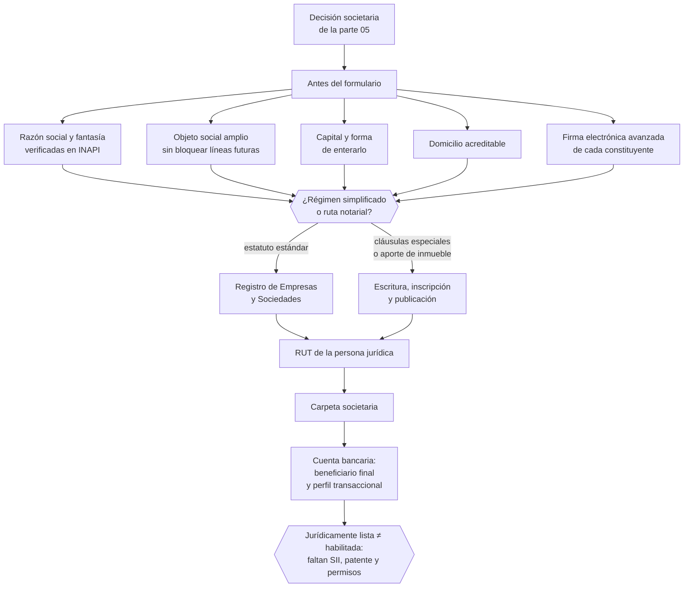

# Parte 06 — Constitución formal de la empresa en Chile

> *Constituida no es lo mismo que habilitada para operar*

🔵 **Etapa 2 — La empresa nace** · salida de la etapa: Empresa constituida, con RUT y régimen elegido

**Estado de evidencia:** `VERIFICADO-FUENTE` · **Clases:** 14 (071–084) · **Fecha base normativa:** 07-08-2026 
**Contenido central:** Registro de Empresas, objeto y domicilio, capital, firma electrónica, RUT, carpeta y cuenta bancaria 
**Conceptos definidos en esta parte:** 55

## 🎯 De qué trata esta parte

Esta es la parte donde la empresa nace jurídicamente, y también donde más se confunde el hito con la meta. Obtener el certificado de estatuto y el RUT significa que la persona jurídica existe; no significa que pueda facturar, ni operar en un local, ni contratar. Esa distinción organiza toda la parte y evita el error caro de comprometer entregas con clientes antes de poder emitir un documento tributario.

El trabajo técnico está en las decisiones que hay que tomar antes de abrir el formulario: razón social y nombre de fantasía verificados contra INAPI, objeto social suficientemente amplio para no bloquear una línea futura, capital que los socios efectivamente van a enterar, poderes con monto y actuación conjunta, y un domicilio que se pueda acreditar. Improvisar cualquiera de esas en la pantalla del Registro produce una sociedad que habrá que modificar meses después.

La parte cierra con dos entregables que suelen armarse tarde y cuestan semanas de reconstrucción: la carpeta societaria ordenada y el expediente bancario, con beneficiario final y perfil transaccional, que la debida diligencia del banco va a exigir.

## 📚 Resultados de la parte

Al terminar esta parte podrás:

1. **Ejecutar o simular la constitución completa por la vía que corresponda al caso**.
2. **Redactar razón social, nombre de fantasía y objeto sin bloquear actividades futuras**.
3. **Obtener RUT y organizar la carpeta societaria de respaldo**.
4. **Anticipar los requisitos de la debida diligencia bancaria antes de pedir la cuenta**.

## 🗺️ Mapa de la parte

## ⚖️ Marco aplicable

- Ley 20.659 sobre régimen simplificado de constitución (Tu Empresa en un Día)
- Ley 19.799 sobre documentos y firma electrónica
- Ley 20.393 y Ley 19.913 en lo relativo a conocimiento del cliente bancario

**Autoridades o contrapartes:** Registro de Empresas y Sociedades, SII, Conservador de Bienes Raíces, Diario Oficial.
**Profesionales de apoyo:** abogado corporativo, notario, contador, ejecutivo bancario.

## ⚠️ Riesgos característicos

- Objeto social redactado tan estrecho que impide facturar una línea nueva.
- Usar una razón social o nombre de fantasía que colisiona con una marca registrada.
- Declarar un domicilio que después no se puede acreditar ante sii o el municipio.
- Asumir que con el rut la empresa ya está habilitada para operar.

## 📘 Las 14 clases

| # | Global | Clase | Decisión que habilita |
|---:|---:|---|---|
| 01 | 071 | [Ruta tradicional versus Registro de Empresas y Sociedades](class-01-ruta-tradicional-versus-registro-de-empresas-y-sociedades/README.md) | elegir la vía de constitución según complejidad estatutaria y tipo de aportes |
| 02 | 072 | [Tu Empresa en un Día: flujo completo](class-02-tu-empresa-en-un-dia-flujo-completo/README.md) | ejecutar o simular la constitución completa y obtener el estatuto actualizado |
| 03 | 073 | [Definir razón social, nombre de fantasía y objeto](class-03-definir-razon-social-nombre-de-fantasia-y-objeto/README.md) | definir razón social, nombre de fantasía y objeto verificando disponibilidad marcaria |
| 04 | 074 | [Domicilio social, comercial y tributario](class-04-domicilio-social-comercial-y-tributario/README.md) | definir los tres domicilios y asegurar la documentación que los acredita |
| 05 | 075 | [Capital social y forma de enterarlo](class-05-capital-social-y-forma-de-enterarlo/README.md) | definir monto de capital, forma de entero y plazo |
| 06 | 076 | [Acciones, series y derechos en una SpA](class-06-acciones-series-y-derechos-en-una-spa/README.md) | definir la estructura de series y las preferencias que se otorgarán |
| 07 | 077 | [Administradores y representantes](class-07-administradores-y-representantes/README.md) | designar administración y representación con facultades y vigencia claras |
| 08 | 078 | [Firma electrónica avanzada y firma notarial](class-08-firma-electronica-avanzada-y-firma-notarial/README.md) | resolver el mecanismo de firma de cada constituyente antes de iniciar el trámite |
| 09 | 079 | [RUT de la persona jurídica](class-09-rut-de-la-persona-juridica/README.md) | obtener el RUT y distinguirlo del inicio de actividades como paso siguiente |
| 10 | 080 | [Obtención y resguardo de documentos societarios](class-10-obtencion-y-resguardo-de-documentos-societarios/README.md) | definir qué documentos componen la carpeta y cómo se custodian y actualizan |
| 11 | 081 | [Modificaciones, saneamientos y rectificaciones](class-11-modificaciones-saneamientos-y-rectificaciones/README.md) | verificar la corrección formal de la constitución y planificar modificaciones futuras |
| 12 | 082 | [Transformación, fusión y división](class-12-transformacion-fusion-y-division/README.md) | determinar si la reorganización se justifica y cómo se estructura tributariamente |
| 13 | 083 | [Cuenta bancaria empresarial y debida diligencia bancaria](class-13-cuenta-bancaria-empresarial-y-debida-diligencia-bancaria/README.md) | preparar el expediente bancario completo antes de solicitar la cuenta |
| 14 | 084 | [Checklist de empresa jurídicamente lista](class-14-checklist-de-empresa-juridicamente-lista/README.md) | verificar el cierre de la etapa societaria y las brechas hacia la habilitación operativa |

## 🔤 Glosario de la parte

| Concepto | Definición operacional |
|---|---|
| **Acreditación** | Documento que prueba el derecho a usar el domicilio declarado. |
| **Administrador** | Persona u órgano encargado de la gestión. |
| **Anotación** | Registro de actos posteriores sobre la sociedad constituida. |
| **Aporte no dinerario** | Bien o derecho aportado en lugar de dinero. |
| **Beneficiario final** | Persona natural que en última instancia controla la sociedad. |
| **Brecha** | Requisito pendiente que impide operar o facturar. |
| **Búsqueda de anterioridad** | Revisión previa de marcas registradas similares en inapi. |
| **Calendario de obligaciones** | Fechas periódicas que la empresa debe cumplir. |
| **Capital social** | Monto que los socios se obligan a aportar. |
| **Capital suscrito y pagado** | Comprometido versus efectivamente enterado. |
| **Carpeta societaria** | Conjunto ordenado de documentos que acreditan la existencia y facultades. |
| **Certificado de estatuto actualizado** | Documento que refleja el estatuto vigente. |
| **Certificado de vigencia** | Acredita que la sociedad existe y quién la representa. |
| **Clave tributaria** | Credencial de acceso a los sistemas del sii. |
| **Cláusula antidilución** | Protección del inversionista ante emisiones a menor valor. |
| **Cuenta corriente empresarial** | Cuenta bancaria a nombre de la persona jurídica. |
| **Custodia** | Resguardo con respaldo, control de acceso y trazabilidad. |
| **Debida diligencia bancaria** | Proceso de conocimiento del cliente exigido al banco. |
| **Derecho de voto** | Facultad de votar, que puede limitarse por serie. |
| **División** | Separación del patrimonio en dos o más sociedades. |
| **Domicilio comercial** | Lugar físico donde se desarrolla la actividad. |
| **Domicilio social** | El declarado en los estatutos, que fija jurisdicción. |
| **Domicilio tributario** | El registrado ante el sii, que debe poder acreditarse. |
| **Duración del cargo** | Plazo por el que se designa. |
| **Efecto tributario** | Consecuencias de la reorganización ante el sii. |
| **Empresa jurídicamente lista** | Sociedad constituida, con rut, representación vigente y documentación completa. |
| **Entero del capital** | Forma y plazo en que efectivamente se paga. |
| **Firma ante notario** | Alternativa presencial cuando no hay firma electrónica. |
| **Firma electrónica avanzada** | Firma con certificado que da valor jurídico equivalente a la manuscrita. |
| **Firma electrónica simple** | Firma sin certificado acreditado, con menor valor probatorio. |
| **Formulario tipo** | Documento estandarizado que reemplaza la escritura. |
| **Fusión** | Unión de dos o más sociedades en una. |
| **Habilitación operativa** | Permisos que además permiten operar la actividad. |
| **Migración** | Paso de una sociedad del régimen simplificado al general o viceversa. |
| **Modificación** | Cambio de estatutos aprobado con el quórum exigido. |
| **Nombre de fantasía** | Nombre comercial con el que opera de cara al mercado. |
| **Objeto social** | Actividades que la sociedad declara poder realizar. |
| **Obtención automática** | Asignación del rut al constituir por el régimen simplificado. |
| **Oponibilidad** | Efecto del acto frente a terceros una vez cumplida la publicidad. |
| **Perfil transaccional** | Volumen y tipo de movimientos declarados al banco. |
| **Preferencia** | Derecho prioritario en dividendos o liquidación. |
| **Proveedor acreditado** | Entidad autorizada para emitir certificados de firma avanzada. |
| **Publicidad registral** | Inscripción y publicación que hacen oponible la sociedad frente a terceros. |
| **Razón social** | Nombre legal completo de la sociedad. |
| **Rectificación** | Corrección de errores materiales. |
| **Representante ante el SII** | Persona habilitada para actuar tributariamente. |
| **Representante legal** | Quien puede obligar a la sociedad frente a terceros. |
| **Responsabilidad del administrador** | Deberes de cuidado y lealtad cuyo incumplimiento genera responsabilidad. |
| **RUT de persona jurídica** | Identificador tributario de la sociedad. |
| **Ruta notarial** | Constitución por escritura pública, inscripción y publicación. |
| **Régimen simplificado** | Constitución electrónica por ley 20.659 en el registro de empresas y sociedades. |
| **Saneamiento** | Corrección de vicios formales de constitución o modificación. |
| **Serie de acciones** | Categoría con derechos económicos o políticos diferenciados. |
| **Transformación** | Cambio de tipo societario conservando la personalidad jurídica. |
| **Tu Empresa en un Día** | Plataforma del registro de empresas y sociedades para constitución electrónica. |

## 🔗 Cómo se conecta

Ejecuta la decisión de la parte 05 y entrega a la parte 07 la sociedad que debe iniciar actividades. El objeto social definido aquí condiciona los códigos de actividad que se podrán declarar, y el domicilio determina el municipio competente de la parte 17.

## 📖 Pauta bibliográfica

- Ley 20.659 — régimen simplificado de constitución, modificación y disolución.
- Ley 19.799 — documentos electrónicos y firma electrónica avanzada.
- Ley 19.913 — debida diligencia bancaria y beneficiario final.

## 🏛️ Fuentes oficiales de la parte

**Registro de Empresas y Sociedades / ChileAtiende — Constitución de empresas**  
<https://www.chileatiende.gob.cl/fichas/21409-tu-empresa> · verificado 2026-08-19

- *Qué contiene:* Describe el régimen simplificado de la Ley 20.659: qué tipos societarios admite el formulario electrónico, quiénes deben firmar, qué documentos entrega el sistema y cómo se hacen después las modificaciones.
- *Cómo leerla:* Entra por el tipo societario que ya elegiste, no al revés. La ficha dice qué campos pide el formulario; si tu estatuto necesita una cláusula que el formulario no soporta, la respuesta es la ruta notarial.

**Servicio de Impuestos Internos — Nuevos contribuyentes, inicio de actividades y DTE**  
<https://www.sii.cl/ayudas/nuevos_contribuyentes/boleta-vys-facturador.html> · verificado 2026-08-19

- *Qué contiene:* Reúne el circuito completo del contribuyente nuevo: obtención de RUT, declaración de inicio de actividades, elección de códigos de actividad económica y habilitación para emitir documentos tributarios electrónicos.
- *Cómo leerla:* Sepáralo en dos actos distintos que la página trata seguidos: el RUT identifica, el inicio de actividades habilita. Lo que te bloquea para facturar casi siempre está en el segundo, no en el primero.

**Instituto Nacional de Propiedad Industrial — Marcas, patentes y diseños industriales**  
<https://www.inapi.cl/> · verificado 2026-08-19

- *Qué contiene:* Administra el registro de marcas, patentes, diseños e indicaciones geográficas, y ofrece el buscador público de solicitudes y registros vigentes por clase.
- *Cómo leerla:* Empieza siempre por el buscador de anterioridades y por clases, no por el formulario de solicitud. Una marca disponible en tu clase puede estar tomada en la clase donde realmente operas, y eso solo se ve buscando por actividad.

**Biblioteca del Congreso Nacional · LeyChile — Normativa oficial consolidada**  
<https://www.bcn.cl/leychile/> · verificado 2026-08-19

- *Qué contiene:* Publica el texto oficial y consolidado de leyes, decretos y reglamentos, con la versión vigente a una fecha, el historial de modificaciones y la tramitación que las originó.
- *Cómo leerla:* Usa siempre el selector de versión vigente a la fecha en que ejecutarás el trámite, no la última publicada. Y lee el artículo transitorio: en normas en implantación gradual —jornada, datos personales— ahí está la fecha que realmente te aplica.

---

| Anterior | Índice | Siguiente |
|---|---|---|
| [← Parte 05 · Diseño societario y gobierno inicial](../part-05-diseno-societario-y-gobierno-inicial/README.md) | [Currículo](../../CURRICULUM.md) · [Programa](../../README.md) | [Parte 07 · SII y ciclo tributario de principio a fin →](../part-07-sii-y-ciclo-tributario-de-principio-a-fin/README.md) |
