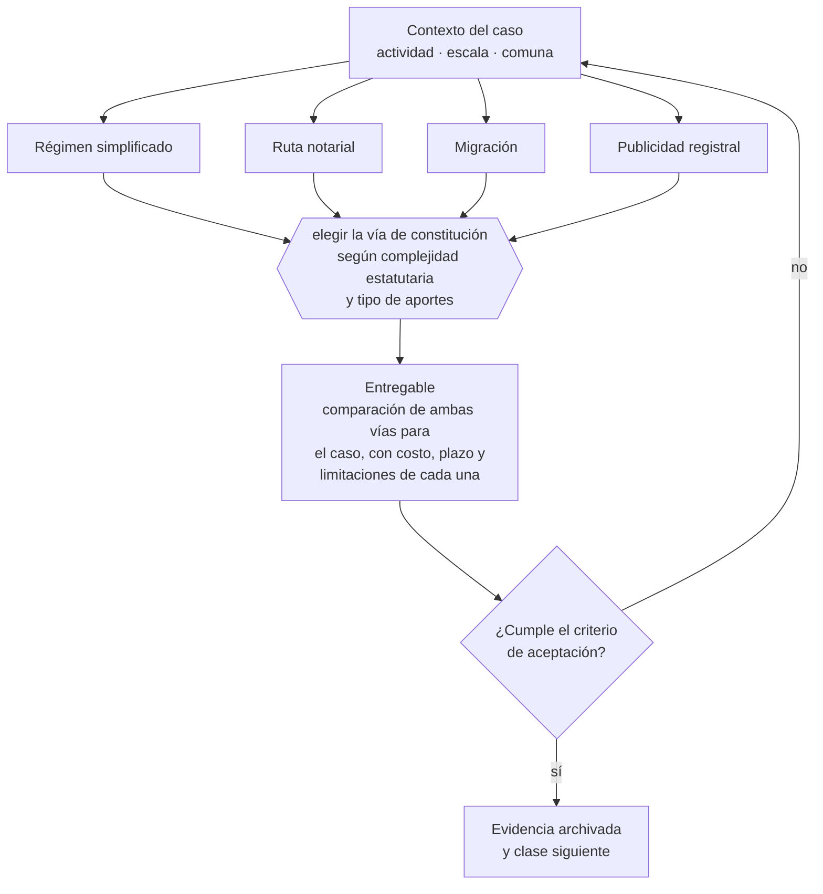

# Clase 071 — Ruta tradicional versus Registro de Empresas y Sociedades

> **Parte 06 · Constitución formal de la empresa en Chile** — clase 1 de 14

**Estado de evidencia:** `VERIFICADO-FUENTE` · **Jurisdicción:** Chile-first · **Fecha base normativa:** 07-08-2026 
**Decisión que habilita:** elegir la vía de constitución según complejidad estatutaria y tipo de aportes 
**Entregable:** comparación de ambas vías para el caso, con costo, plazo y limitaciones de cada una

## 🎯 Propósito

Elegir la vía de constitución según la complejidad del estatuto y el tipo de aportes, no por costo, porque esa elección condiciona cómo se harán las modificaciones futuras.

## 📚 Resultados de aprendizaje

Al finalizar esta clase podrás:

1. **Definir** con precisión los cuatro conceptos de la tabla siguiente y usarlos para describir un caso real.
2. **Explicar** por qué esta materia condiciona decisiones de otras partes del programa.
3. **Decidir** —elegir la vía de constitución según complejidad estatutaria y tipo de aportes— y justificar la decisión por escrito.
4. **Producir** el entregable de la clase y contrastarlo contra su criterio de aceptación.
5. **Distinguir** el dato estable del dato dinámico que exige revalidación en la fuente oficial.

## 🧩 Conceptos centrales

| Concepto | Comprensión verificable |
|---|---|
| **Régimen simplificado** | Constitución electrónica por ley 20.659 en el registro de empresas y sociedades. |
| **Ruta notarial** | Constitución por escritura pública, inscripción y publicación. |
| **Migración** | Paso de una sociedad del régimen simplificado al general o viceversa. |
| **Publicidad registral** | Inscripción y publicación que hacen oponible la sociedad frente a terceros. |

## 🗺️ Flujo de razonamiento

## 📖 Desarrollo

### 1. El fondo del asunto

El régimen simplificado permite constituir en línea, sin notaría y con costo cercano a cero para los tipos que admite. La ruta tradicional sigue siendo necesaria para estructuras complejas, aportes de inmuebles y estatutos que el formulario no soporta. La elección determina cómo se harán las modificaciones futuras.

### 2. Cómo se traduce en la práctica

El régimen simplificado de la Ley 20.659 permite constituir en línea con costo cercano a cero, pero solo admite lo que el formulario soporta. Aportar un inmueble o pactar cláusulas especiales obliga a la ruta notarial con escritura, inscripción y publicación; descubrirlo a mitad del trámite obliga a empezar de nuevo.

### 3. Marco aplicable y quién interviene

- Ley 20.659 sobre régimen simplificado de constitución (Tu Empresa en un Día)
- Ley 19.799 sobre documentos y firma electrónica
- Ley 20.393 y Ley 19.913 en lo relativo a conocimiento del cliente bancario

**Autoridades o contrapartes involucradas:** Registro de Empresas y Sociedades, SII, Conservador de Bienes Raíces, Diario Oficial.
**Profesionales de apoyo:** abogado corporativo, notario, contador, ejecutivo bancario. La participación concreta depende del riesgo, del
tamaño de la empresa y de la actividad económica.

## 🧪 Taller guiado

Aplica esta clase a **una** de las siguientes líneas de negocio y repite después el ejercicio con
una segunda línea de carga regulatoria distinta:

| Línea | Carga regulatoria |
|---|---|
| SaaS B2B con IA | media |
| Servicios profesionales | baja |
| E-commerce D2C | media |
| Alimentos o foodtech | alta |
| Exportación de servicios | media |
| Fintech regulada | alta |
| Construcción o servicios técnicos | alta |

**Secuencia de trabajo:**

1. Delimita el contexto: actividad económica, escala, comuna y etapa de la empresa.
2. Reúne los antecedentes que la decisión exige y anota la fecha de cada fuente.
3. Identifica las alternativas reales, incluida la de no hacer nada.
4. Evalúa el impacto en mercado, caja, personas, regulación y operación.
5. Toma la decisión y regístrala con sus supuestos.
6. Produce el entregable.
7. Contrástalo contra el criterio de aceptación.
8. Anota lo que requiere validación profesional y programa su revisión.

### 📦 Entregable

Comparación de ambas vías para el caso, con costo, plazo y limitaciones de cada una.

Debe incluir decisión, supuestos, fuentes con fecha de consulta, responsable, riesgos
identificados y próximos pasos.

## 🏆 Reto verificable

Resuelve la misma materia para una segunda línea de negocio con distinta carga regulatoria y
explica por escrito **qué cambió, por qué y qué fuente lo determina**.

## ✅ Criterio de aceptación

- [ ] la vía elegida es compatible con los estatutos requeridos
- [ ] costo y plazo de cada vía están estimados
- [ ] cada afirmación regulatoria está referida a una fuente oficial con fecha de consulta;
- [ ] los datos dinámicos quedan marcados para revalidación;
- [ ] hay un responsable asignado y evidencia reproducible del trabajo.

## ⚠️ Errores frecuentes

**Propios de esta clase:**

- Usar el régimen simplificado para estatutos que requieren cláusulas no soportadas.
- Aportar un inmueble sin la escritura e inscripción que la transferencia exige.

**Característicos de la parte 06:**

- Objeto social redactado tan estrecho que impide facturar una línea nueva.
- Usar una razón social o nombre de fantasía que colisiona con una marca registrada.

## 🇨🇱 Checklist Chile

- [ ] ¿existe norma o autoridad específica para esta materia?
- [ ] ¿la fuente consultada está vigente a la fecha de ejecución?
- [ ] ¿se activa algún trámite ante el SII?
- [ ] ¿se activa algún requisito municipal o sectorial?
- [ ] ¿afecta a consumidores o al tratamiento de datos personales?
- [ ] ¿afecta a trabajadores o a la seguridad y salud en el trabajo?
- [ ] ¿afecta a impuestos, contabilidad o caja?
- [ ] ¿afecta a contratos o a propiedad intelectual?
- [ ] ¿requiere renovación, reporte periódico o revalidación?

## ❓ Preguntas de comprobación

1. ¿Tu estatuto requiere alguna cláusula que el formulario electrónico no admita?
2. ¿Hay aportes no dinerarios que exijan transferencia formal e inscripción?
3. ¿Cuánto cuesta y demora una modificación por cada vía?

## 🔗 Fuentes oficiales

**Registro de Empresas y Sociedades / ChileAtiende — Constitución de empresas**  
<https://www.chileatiende.gob.cl/fichas/21409-tu-empresa> · verificado 2026-08-19

- *Qué contiene:* Describe el régimen simplificado de la Ley 20.659: qué tipos societarios admite el formulario electrónico, quiénes deben firmar, qué documentos entrega el sistema y cómo se hacen después las modificaciones.
- *Cómo leerla:* Entra por el tipo societario que ya elegiste, no al revés. La ficha dice qué campos pide el formulario; si tu estatuto necesita una cláusula que el formulario no soporta, la respuesta es la ruta notarial.
- *Uso en esta clase:* aporta el marco de «Constitución de empresas» para elegir la vía de constitución según complejidad estatutaria y tipo de aportes.

**Biblioteca del Congreso Nacional · LeyChile — Normativa oficial consolidada**  
<https://www.bcn.cl/leychile/> · verificado 2026-08-19

- *Qué contiene:* Publica el texto oficial y consolidado de leyes, decretos y reglamentos, con la versión vigente a una fecha, el historial de modificaciones y la tramitación que las originó.
- *Cómo leerla:* Usa siempre el selector de versión vigente a la fecha en que ejecutarás el trámite, no la última publicada. Y lee el artículo transitorio: en normas en implantación gradual —jornada, datos personales— ahí está la fecha que realmente te aplica.
- *Uso en esta clase:* aporta el marco de «Normativa oficial consolidada» para elegir la vía de constitución según complejidad estatutaria y tipo de aportes.

Complementos del repositorio: [glosario](../../../docs/19_GLOSSARY.md) ·
[ruta de lecturas](../../../docs/15_BOOKS_AND_LEARNING_PATH.md) ·
[catálogo de fuentes](../../../docs/16_OFFICIAL_SOURCE_CATALOG.md).

> [!IMPORTANT]
> Material educativo. Para una decisión real de alto impacto hay que verificar la fuente oficial
> vigente y validar con el profesional competente.

---

| Anterior | Índice | Siguiente |
|---|---|---|
| **Inicio de la parte** | [Parte 06](../README.md) · [Programa](../../../README.md) | [072 · Tu Empresa en un Día: flujo completo →](../class-02-tu-empresa-en-un-dia-flujo-completo/README.md) |
