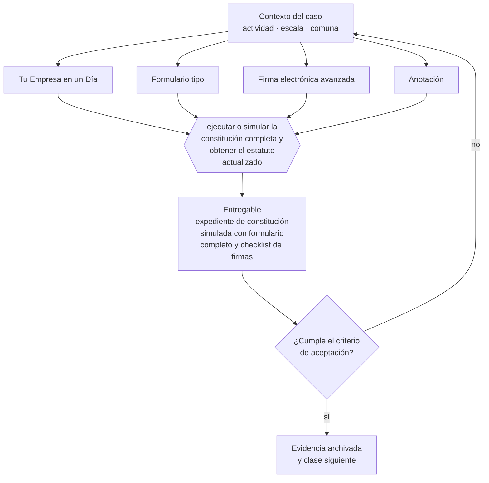

# Clase 072 — Tu Empresa en un Día: flujo completo

> **Parte 06 · Constitución formal de la empresa en Chile** — clase 2 de 14

**Estado de evidencia:** `VERIFICADO-FUENTE` · **Jurisdicción:** Chile-first · **Fecha base normativa:** 07-08-2026 
**Decisión que habilita:** ejecutar o simular la constitución completa y obtener el estatuto actualizado 
**Entregable:** expediente de constitución simulada con formulario completo y checklist de firmas

## 🎯 Propósito

Ejecutar o simular el flujo completo de Tu Empresa en un Día y obtener el certificado de estatuto actualizado, que es el documento que exigirán SII, banco y contrapartes.

## 📚 Resultados de aprendizaje

Al finalizar esta clase podrás:

1. **Definir** con precisión los cuatro conceptos de la tabla siguiente y usarlos para describir un caso real.
2. **Explicar** por qué esta materia condiciona decisiones de otras partes del programa.
3. **Decidir** —ejecutar o simular la constitución completa y obtener el estatuto actualizado— y justificar la decisión por escrito.
4. **Producir** el entregable de la clase y contrastarlo contra su criterio de aceptación.
5. **Distinguir** el dato estable del dato dinámico que exige revalidación en la fuente oficial.

## 🧩 Conceptos centrales

| Concepto | Comprensión verificable |
|---|---|
| **Tu Empresa en un Día** | Plataforma del registro de empresas y sociedades para constitución electrónica. |
| **Formulario tipo** | Documento estandarizado que reemplaza la escritura. |
| **Firma electrónica avanzada** | Firma con certificado que da valor jurídico equivalente a la manuscrita. |
| **Anotación** | Registro de actos posteriores sobre la sociedad constituida. |

## 🗺️ Flujo de razonamiento

## 📖 Desarrollo

### 1. El fondo del asunto

El flujo completo es: elegir tipo societario, completar el formulario, firmar todos los constituyentes con firma electrónica avanzada o ante notario, y obtener el certificado de estatuto actualizado. Ese certificado es el documento que exigirán el SII, el banco y las contrapartes.

### 2. Cómo se traduce en la práctica

El paso que más detiene el trámite no es el formulario sino la firma: todos los constituyentes deben tener firma electrónica avanzada o comparecer ante notario. Conseguir el certificado toma días, de modo que la gestión debe iniciarse antes de abrir la plataforma y no cuando ya está todo completado.

### 3. Marco aplicable y quién interviene

- Ley 20.659 sobre régimen simplificado de constitución (Tu Empresa en un Día)
- Ley 19.799 sobre documentos y firma electrónica
- Ley 20.393 y Ley 19.913 en lo relativo a conocimiento del cliente bancario

**Autoridades o contrapartes involucradas:** Registro de Empresas y Sociedades, SII, Conservador de Bienes Raíces, Diario Oficial.
**Profesionales de apoyo:** abogado corporativo, notario, contador, ejecutivo bancario. La participación concreta depende del riesgo, del
tamaño de la empresa y de la actividad económica.

## 🧪 Taller guiado

Aplica esta clase a **una** de las siguientes líneas de negocio y repite después el ejercicio con
una segunda línea de carga regulatoria distinta:

| Línea | Carga regulatoria |
|---|---|
| SaaS B2B con IA | media |
| Servicios profesionales | baja |
| E-commerce D2C | media |
| Alimentos o foodtech | alta |
| Exportación de servicios | media |
| Fintech regulada | alta |
| Construcción o servicios técnicos | alta |

**Secuencia de trabajo:**

1. Delimita el contexto: actividad económica, escala, comuna y etapa de la empresa.
2. Reúne los antecedentes que la decisión exige y anota la fecha de cada fuente.
3. Identifica las alternativas reales, incluida la de no hacer nada.
4. Evalúa el impacto en mercado, caja, personas, regulación y operación.
5. Toma la decisión y regístrala con sus supuestos.
6. Produce el entregable.
7. Contrástalo contra el criterio de aceptación.
8. Anota lo que requiere validación profesional y programa su revisión.

### 📦 Entregable

Expediente de constitución simulada con formulario completo y checklist de firmas.

Debe incluir decisión, supuestos, fuentes con fecha de consulta, responsable, riesgos
identificados y próximos pasos.

## 🏆 Reto verificable

Resuelve la misma materia para una segunda línea de negocio con distinta carga regulatoria y
explica por escrito **qué cambió, por qué y qué fuente lo determina**.

## ✅ Criterio de aceptación

- [ ] el formulario está completo y coherente con la decisión societaria
- [ ] el mecanismo de firma de cada constituyente está resuelto
- [ ] cada afirmación regulatoria está referida a una fuente oficial con fecha de consulta;
- [ ] los datos dinámicos quedan marcados para revalidación;
- [ ] hay un responsable asignado y evidencia reproducible del trabajo.

## ⚠️ Errores frecuentes

**Propios de esta clase:**

- Iniciar el trámite sin que todos los constituyentes tengan firma electrónica avanzada.
- Completar el objeto social sin revisar las actividades futuras previstas.

**Característicos de la parte 06:**

- Objeto social redactado tan estrecho que impide facturar una línea nueva.
- Usar una razón social o nombre de fantasía que colisiona con una marca registrada.

## 🇨🇱 Checklist Chile

- [ ] ¿existe norma o autoridad específica para esta materia?
- [ ] ¿la fuente consultada está vigente a la fecha de ejecución?
- [ ] ¿se activa algún trámite ante el SII?
- [ ] ¿se activa algún requisito municipal o sectorial?
- [ ] ¿afecta a consumidores o al tratamiento de datos personales?
- [ ] ¿afecta a trabajadores o a la seguridad y salud en el trabajo?
- [ ] ¿afecta a impuestos, contabilidad o caja?
- [ ] ¿afecta a contratos o a propiedad intelectual?
- [ ] ¿requiere renovación, reporte periódico o revalidación?

## ❓ Preguntas de comprobación

1. ¿Todos los constituyentes tienen resuelto su mecanismo de firma y en qué plazo?
2. ¿El objeto que escribiste cubre las actividades previstas a 36 meses?
3. ¿Qué documento entrega el sistema y quién lo custodiará?

## 🔗 Fuentes oficiales

**Registro de Empresas y Sociedades / ChileAtiende — Constitución de empresas**  
<https://www.chileatiende.gob.cl/fichas/21409-tu-empresa> · verificado 2026-08-07

- *Qué contiene:* Describe el régimen simplificado de la Ley 20.659: qué tipos societarios admite el formulario electrónico, quiénes deben firmar, qué documentos entrega el sistema y cómo se hacen después las modificaciones.
- *Cómo leerla:* Entra por el tipo societario que ya elegiste, no al revés. La ficha dice qué campos pide el formulario; si tu estatuto necesita una cláusula que el formulario no soporta, la respuesta es la ruta notarial.

Complementos del repositorio: [glosario](../../../docs/19_GLOSSARY.md) ·
[ruta de lecturas](../../../docs/15_BOOKS_AND_LEARNING_PATH.md) ·
[catálogo de fuentes](../../../docs/16_OFFICIAL_SOURCE_CATALOG.md).

> [!IMPORTANT]
> Material educativo. Para una decisión real de alto impacto hay que verificar la fuente oficial
> vigente y validar con el profesional competente.

---

| Anterior | Índice | Siguiente |
|---|---|---|
| [← 071 · Ruta tradicional versus Registro de Empresas y Sociedades](../class-01-ruta-tradicional-versus-registro-de-empresas-y-sociedades/README.md) | [Parte 06](../README.md) · [Programa](../../../README.md) | [073 · Definir razón social, nombre de fantasía y objeto →](../class-03-definir-razon-social-nombre-de-fantasia-y-objeto/README.md) |
