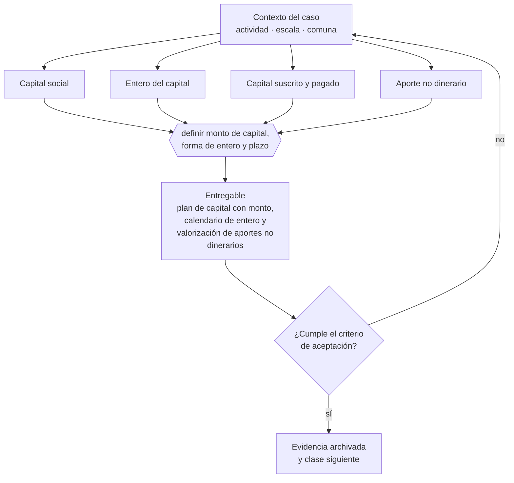

# Clase 075 — Capital social y forma de enterarlo

> **Parte 06 · Constitución formal de la empresa en Chile** — clase 5 de 14

**Estado de evidencia:** `VERIFICADO-FUENTE` · **Jurisdicción:** Chile-first · **Fecha base normativa:** 07-08-2026 
**Decisión que habilita:** definir monto de capital, forma de entero y plazo 
**Entregable:** plan de capital con monto, calendario de entero y valorización de aportes no dinerarios

## 🎯 Propósito

Definir un capital que los socios efectivamente van a enterar, porque el capital declarado y no pagado es una deuda real de los socios con la sociedad.

## 📚 Resultados de aprendizaje

Al finalizar esta clase podrás:

1. **Definir** con precisión los cuatro conceptos de la tabla siguiente y usarlos para describir un caso real.
2. **Explicar** por qué esta materia condiciona decisiones de otras partes del programa.
3. **Decidir** —definir monto de capital, forma de entero y plazo— y justificar la decisión por escrito.
4. **Producir** el entregable de la clase y contrastarlo contra su criterio de aceptación.
5. **Distinguir** el dato estable del dato dinámico que exige revalidación en la fuente oficial.

## 🧩 Conceptos centrales

| Concepto | Comprensión verificable |
|---|---|
| **Capital social** | Monto que los socios se obligan a aportar. |
| **Entero del capital** | Forma y plazo en que efectivamente se paga. |
| **Capital suscrito y pagado** | Comprometido versus efectivamente enterado. |
| **Aporte no dinerario** | Bien o derecho aportado en lugar de dinero. |

## 🗺️ Flujo de razonamiento

## 📖 Desarrollo

### 1. El fondo del asunto

El capital declarado sin enterar es una obligación pendiente de los socios frente a la sociedad y sus acreedores. Declarar un capital alto para aparentar solidez crea una deuda real. El aporte no dinerario exige valorización y, tratándose de ciertos bienes, transferencia formal e inscripción.

### 2. Cómo se traduce en la práctica

Declarar un capital alto para aparentar solidez crea una obligación exigible frente a la sociedad y sus acreedores. Y los aportes no dinerarios de ciertos bienes exigen transferencia formal e inscripción: aportar un vehículo o un inmueble sin ese acto deja el aporte incompleto.

### 3. Marco aplicable y quién interviene

- Ley 20.659 sobre régimen simplificado de constitución (Tu Empresa en un Día)
- Ley 19.799 sobre documentos y firma electrónica
- Ley 20.393 y Ley 19.913 en lo relativo a conocimiento del cliente bancario

**Autoridades o contrapartes involucradas:** Registro de Empresas y Sociedades, SII, Conservador de Bienes Raíces, Diario Oficial.
**Profesionales de apoyo:** abogado corporativo, notario, contador, ejecutivo bancario. La participación concreta depende del riesgo, del
tamaño de la empresa y de la actividad económica.

## 🧪 Taller guiado

Aplica esta clase a **una** de las siguientes líneas de negocio y repite después el ejercicio con
una segunda línea de carga regulatoria distinta:

| Línea | Carga regulatoria |
|---|---|
| SaaS B2B con IA | media |
| Servicios profesionales | baja |
| E-commerce D2C | media |
| Alimentos o foodtech | alta |
| Exportación de servicios | media |
| Fintech regulada | alta |
| Construcción o servicios técnicos | alta |

**Secuencia de trabajo:**

1. Delimita el contexto: actividad económica, escala, comuna y etapa de la empresa.
2. Reúne los antecedentes que la decisión exige y anota la fecha de cada fuente.
3. Identifica las alternativas reales, incluida la de no hacer nada.
4. Evalúa el impacto en mercado, caja, personas, regulación y operación.
5. Toma la decisión y regístrala con sus supuestos.
6. Produce el entregable.
7. Contrástalo contra el criterio de aceptación.
8. Anota lo que requiere validación profesional y programa su revisión.

### 📦 Entregable

Plan de capital con monto, calendario de entero y valorización de aportes no dinerarios.

Debe incluir decisión, supuestos, fuentes con fecha de consulta, responsable, riesgos
identificados y próximos pasos.

## 🏆 Reto verificable

Resuelve la misma materia para una segunda línea de negocio con distinta carga regulatoria y
explica por escrito **qué cambió, por qué y qué fuente lo determina**.

## ✅ Criterio de aceptación

- [ ] el calendario de entero es realista y está documentado
- [ ] los aportes no dinerarios tienen valorización y forma de transferencia
- [ ] cada afirmación regulatoria está referida a una fuente oficial con fecha de consulta;
- [ ] los datos dinámicos quedan marcados para revalidación;
- [ ] hay un responsable asignado y evidencia reproducible del trabajo.

## ⚠️ Errores frecuentes

**Propios de esta clase:**

- Declarar un capital que los socios no van a enterar.
- Aportar un bien sin efectuar la transferencia formal correspondiente.

**Característicos de la parte 06:**

- Objeto social redactado tan estrecho que impide facturar una línea nueva.
- Usar una razón social o nombre de fantasía que colisiona con una marca registrada.

## 🇨🇱 Checklist Chile

- [ ] ¿existe norma o autoridad específica para esta materia?
- [ ] ¿la fuente consultada está vigente a la fecha de ejecución?
- [ ] ¿se activa algún trámite ante el SII?
- [ ] ¿se activa algún requisito municipal o sectorial?
- [ ] ¿afecta a consumidores o al tratamiento de datos personales?
- [ ] ¿afecta a trabajadores o a la seguridad y salud en el trabajo?
- [ ] ¿afecta a impuestos, contabilidad o caja?
- [ ] ¿afecta a contratos o a propiedad intelectual?
- [ ] ¿requiere renovación, reporte periódico o revalidación?

## ❓ Preguntas de comprobación

1. ¿Cuándo y cómo se enterará efectivamente el capital que vas a declarar?
2. ¿Qué aportes no son dinero y qué transferencia formal requieren?
3. ¿Con qué criterio valorizaste cada aporte no dinerario?

## 🔗 Fuentes oficiales

**Registro de Empresas y Sociedades / ChileAtiende — Constitución de empresas**  
<https://www.chileatiende.gob.cl/fichas/21409-tu-empresa> · verificado 2026-08-19

- *Qué contiene:* Describe el régimen simplificado de la Ley 20.659: qué tipos societarios admite el formulario electrónico, quiénes deben firmar, qué documentos entrega el sistema y cómo se hacen después las modificaciones.
- *Cómo leerla:* Entra por el tipo societario que ya elegiste, no al revés. La ficha dice qué campos pide el formulario; si tu estatuto necesita una cláusula que el formulario no soporta, la respuesta es la ruta notarial.
- *Uso en esta clase:* aporta el marco de «Constitución de empresas» para definir monto de capital, forma de entero y plazo.

**Servicio de Impuestos Internos — Nuevos contribuyentes, inicio de actividades y DTE**  
<https://www.sii.cl/ayudas/nuevos_contribuyentes/boleta-vys-facturador.html> · verificado 2026-08-19

- *Qué contiene:* Reúne el circuito completo del contribuyente nuevo: obtención de RUT, declaración de inicio de actividades, elección de códigos de actividad económica y habilitación para emitir documentos tributarios electrónicos.
- *Cómo leerla:* Sepáralo en dos actos distintos que la página trata seguidos: el RUT identifica, el inicio de actividades habilita. Lo que te bloquea para facturar casi siempre está en el segundo, no en el primero.
- *Uso en esta clase:* aporta el marco de «Nuevos contribuyentes, inicio de actividades y DTE» para definir monto de capital, forma de entero y plazo.

Complementos del repositorio: [glosario](../../../docs/19_GLOSSARY.md) ·
[ruta de lecturas](../../../docs/15_BOOKS_AND_LEARNING_PATH.md) ·
[catálogo de fuentes](../../../docs/16_OFFICIAL_SOURCE_CATALOG.md).

> [!IMPORTANT]
> Material educativo. Para una decisión real de alto impacto hay que verificar la fuente oficial
> vigente y validar con el profesional competente.

---

| Anterior | Índice | Siguiente |
|---|---|---|
| [← 074 · Domicilio social, comercial y tributario](../class-04-domicilio-social-comercial-y-tributario/README.md) | [Parte 06](../README.md) · [Programa](../../../README.md) | [076 · Acciones, series y derechos en una SpA →](../class-06-acciones-series-y-derechos-en-una-spa/README.md) |
