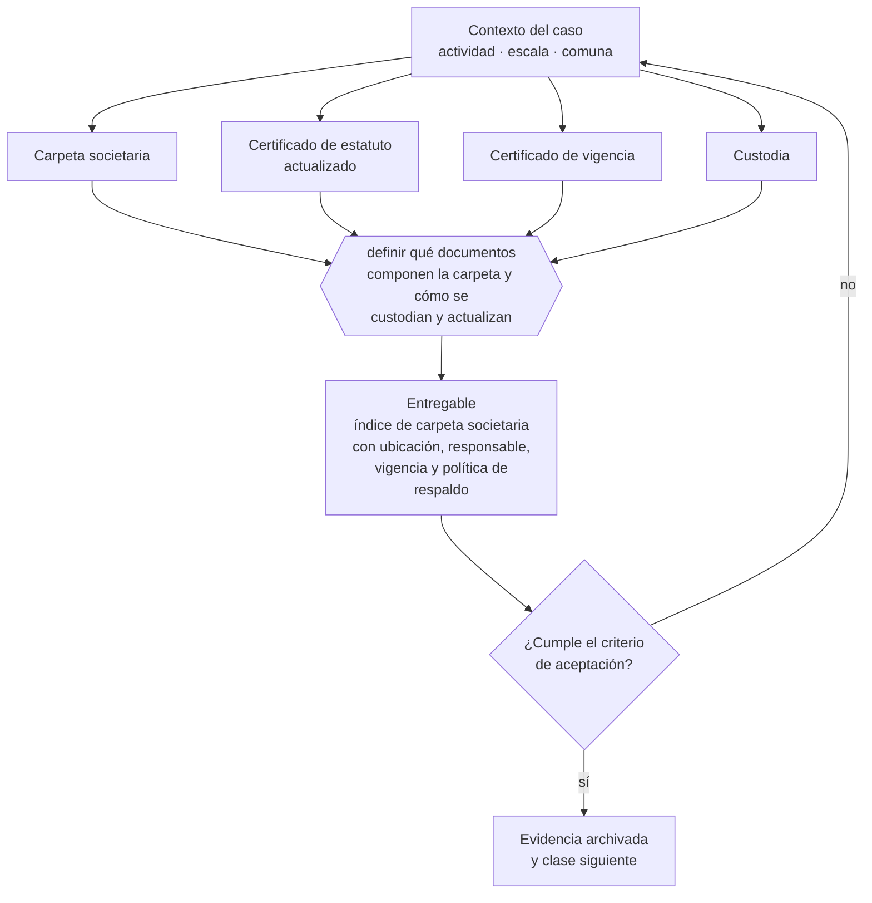

# Clase 080 — Obtención y resguardo de documentos societarios

> **Parte 06 · Constitución formal de la empresa en Chile** — clase 10 de 14

**Estado de evidencia:** `VERIFICADO-FUENTE` · **Jurisdicción:** Chile-first · **Fecha base normativa:** 07-08-2026 
**Decisión que habilita:** definir qué documentos componen la carpeta y cómo se custodian y actualizan 
**Entregable:** índice de carpeta societaria con ubicación, responsable, vigencia y política de respaldo

## 🎯 Propósito

Armar la carpeta societaria al constituir, porque reconstruirla tres años después cuesta semanas y siempre ocurre bajo presión de un tercero.

## 📚 Resultados de aprendizaje

Al finalizar esta clase podrás:

1. **Definir** con precisión los cuatro conceptos de la tabla siguiente y usarlos para describir un caso real.
2. **Explicar** por qué esta materia condiciona decisiones de otras partes del programa.
3. **Decidir** —definir qué documentos componen la carpeta y cómo se custodian y actualizan— y justificar la decisión por escrito.
4. **Producir** el entregable de la clase y contrastarlo contra su criterio de aceptación.
5. **Distinguir** el dato estable del dato dinámico que exige revalidación en la fuente oficial.

## 🧩 Conceptos centrales

| Concepto | Comprensión verificable |
|---|---|
| **Carpeta societaria** | Conjunto ordenado de documentos que acreditan la existencia y facultades. |
| **Certificado de estatuto actualizado** | Documento que refleja el estatuto vigente. |
| **Certificado de vigencia** | Acredita que la sociedad existe y quién la representa. |
| **Custodia** | Resguardo con respaldo, control de acceso y trazabilidad. |

## 🗺️ Flujo de razonamiento

## 📖 Desarrollo

### 1. El fondo del asunto

La carpeta societaria es el primer documento que pide un banco, un cliente grande, un inversionista o un comprador. Armarla al constituir cuesta una hora; reconstruirla tres años después cuesta semanas. Debe mantenerse digital con respaldo y con control de versiones cuando hay modificaciones.

### 2. Cómo se traduce en la práctica

Es el primer documento que pide un banco, un cliente grande, un inversionista o un comprador. Debe mantenerse digital, con respaldo, control de versiones tras cada modificación y acceso de más de una persona: guardarla en el correo de un socio es la forma habitual de perderla.

### 3. Marco aplicable y quién interviene

- Ley 20.659 sobre régimen simplificado de constitución (Tu Empresa en un Día)
- Ley 19.799 sobre documentos y firma electrónica
- Ley 20.393 y Ley 19.913 en lo relativo a conocimiento del cliente bancario

**Autoridades o contrapartes involucradas:** Registro de Empresas y Sociedades, SII, Conservador de Bienes Raíces, Diario Oficial.
**Profesionales de apoyo:** abogado corporativo, notario, contador, ejecutivo bancario. La participación concreta depende del riesgo, del
tamaño de la empresa y de la actividad económica.

## 🧪 Taller guiado

Aplica esta clase a **una** de las siguientes líneas de negocio y repite después el ejercicio con
una segunda línea de carga regulatoria distinta:

| Línea | Carga regulatoria |
|---|---|
| SaaS B2B con IA | media |
| Servicios profesionales | baja |
| E-commerce D2C | media |
| Alimentos o foodtech | alta |
| Exportación de servicios | media |
| Fintech regulada | alta |
| Construcción o servicios técnicos | alta |

**Secuencia de trabajo:**

1. Delimita el contexto: actividad económica, escala, comuna y etapa de la empresa.
2. Reúne los antecedentes que la decisión exige y anota la fecha de cada fuente.
3. Identifica las alternativas reales, incluida la de no hacer nada.
4. Evalúa el impacto en mercado, caja, personas, regulación y operación.
5. Toma la decisión y regístrala con sus supuestos.
6. Produce el entregable.
7. Contrástalo contra el criterio de aceptación.
8. Anota lo que requiere validación profesional y programa su revisión.

### 📦 Entregable

Índice de carpeta societaria con ubicación, responsable, vigencia y política de respaldo.

Debe incluir decisión, supuestos, fuentes con fecha de consulta, responsable, riesgos
identificados y próximos pasos.

## 🏆 Reto verificable

Resuelve la misma materia para una segunda línea de negocio con distinta carga regulatoria y
explica por escrito **qué cambió, por qué y qué fuente lo determina**.

## ✅ Criterio de aceptación

- [ ] existe índice con responsable y vigencia por documento
- [ ] la política de respaldo está definida
- [ ] cada afirmación regulatoria está referida a una fuente oficial con fecha de consulta;
- [ ] los datos dinámicos quedan marcados para revalidación;
- [ ] hay un responsable asignado y evidencia reproducible del trabajo.

## ⚠️ Errores frecuentes

**Propios de esta clase:**

- Guardar los documentos societarios solo en el correo de un socio.
- No actualizar la carpeta después de una modificación estatutaria.

**Característicos de la parte 06:**

- Objeto social redactado tan estrecho que impide facturar una línea nueva.
- Usar una razón social o nombre de fantasía que colisiona con una marca registrada.

## 🇨🇱 Checklist Chile

- [ ] ¿existe norma o autoridad específica para esta materia?
- [ ] ¿la fuente consultada está vigente a la fecha de ejecución?
- [ ] ¿se activa algún trámite ante el SII?
- [ ] ¿se activa algún requisito municipal o sectorial?
- [ ] ¿afecta a consumidores o al tratamiento de datos personales?
- [ ] ¿afecta a trabajadores o a la seguridad y salud en el trabajo?
- [ ] ¿afecta a impuestos, contabilidad o caja?
- [ ] ¿afecta a contratos o a propiedad intelectual?
- [ ] ¿requiere renovación, reporte periódico o revalidación?

## ❓ Preguntas de comprobación

1. ¿Existe un índice de tu carpeta societaria con responsable por documento?
2. ¿Está actualizada después de la última modificación estatutaria?
3. ¿Puede alguien distinto del fundador acceder a ella en una emergencia?

## 🔗 Fuentes oficiales

**Registro de Empresas y Sociedades / ChileAtiende — Constitución de empresas**  
<https://www.chileatiende.gob.cl/fichas/21409-tu-empresa> · verificado 2026-08-19

- *Qué contiene:* Describe el régimen simplificado de la Ley 20.659: qué tipos societarios admite el formulario electrónico, quiénes deben firmar, qué documentos entrega el sistema y cómo se hacen después las modificaciones.
- *Cómo leerla:* Entra por el tipo societario que ya elegiste, no al revés. La ficha dice qué campos pide el formulario; si tu estatuto necesita una cláusula que el formulario no soporta, la respuesta es la ruta notarial.
- *Uso en esta clase:* aporta el marco de «Constitución de empresas» para definir qué documentos componen la carpeta y cómo se custodian y actualizan.

**Servicio de Impuestos Internos — Carpeta Tributaria Electrónica**  
<https://zeus.sii.cl/dii_doc/carpeta_tributaria/html/generar_carpeta.htm> · verificado 2026-08-19

- *Qué contiene:* Permite generar el expediente que acredita la situación tributaria de la empresa: inicio de actividades, régimen, declaraciones presentadas y timbraje.
- *Cómo leerla:* Es el documento que pedirán banco, inversionista y comprador. Genera una hoy aunque no la necesites: lo que muestre es exactamente lo que verá un tercero al evaluarte.
- *Uso en esta clase:* aporta el marco de «Carpeta Tributaria Electrónica» para definir qué documentos componen la carpeta y cómo se custodian y actualizan.

Complementos del repositorio: [glosario](../../../docs/19_GLOSSARY.md) ·
[ruta de lecturas](../../../docs/15_BOOKS_AND_LEARNING_PATH.md) ·
[catálogo de fuentes](../../../docs/16_OFFICIAL_SOURCE_CATALOG.md).

> [!IMPORTANT]
> Material educativo. Para una decisión real de alto impacto hay que verificar la fuente oficial
> vigente y validar con el profesional competente.

---

| Anterior | Índice | Siguiente |
|---|---|---|
| [← 079 · RUT de la persona jurídica](../class-09-rut-de-la-persona-juridica/README.md) | [Parte 06](../README.md) · [Programa](../../../README.md) | [081 · Modificaciones, saneamientos y rectificaciones →](../class-11-modificaciones-saneamientos-y-rectificaciones/README.md) |
