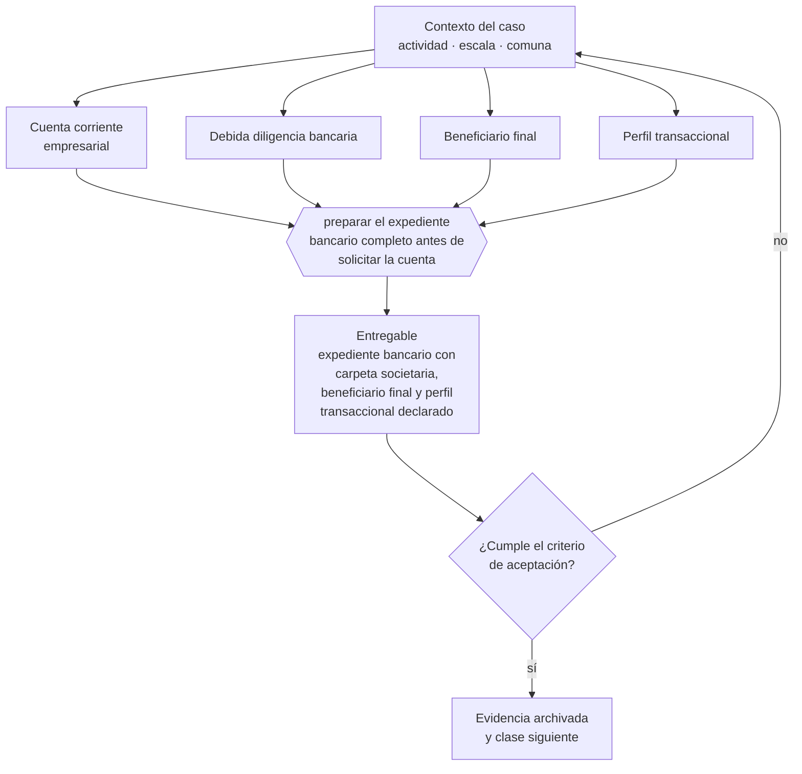

# Clase 083 — Cuenta bancaria empresarial y debida diligencia bancaria

> **Parte 06 · Constitución formal de la empresa en Chile** — clase 13 de 14

**Estado de evidencia:** `VERIFICADO-FUENTE` · **Jurisdicción:** Chile-first · **Fecha base normativa:** 07-08-2026 
**Decisión que habilita:** preparar el expediente bancario completo antes de solicitar la cuenta 
**Entregable:** expediente bancario con carpeta societaria, beneficiario final y perfil transaccional declarado

## 🎯 Propósito

Preparar el expediente bancario completo antes de solicitar la cuenta, porque la debida diligencia del banco es el trámite que más semanas agrega al arranque.

## 📚 Resultados de aprendizaje

Al finalizar esta clase podrás:

1. **Definir** con precisión los cuatro conceptos de la tabla siguiente y usarlos para describir un caso real.
2. **Explicar** por qué esta materia condiciona decisiones de otras partes del programa.
3. **Decidir** —preparar el expediente bancario completo antes de solicitar la cuenta— y justificar la decisión por escrito.
4. **Producir** el entregable de la clase y contrastarlo contra su criterio de aceptación.
5. **Distinguir** el dato estable del dato dinámico que exige revalidación en la fuente oficial.

## 🧩 Conceptos centrales

| Concepto | Comprensión verificable |
|---|---|
| **Cuenta corriente empresarial** | Cuenta bancaria a nombre de la persona jurídica. |
| **Debida diligencia bancaria** | Proceso de conocimiento del cliente exigido al banco. |
| **Beneficiario final** | Persona natural que en última instancia controla la sociedad. |
| **Perfil transaccional** | Volumen y tipo de movimientos declarados al banco. |

## 🗺️ Flujo de razonamiento

## 📖 Desarrollo

### 1. El fondo del asunto

Abrir cuenta empresarial exige carpeta societaria, acreditación de domicilio, declaración de beneficiario final y perfil transaccional. Los bancos aplican Ley 19.913 y pueden rechazar o cerrar cuentas por riesgo. Preparar la documentación completa antes de la solicitud reduce semanas de demora.

### 2. Cómo se traduce en la práctica

Los bancos aplican la Ley 19.913 y exigen carpeta societaria, acreditación de domicilio, declaración de beneficiario final y perfil transaccional. Declarar un perfil que no corresponde al negocio real genera alertas posteriores; operar mientras tanto con la cuenta personal del socio confunde patrimonios y compromete la limitación de responsabilidad.

### 3. Marco aplicable y quién interviene

- Ley 20.659 sobre régimen simplificado de constitución (Tu Empresa en un Día)
- Ley 19.799 sobre documentos y firma electrónica
- Ley 20.393 y Ley 19.913 en lo relativo a conocimiento del cliente bancario

**Autoridades o contrapartes involucradas:** Registro de Empresas y Sociedades, SII, Conservador de Bienes Raíces, Diario Oficial.
**Profesionales de apoyo:** abogado corporativo, notario, contador, ejecutivo bancario. La participación concreta depende del riesgo, del
tamaño de la empresa y de la actividad económica.

## 🧪 Taller guiado

Aplica esta clase a **una** de las siguientes líneas de negocio y repite después el ejercicio con
una segunda línea de carga regulatoria distinta:

| Línea | Carga regulatoria |
|---|---|
| SaaS B2B con IA | media |
| Servicios profesionales | baja |
| E-commerce D2C | media |
| Alimentos o foodtech | alta |
| Exportación de servicios | media |
| Fintech regulada | alta |
| Construcción o servicios técnicos | alta |

**Secuencia de trabajo:**

1. Delimita el contexto: actividad económica, escala, comuna y etapa de la empresa.
2. Reúne los antecedentes que la decisión exige y anota la fecha de cada fuente.
3. Identifica las alternativas reales, incluida la de no hacer nada.
4. Evalúa el impacto en mercado, caja, personas, regulación y operación.
5. Toma la decisión y regístrala con sus supuestos.
6. Produce el entregable.
7. Contrástalo contra el criterio de aceptación.
8. Anota lo que requiere validación profesional y programa su revisión.

### 📦 Entregable

Expediente bancario con carpeta societaria, beneficiario final y perfil transaccional declarado.

Debe incluir decisión, supuestos, fuentes con fecha de consulta, responsable, riesgos
identificados y próximos pasos.

## 🏆 Reto verificable

Resuelve la misma materia para una segunda línea de negocio con distinta carga regulatoria y
explica por escrito **qué cambió, por qué y qué fuente lo determina**.

## ✅ Criterio de aceptación

- [ ] el expediente incluye beneficiario final identificado
- [ ] el perfil transaccional declarado es coherente con el modelo de negocio
- [ ] cada afirmación regulatoria está referida a una fuente oficial con fecha de consulta;
- [ ] los datos dinámicos quedan marcados para revalidación;
- [ ] hay un responsable asignado y evidencia reproducible del trabajo.

## ⚠️ Errores frecuentes

**Propios de esta clase:**

- Declarar un perfil transaccional que no corresponde al negocio real.
- Operar con la cuenta personal del socio y mezclar patrimonios.

**Característicos de la parte 06:**

- Objeto social redactado tan estrecho que impide facturar una línea nueva.
- Usar una razón social o nombre de fantasía que colisiona con una marca registrada.

## 🇨🇱 Checklist Chile

- [ ] ¿existe norma o autoridad específica para esta materia?
- [ ] ¿la fuente consultada está vigente a la fecha de ejecución?
- [ ] ¿se activa algún trámite ante el SII?
- [ ] ¿se activa algún requisito municipal o sectorial?
- [ ] ¿afecta a consumidores o al tratamiento de datos personales?
- [ ] ¿afecta a trabajadores o a la seguridad y salud en el trabajo?
- [ ] ¿afecta a impuestos, contabilidad o caja?
- [ ] ¿afecta a contratos o a propiedad intelectual?
- [ ] ¿requiere renovación, reporte periódico o revalidación?

## ❓ Preguntas de comprobación

1. ¿Quién es el beneficiario final de tu sociedad y puedes acreditarlo documentalmente?
2. ¿El perfil transaccional que declararás corresponde a tu modelo de negocio real?
3. ¿Qué operaciones estás haciendo hoy por una cuenta personal?

## 🔗 Fuentes oficiales

**Unidad de Análisis Financiero — Sujetos obligados · Ley 19.913**  
<https://www.uaf.cl/entidades/quienes.aspx> · verificado 2026-08-07

- *Qué contiene:* Enumera los sectores obligados a reportar, las obligaciones que se activan —designar oficial de cumplimiento, mantener registros, reportar ROS y ROE— y los umbrales aplicables.
- *Cómo leerla:* Busca tu actividad en la lista literal antes de asumir que no te aplica: inmobiliarias, casas de cambio, corredores y varias actividades con manejo de efectivo entran sin ser instituciones financieras.

**Biblioteca del Congreso Nacional · LeyChile — Normativa oficial consolidada**  
<https://www.bcn.cl/leychile/> · verificado 2026-08-07

- *Qué contiene:* Publica el texto oficial y consolidado de leyes, decretos y reglamentos, con la versión vigente a una fecha, el historial de modificaciones y la tramitación que las originó.
- *Cómo leerla:* Usa siempre el selector de versión vigente a la fecha en que ejecutarás el trámite, no la última publicada. Y lee el artículo transitorio: en normas en implantación gradual —jornada, datos personales— ahí está la fecha que realmente te aplica.

Complementos del repositorio: [glosario](../../../docs/19_GLOSSARY.md) ·
[ruta de lecturas](../../../docs/15_BOOKS_AND_LEARNING_PATH.md) ·
[catálogo de fuentes](../../../docs/16_OFFICIAL_SOURCE_CATALOG.md).

> [!IMPORTANT]
> Material educativo. Para una decisión real de alto impacto hay que verificar la fuente oficial
> vigente y validar con el profesional competente.

---

| Anterior | Índice | Siguiente |
|---|---|---|
| [← 082 · Transformación, fusión y división](../class-12-transformacion-fusion-y-division/README.md) | [Parte 06](../README.md) · [Programa](../../../README.md) | [084 · Checklist de empresa jurídicamente lista →](../class-14-checklist-de-empresa-juridicamente-lista/README.md) |
