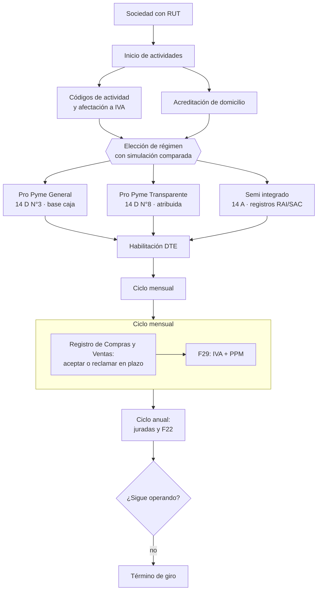

# Parte 07 — SII y ciclo tributario de principio a fin

> *El ciclo tributario es una máquina de plazos que no se detiene*

**Estado de evidencia:** `VERIFICADO-FUENTE` · **Clases:** 14 (085–098) · **Fecha base normativa:** 07-08-2026 
**Conceptos definidos en esta parte:** 56

## 🎯 De qué trata esta parte

Iniciar actividades enciende un reloj. Desde ese día la empresa tiene obligaciones mensuales y anuales con fecha fija, se declare o no actividad, haya o no ventas. Entender el ciclo como una máquina de plazos —y no como una serie de trámites— es lo que permite organizar la contabilidad para llegar a tiempo en vez de reaccionar cada mes.

La decisión de mayor impacto es el régimen, y la única forma responsable de tomarla es simular el mismo escenario bajo cada régimen elegible incluyendo el impuesto que pagarán los socios al retirar. Comparar solo la tasa de la empresa lleva sistemáticamente a la elección equivocada, porque los regímenes chilenos integran ambos niveles: Pro Pyme General tributa en la empresa con crédito para los dueños, Transparente atribuye la renta directamente a los propietarios, y el semi integrado restituye parte del crédito.

El otro contenido crítico de la parte es el IVA, y en particular una idea que salva empresas: el IVA recaudado no es ingreso. Es dinero del fisco que la empresa retiene unas semanas. Usarlo como capital de trabajo produce la crisis de caja más común y más evitable de la pyme chilena, porque la obligación llega igual cada mes.

## 📚 Resultados de la parte

Al terminar esta parte podrás:

1. **Ejecutar inicio de actividades y elegir régimen con criterio, no por defecto**.
2. **Operar el ciclo mensual de IVA y PPM sin sorpresas de caja**.
3. **Emitir y controlar documentos tributarios electrónicos correctamente**.
4. **Preparar la Operación Renta con contabilidad conciliada**.

## 🗺️ Mapa de la parte

## ⚖️ Marco aplicable

- DL 824 sobre impuesto a la renta y DL 825 sobre impuesto a las ventas y servicios
- Código Tributario (DL 830)
- Ley 21.210 de modernización tributaria y Ley 21.713 de cumplimiento tributario
- regímenes Pro Pyme General (14 D N°3), Pro Pyme Transparente (14 D N°8) y Semi Integrado (14 A)

**Autoridades o contrapartes:** SII, Tesorería General de la República.
**Profesionales de apoyo:** contador, asesor tributario, abogado tributario.

## ⚠️ Riesgos característicos

- Elegir régimen por recomendación genérica sin mirar la estructura de socios.
- Usar el iva recaudado como capital de trabajo y no poder pagar el f29.
- Códigos de actividad económica incompletos que impiden facturar una línea.
- No conciliar el registro de compras y ventas con la contabilidad propia.

## 📘 Las 14 clases

| # | Global | Clase | Decisión que habilita |
|---:|---:|---|---|
| 01 | 085 | [Arquitectura tributaria chilena para empresas](class-01-arquitectura-tributaria-chilena-para-empresas/README.md) | comprender la estructura antes de elegir régimen y política de retiros |
| 02 | 086 | [Inicio de actividades en SII](class-02-inicio-de-actividades-en-sii/README.md) | declarar inicio de actividades con giros correctos y régimen elegido |
| 03 | 087 | [Actividades económicas, giros y códigos](class-03-actividades-economicas-giros-y-codigos/README.md) | seleccionar los códigos de actividad que cubren el negocio actual y previsto |
| 04 | 088 | [Acreditación de domicilio ante SII](class-04-acreditacion-de-domicilio-ante-sii/README.md) | reunir el título que acredita el domicilio antes de declarar el inicio |
| 05 | 089 | [Selección de régimen tributario](class-05-seleccion-de-regimen-tributario/README.md) | elegir el régimen tributario con simulación comparada documentada |
| 06 | 090 | [Pro Pyme General](class-06-pro-pyme-general/README.md) | determinar si Pro Pyme General es el régimen adecuado para el caso |
| 07 | 091 | [Pro Pyme Transparente](class-07-pro-pyme-transparente/README.md) | determinar si la transparencia conviene según los tramos de los socios y la política de reinversión |
| 08 | 092 | [Régimen General semi integrado y otros regímenes](class-08-regimen-general-semi-integrado-y-otros-regimenes/README.md) | determinar si el caso obliga o conviene el régimen general y qué capacidad contable exige |
| 09 | 093 | [IVA: débito, crédito y hechos gravados](class-09-iva-debito-credito-y-hechos-gravados/README.md) | determinar la afectación a IVA de cada línea y separar el IVA recaudado de la caja operativa |
| 10 | 094 | [Documentos tributarios electrónicos DTE](class-10-documentos-tributarios-electronicos-dte/README.md) | definir el sistema de emisión y el procedimiento de corrección de documentos |
| 11 | 095 | [Registro de Compras y Ventas](class-11-registro-de-compras-y-ventas/README.md) | definir la rutina de revisión, aceptación o reclamo de documentos recibidos |
| 12 | 096 | [Formulario 29, PPM y ciclo mensual](class-12-formulario-29-ppm-y-ciclo-mensual/README.md) | definir el calendario mensual que asegura declarar y pagar en plazo |
| 13 | 097 | [Operación Renta, F22 y declaraciones juradas](class-13-operacion-renta-f22-y-declaraciones-juradas/README.md) | preparar el cierre anual y las declaraciones juradas antes del período de Operación Renta |
| 14 | 098 | [Modificaciones, fiscalización y término de giro](class-14-modificaciones-fiscalizacion-y-termino-de-giro/README.md) | mantener actualizada la información ante el SII y planificar el cierre cuando corresponda |

## 🔤 Glosario de la parte

| Concepto | Definición operacional |
|---|---|
| **Aceptación o reclamo** | Acción sobre facturas recibidas dentro del plazo legal. |
| **Acreditación de domicilio** | Prueba del derecho a usar el lugar declarado. |
| **Acuse de recibo** | Confirmación de recepción de mercadería o servicio. |
| **Afectación a IVA** | Condición del código que determina si la actividad está gravada. |
| **Atribución** | Asignación de la renta a los socios aunque no se haya retirado. |
| **Cambio de régimen** | Paso de un régimen a otro, con plazos y efectos definidos. |
| **Conciliación** | Comparación entre el rcv y la contabilidad propia. |
| **Crédito fiscal** | Iva soportado en las compras que da derecho a rebaja. |
| **Crédito por impuesto de primera categoría** | Imputación contra los impuestos finales de los socios. |
| **Código de actividad económica** | Clasificador que identifica el giro ante el sii. |
| **Declaración jurada** | Informe anual con información específica exigida al contribuyente. |
| **Domicilio virtual** | Oficina compartida o coworking usado como domicilio tributario. |
| **DTE** | Documento tributario electrónico: factura, boleta, nota de crédito y débito. |
| **Débito fiscal** | Iva recargado en las ventas del período. |
| **Exención** | Operación que la ley libera del impuesto. |
| **Facturador gratuito** | Sistema del sii para emisión sin software propio. |
| **Fecha de vencimiento** | Día del mes en que vence según medio de pago y tipo de contribuyente. |
| **Fiscalización** | Proceso de revisión del sii sobre el cumplimiento del contribuyente. |
| **Folios** | Numeración autorizada por el sii para emitir. |
| **Formulario 22** | Declaración anual de renta. |
| **Formulario 29** | Declaración mensual de iva y retenciones. |
| **Giro principal** | Actividad de mayor relevancia económica. |
| **Giro secundario** | Actividad adicional declarada. |
| **Habilitación para emitir DTE** | Autorización para emitir documentos tributarios electrónicos. |
| **Hecho gravado** | Operación que la ley afecta con iva. |
| **Impuesto de primera categoría** | Impuesto que grava la renta de la empresa. |
| **Impuestos finales** | Global complementario o adicional que pagan los dueños al retirar. |
| **Inicio de actividades** | Declaración jurada ante el sii de que se comenzará una actividad económica. |
| **Integración** | Mecanismo por el que el impuesto de la empresa se imputa al de los dueños. |
| **IVA** | Impuesto al valor agregado sobre ventas y servicios gravados. |
| **Límite de ingresos** | Tope promedio de ingresos que condiciona la permanencia. |
| **Modificación de datos** | Aviso al sii de cambios de domicilio, giro, socios o representante. |
| **Multa e interés** | Recargo por declaración o pago fuera de plazo. |
| **Nota de crédito** | Documento que anula o rebaja una operación previa. |
| **Observación** | Inconsistencia detectada por el sii que debe resolverse. |
| **Operación Renta** | Proceso anual de declaración y fiscalización. |
| **Plazo legal** | Tiempo desde el inicio efectivo para presentar la declaración. |
| **PPM** | Pago provisional mensual a cuenta del impuesto anual. |
| **Prescripción** | Plazo tras el cual el sii no puede revisar ni cobrar. |
| **Pro Pyme General** | Régimen del artículo 14 d n°3, con contabilidad simplificada y tributación a nivel empresa. |
| **Pro Pyme Transparente** | Régimen del artículo 14 d n°8, sin impuesto a nivel de empresa. |
| **Registro de Compras y Ventas** | Registro electrónico del sii que consolida los dte. |
| **Registros empresariales** | Rai, ddan, rex y sac que controlan rentas y créditos. |
| **Renta presunta** | Régimen especial para ciertas actividades con base presunta. |
| **Requisito de ingreso** | Condiciones de ingresos, capital y tipo de socios para acceder. |
| **Requisito de propietarios** | Exige que los dueños sean contribuyentes de impuestos finales. |
| **Restitución** | Porción del crédito que el socio debe devolver. |
| **Régimen general semi integrado** | Régimen del artículo 14 a, con imputación parcial del crédito. |
| **Régimen tributario** | Conjunto de reglas de determinación y pago del impuesto. |
| **Simulación comparada** | Cálculo del resultado bajo cada régimen para el mismo escenario. |
| **Transparencia** | La renta se atribuye directamente a los propietarios. |
| **Tributación en base a caja** | Reconocimiento de ingresos y gastos percibidos y pagados. |
| **Término de giro** | Acto que cierra la vida tributaria de la empresa. |
| **Título que habilita** | Escritura, contrato de arriendo, comodato o autorización del propietario. |
| **Verificación de actividad** | Proceso por el que el sii confirma la operación declarada. |
| **Verificación en terreno** | Visita o revisión del sii para confirmar la actividad. |

## 🔗 Cómo se conecta

Recibe de la parte 06 la sociedad constituida y exige de la parte 08 la contabilidad que sostiene las declaraciones. Su régimen condiciona la política de retiros de la parte 09 y el efecto tributario de las reorganizaciones de la parte 20 y de la venta de la parte 22.

## 📖 Pauta bibliográfica

- DL 824 (renta) y DL 825 (IVA); Código Tributario DL 830.
- Ley 21.210 de modernización tributaria y Ley 21.713 de cumplimiento tributario.
- SII — comparativo de regímenes de la Operación Renta vigente, con fecha de consulta anotada.

## 🏛️ Fuentes oficiales de la parte

**Servicio de Impuestos Internos — Nuevos contribuyentes, inicio de actividades y DTE**  
<https://www.sii.cl/ayudas/nuevos_contribuyentes/boleta-vys-facturador.html> · verificado 2026-08-07

- *Qué contiene:* Reúne el circuito completo del contribuyente nuevo: obtención de RUT, declaración de inicio de actividades, elección de códigos de actividad económica y habilitación para emitir documentos tributarios electrónicos.
- *Cómo leerla:* Sepáralo en dos actos distintos que la página trata seguidos: el RUT identifica, el inicio de actividades habilita. Lo que te bloquea para facturar casi siempre está en el segundo, no en el primero.

**Servicio de Impuestos Internos — Regímenes tributarios · Operación Renta 2026**  
<https://www.sii.cl/destacados/renta/2026/intermediarios/regimenes_tributarios/> · verificado 2026-08-07

- *Qué contiene:* Compara los regímenes vigentes: requisitos de ingreso y permanencia, tipo de propietarios admitidos, forma de determinar la base imponible y cómo se imputa el crédito contra los impuestos finales de los dueños.
- *Cómo leerla:* Lee primero la columna de requisitos de propietarios: descarta regímenes antes de comparar tasas. Las tasas cambian por ley y por período transitorio, así que anota la fecha de consulta junto a cada cifra que uses.

**Servicio de Impuestos Internos — Registro de Compras y Ventas**  
<https://www.sii.cl/destacados/f29/registrocompraventas.htm> · verificado 2026-08-07

- *Qué contiene:* Explica cómo el SII consolida los documentos tributarios electrónicos recibidos y emitidos, y cómo esa consolidación propone la declaración mensual de IVA.
- *Cómo leerla:* Fíjate en los plazos de aceptación o reclamo de una factura recibida: la página los trata como un detalle operativo, pero dejarlos vencer equivale a aceptar la factura con efecto tributario y mérito ejecutivo.

**Servicio de Impuestos Internos — Formulario 22 y Operación Renta**  
<https://www.sii.cl/ayudas/formularios/3094-form22-3097.html> · verificado 2026-08-07

- *Qué contiene:* Publica el formulario anual de renta, sus instrucciones línea por línea y las declaraciones juradas que deben presentarse antes de él.
- *Cómo leerla:* Empieza por el calendario de declaraciones juradas, no por el formulario: una jurada omitida genera observación y retiene la devolución aunque el F22 esté bien.

**Servicio de Impuestos Internos — Carpeta Tributaria Electrónica**  
<https://zeus.sii.cl/dii_doc/carpeta_tributaria/html/generar_carpeta.htm> · verificado 2026-08-07

- *Qué contiene:* Permite generar el expediente que acredita la situación tributaria de la empresa: inicio de actividades, régimen, declaraciones presentadas y timbraje.
- *Cómo leerla:* Es el documento que pedirán banco, inversionista y comprador. Genera una hoy aunque no la necesites: lo que muestre es exactamente lo que verá un tercero al evaluarte.

**Biblioteca del Congreso Nacional · LeyChile — Normativa oficial consolidada**  
<https://www.bcn.cl/leychile/> · verificado 2026-08-07

- *Qué contiene:* Publica el texto oficial y consolidado de leyes, decretos y reglamentos, con la versión vigente a una fecha, el historial de modificaciones y la tramitación que las originó.
- *Cómo leerla:* Usa siempre el selector de versión vigente a la fecha en que ejecutarás el trámite, no la última publicada. Y lee el artículo transitorio: en normas en implantación gradual —jornada, datos personales— ahí está la fecha que realmente te aplica.

---

| Anterior | Índice | Siguiente |
|---|---|---|
| [← Parte 06 · Constitución formal de la empresa en Chile](../part-06-constitucion-formal-de-la-empresa-en-chile/README.md) | [Currículo](../../CURRICULUM.md) · [Programa](../../README.md) | [Parte 08 · Contabilidad y estados financieros →](../part-08-contabilidad-y-estados-financieros/README.md) |
