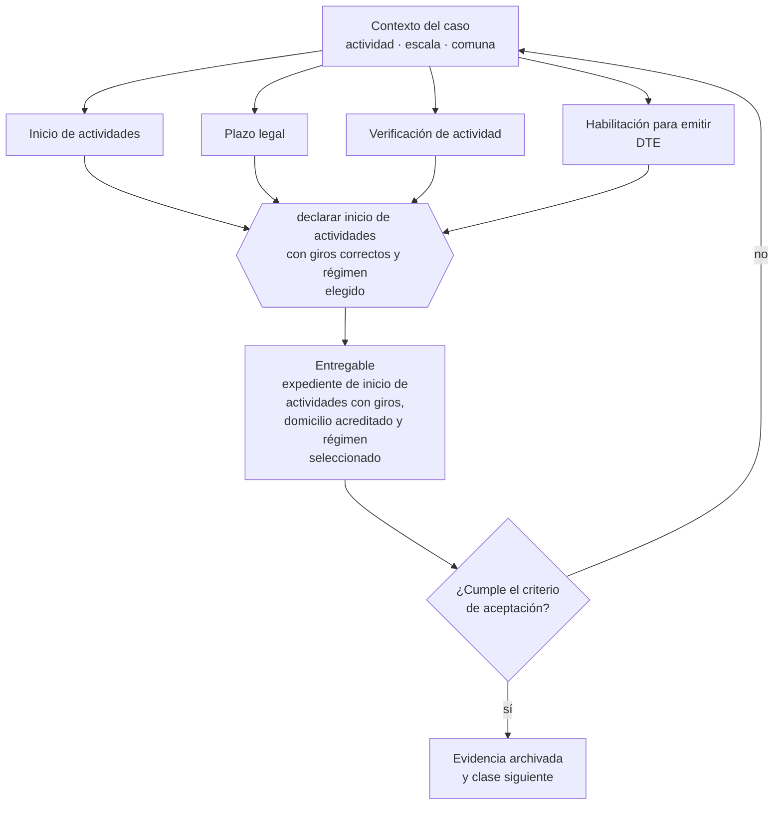

# Clase 086 — Inicio de actividades en SII

> **Parte 07 · SII y ciclo tributario de principio a fin** — clase 2 de 14

**Estado de evidencia:** `VERIFICADO-FUENTE` · **Jurisdicción:** Chile-first · **Fecha base normativa:** 07-08-2026 
**Decisión que habilita:** declarar inicio de actividades con giros correctos y régimen elegido 
**Entregable:** expediente de inicio de actividades con giros, domicilio acreditado y régimen seleccionado

## 🎯 Propósito

Ejecutar el inicio de actividades entendiendo que es el acto que enciende el reloj de las obligaciones mensuales, se venda o no.

## 📚 Resultados de aprendizaje

Al finalizar esta clase podrás:

1. **Definir** con precisión los cuatro conceptos de la tabla siguiente y usarlos para describir un caso real.
2. **Explicar** por qué esta materia condiciona decisiones de otras partes del programa.
3. **Decidir** —declarar inicio de actividades con giros correctos y régimen elegido— y justificar la decisión por escrito.
4. **Producir** el entregable de la clase y contrastarlo contra su criterio de aceptación.
5. **Distinguir** el dato estable del dato dinámico que exige revalidación en la fuente oficial.

## 🧩 Conceptos centrales

| Concepto | Comprensión verificable |
|---|---|
| **Inicio de actividades** | Declaración jurada ante el sii de que se comenzará una actividad económica. |
| **Plazo legal** | Tiempo desde el inicio efectivo para presentar la declaración. |
| **Verificación de actividad** | Proceso por el que el sii confirma la operación declarada. |
| **Habilitación para emitir DTE** | Autorización para emitir documentos tributarios electrónicos. |

## 🗺️ Flujo de razonamiento

## 📖 Desarrollo

### 1. El fondo del asunto

El inicio de actividades es el acto que convierte a la sociedad en contribuyente operativo: activa obligaciones mensuales, habilita la emisión de documentos y fija el régimen. Se declara en línea y puede requerir verificación de domicilio y actividad antes de habilitar la emisión.

### 2. Cómo se traduce en la práctica

Desde ese momento hay F29 mensual y calendario anual, con independencia de que haya actividad. El SII puede además verificar domicilio y actividad antes de habilitar la emisión de documentos, de modo que la fecha de inicio debe elegirse considerando cuándo se podrá facturar realmente.

### 3. Marco aplicable y quién interviene

- DL 824 sobre impuesto a la renta y DL 825 sobre impuesto a las ventas y servicios
- Código Tributario (DL 830)
- Ley 21.210 de modernización tributaria y Ley 21.713 de cumplimiento tributario
- regímenes Pro Pyme General (14 D N°3), Pro Pyme Transparente (14 D N°8) y Semi Integrado (14 A)

**Autoridades o contrapartes involucradas:** SII, Tesorería General de la República.
**Profesionales de apoyo:** contador, asesor tributario, abogado tributario. La participación concreta depende del riesgo, del
tamaño de la empresa y de la actividad económica.

## 🧪 Taller guiado

Aplica esta clase a **una** de las siguientes líneas de negocio y repite después el ejercicio con
una segunda línea de carga regulatoria distinta:

| Línea | Carga regulatoria |
|---|---|
| SaaS B2B con IA | media |
| Servicios profesionales | baja |
| E-commerce D2C | media |
| Alimentos o foodtech | alta |
| Exportación de servicios | media |
| Fintech regulada | alta |
| Construcción o servicios técnicos | alta |

**Secuencia de trabajo:**

1. Delimita el contexto: actividad económica, escala, comuna y etapa de la empresa.
2. Reúne los antecedentes que la decisión exige y anota la fecha de cada fuente.
3. Identifica las alternativas reales, incluida la de no hacer nada.
4. Evalúa el impacto en mercado, caja, personas, regulación y operación.
5. Toma la decisión y regístrala con sus supuestos.
6. Produce el entregable.
7. Contrástalo contra el criterio de aceptación.
8. Anota lo que requiere validación profesional y programa su revisión.

### 📦 Entregable

Expediente de inicio de actividades con giros, domicilio acreditado y régimen seleccionado.

Debe incluir decisión, supuestos, fuentes con fecha de consulta, responsable, riesgos
identificados y próximos pasos.

## 🏆 Reto verificable

Resuelve la misma materia para una segunda línea de negocio con distinta carga regulatoria y
explica por escrito **qué cambió, por qué y qué fuente lo determina**.

## ✅ Criterio de aceptación

- [ ] los giros declarados cubren las actividades previstas
- [ ] el domicilio cuenta con documento de acreditación
- [ ] cada afirmación regulatoria está referida a una fuente oficial con fecha de consulta;
- [ ] los datos dinámicos quedan marcados para revalidación;
- [ ] hay un responsable asignado y evidencia reproducible del trabajo.

## ⚠️ Errores frecuentes

**Propios de esta clase:**

- Operar y facturar antes de presentar el inicio de actividades.
- Declarar un domicilio que no se puede acreditar en la verificación.

**Característicos de la parte 07:**

- Elegir régimen por recomendación genérica sin mirar la estructura de socios.
- Usar el iva recaudado como capital de trabajo y no poder pagar el f29.

## 🇨🇱 Checklist Chile

- [ ] ¿existe norma o autoridad específica para esta materia?
- [ ] ¿la fuente consultada está vigente a la fecha de ejecución?
- [ ] ¿se activa algún trámite ante el SII?
- [ ] ¿se activa algún requisito municipal o sectorial?
- [ ] ¿afecta a consumidores o al tratamiento de datos personales?
- [ ] ¿afecta a trabajadores o a la seguridad y salud en el trabajo?
- [ ] ¿afecta a impuestos, contabilidad o caja?
- [ ] ¿afecta a contratos o a propiedad intelectual?
- [ ] ¿requiere renovación, reporte periódico o revalidación?

## ❓ Preguntas de comprobación

1. ¿Tus giros declarados cubren todas las líneas que planeas facturar?
2. ¿Tienes el documento que acredita el domicilio para la verificación?
3. ¿Desde qué mes asumirás obligaciones mensuales aunque no vendas?

## 🔗 Fuentes oficiales

**Servicio de Impuestos Internos — Nuevos contribuyentes, inicio de actividades y DTE**  
<https://www.sii.cl/ayudas/nuevos_contribuyentes/boleta-vys-facturador.html> · verificado 2026-08-19

- *Qué contiene:* Reúne el circuito completo del contribuyente nuevo: obtención de RUT, declaración de inicio de actividades, elección de códigos de actividad económica y habilitación para emitir documentos tributarios electrónicos.
- *Cómo leerla:* Sepáralo en dos actos distintos que la página trata seguidos: el RUT identifica, el inicio de actividades habilita. Lo que te bloquea para facturar casi siempre está en el segundo, no en el primero.
- *Uso en esta clase:* aporta el marco de «Nuevos contribuyentes, inicio de actividades y DTE» para declarar inicio de actividades con giros correctos y régimen elegido.

Complementos del repositorio: [glosario](../../../docs/19_GLOSSARY.md) ·
[ruta de lecturas](../../../docs/15_BOOKS_AND_LEARNING_PATH.md) ·
[catálogo de fuentes](../../../docs/16_OFFICIAL_SOURCE_CATALOG.md).

> [!IMPORTANT]
> Material educativo. Para una decisión real de alto impacto hay que verificar la fuente oficial
> vigente y validar con el profesional competente.

---

| Anterior | Índice | Siguiente |
|---|---|---|
| [← 085 · Arquitectura tributaria chilena para empresas](../class-01-arquitectura-tributaria-chilena-para-empresas/README.md) | [Parte 07](../README.md) · [Programa](../../../README.md) | [087 · Actividades económicas, giros y códigos →](../class-03-actividades-economicas-giros-y-codigos/README.md) |
