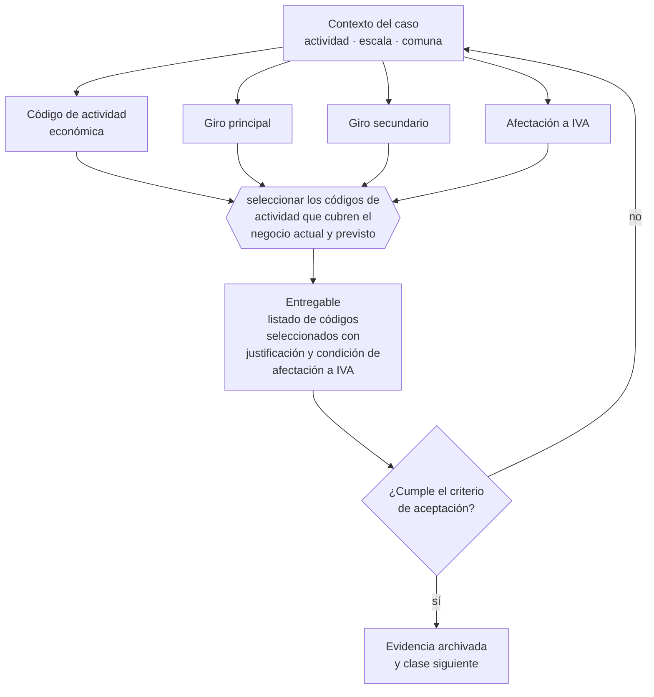

# Clase 087 — Actividades económicas, giros y códigos

> **Parte 07 · SII y ciclo tributario de principio a fin** — clase 3 de 14

**Estado de evidencia:** `VERIFICADO-FUENTE` · **Jurisdicción:** Chile-first · **Fecha base normativa:** 07-08-2026 
**Decisión que habilita:** seleccionar los códigos de actividad que cubren el negocio actual y previsto 
**Entregable:** listado de códigos seleccionados con justificación y condición de afectación a IVA

## 🎯 Propósito

Seleccionar códigos de actividad económica que cubran el negocio actual y el previsto, verificando la afectación a IVA de cada uno.

## 📚 Resultados de aprendizaje

Al finalizar esta clase podrás:

1. **Definir** con precisión los cuatro conceptos de la tabla siguiente y usarlos para describir un caso real.
2. **Explicar** por qué esta materia condiciona decisiones de otras partes del programa.
3. **Decidir** —seleccionar los códigos de actividad que cubren el negocio actual y previsto— y justificar la decisión por escrito.
4. **Producir** el entregable de la clase y contrastarlo contra su criterio de aceptación.
5. **Distinguir** el dato estable del dato dinámico que exige revalidación en la fuente oficial.

## 🧩 Conceptos centrales

| Concepto | Comprensión verificable |
|---|---|
| **Código de actividad económica** | Clasificador que identifica el giro ante el sii. |
| **Giro principal** | Actividad de mayor relevancia económica. |
| **Giro secundario** | Actividad adicional declarada. |
| **Afectación a IVA** | Condición del código que determina si la actividad está gravada. |

## 🗺️ Flujo de razonamiento

## 📖 Desarrollo

### 1. El fondo del asunto

Los códigos determinan si la actividad está afecta a IVA, qué documentos se pueden emitir y cómo se clasifica la empresa para efectos estadísticos y de fomento. Un código faltante impide facturar esa línea; un código mal elegido puede afectar indebidamente al IVA una actividad exenta.

### 2. Cómo se traduce en la práctica

Un código faltante impide facturar esa línea hasta agregarlo; uno mal elegido puede afectar indebidamente al IVA una actividad exenta o al revés. Elegir por similitud de nombre sin verificar la afectación es el error que aparece cuando ya se emitieron documentos y hay que rectificar.

### 3. Marco aplicable y quién interviene

- DL 824 sobre impuesto a la renta y DL 825 sobre impuesto a las ventas y servicios
- Código Tributario (DL 830)
- Ley 21.210 de modernización tributaria y Ley 21.713 de cumplimiento tributario
- regímenes Pro Pyme General (14 D N°3), Pro Pyme Transparente (14 D N°8) y Semi Integrado (14 A)

**Autoridades o contrapartes involucradas:** SII, Tesorería General de la República.
**Profesionales de apoyo:** contador, asesor tributario, abogado tributario. La participación concreta depende del riesgo, del
tamaño de la empresa y de la actividad económica.

## 🧪 Taller guiado

Aplica esta clase a **una** de las siguientes líneas de negocio y repite después el ejercicio con
una segunda línea de carga regulatoria distinta:

| Línea | Carga regulatoria |
|---|---|
| SaaS B2B con IA | media |
| Servicios profesionales | baja |
| E-commerce D2C | media |
| Alimentos o foodtech | alta |
| Exportación de servicios | media |
| Fintech regulada | alta |
| Construcción o servicios técnicos | alta |

**Secuencia de trabajo:**

1. Delimita el contexto: actividad económica, escala, comuna y etapa de la empresa.
2. Reúne los antecedentes que la decisión exige y anota la fecha de cada fuente.
3. Identifica las alternativas reales, incluida la de no hacer nada.
4. Evalúa el impacto en mercado, caja, personas, regulación y operación.
5. Toma la decisión y regístrala con sus supuestos.
6. Produce el entregable.
7. Contrástalo contra el criterio de aceptación.
8. Anota lo que requiere validación profesional y programa su revisión.

### 📦 Entregable

Listado de códigos seleccionados con justificación y condición de afectación a iva.

Debe incluir decisión, supuestos, fuentes con fecha de consulta, responsable, riesgos
identificados y próximos pasos.

## 🏆 Reto verificable

Resuelve la misma materia para una segunda línea de negocio con distinta carga regulatoria y
explica por escrito **qué cambió, por qué y qué fuente lo determina**.

## ✅ Criterio de aceptación

- [ ] cada código tiene justificación y condición de IVA identificada
- [ ] los códigos cubren las líneas previstas a 24 meses
- [ ] cada afirmación regulatoria está referida a una fuente oficial con fecha de consulta;
- [ ] los datos dinámicos quedan marcados para revalidación;
- [ ] hay un responsable asignado y evidencia reproducible del trabajo.

## ⚠️ Errores frecuentes

**Propios de esta clase:**

- Declarar un solo código y no poder facturar una línea nueva.
- Elegir un código por similitud de nombre sin verificar su afectación a iva.

**Característicos de la parte 07:**

- Elegir régimen por recomendación genérica sin mirar la estructura de socios.
- Usar el iva recaudado como capital de trabajo y no poder pagar el f29.

## 🇨🇱 Checklist Chile

- [ ] ¿existe norma o autoridad específica para esta materia?
- [ ] ¿la fuente consultada está vigente a la fecha de ejecución?
- [ ] ¿se activa algún trámite ante el SII?
- [ ] ¿se activa algún requisito municipal o sectorial?
- [ ] ¿afecta a consumidores o al tratamiento de datos personales?
- [ ] ¿afecta a trabajadores o a la seguridad y salud en el trabajo?
- [ ] ¿afecta a impuestos, contabilidad o caja?
- [ ] ¿afecta a contratos o a propiedad intelectual?
- [ ] ¿requiere renovación, reporte periódico o revalidación?

## ❓ Preguntas de comprobación

1. ¿Qué códigos declaraste y cuál es la afectación a IVA de cada uno?
2. ¿Qué línea prevista a 24 meses todavía no tiene código declarado?
3. ¿Alguna de tus actividades es exenta y la estás tratando como gravada?

## 🔗 Fuentes oficiales

**Servicio de Impuestos Internos — Nuevos contribuyentes, inicio de actividades y DTE**  
<https://www.sii.cl/ayudas/nuevos_contribuyentes/boleta-vys-facturador.html> · verificado 2026-08-07

- *Qué contiene:* Reúne el circuito completo del contribuyente nuevo: obtención de RUT, declaración de inicio de actividades, elección de códigos de actividad económica y habilitación para emitir documentos tributarios electrónicos.
- *Cómo leerla:* Sepáralo en dos actos distintos que la página trata seguidos: el RUT identifica, el inicio de actividades habilita. Lo que te bloquea para facturar casi siempre está en el segundo, no en el primero.

Complementos del repositorio: [glosario](../../../docs/19_GLOSSARY.md) ·
[ruta de lecturas](../../../docs/15_BOOKS_AND_LEARNING_PATH.md) ·
[catálogo de fuentes](../../../docs/16_OFFICIAL_SOURCE_CATALOG.md).

> [!IMPORTANT]
> Material educativo. Para una decisión real de alto impacto hay que verificar la fuente oficial
> vigente y validar con el profesional competente.

---

| Anterior | Índice | Siguiente |
|---|---|---|
| [← 086 · Inicio de actividades en SII](../class-02-inicio-de-actividades-en-sii/README.md) | [Parte 07](../README.md) · [Programa](../../../README.md) | [088 · Acreditación de domicilio ante SII →](../class-04-acreditacion-de-domicilio-ante-sii/README.md) |
