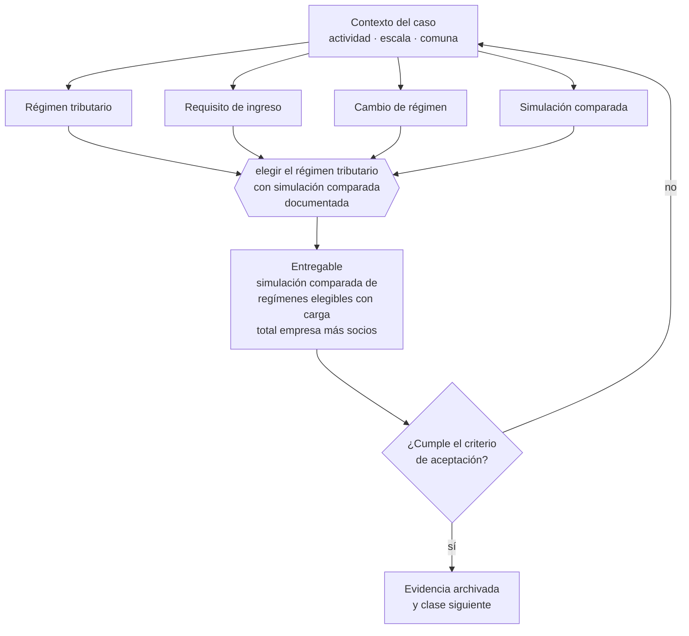

# Clase 089 — Selección de régimen tributario

> **Parte 07 · SII y ciclo tributario de principio a fin** — clase 5 de 14

**Estado de evidencia:** `VERIFICADO-FUENTE` · **Jurisdicción:** Chile-first · **Fecha base normativa:** 07-08-2026 
**Decisión que habilita:** elegir el régimen tributario con simulación comparada documentada 
**Entregable:** simulación comparada de regímenes elegibles con carga total empresa más socios

## 🎯 Propósito

Elegir régimen con una simulación comparada documentada, que es la única forma responsable de tomar la decisión de mayor impacto tributario del negocio.

## 📚 Resultados de aprendizaje

Al finalizar esta clase podrás:

1. **Definir** con precisión los cuatro conceptos de la tabla siguiente y usarlos para describir un caso real.
2. **Explicar** por qué esta materia condiciona decisiones de otras partes del programa.
3. **Decidir** —elegir el régimen tributario con simulación comparada documentada— y justificar la decisión por escrito.
4. **Producir** el entregable de la clase y contrastarlo contra su criterio de aceptación.
5. **Distinguir** el dato estable del dato dinámico que exige revalidación en la fuente oficial.

## 🧩 Conceptos centrales

| Concepto | Comprensión verificable |
|---|---|
| **Régimen tributario** | Conjunto de reglas de determinación y pago del impuesto. |
| **Requisito de ingreso** | Condiciones de ingresos, capital y tipo de socios para acceder. |
| **Cambio de régimen** | Paso de un régimen a otro, con plazos y efectos definidos. |
| **Simulación comparada** | Cálculo del resultado bajo cada régimen para el mismo escenario. |

## 🗺️ Flujo de razonamiento

## 📖 Desarrollo

### 1. El fondo del asunto

La elección de régimen depende del nivel de ingresos, del tipo de socios y de la política de retiros. La única forma responsable de decidir es simular el mismo escenario bajo cada régimen elegible, incluyendo el impuesto de los socios, y no quedarse con la carga a nivel empresa.

### 2. Cómo se traduce en la práctica

La comparación debe incluir el impuesto de los socios y verificar primero los requisitos de tipo de propietarios, que descartan regímenes antes de que las tasas importen. Las tasas además cambian por ley y por período transitorio: cada cifra usada necesita fecha de consulta anotada junto a ella.

### 3. Marco aplicable y quién interviene

- DL 824 sobre impuesto a la renta y DL 825 sobre impuesto a las ventas y servicios
- Código Tributario (DL 830)
- Ley 21.210 de modernización tributaria y Ley 21.713 de cumplimiento tributario
- regímenes Pro Pyme General (14 D N°3), Pro Pyme Transparente (14 D N°8) y Semi Integrado (14 A)

**Autoridades o contrapartes involucradas:** SII, Tesorería General de la República.
**Profesionales de apoyo:** contador, asesor tributario, abogado tributario. La participación concreta depende del riesgo, del
tamaño de la empresa y de la actividad económica.

## 🧪 Taller guiado

Aplica esta clase a **una** de las siguientes líneas de negocio y repite después el ejercicio con
una segunda línea de carga regulatoria distinta:

| Línea | Carga regulatoria |
|---|---|
| SaaS B2B con IA | media |
| Servicios profesionales | baja |
| E-commerce D2C | media |
| Alimentos o foodtech | alta |
| Exportación de servicios | media |
| Fintech regulada | alta |
| Construcción o servicios técnicos | alta |

**Secuencia de trabajo:**

1. Delimita el contexto: actividad económica, escala, comuna y etapa de la empresa.
2. Reúne los antecedentes que la decisión exige y anota la fecha de cada fuente.
3. Identifica las alternativas reales, incluida la de no hacer nada.
4. Evalúa el impacto en mercado, caja, personas, regulación y operación.
5. Toma la decisión y regístrala con sus supuestos.
6. Produce el entregable.
7. Contrástalo contra el criterio de aceptación.
8. Anota lo que requiere validación profesional y programa su revisión.

### 📦 Entregable

Simulación comparada de regímenes elegibles con carga total empresa más socios.

Debe incluir decisión, supuestos, fuentes con fecha de consulta, responsable, riesgos
identificados y próximos pasos.

## 🏆 Reto verificable

Resuelve la misma materia para una segunda línea de negocio con distinta carga regulatoria y
explica por escrito **qué cambió, por qué y qué fuente lo determina**.

## ✅ Criterio de aceptación

- [ ] la simulación incluye impuestos finales de los socios
- [ ] los requisitos de elegibilidad están verificados
- [ ] cada afirmación regulatoria está referida a una fuente oficial con fecha de consulta;
- [ ] los datos dinámicos quedan marcados para revalidación;
- [ ] hay un responsable asignado y evidencia reproducible del trabajo.

## ⚠️ Errores frecuentes

**Propios de esta clase:**

- Elegir régimen por recomendación genérica sin simular el caso.
- Ignorar los requisitos de tipo de socios que restringen la elegibilidad.

**Característicos de la parte 07:**

- Elegir régimen por recomendación genérica sin mirar la estructura de socios.
- Usar el iva recaudado como capital de trabajo y no poder pagar el f29.

## 🇨🇱 Checklist Chile

- [ ] ¿existe norma o autoridad específica para esta materia?
- [ ] ¿la fuente consultada está vigente a la fecha de ejecución?
- [ ] ¿se activa algún trámite ante el SII?
- [ ] ¿se activa algún requisito municipal o sectorial?
- [ ] ¿afecta a consumidores o al tratamiento de datos personales?
- [ ] ¿afecta a trabajadores o a la seguridad y salud en el trabajo?
- [ ] ¿afecta a impuestos, contabilidad o caja?
- [ ] ¿afecta a contratos o a propiedad intelectual?
- [ ] ¿requiere renovación, reporte periódico o revalidación?

## ❓ Preguntas de comprobación

1. ¿Simulaste el mismo escenario bajo cada régimen elegible, con impuestos finales incluidos?
2. ¿Qué régimen queda descartado por la estructura de propietarios de tu sociedad?
3. ¿De qué fecha son las tasas que usaste y cuándo toca revalidarlas?

## 🔗 Fuentes oficiales

**Servicio de Impuestos Internos — Regímenes tributarios · Operación Renta 2026**  
<https://www.sii.cl/destacados/renta/2026/intermediarios/regimenes_tributarios/> · verificado 2026-08-19

- *Qué contiene:* Compara los regímenes vigentes: requisitos de ingreso y permanencia, tipo de propietarios admitidos, forma de determinar la base imponible y cómo se imputa el crédito contra los impuestos finales de los dueños.
- *Cómo leerla:* Lee primero la columna de requisitos de propietarios: descarta regímenes antes de comparar tasas. Las tasas cambian por ley y por período transitorio, así que anota la fecha de consulta junto a cada cifra que uses.
- *Uso en esta clase:* aporta el marco de «Regímenes tributarios · Operación Renta 2026» para elegir el régimen tributario con simulación comparada documentada.

**Biblioteca del Congreso Nacional · LeyChile — Normativa oficial consolidada**  
<https://www.bcn.cl/leychile/> · verificado 2026-08-19

- *Qué contiene:* Publica el texto oficial y consolidado de leyes, decretos y reglamentos, con la versión vigente a una fecha, el historial de modificaciones y la tramitación que las originó.
- *Cómo leerla:* Usa siempre el selector de versión vigente a la fecha en que ejecutarás el trámite, no la última publicada. Y lee el artículo transitorio: en normas en implantación gradual —jornada, datos personales— ahí está la fecha que realmente te aplica.
- *Uso en esta clase:* aporta el marco de «Normativa oficial consolidada» para elegir el régimen tributario con simulación comparada documentada.

Complementos del repositorio: [glosario](../../../docs/19_GLOSSARY.md) ·
[ruta de lecturas](../../../docs/15_BOOKS_AND_LEARNING_PATH.md) ·
[catálogo de fuentes](../../../docs/16_OFFICIAL_SOURCE_CATALOG.md).

> [!IMPORTANT]
> Material educativo. Para una decisión real de alto impacto hay que verificar la fuente oficial
> vigente y validar con el profesional competente.

---

| Anterior | Índice | Siguiente |
|---|---|---|
| [← 088 · Acreditación de domicilio ante SII](../class-04-acreditacion-de-domicilio-ante-sii/README.md) | [Parte 07](../README.md) · [Programa](../../../README.md) | [090 · Pro Pyme General →](../class-06-pro-pyme-general/README.md) |
