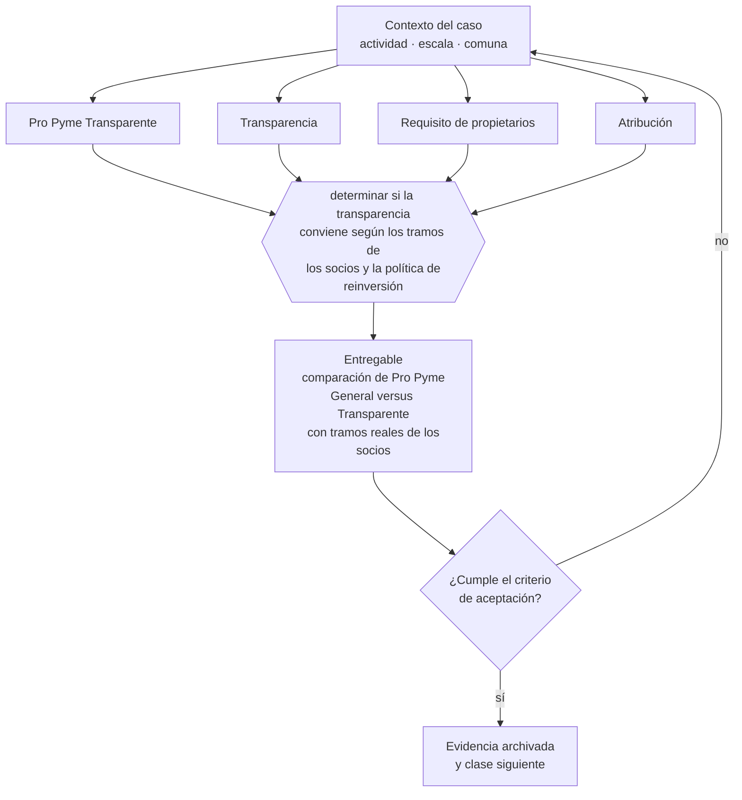

# Clase 091 — Pro Pyme Transparente

> **Parte 07 · SII y ciclo tributario de principio a fin** — clase 7 de 14

**Estado de evidencia:** `VERIFICADO-FUENTE` · **Jurisdicción:** Chile-first · **Fecha base normativa:** 07-08-2026 
**Decisión que habilita:** determinar si la transparencia conviene según los tramos de los socios y la política de reinversión 
**Entregable:** comparación de Pro Pyme General versus Transparente con tramos reales de los socios

## 🎯 Propósito

Determinar si la transparencia conviene, sabiendo que elimina el impuesto a nivel de empresa pero obliga a tributar aunque no se retire.

## 📚 Resultados de aprendizaje

Al finalizar esta clase podrás:

1. **Definir** con precisión los cuatro conceptos de la tabla siguiente y usarlos para describir un caso real.
2. **Explicar** por qué esta materia condiciona decisiones de otras partes del programa.
3. **Decidir** —determinar si la transparencia conviene según los tramos de los socios y la política de reinversión— y justificar la decisión por escrito.
4. **Producir** el entregable de la clase y contrastarlo contra su criterio de aceptación.
5. **Distinguir** el dato estable del dato dinámico que exige revalidación en la fuente oficial.

## 🧩 Conceptos centrales

| Concepto | Comprensión verificable |
|---|---|
| **Pro Pyme Transparente** | Régimen del artículo 14 d n°8, sin impuesto a nivel de empresa. |
| **Transparencia** | La renta se atribuye directamente a los propietarios. |
| **Requisito de propietarios** | Exige que los dueños sean contribuyentes de impuestos finales. |
| **Atribución** | Asignación de la renta a los socios aunque no se haya retirado. |

## 🗺️ Flujo de razonamiento

## 📖 Desarrollo

### 1. El fondo del asunto

En el régimen transparente la empresa no paga impuesto de primera categoría y la renta se atribuye a los dueños, que tributan según su tramo. Conviene cuando los socios tienen tasas bajas, y perjudica cuando se quiere reinvertir, porque se tributa aunque no se retire.

### 2. Cómo se traduce en la práctica

El régimen transparente atribuye la renta a los propietarios según su tramo, lo que favorece a socios con tasas bajas y perjudica a quien quiere reinvertir. Además exige que los dueños sean contribuyentes de impuestos finales: incorporar un socio persona jurídica hace perder la elegibilidad.

### 3. Marco aplicable y quién interviene

- DL 824 sobre impuesto a la renta y DL 825 sobre impuesto a las ventas y servicios
- Código Tributario (DL 830)
- Ley 21.210 de modernización tributaria y Ley 21.713 de cumplimiento tributario
- regímenes Pro Pyme General (14 D N°3), Pro Pyme Transparente (14 D N°8) y Semi Integrado (14 A)

**Autoridades o contrapartes involucradas:** SII, Tesorería General de la República.
**Profesionales de apoyo:** contador, asesor tributario, abogado tributario. La participación concreta depende del riesgo, del
tamaño de la empresa y de la actividad económica.

## 🧪 Taller guiado

Aplica esta clase a **una** de las siguientes líneas de negocio y repite después el ejercicio con
una segunda línea de carga regulatoria distinta:

| Línea | Carga regulatoria |
|---|---|
| SaaS B2B con IA | media |
| Servicios profesionales | baja |
| E-commerce D2C | media |
| Alimentos o foodtech | alta |
| Exportación de servicios | media |
| Fintech regulada | alta |
| Construcción o servicios técnicos | alta |

**Secuencia de trabajo:**

1. Delimita el contexto: actividad económica, escala, comuna y etapa de la empresa.
2. Reúne los antecedentes que la decisión exige y anota la fecha de cada fuente.
3. Identifica las alternativas reales, incluida la de no hacer nada.
4. Evalúa el impacto en mercado, caja, personas, regulación y operación.
5. Toma la decisión y regístrala con sus supuestos.
6. Produce el entregable.
7. Contrástalo contra el criterio de aceptación.
8. Anota lo que requiere validación profesional y programa su revisión.

### 📦 Entregable

Comparación de pro pyme general versus transparente con tramos reales de los socios.

Debe incluir decisión, supuestos, fuentes con fecha de consulta, responsable, riesgos
identificados y próximos pasos.

## 🏆 Reto verificable

Resuelve la misma materia para una segunda línea de negocio con distinta carga regulatoria y
explica por escrito **qué cambió, por qué y qué fuente lo determina**.

## ✅ Criterio de aceptación

- [ ] la comparación usa los tramos efectivos de los socios
- [ ] el efecto sobre la reinversión está evaluado
- [ ] cada afirmación regulatoria está referida a una fuente oficial con fecha de consulta;
- [ ] los datos dinámicos quedan marcados para revalidación;
- [ ] hay un responsable asignado y evidencia reproducible del trabajo.

## ⚠️ Errores frecuentes

**Propios de esta clase:**

- Elegir transparente y luego necesitar reinvertir utilidades ya tributadas.
- Perder la elegibilidad al incorporar un socio persona jurídica.

**Característicos de la parte 07:**

- Elegir régimen por recomendación genérica sin mirar la estructura de socios.
- Usar el iva recaudado como capital de trabajo y no poder pagar el f29.

## 🇨🇱 Checklist Chile

- [ ] ¿existe norma o autoridad específica para esta materia?
- [ ] ¿la fuente consultada está vigente a la fecha de ejecución?
- [ ] ¿se activa algún trámite ante el SII?
- [ ] ¿se activa algún requisito municipal o sectorial?
- [ ] ¿afecta a consumidores o al tratamiento de datos personales?
- [ ] ¿afecta a trabajadores o a la seguridad y salud en el trabajo?
- [ ] ¿afecta a impuestos, contabilidad o caja?
- [ ] ¿afecta a contratos o a propiedad intelectual?
- [ ] ¿requiere renovación, reporte periódico o revalidación?

## ❓ Preguntas de comprobación

1. ¿En qué tramo tributan tus socios y cómo se compara con la tasa de empresa?
2. ¿Planeas reinvertir utilidades sabiendo que en este régimen tributarás igual aunque no retires?
3. ¿Entrará algún socio persona jurídica que te haga perder la elegibilidad?

## 🔗 Fuentes oficiales

**Servicio de Impuestos Internos — Regímenes tributarios · Operación Renta 2026**  
<https://www.sii.cl/destacados/renta/2026/intermediarios/regimenes_tributarios/> · verificado 2026-08-19

- *Qué contiene:* Compara los regímenes vigentes: requisitos de ingreso y permanencia, tipo de propietarios admitidos, forma de determinar la base imponible y cómo se imputa el crédito contra los impuestos finales de los dueños.
- *Cómo leerla:* Lee primero la columna de requisitos de propietarios: descarta regímenes antes de comparar tasas. Las tasas cambian por ley y por período transitorio, así que anota la fecha de consulta junto a cada cifra que uses.
- *Uso en esta clase:* aporta el marco de «Regímenes tributarios · Operación Renta 2026» para determinar si la transparencia conviene según los tramos de los socios y la política de reinversión.

Complementos del repositorio: [glosario](../../../docs/19_GLOSSARY.md) ·
[ruta de lecturas](../../../docs/15_BOOKS_AND_LEARNING_PATH.md) ·
[catálogo de fuentes](../../../docs/16_OFFICIAL_SOURCE_CATALOG.md).

> [!IMPORTANT]
> Material educativo. Para una decisión real de alto impacto hay que verificar la fuente oficial
> vigente y validar con el profesional competente.

---

| Anterior | Índice | Siguiente |
|---|---|---|
| [← 090 · Pro Pyme General](../class-06-pro-pyme-general/README.md) | [Parte 07](../README.md) · [Programa](../../../README.md) | [092 · Régimen General semi integrado y otros regímenes →](../class-08-regimen-general-semi-integrado-y-otros-regimenes/README.md) |
