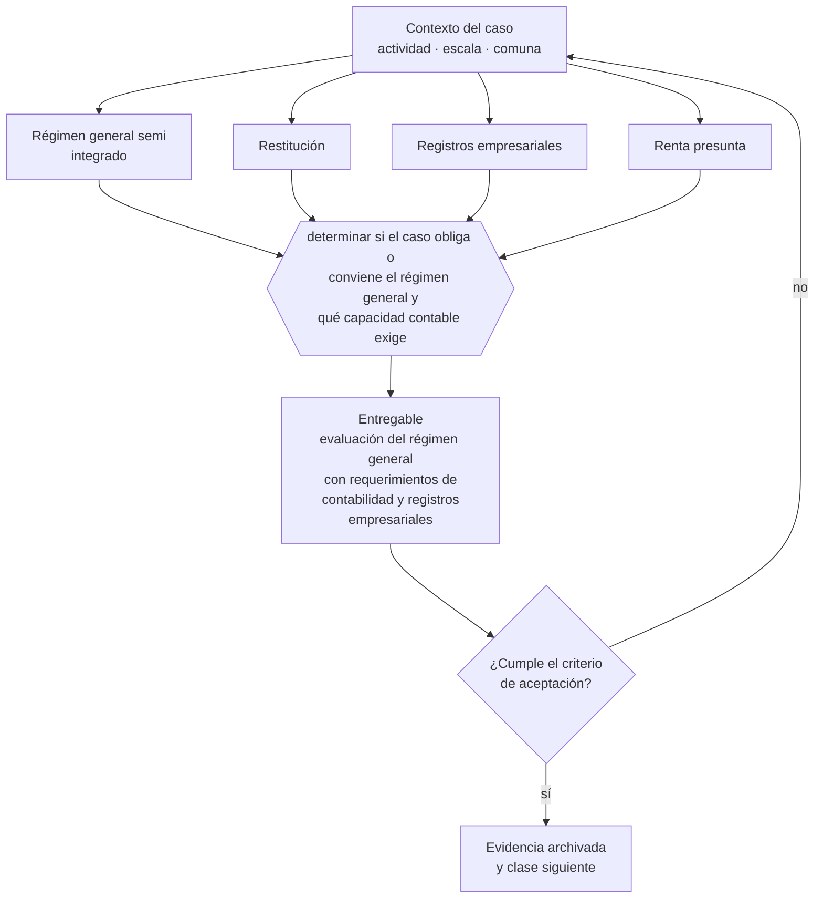

# Clase 092 — Régimen General semi integrado y otros regímenes

> **Parte 07 · SII y ciclo tributario de principio a fin** — clase 8 de 14

**Estado de evidencia:** `VERIFICADO-FUENTE` · **Jurisdicción:** Chile-first · **Fecha base normativa:** 07-08-2026 
**Decisión que habilita:** determinar si el caso obliga o conviene el régimen general y qué capacidad contable exige 
**Entregable:** evaluación del régimen general con requerimientos de contabilidad y registros empresariales

## 🎯 Propósito

Reconocer cuándo el caso obliga al régimen general y dimensionar la capacidad contable que exige operarlo correctamente.

## 📚 Resultados de aprendizaje

Al finalizar esta clase podrás:

1. **Definir** con precisión los cuatro conceptos de la tabla siguiente y usarlos para describir un caso real.
2. **Explicar** por qué esta materia condiciona decisiones de otras partes del programa.
3. **Decidir** —determinar si el caso obliga o conviene el régimen general y qué capacidad contable exige— y justificar la decisión por escrito.
4. **Producir** el entregable de la clase y contrastarlo contra su criterio de aceptación.
5. **Distinguir** el dato estable del dato dinámico que exige revalidación en la fuente oficial.

## 🧩 Conceptos centrales

| Concepto | Comprensión verificable |
|---|---|
| **Régimen general semi integrado** | Régimen del artículo 14 a, con imputación parcial del crédito. |
| **Restitución** | Porción del crédito que el socio debe devolver. |
| **Registros empresariales** | Rai, ddan, rex y sac que controlan rentas y créditos. |
| **Renta presunta** | Régimen especial para ciertas actividades con base presunta. |

## 🗺️ Flujo de razonamiento

## 📖 Desarrollo

### 1. El fondo del asunto

El semi integrado aplica a empresas que exceden los límites Pro Pyme o cuya estructura de propietarios lo exige. Su complejidad está en los registros empresariales, que determinan qué se puede retirar y con qué crédito. Exige contabilidad completa y asesoría permanente.

### 2. Cómo se traduce en la práctica

El semi integrado exige contabilidad completa y los registros empresariales RAI, DDAN, REX y SAC, que determinan qué se puede retirar y con qué crédito. Quedar en él por omisión, sin esa capacidad contable, produce pérdida de trazabilidad de créditos que se descubre en la Operación Renta.

### 3. Marco aplicable y quién interviene

- DL 824 sobre impuesto a la renta y DL 825 sobre impuesto a las ventas y servicios
- Código Tributario (DL 830)
- Ley 21.210 de modernización tributaria y Ley 21.713 de cumplimiento tributario
- regímenes Pro Pyme General (14 D N°3), Pro Pyme Transparente (14 D N°8) y Semi Integrado (14 A)

**Autoridades o contrapartes involucradas:** SII, Tesorería General de la República.
**Profesionales de apoyo:** contador, asesor tributario, abogado tributario. La participación concreta depende del riesgo, del
tamaño de la empresa y de la actividad económica.

## 🧪 Taller guiado

Aplica esta clase a **una** de las siguientes líneas de negocio y repite después el ejercicio con
una segunda línea de carga regulatoria distinta:

| Línea | Carga regulatoria |
|---|---|
| SaaS B2B con IA | media |
| Servicios profesionales | baja |
| E-commerce D2C | media |
| Alimentos o foodtech | alta |
| Exportación de servicios | media |
| Fintech regulada | alta |
| Construcción o servicios técnicos | alta |

**Secuencia de trabajo:**

1. Delimita el contexto: actividad económica, escala, comuna y etapa de la empresa.
2. Reúne los antecedentes que la decisión exige y anota la fecha de cada fuente.
3. Identifica las alternativas reales, incluida la de no hacer nada.
4. Evalúa el impacto en mercado, caja, personas, regulación y operación.
5. Toma la decisión y regístrala con sus supuestos.
6. Produce el entregable.
7. Contrástalo contra el criterio de aceptación.
8. Anota lo que requiere validación profesional y programa su revisión.

### 📦 Entregable

Evaluación del régimen general con requerimientos de contabilidad y registros empresariales.

Debe incluir decisión, supuestos, fuentes con fecha de consulta, responsable, riesgos
identificados y próximos pasos.

## 🏆 Reto verificable

Resuelve la misma materia para una segunda línea de negocio con distinta carga regulatoria y
explica por escrito **qué cambió, por qué y qué fuente lo determina**.

## ✅ Criterio de aceptación

- [ ] los requerimientos de contabilidad están dimensionados
- [ ] los registros empresariales exigidos están identificados
- [ ] cada afirmación regulatoria está referida a una fuente oficial con fecha de consulta;
- [ ] los datos dinámicos quedan marcados para revalidación;
- [ ] hay un responsable asignado y evidencia reproducible del trabajo.

## ⚠️ Errores frecuentes

**Propios de esta clase:**

- Quedar en régimen general por omisión sin la capacidad contable para operarlo.
- No llevar los registros empresariales y perder trazabilidad de créditos.

**Característicos de la parte 07:**

- Elegir régimen por recomendación genérica sin mirar la estructura de socios.
- Usar el iva recaudado como capital de trabajo y no poder pagar el f29.

## 🇨🇱 Checklist Chile

- [ ] ¿existe norma o autoridad específica para esta materia?
- [ ] ¿la fuente consultada está vigente a la fecha de ejecución?
- [ ] ¿se activa algún trámite ante el SII?
- [ ] ¿se activa algún requisito municipal o sectorial?
- [ ] ¿afecta a consumidores o al tratamiento de datos personales?
- [ ] ¿afecta a trabajadores o a la seguridad y salud en el trabajo?
- [ ] ¿afecta a impuestos, contabilidad o caja?
- [ ] ¿afecta a contratos o a propiedad intelectual?
- [ ] ¿requiere renovación, reporte periódico o revalidación?

## ❓ Preguntas de comprobación

1. ¿Estás en régimen general por elección o por haber excedido los límites?
2. ¿Quién lleva tus registros empresariales y con qué periodicidad?
3. ¿Puedes reconstruir hoy el crédito disponible para un retiro?

## 🔗 Fuentes oficiales

**Servicio de Impuestos Internos — Regímenes tributarios · Operación Renta 2026**  
<https://www.sii.cl/destacados/renta/2026/intermediarios/regimenes_tributarios/> · verificado 2026-08-07

- *Qué contiene:* Compara los regímenes vigentes: requisitos de ingreso y permanencia, tipo de propietarios admitidos, forma de determinar la base imponible y cómo se imputa el crédito contra los impuestos finales de los dueños.
- *Cómo leerla:* Lee primero la columna de requisitos de propietarios: descarta regímenes antes de comparar tasas. Las tasas cambian por ley y por período transitorio, así que anota la fecha de consulta junto a cada cifra que uses.

**Biblioteca del Congreso Nacional · LeyChile — Normativa oficial consolidada**  
<https://www.bcn.cl/leychile/> · verificado 2026-08-07

- *Qué contiene:* Publica el texto oficial y consolidado de leyes, decretos y reglamentos, con la versión vigente a una fecha, el historial de modificaciones y la tramitación que las originó.
- *Cómo leerla:* Usa siempre el selector de versión vigente a la fecha en que ejecutarás el trámite, no la última publicada. Y lee el artículo transitorio: en normas en implantación gradual —jornada, datos personales— ahí está la fecha que realmente te aplica.

Complementos del repositorio: [glosario](../../../docs/19_GLOSSARY.md) ·
[ruta de lecturas](../../../docs/15_BOOKS_AND_LEARNING_PATH.md) ·
[catálogo de fuentes](../../../docs/16_OFFICIAL_SOURCE_CATALOG.md).

> [!IMPORTANT]
> Material educativo. Para una decisión real de alto impacto hay que verificar la fuente oficial
> vigente y validar con el profesional competente.

---

| Anterior | Índice | Siguiente |
|---|---|---|
| [← 091 · Pro Pyme Transparente](../class-07-pro-pyme-transparente/README.md) | [Parte 07](../README.md) · [Programa](../../../README.md) | [093 · IVA: débito, crédito y hechos gravados →](../class-09-iva-debito-credito-y-hechos-gravados/README.md) |
