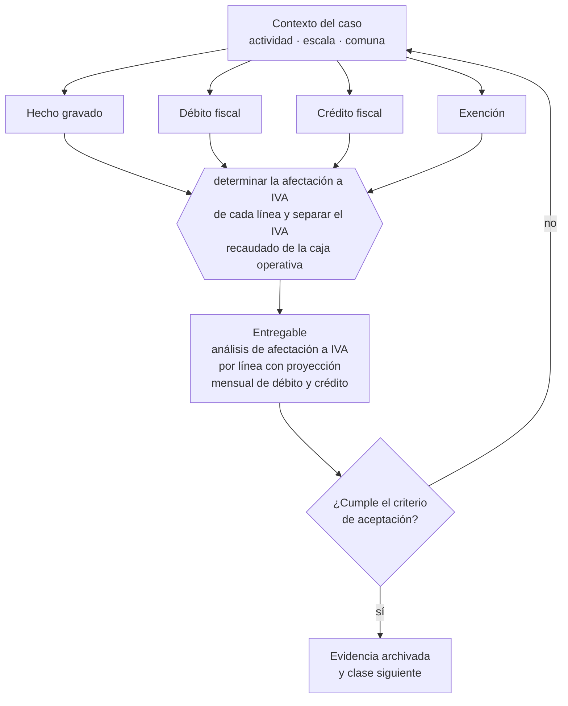

# Clase 093 — IVA: débito, crédito y hechos gravados

> **Parte 07 · SII y ciclo tributario de principio a fin** — clase 9 de 14

**Estado de evidencia:** `VERIFICADO-FUENTE` · **Jurisdicción:** Chile-first · **Fecha base normativa:** 07-08-2026 
**Decisión que habilita:** determinar la afectación a IVA de cada línea y separar el IVA recaudado de la caja operativa 
**Entregable:** análisis de afectación a IVA por línea con proyección mensual de débito y crédito

## 🎯 Propósito

Interiorizar que el IVA recaudado no es ingreso sino dinero del fisco retenido por unas semanas, que es la lección de caja más importante de esta parte.

## 📚 Resultados de aprendizaje

Al finalizar esta clase podrás:

1. **Definir** con precisión los cuatro conceptos de la tabla siguiente y usarlos para describir un caso real.
2. **Explicar** por qué esta materia condiciona decisiones de otras partes del programa.
3. **Decidir** —determinar la afectación a IVA de cada línea y separar el IVA recaudado de la caja operativa— y justificar la decisión por escrito.
4. **Producir** el entregable de la clase y contrastarlo contra su criterio de aceptación.
5. **Distinguir** el dato estable del dato dinámico que exige revalidación en la fuente oficial.

## 🧩 Conceptos centrales

| Concepto | Comprensión verificable |
|---|---|
| **Hecho gravado** | Operación que la ley afecta con iva. |
| **Débito fiscal** | Iva recargado en las ventas del período. |
| **Crédito fiscal** | Iva soportado en las compras que da derecho a rebaja. |
| **Exención** | Operación que la ley libera del impuesto. |

## 🗺️ Flujo de razonamiento

## 📖 Desarrollo

### 1. El fondo del asunto

El IVA no es un costo de la empresa sino dinero recaudado para el fisco: la diferencia entre débito y crédito se entera mensualmente. Tratarlo como capital de trabajo es una de las causas más frecuentes de crisis de caja en pymes chilenas, porque la obligación llega igual el día 12 o 20.

### 2. Cómo se traduce en la práctica

Usarlo como capital de trabajo produce la crisis más común y más evitable de la pyme chilena, porque la obligación del F29 llega igual el día 12 o 20. La regla práctica es separar el IVA recaudado en cuanto se cobra, tratándolo como un pasivo con fecha y no como saldo disponible.

### 3. Marco aplicable y quién interviene

- DL 824 sobre impuesto a la renta y DL 825 sobre impuesto a las ventas y servicios
- Código Tributario (DL 830)
- Ley 21.210 de modernización tributaria y Ley 21.713 de cumplimiento tributario
- regímenes Pro Pyme General (14 D N°3), Pro Pyme Transparente (14 D N°8) y Semi Integrado (14 A)

**Autoridades o contrapartes involucradas:** SII, Tesorería General de la República.
**Profesionales de apoyo:** contador, asesor tributario, abogado tributario. La participación concreta depende del riesgo, del
tamaño de la empresa y de la actividad económica.

## 🧪 Taller guiado

Aplica esta clase a **una** de las siguientes líneas de negocio y repite después el ejercicio con
una segunda línea de carga regulatoria distinta:

| Línea | Carga regulatoria |
|---|---|
| SaaS B2B con IA | media |
| Servicios profesionales | baja |
| E-commerce D2C | media |
| Alimentos o foodtech | alta |
| Exportación de servicios | media |
| Fintech regulada | alta |
| Construcción o servicios técnicos | alta |

**Secuencia de trabajo:**

1. Delimita el contexto: actividad económica, escala, comuna y etapa de la empresa.
2. Reúne los antecedentes que la decisión exige y anota la fecha de cada fuente.
3. Identifica las alternativas reales, incluida la de no hacer nada.
4. Evalúa el impacto en mercado, caja, personas, regulación y operación.
5. Toma la decisión y regístrala con sus supuestos.
6. Produce el entregable.
7. Contrástalo contra el criterio de aceptación.
8. Anota lo que requiere validación profesional y programa su revisión.

### 📦 Entregable

Análisis de afectación a iva por línea con proyección mensual de débito y crédito.

Debe incluir decisión, supuestos, fuentes con fecha de consulta, responsable, riesgos
identificados y próximos pasos.

## 🏆 Reto verificable

Resuelve la misma materia para una segunda línea de negocio con distinta carga regulatoria y
explica por escrito **qué cambió, por qué y qué fuente lo determina**.

## ✅ Criterio de aceptación

- [ ] cada línea tiene afectación a IVA determinada
- [ ] existe regla de separación del IVA recaudado
- [ ] cada afirmación regulatoria está referida a una fuente oficial con fecha de consulta;
- [ ] los datos dinámicos quedan marcados para revalidación;
- [ ] hay un responsable asignado y evidencia reproducible del trabajo.

## ⚠️ Errores frecuentes

**Propios de esta clase:**

- Usar el iva recaudado para financiar operación y no poder pagar el f29.
- No documentar compras correctamente y perder el crédito fiscal.

**Característicos de la parte 07:**

- Elegir régimen por recomendación genérica sin mirar la estructura de socios.
- Usar el iva recaudado como capital de trabajo y no poder pagar el f29.

## 🇨🇱 Checklist Chile

- [ ] ¿existe norma o autoridad específica para esta materia?
- [ ] ¿la fuente consultada está vigente a la fecha de ejecución?
- [ ] ¿se activa algún trámite ante el SII?
- [ ] ¿se activa algún requisito municipal o sectorial?
- [ ] ¿afecta a consumidores o al tratamiento de datos personales?
- [ ] ¿afecta a trabajadores o a la seguridad y salud en el trabajo?
- [ ] ¿afecta a impuestos, contabilidad o caja?
- [ ] ¿afecta a contratos o a propiedad intelectual?
- [ ] ¿requiere renovación, reporte periódico o revalidación?

## ❓ Preguntas de comprobación

1. ¿Está el IVA recaudado separado de tu caja operativa o mezclado con ella?
2. ¿Cuál es la afectación a IVA de cada una de tus líneas de ingreso?
3. ¿Qué compras estás haciendo sin documentación que permita el crédito fiscal?

## 🔗 Fuentes oficiales

**Servicio de Impuestos Internos — Registro de Compras y Ventas**  
<https://www.sii.cl/destacados/f29/registrocompraventas.htm> · verificado 2026-08-19

- *Qué contiene:* Explica cómo el SII consolida los documentos tributarios electrónicos recibidos y emitidos, y cómo esa consolidación propone la declaración mensual de IVA.
- *Cómo leerla:* Fíjate en los plazos de aceptación o reclamo de una factura recibida: la página los trata como un detalle operativo, pero dejarlos vencer equivale a aceptar la factura con efecto tributario y mérito ejecutivo.
- *Uso en esta clase:* aporta el marco de «Registro de Compras y Ventas» para determinar la afectación a IVA de cada línea y separar el IVA recaudado de la caja operativa.

**Biblioteca del Congreso Nacional · LeyChile — Normativa oficial consolidada**  
<https://www.bcn.cl/leychile/> · verificado 2026-08-19

- *Qué contiene:* Publica el texto oficial y consolidado de leyes, decretos y reglamentos, con la versión vigente a una fecha, el historial de modificaciones y la tramitación que las originó.
- *Cómo leerla:* Usa siempre el selector de versión vigente a la fecha en que ejecutarás el trámite, no la última publicada. Y lee el artículo transitorio: en normas en implantación gradual —jornada, datos personales— ahí está la fecha que realmente te aplica.
- *Uso en esta clase:* aporta el marco de «Normativa oficial consolidada» para determinar la afectación a IVA de cada línea y separar el IVA recaudado de la caja operativa.

Complementos del repositorio: [glosario](../../../docs/19_GLOSSARY.md) ·
[ruta de lecturas](../../../docs/15_BOOKS_AND_LEARNING_PATH.md) ·
[catálogo de fuentes](../../../docs/16_OFFICIAL_SOURCE_CATALOG.md).

> [!IMPORTANT]
> Material educativo. Para una decisión real de alto impacto hay que verificar la fuente oficial
> vigente y validar con el profesional competente.

---

| Anterior | Índice | Siguiente |
|---|---|---|
| [← 092 · Régimen General semi integrado y otros regímenes](../class-08-regimen-general-semi-integrado-y-otros-regimenes/README.md) | [Parte 07](../README.md) · [Programa](../../../README.md) | [094 · Documentos tributarios electrónicos DTE →](../class-10-documentos-tributarios-electronicos-dte/README.md) |
