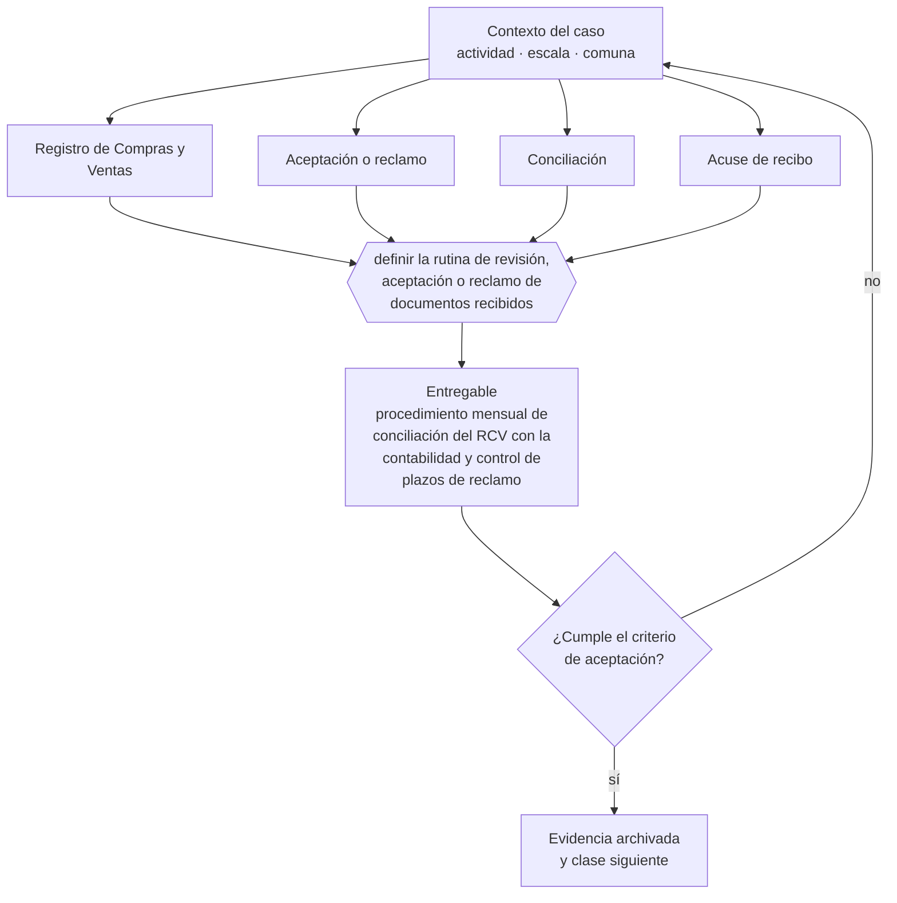

# Clase 095 — Registro de Compras y Ventas

> **Parte 07 · SII y ciclo tributario de principio a fin** — clase 11 de 14

**Estado de evidencia:** `VERIFICADO-FUENTE` · **Jurisdicción:** Chile-first · **Fecha base normativa:** 07-08-2026 
**Decisión que habilita:** definir la rutina de revisión, aceptación o reclamo de documentos recibidos 
**Entregable:** procedimiento mensual de conciliación del RCV con la contabilidad y control de plazos de reclamo

## 🎯 Propósito

Instalar la conciliación mensual del Registro de Compras y Ventas contra la contabilidad propia, y el control de plazos de reclamo de facturas recibidas.

## 📚 Resultados de aprendizaje

Al finalizar esta clase podrás:

1. **Definir** con precisión los cuatro conceptos de la tabla siguiente y usarlos para describir un caso real.
2. **Explicar** por qué esta materia condiciona decisiones de otras partes del programa.
3. **Decidir** —definir la rutina de revisión, aceptación o reclamo de documentos recibidos— y justificar la decisión por escrito.
4. **Producir** el entregable de la clase y contrastarlo contra su criterio de aceptación.
5. **Distinguir** el dato estable del dato dinámico que exige revalidación en la fuente oficial.

## 🧩 Conceptos centrales

| Concepto | Comprensión verificable |
|---|---|
| **Registro de Compras y Ventas** | Registro electrónico del sii que consolida los dte. |
| **Aceptación o reclamo** | Acción sobre facturas recibidas dentro del plazo legal. |
| **Conciliación** | Comparación entre el rcv y la contabilidad propia. |
| **Acuse de recibo** | Confirmación de recepción de mercadería o servicio. |

## 🗺️ Flujo de razonamiento

## 📖 Desarrollo

### 1. El fondo del asunto

El RCV propone la declaración de IVA a partir de los documentos electrónicos, pero la responsabilidad sigue siendo del contribuyente. Reclamar una factura improcedente tiene plazo; dejarlo pasar equivale a aceptarla, con efecto tributario y mérito ejecutivo asociado.

### 2. Cómo se traduce en la práctica

El RCV propone la declaración pero la responsabilidad sigue siendo del contribuyente. Dejar vencer el plazo para reclamar una factura improcedente equivale a aceptarla, con efecto tributario y mérito ejecutivo asociado: el proveedor puede cobrarla judicialmente sin juicio declarativo previo.

### 3. Marco aplicable y quién interviene

- DL 824 sobre impuesto a la renta y DL 825 sobre impuesto a las ventas y servicios
- Código Tributario (DL 830)
- Ley 21.210 de modernización tributaria y Ley 21.713 de cumplimiento tributario
- regímenes Pro Pyme General (14 D N°3), Pro Pyme Transparente (14 D N°8) y Semi Integrado (14 A)

**Autoridades o contrapartes involucradas:** SII, Tesorería General de la República.
**Profesionales de apoyo:** contador, asesor tributario, abogado tributario. La participación concreta depende del riesgo, del
tamaño de la empresa y de la actividad económica.

## 🧪 Taller guiado

Aplica esta clase a **una** de las siguientes líneas de negocio y repite después el ejercicio con
una segunda línea de carga regulatoria distinta:

| Línea | Carga regulatoria |
|---|---|
| SaaS B2B con IA | media |
| Servicios profesionales | baja |
| E-commerce D2C | media |
| Alimentos o foodtech | alta |
| Exportación de servicios | media |
| Fintech regulada | alta |
| Construcción o servicios técnicos | alta |

**Secuencia de trabajo:**

1. Delimita el contexto: actividad económica, escala, comuna y etapa de la empresa.
2. Reúne los antecedentes que la decisión exige y anota la fecha de cada fuente.
3. Identifica las alternativas reales, incluida la de no hacer nada.
4. Evalúa el impacto en mercado, caja, personas, regulación y operación.
5. Toma la decisión y regístrala con sus supuestos.
6. Produce el entregable.
7. Contrástalo contra el criterio de aceptación.
8. Anota lo que requiere validación profesional y programa su revisión.

### 📦 Entregable

Procedimiento mensual de conciliación del rcv con la contabilidad y control de plazos de reclamo.

Debe incluir decisión, supuestos, fuentes con fecha de consulta, responsable, riesgos
identificados y próximos pasos.

## 🏆 Reto verificable

Resuelve la misma materia para una segunda línea de negocio con distinta carga regulatoria y
explica por escrito **qué cambió, por qué y qué fuente lo determina**.

## ✅ Criterio de aceptación

- [ ] existe rutina mensual de conciliación documentada
- [ ] el control de plazos de reclamo está asignado a un responsable
- [ ] cada afirmación regulatoria está referida a una fuente oficial con fecha de consulta;
- [ ] los datos dinámicos quedan marcados para revalidación;
- [ ] hay un responsable asignado y evidencia reproducible del trabajo.

## ⚠️ Errores frecuentes

**Propios de esta clase:**

- Aceptar por omisión facturas improcedentes al dejar vencer el plazo.
- Declarar iva con el rcv sin conciliar contra la contabilidad propia.

**Característicos de la parte 07:**

- Elegir régimen por recomendación genérica sin mirar la estructura de socios.
- Usar el iva recaudado como capital de trabajo y no poder pagar el f29.

## 🇨🇱 Checklist Chile

- [ ] ¿existe norma o autoridad específica para esta materia?
- [ ] ¿la fuente consultada está vigente a la fecha de ejecución?
- [ ] ¿se activa algún trámite ante el SII?
- [ ] ¿se activa algún requisito municipal o sectorial?
- [ ] ¿afecta a consumidores o al tratamiento de datos personales?
- [ ] ¿afecta a trabajadores o a la seguridad y salud en el trabajo?
- [ ] ¿afecta a impuestos, contabilidad o caja?
- [ ] ¿afecta a contratos o a propiedad intelectual?
- [ ] ¿requiere renovación, reporte periódico o revalidación?

## ❓ Preguntas de comprobación

1. ¿Quién revisa las facturas recibidas y con qué frecuencia?
2. ¿Cuántas facturas improcedentes aceptaste el último año por dejar vencer el plazo?
3. ¿Cuadra tu contabilidad con el RCV o declaras solo con lo que el SII propone?

## 🔗 Fuentes oficiales

**Servicio de Impuestos Internos — Registro de Compras y Ventas**  
<https://www.sii.cl/destacados/f29/registrocompraventas.htm> · verificado 2026-08-07

- *Qué contiene:* Explica cómo el SII consolida los documentos tributarios electrónicos recibidos y emitidos, y cómo esa consolidación propone la declaración mensual de IVA.
- *Cómo leerla:* Fíjate en los plazos de aceptación o reclamo de una factura recibida: la página los trata como un detalle operativo, pero dejarlos vencer equivale a aceptar la factura con efecto tributario y mérito ejecutivo.

**Biblioteca del Congreso Nacional · LeyChile — Normativa oficial consolidada**  
<https://www.bcn.cl/leychile/> · verificado 2026-08-07

- *Qué contiene:* Publica el texto oficial y consolidado de leyes, decretos y reglamentos, con la versión vigente a una fecha, el historial de modificaciones y la tramitación que las originó.
- *Cómo leerla:* Usa siempre el selector de versión vigente a la fecha en que ejecutarás el trámite, no la última publicada. Y lee el artículo transitorio: en normas en implantación gradual —jornada, datos personales— ahí está la fecha que realmente te aplica.

Complementos del repositorio: [glosario](../../../docs/19_GLOSSARY.md) ·
[ruta de lecturas](../../../docs/15_BOOKS_AND_LEARNING_PATH.md) ·
[catálogo de fuentes](../../../docs/16_OFFICIAL_SOURCE_CATALOG.md).

> [!IMPORTANT]
> Material educativo. Para una decisión real de alto impacto hay que verificar la fuente oficial
> vigente y validar con el profesional competente.

---

| Anterior | Índice | Siguiente |
|---|---|---|
| [← 094 · Documentos tributarios electrónicos DTE](../class-10-documentos-tributarios-electronicos-dte/README.md) | [Parte 07](../README.md) · [Programa](../../../README.md) | [096 · Formulario 29, PPM y ciclo mensual →](../class-12-formulario-29-ppm-y-ciclo-mensual/README.md) |
